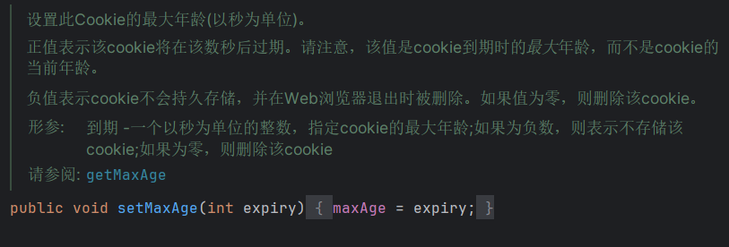
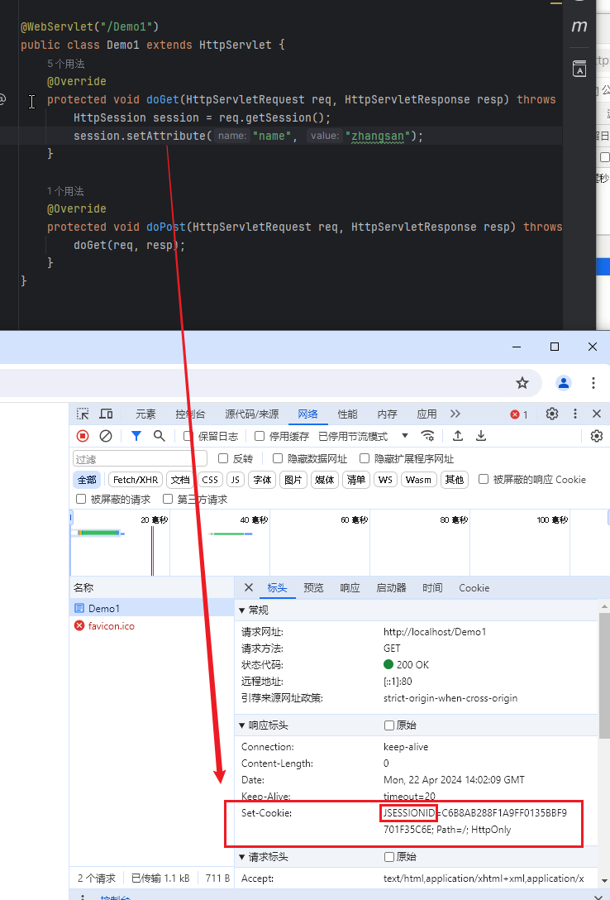
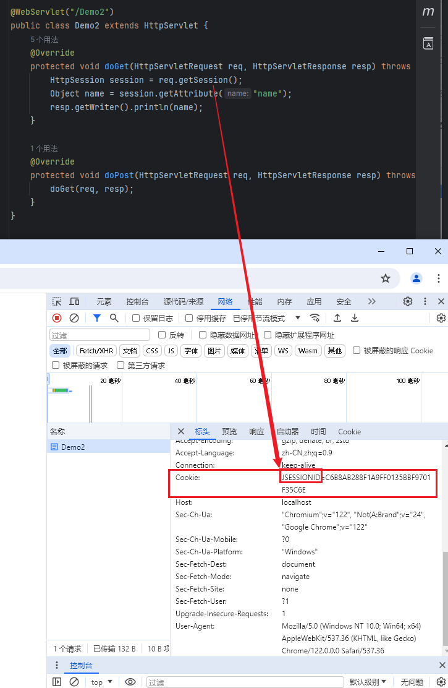
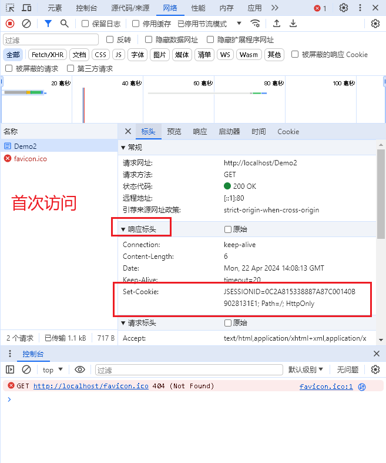
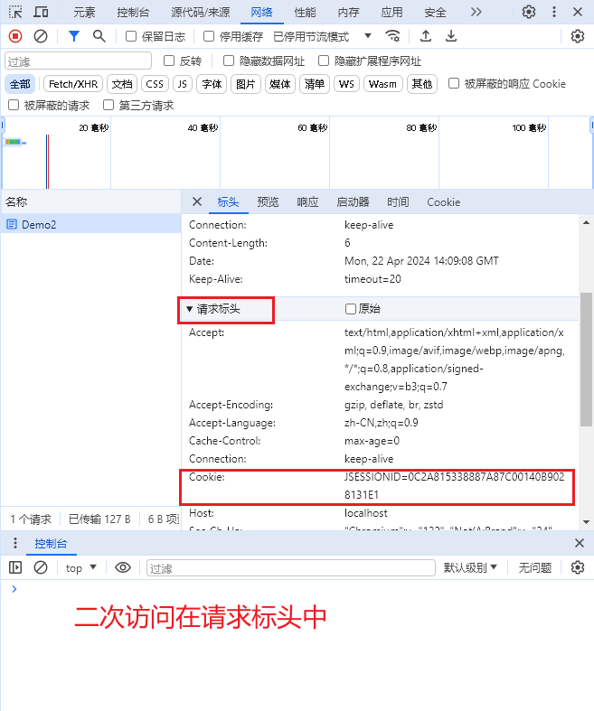

# 会话技术

> 概念：会话是客户端和服务器之间的一个通信过程，一次会话中可以包含多次的[[19-请求和响应]]
>
> 一次完整的会话，客户端第一次访问服务器时建立会话，直到任何一方断开为止
>
> 作用：在一次会话中的多次请求之间共享数据
>
> 分类：
>
> 1. 客户端会话技术：Cookie
> 2. 服务器会话技术：Session

## 客户端会话技术Cookie

### 概念和使用

> Cookie是客户端会话技术，它将数据存储在客户端（浏览器）中
>
> Cookie使用的相关方法：
>
> `注意!!!`
>
> - 在Cookie中，某些特殊字符不能存在。例如：`空格`、`逗号`、`等于号`、`双引号`、`斜杠`等`特殊符号`
>
>   也可以尽量不在Cookie中存这些特殊字符，就可以避免此类问题。
>
> 1. 创建Cookie
>
>    ```java
>    // 将两个参数形成的键值对绑定到当前Cookie对象中
>    Cookie c = new Cookie(String name,String value);
>    ```
>
> 2. 将Cookie数据发送给客户端
>
>    ```java
>    resp.addCookie(c);
>    ```
>
>    发现了：
>
>    1. 在响应头中有一个键：`Set-Cookie`，它的值是：Cookie对象中所保存的键值对
>
>    2. 第一次在访问时，请求头中没有与Cookie相关的内容；再次访问时，请求头中有一个键：`Cookie`，它的值是：上一次访问时服务器响应给客户端的Cookie对象中的键值对
>
> 3. 获取客户端携带的Cookie数据
>
>    ```java
>    req.getCookies();
>    //获取单个[[cookie]]值
>    String cookiePath = req.getHeader("cookie");
>    //获取所有的cookie，组成一个数组     如果之前没有cookie值，则会返回一个null，注意空指针异常
>    Cookie[] cookies = req.getCookies();
>    for (Cookie cookie : cookies) {
>        System.out.println(cookie.getName() + ":" + cookie.getValue());
>    }
>    ```

### Cookie的原理

> 1. 在客户端第一次访问服务器时，服务器会将Cookie对象中的键值对，以`Set-Cookie:name=value`的形式通过响应头发送给客户端
> 2. 在会话没有结束的情况下，客户端访问服务器中当前项目下的任何资源时，都会自动在请求头中携带着`Cookie:name=value`提交给服务器

### Cookie的细节问题

> 1. 一次可以发送多少个Cookie
>
>    可以是多个，如果Cookie的键相同，那么原来的值会被覆盖
>
> 2. Cookie中是否可以存储中文
>
>    可以，但是中文会发生乱码问题
>
>    在存储到Cookie前需要先对中文内容进行编码
>
>    ```java
>    String s = "张三";
>    s = URLEncoder.encode(s,"utf-8");
>    Cookie cookie = new Cookie("name",s);
>    ```
>
>    在获取Cookie对象后需要对编码过的内容进行解码
>
>    ```java
>    Cookie[] cookies = req.getCookies();
>    if(cookies != null){
>        for(Cookie c : cookies){
>            String name = c.getName();
>            String value = c.getValue();
>            if(name.equals("name")){
>                value = URLDecoder.decode(value, "utf-8");
>            }
>            System.out.println(name+"-----"+value);
>        }
>    }
>    ```
>
> 3. Cooki*e在客户端中可以保存多久
>    1. 会话级别：Cookie默认是会话级别的，浏览器关闭，会话结束，Cookie被释放
>
>    2. 持久化级别：可以通过`cookie对象.setMaxAge(int seconds)`来设置Cookie的销毁时间
>
>       
>
>       1. 正数：设置了多久，Cookie在客户端中就能保存多久，无论会话是否结束了
>       2. 负数：默认值，就是会话级别的，浏览器关闭，会话结束，Cookie被释放
>       3. 0：立即删除Cookie
>
> 4. 在访问哪些资源时会携带Cookie
>
>    1. 默认情况下，访问当前项目中的任何资源时都会携带着Cookie
>
>    2. 可以手动设置Cookie的携带路径：`cookie对象.setPath(String path)`
>
>       ```java
>       // 只有访问hello.html时会携带Cookie
>       c1.setPath("/hello.html");
>       // 只有访问res目录下的资源时候才会携带Cookie
>       c1.setPath("/res/");
>       ```

### Cookie的常用方法

> Cookie常用方法：
>
> - 1、设置Cookie过期时间（以秒为单位）：
>
>   ```java
>   public void setMaxAge(int expiry)
>   ```
>
> - 2、获取Cookie过期时间（以秒为单位）：
>
>   ```java
>   public int getMaxAge()
>   补充：默认情况下，-1表示cookie将持续下去，直到浏览器关闭。
>   ```
>
> - 3、获取Cookie的名称：
>
>   ```java
>   public String getName()
>   补充：Cookie的名称在创建后不能修改。
>   ```
>
> - 4、设置Cookie关联的值：
>
>   ```java
>   public void setValue(String newValue)
>   ```
>
> - 5、获取Cookie关联的值：
>
>   ```java
>   public String getValue()
>   ```
>
> - 6、设置对应Cookie适用的路径：
>
>   ```java
>   public void setPath(String uri)
>   补充：如果不给Cookie指定路径，那么与当前页面相同目录下的所有URL都会返回该Cookie（包括子目录下的）。
>   ```
>
> - 7、获取Cookie适用的路径：
>
>   ```java
>   public String getPath()
>   ```
>
> - 8、设置是否配置SSL加密安全：
>
>   ```java
>   public void setSecure(boolean flag)
>   补充：该方法设置布尔值，表示Cookie是否只在加密的SSL连接上发送。
>   ```
>
> - 9、设置Cookie注释：
>
>   ```java
>   public vid setComment(String purpose)
>   补充：该方法在浏览器向用户呈现Cookie时非常有用。
>   ```
>
> - 10、获取Cookie注释：
>
>   ```java
>   public String getComment()
>   补充：如果Cookie尚未设置注释，就返回null。
>   ```

### Cookie的特点

> 1. Cookie数据保存在客户端中
> 2. Cookie的键和值都是字符串类型的
> 3. Cookie不安全，Cookie可能被销毁（会话结束，到达最大时间，手动清除浏览器的Cookie）
> 4. 不同浏览器对单个Cookie的大小有限制，并且不同浏览器针对同一个项目中保存的Cookie数量也有限制

## 服务器会话技术Session

### 概念和使用

> Session是服务器会话技术，它将数据存储到服务器中
>
> HttpSession的一个接口，它也是一个域对象
>
> 1. setAttribute(String name，Object obj)
> 2. getAttribute(String name)
> 3. removeAttribute(String name)
>
> Session的获取：
>
> ```java
> req.getSession();
> ```
>
> 注：在调用`getSession()`时，会先判断服务器中是否已经有Session对象，如果没有则创建Session；如果有，则直接获取该Session。

### Session的原理

> 1. Session的实现是依赖于Cookie的
>
>    
>
> 2. 当调用`getSession()`时，服务器会看客户端的请求头中是否携带存有指定`JSESSIONID`的Cookie
>    1. 如果有，则在服务器中查找是否存在某一个Session对象的id值与该JSESSIONID的值相同，如果存在，则直接返回这个Session对象；
>
>       
>
>    2. 如果不存在，则创建一个新的Session对象
>
>       **第一次访问**
>
>       
>
>       **第二次访问**
>
>       
>
> 3. 创建新的Session时，系统会将`JSESSIONID`作为键，将这个新的Session对象的id值作为值，存储在Cookie中，通过响应头发送给客户端
>
> SessionId是什么？
>
> - session
>   客户端和服务器之间的会话。多个session对象都存储在server的内存中。
> - sessionId
>   session对象的标识符。
>   server用sessionId来区分内存中多个不同的session对象。
>   每个客户端要知道自己是谁，叫啥名字(就是这个sessionId)
> - cookie
>   客户端的备忘录，存储一些键值对。其中包括存储sessionId的键值对。
> - JSESSIONID
>   传输sessionId的值时，得起个名字，然后传输JSESSIONID=xxx。也可以叫hellosessionId，传输
>
> hellosessionId=xxx。
> `用一段话阐述关系：`
> session是存储在服务器内存中的，与客户端<-->服务器这种关系一一对应的对象。
> 每个session对象有一个唯一的标识符(即sessionId)，以做区分。
> 而Cookie是在客户端存储一些键值对的文本/容器。这个容器中存啥都行，开发人员说了算。
> 其中一个键值对：JSESSIONID=xxxxxx，其中的键就是JSESSIONID(这个名字叫啥由web服务器的开发者说了算)。
>
> 如何实现Session数据的持久化：
>
> 因为Session的id与JSESSIONID保存在Cookie中，Cookie默认是会话级别的，所以浏览器关闭后，保存JSESSIONID的Cookie也随之释放，因此如果想要让Session持久化我们可以==对保存JSESSIONID的Cookie==
>
> ```java
> @Override
> protected void doGet(HttpServletRequest req, HttpServletResponse resp) throws ServletException, IOException {
>     //session的持久化，即：关闭绘会话后的一段时间内，仍可以访问session域的数据
>     HttpSession session = req.getSession();
>     Cookie cookie = new Cookie("JSESSIONID", session.getId());
>     //60秒销毁依靠Cookie保存于浏览器的session域
>     cookie.setMaxAge(60);
>     session.setAttribute("name","zhangsan");
>     resp.addCookie(cookie);
> }
> ```

### Session的细节问题

> 1. 客户端关闭，服务器不关，再次打开客户端访问Session，是否还能从Session中获取数据
>
>    默认情况下不能，但是可以通过对保存JSESSIONID的Cookie进行持久化，就能在Session还没达到最大保存时间之前获取Session中的数据
>
> 2. 客户端不关，服务器关闭，再次打开服务器访问Session，是否还能从Session中获取数据
>
>    不能，因为域对象中的数据都是保存在服务器内存中的，服务器关闭，内存释放，因此获取不到
>
> 3. Session何时销毁
>
>    1. 达到最大时间，最大时间在tomcat\conf\web.xml中有默认配置
>
>    ```xml
>    //默认为30分钟
>    <session-config>
>        <session-timeout>30</session-timeout>
>    </session-config>
>    ```
>
>
>
>    ```java
>    /*
>    也可以在当前项目的web.xml中自行设置Session的失效时间
>    注：只要Session的失效时间没到，哪怕保存JSESSIONID的Cookie时间到了，服务器中的Session也不会被释放，只是无法再获取到了
>    */
>
>    调用`invalidate()`可以直接删除Session对象
>    ```

### Session的特点

> 1. Session将数据保存在服务器中
> 2. Session是一个域对象，可以存储任意类型的数据
>
> `注：`ServletContext > Session > request

## Session 和 Cookie 的区别

### 1. 核心本质（一句话概括）

- **Cookie**：是**浏览器**（客户端）用来存储少量数据的本地文件（大小限制约4KB）。
- **Session**：是**服务器**内存（或[[16-数据库]]）中用来存储用户状态的数据结构（理论上无大小限制，但会占用服务器资源）。

------

### 2. 详细对比表（面试直接回答这部分）

| 对比维度     | **Cookie**                                                   | **Session**                                                  |
| :----------- | :----------------------------------------------------------- | :----------------------------------------------------------- |
| **存储位置** | **客户端**（浏览器本地）                                     | **服务端**（内存/Redis/数据库）                              |
| **存储容量** | 小（通常 **4KB** 左右）                                      | 大（理论上无限制，取决于服务器配置）                         |
| **安全性**   | **低**。数据明文可见，易被篡改或窃取（XSS/CSRF攻击）         | **高**。数据在服务端，用户无法直接看到和修改                 |
| **生命周期** | 可设置过期时间（`Max-Age`/`Expires`）。 若不设，关闭浏览器即失效（会话级） | 依赖于 **Session 超时时间**（如Tomcat默认30分钟），关闭浏览器不会立即销毁Session |
| **性能影响** | **小**。数据存在客户端，不消耗服务器内存                     | **大**。大量并发用户会占用服务器大量内存，需做持久化或分布式存储 |
| **跨域支持** | 默认不支持跨域，需设置 `SameSite` 和 `Domain` 属性           | 不涉及跨域问题，依赖Cookie中的`SessionId`传递                |
| **数据类型** | 只能是**字符串**（通常需编码）                               | 任意对象（Java Object、Python Dict等）                       |

------

### 3. 关键误区：Session 离不开 Cookie（99%的初学者会忽略）

**最重要的区别是依赖关系**：

> **Session 的实现，绝大多数情况下依赖于 Cookie。**

流程是这样的：

1. 用户登录成功，服务器创建一个 Session，并生成一个唯一的 **SessionID**。
2. 服务器将这个 **SessionID** 放在一个名为 `JSESSIONID`（Java）或 `sessionid`（Python/Django）的 **Cookie** 里，发给浏览器。
3. 浏览器后续每次请求，都会自动在请求头（`Cookie`）里带上这个ID。
4. 服务器拿到ID，去内存里查找对应的Session数据。

**特例**：如果浏览器禁用了Cookie，Session依然可用，但需要通过 **URL 重写**（将 SessionID 拼接在 URL 后面，如 `url?sessionid=xxx`）来实现。
