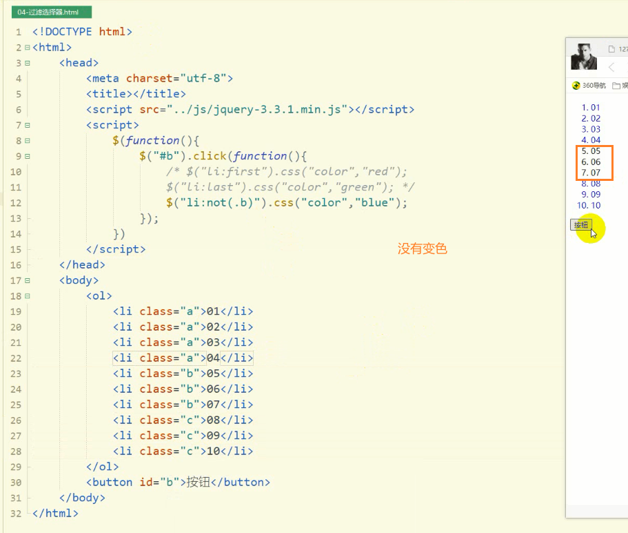
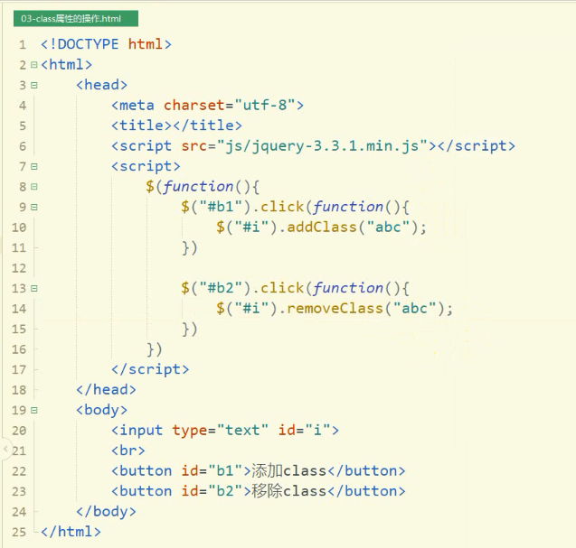
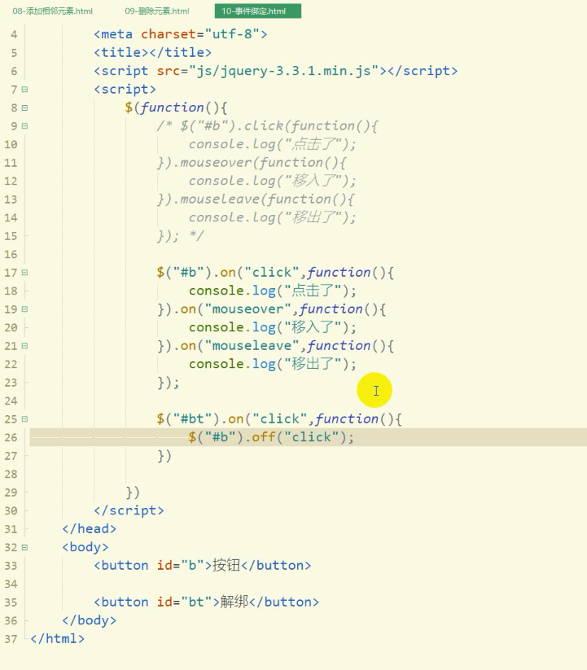
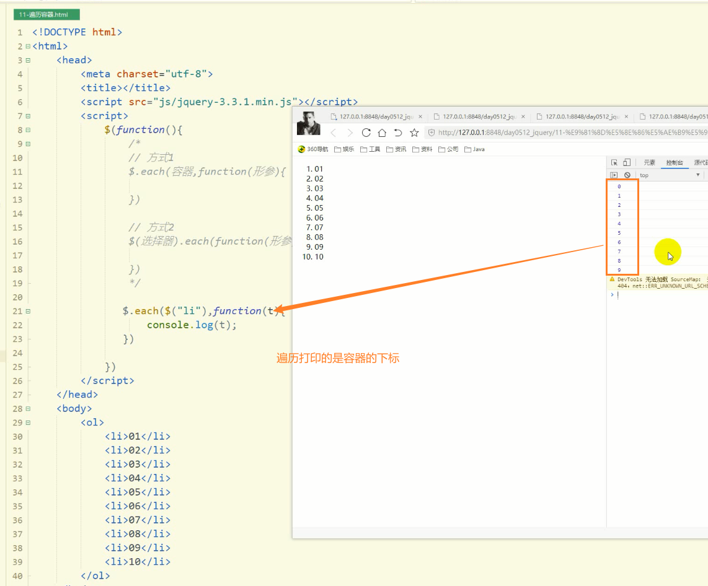
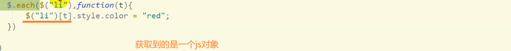
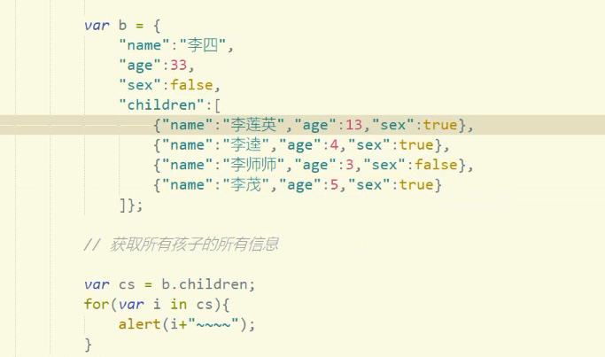
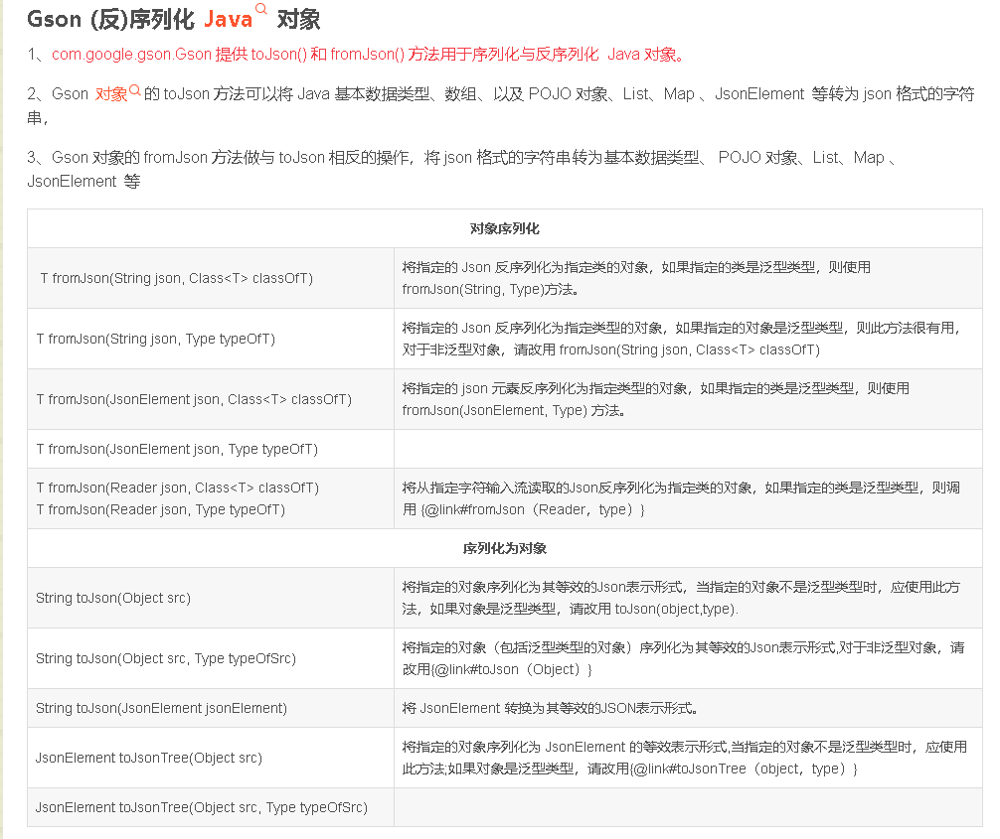

### 一，jQuery

#### 1.1 概念

> jQuery是一个前端框架，用于简化js开发
>
> jQuery的设计宗旨：`write less do more`，提倡使用更少的代码写出更多的功能。
>
> 它封装了js的常用功能，优化了html页面的操作、优化了事件处理、优化了ajax的开发。
>
> jQuery本质是一个js文件

#### 1.2 jQuery的使用

> 1. 下载jQuery文件
>
> jquery-3.3.1
>
> 微软压缩版引用地址：`http://ajax.aspnetcdn.com/ajax/jQuery/jquery-3.3.1.min.js`
>
> 官网压缩版引用地址：`https://code.jquery.com/jquery-3.3.1.min.js`
>
> 2. 在页面中引入jQuery
>
>    ```html
>    <!-- 微软版 -->
>    <!-- <script src="http://ajax.aspnetcdn.com/ajax/jQuery/jquery-3.3.1.min.js">
>    </script> -->
>    
>    <!-- 官方版 -->
>    <!-- <script src="https://code.jquery.com/jquery-3.3.1.min.js">
>    </script> -->
>    
>    <!-- 本地的 -->
>    <script src="js/jquery-3.3.1.min.js">
>    </script>
>    ```
>
> 注：任何一个版本的jQuery都有带有min和不带有min的两个版本
>
> jquery-xxx.js：开发版，给程序员学习阅读的，其中代码有良好的注释和缩进，体积大
>
> jquery-xxx.min.js：生产版，给程序员开发使用的，没有注释和索引，体积小

#### 1.3 js对象与jquery对象的转换

> 1. js对象转换成jquery对象
>
>    格式：
>
>    ```js
>    $(js对象)
>    ```
>
>    ```js
>    var btn = [[document]].getElementById("btn");// 通过id找到js的标签对象
>    var b = $(btn);// 将js对象转换成jquery对象
>    ```
>
> 2. jquery对象转换成js对象
>
>    格式：
>
>    ```js
>    //方式一
>    jquery对象[索引]
>    //方式二 
>    jquery对象.get(索引)
>    ```
>
> 注：js（jquery）对象不能调用jquery（js）的属性和方法
>
> ```html
> <!DOCTYPE html>
> <script src="js/http_ajax.aspnetcdn.com_ajax_jQuery_jquery-3.7.0.js"></script>
> <html>
> 	<head>
> 		<meta charset="utf-8">
> 		<title></title>
> 	</head>
> 	<body>
> 		<[[button]] id="btn">按钮</button>
> 	</body>
> </html>
> <script>
> 	onload = function() {
> 		[[let]] btn = document.getElementById("btn");
> 		// 将js对象转换为jQuery对象
> 		let b = $(btn);
> 		console.log(b);
> 		b.click(function(){
> 			console.log("b的方式执行了");
> 		});
> 		// jquery对象转换成js对象
> 		// 方式一
> 		// let btn2 = b[0];
> 		// 方式二	
> 		let btn2 = b.get(0);
> 		btn2.onclick = function(){
> 			console.log("btn的方式执行了");
> 		}
> 	}
> </script>
> ```

#### 1.4 jQuery的基本操作

> 1. 入口函数（就是js中的onload） 
>
>    ```js
>    //方式1
>    $(document).ready(function(){    
>    });
>    
>    //方式2
>    $().ready(function(){    
>    });
>    
>    //方式3  最常用的方式
>    $(function(){
>    })
>    ```
>
> 2. 事件绑定
>
>    ```js
>    jquery对象.事件1(function(){
>        
>    }).事件2(function(){
>        
>    });
>    ```
>
> 3. 样式设置
>
>    ```js
>    jquery对象.[[css]]("样式名","样式值");
>    
>    jquery对象.css("样式名","样式值").css("样式名","样式值").css("样式名","样式值")...;
>    
>    jquery对象.css({"样式名":"样式值","样式名":"样式值","样式名":"样式值",...});
>    ```

#### 1.5 选择器

##### 1.5.1 基本选择器

> 1. 元素选择器
>
>    ```js
>    $("标签名")
>    ```
>
> 2. id选择器
>
>    ```js
>    $("#id值")
>    ```
>
> 3. 类选择器
>
>    ```js
>    $(".class值")
>    ```
>
> 4. 分组选择器
>
>    ```js
>    $("选择器1,选择器2,...")
>    ```
>
> 5. 通配符选择器
>
>    ```js
>    $("*")  
>    ```

##### 1.5.2 层级选择器

> 1. 子代选择器
>
>    ```js
>    $("选择器1>选择器2")
>    ```
>
> 2. 后代选择器
>
>    ```js
>    $("选择器1 选择器2")
>    ```

##### 1.5.3 属性选择器

> ```js
> // 格式1
> $("选择器[属性名]")
> // 格式2
> $("选择器[属性名='值']")
> // 格式3
> $("选择器[属性名='值'][属性名='值'][属性名='值']...")
> ```

##### 1.5.4 过滤选择器

> 1. 首元素选择器
>
>    ```js
>    $("选择器:first")
>    ```
>
> 2. 尾元素选择器
>
>    ```js
>    $("选择器:last")
>    ```
>
> 3. 非元素选择器
>
>    ```js
>    $("选择器:not(选择器)")
>    ```
>
>    
>
> 4. 奇数选择器----(`从0开始`)
>
>    ```js
>    $("选择器:odd")
>    ```
>
> 5. 偶数选择器
>
>    ```js
>    $("选择器:even")
>    ```
>
> 6. 等于索引选择器
>
>    ```js
>    $("选择器:eq(index)")
>    ```
>
> 7. 大于索引选择器
>
>    ```js
>    $("选择器:gt(index)")
>    ```
>
> 8. 小于索引选择器
>
>    ```js
>    $("选择器:lt(index)")
>    ```

#### 1.6 DOM操作

##### 1.6.1 内容的操作

> 1. [[text]]()：等价于js中的innerText，获取/设置标签体中的内容
> 2. html()：等价于js中innerHTML，获取/设置标签体中的html结构
> 3. val()：等价于[[input]]元素中的value，获取/设置标签中的value属性
>
> 注：
>
> 1. 方法无参表示获取
> 2. 方法有参表示设置

##### 1.6.2 属性的操作

> 1. 通用属性的操作
>
>    1. attr()：获取/设置属性
>
>       **问题：**
>
>       - `$(‘inp’).attr(‘标签属性’)`是侧重去得到一个标签内部属性的值的，所以在表单标签中，这个操作无法得到一个实时变化的表单内部的值。
>
>       **解决办法：**
>
>       - 解决办法，其实JQuery早就给出来了，就是使用` .val()` 去获取表单的值。
>
>    2. removeAttr()：根据属性名删除属性
>
>    3. prop()：获取/设置属性
>
>    4. removeProp()：根据属性名删除属性
>
>       注：
>
>       1. 设置：需要属性名和属性值两个参数
>       2. 获取：需要属性名这一个参数
>       3. attr专门用于`操作自定义`属性，prop专门用于操作标签的`固有属性`
>
> 2. class属性的操作
>
>    1. addClass()：添加class属性值
>
>    2. removeClass()：移除class属性
>
>       
>
>    3. toggleClass()：切换class属性，如果该标签有指定的class值则移除；如果没有则添加==(字面意思)==

##### 1.6.3 标签的操作

> 1. a.append(b)：在a中添加最后一个子元素b
>
> 2. a.prepend(b)：在a中添加第一个子元素b
>
> 3. a.appendTo(b)：在b中添加最后一个子元素a  和`1.`很相似
>
> 4. a.prependTo(b)：在b中添加第一个子元素a   和`2.`很相似
>
> 5. 创建标签对象：
>
>    ```html
>    //创建一个超链接，返回创建出的标签对象
>    $("<a href='http://www.baidu.com'>百度</a>");
>    ```
>
> 6. a.insertBefore(b)：将a添加到b之前
>
> 7. a.insertAfter(b)：将a添加到b之后
>
> 8. a.before(b)：将b添加到a之前 
>
> 9. a.after(b)：将b添加到a之后
>
> 10. a.remove()：删除自身，如果有子元素则也一并删除
>
> 11. a.empty()：清空子元素，保留自身

#### 1.7 事件绑定

> ```js
> // 方式1：
> $(选择器).事件(function(){
> 
> }).事件(function(){
> 
> })
> 
> // 方式2：
> $(选择器).on("事件",function(){
> 
> }).on("事件",function(){
> 
> })
> //解绑
> $(选择器).off("事件")
> ```
>
> 举例：
>
> ```js
> // 方式1：
> $(选择器).click(function(){
> 
> }).mouseover(function(){
> 
> })
> 
> // 方式2：
> $(选择器).on("click",function(){
> 
> }).on("mouseover",function(){
> 
> })
> //解绑
> $(选择器).off("mouseover")
> ```
>
> 

#### 1.8 遍历容器

> ```js
> // 方式1 需要声明容器
> $.each(容器,function(形参){
> 
> })
> 
> // 方式2
> $(选择器).each(function(形参){
> 
> })
> ```
>
> 
>
> 注：
>
> 
>
> 1. 以上两种方式的匿名函数中必须定义形参，该形参表示遍历过程中每一个元素的下标
> 2. jquery的each遍历中不能使用break和continue，要使用`return false`来代替`break`，`return true`代替`continue`
>
> **省市列表案例**
>
> ```html
> <label>
>     <select id="type">
>         <[[option]]>-----请选择类型-----</option>
>         <option value="0">省</option>
>         <option value="1">直辖市</option>
>         <option value="2">自治区</option>
>     </select>
>     <select id="province">
>         <option>-----请选择省市-----</option>
>     </select>
> </label>
> </body>
> </html>
> 
> <script>
>     $(function () {
>         let provinces = [
>             ["安徽省", "福建省", "甘肃省", "广东省", "贵州省", "海南省", "河北省", "河南省", "黑龙江省", "湖北省", "湖南省", "吉林省", "江苏省", "江西省", "辽宁省", "青海省", "山东省", "山西省", "陕西省", "四川省", "云南省", "浙江省"],
>             ["天津市", "重庆市", "北京市", "上海市"],
>             ["内蒙古自治区", "宁夏回族自治区", "西藏自治区", "新疆维吾尔自治区", "广西壮族自治区"]
>         ]
>         // 头列表发生改变触发此事件
>         $("#type").change(function () {
>             $("#province").html("<option>-----请选择省市-----</option>")
>             // 不同管理制度的省市容器
>             let arr = provinces[$(this).val()];
>             $(arr).each(function (index) {
>                 // 添加此子元素到容器末尾
>                 $("#province").append("<option>" + arr[index] + "</option>")
>             })
>         })
>     })
> </script>
> ```
>
> 

### 二，json

#### 2.1 概念

> [[json]]：javascript object notation，js对象表示法
>
> 作用：用于存储和交换文本信息
>
> 特点：
>
> 1. 速度快
> 2. 内存占用小
> 3. 易于解析

#### 2.2 基本语法

> json对象中的数据使用键值对进行存储（表现）
>
> 键：`字符串类型`，用单（双）引号括起来
>
> 值：
>
> 1. [[数值]]
> 2. 字符串
> 3. 布尔值
> 4. null
> 5. json[[数组]]
> 6. json对象

> 获取json中的数据：
>
> 1. json对象.键  `建议使用这种`
> 2. json对象["键"]
> 3. json数组[索引]

> json数组的遍历除了可以使用普通for循环外，还有可以使用如下方式：
>
> 
>
> ```js
> for(var 变量t in json数组/对象){
> 
> }
> ```
>
> 注：使用`forin`遍历json时，如果遍历的是json对象，那么变量t是json对象中的键；如果遍历的是json数组，那么变量t是json数组的下标

#### 2.3 json数据与java对象的转换

> 方式一：使用jackson
>
> 步骤：
>
> 1. 引入依赖
>
>    ```xml
>    <dependency>
>        <groupId>com.fasterxml.jackson.core</groupId>
>        <artifactId>jackson-databind</artifactId>
>        <version>2.12.6</version>
>    </dependency>
>    ```
>
> 2. 创建jackson的核心对象ObjectMapper
>
>    ```java
>    ObjectMapper mapper = new ObjectMapper();
>    ```
>
> 3. 进行转换
>
>    1. java对象转换成json数据
>
>       ```java
>       mapper.writeValueAsString(Object o);
>       ```
>
>    2. json数据转换成java对象
>
>       ```java
>       //根据无参构造函数来创建对象
>       mapper.readValue(String json,Class c);
>       ```

> 方式二：使用gson
>
> 步骤：
>
> 1. 引入依赖
>
>    ```xml
>    <dependency>
>        <groupId>com.google.code.gson</groupId>
>        <artifactId>gson</artifactId>
>        <version>2.9.0</version>
>    </dependency>
>    ```
>
> 2. 创建gson的核心对象Gson
>
>    ```java
>    Gson g = new Gson();
>    ```
>
> 3. 进行转换
>
>    1. java对象转换成json数据
>
>       ```java
>       g.toJson(Object o);
>       ```
>
>    2. json数据转换成java对象
>
>       ```java
>       g.fromJson(String json,Class c);
>       ```
>
> 

### 三，AJAX

#### 3.1 概念

> ajax：Asynchronous JavaScript And Xml，异步的js和xml
>
> 同步：客户端向服务器发送请求后，必须等待服务器的响应，只有接收到服务器的响应后，客户端才能再此发起请求
>
> 异步：客户端向服务器发送请求后，客户端不需要等待服务器的响应，就可以再次发起请求
>
> 作用：页面的局部刷新
>
> ajax是一种无需加载整个页面，就可以更新页面中部分内容的技术，提高了用户的体验
>
> **AJAX**（Asynchronous [JavaScript](https://developer.mozilla.org/zh-CN/docs/Glossary/JavaScript) And [XML](https://developer.mozilla.org/zh-CN/docs/Glossary/XML) ）是一种在 Web 应用中通过异步发送 HTTP 请求向服务器获取内容，并使用这些新内容更新页面中相关的部分，而无需重新加载整个页面的 Web 开发技术。这可以让网页更具有响应性，因为只请求了需要更新的部分。
>
> AJAX 可以用于创建[单页应用](https://developer.mozilla.org/zh-CN/docs/Glossary/SPA)——那些使用 AJAX 来更新需要的内容的、由单一文档构成的一整个 Web 应用。
>
> 一开始的时候 AJAX 通过使用 [`XMLHttpRequest`](https://developer.mozilla.org/zh-CN/docs/Web/API/XMLHttpRequest) 接口实现，但是 [`fetch()`](https://developer.mozilla.org/zh-CN/docs/Web/API/fetch) API 更适合用于开发现代 Web 应用：更出色、更灵活、更好地与一些 Web 应用的基础技术相结合（如 [Service Worker](https://developer.mozilla.org/zh-CN/docs/Web/API/Service_Worker_API)）。现代 Web 框架也为 AJAX 提供了抽象。

#### 3.2 使用原生的js完成ajax

> １.创建执行异步请求的核心对象`XMLHttpRequest`
>
> ```js
> let xmlhttp;
> // 判断当前浏览器是高版本的浏览器，还是低版本的浏览器
> if(window.XMLHttpRequest){
>  // 当前浏览器是新版本的浏览器，新版本的浏览器中内置了XMLHttpRequest对象
>  // chrome、firefox、IE7+ 等
>  xmlhttp = new XMLHttpRequest();
> }else{
>  // 当前浏览器是老版本的浏览器，没有内置XMLHttpRequest对象，需要创建ActiveXObject对象
>  xmlhttp = new ActiveXObject("Microsoft.XMLHTTP");
> }
> ```
>
> 2. 建立连接
>
> ```js
> xmlhttp.open(参数1,参数2,参数3);
> /*
> 参数：
> 1. 提交方式：get、post
> 2. 请求的地址
> 3. 是否使用异步：true（使用），false（不使用）
> */
> ```
>
> 3. 发送请求
>
> ```js
> xmlhttp.send();
> /*
> 注：
> 1. get请求：提交的数据必须拼接在请求的地址之后，并且send()方法的参数为空
> 2. post请求：提交的数据必须写在send()方法的参数中，并且在以post方式提交数据之前，必须先写如下语句：
> xmlhttp.setRequestHeader("Content-type", "application/x-www-form-urlencoded");
> */
> ```
>
> 4. 接收服务器响应回来的数据
>
> ```js
> xmlhttp.onreadystatechange = function(){
>     //以下是固定写法
>     /*
>     xmlhttp.readyState == ？
>     0：初始化，XMLHttpRequest对象还没有完成初始化
>     1：载入，XMLHttpRequest对象开始发送请求
>     2：载入完成，XMLHttpRequest对象的请求发送完成
>     3：解析，XMLHttpRequest对象开始读取服务器的响应
>     4：完成，XMLHttpRequest对象读取服务器响应结束
>     */
>     if(xmlhttp.readyState == 4 && xmlhttp.status/*状态码*/ == 200){
>        // 响应后的功能
>     }
> }
> ```
>
> 注：要通过`xmlhttp.responseText`来获取服务器响应回来的文本

##### GET 还是 POST？

> GET 比 POST 更简单更快，可用于大多数情况下。
>
> 不过，请在以下情况始终使用 POST：
>
> - 缓存文件不是选项（更新服务器上的文件或[[16-数据库]]）
> - 向服务器发送大量数据（POST 无大小限制）
> - 发送用户输入（可包含未知字符），POST 比 GET 更强大更安全

##### ajax的post请求提交的数据在后端无法用request.getParameter获取

> **原因分析**
> 原因是原生ajax请求时,在http头中的`content-type为text/plain;charset=UTF-8`.当请求到达tomcat服务器时,服务器只对`application/x-www-form-urlencoded`形式的http,post请求进行读取body体中的参数,并放到request的parameter中,对于原生ajax请求则直接忽略,不会读取body体中的参数,才导致`request.getParameter(name)`读取不到参数.
>
> **解决方法**
>
> ```java
> getInputStream()
> ```

#### 3.3 使用jquery完成ajax

> ```js
> //方式1：使用get方式
> $.get(参数1,参数2,参数3,参数4);
> //方式2：使用post方式
> $.post(参数1,参数2,参数3,参数4);
> /*
> 参数：
> 1.请求的地址
> 2.提交的数据
> 3.服务器响应后执行的函数，这个函数的参数就是响应回来的数据
> 4.接收服务器响应数据的类型：json、text
> 注：
> 1.无论是get还是post，请求的参数都单独写在参数2的位置上
> 2.如果服务器响应回来的数据不是json格式的字符串，那么参数4可以是json也可以是text，因为接收到的数据都是字符串；
> 如果服务器响应回来的数据是json格式的字符串，那么参数4是text的话，接收到的就是字符串，参数4是json的话，接收到的就是json对象
> 3.提交的数据可以是：key=value，也可以是{"key":"value"}
> */
> ```
>
> ```js
> //方式3：
> $.ajax({
>  url:请求的地址,
>  data:提交的数据,
>  success:function(d){
>  },
>  dataType:接收数据的类型(json/text),
>  type:提交方式(get/post)
> });
> ```
>
> 

#### 3.4 手机号校验测试（原生AJax）

> **html**
>
> ```html
> <!DOCTYPE html>
> <html lang="en">
> <script src="../js/jquery-3.7.0.js"></script>
> <head>
>  <meta charset="UTF-8">
>  <title>原生JS实现手机号注册账号校验</title>
> </head>
> <body>
> <form action="/check" method="post">
>  <label>
>      <input id="username" type="text"><span id="ExistenceOrNot">提示</span>
>      <br>
>      <input type="password">
>  </label>
>  <br>
>  <button>注册</button>
> </form>
> </body>
> </html>
> <script>
>  $(function () {
>      let xmlhttp;
>      // 判断当前浏览器是高版本的浏览器，还是低版本的浏览器
>      if(window.XMLHttpRequest){
>          // 当前浏览器是新版本的浏览器，新版本的浏览器中内置了XMLHttpRequest对象
>          // chrome、firefox、IE7+ 等
>          xmlhttp = new XMLHttpRequest();
>      }else{
>          // 当前浏览器是老版本的浏览器，没有内置XMLHttpRequest对象，需要创建ActiveXObject对象
>          xmlhttp = new ActiveXObject("Microsoft.XMLHTTP");
>      }
>      $("#username").blur(function () {
>          /*
>          // get方式提交
>          xmlhttp.open("post", "/check", true);
>          xmlhttp.send("phoneNumber=" + $(this).val());
>          */
> 
>          // post方式提交
>          xmlhttp.open("get", "/check?phoneNumber="+$(this).val(), true);
>          xmlhttp.setRequestHeader("Content-type", "application/x-www-form-urlencoded");
>          xmlhttp.send();
> 
>          xmlhttp.onreadystatechange = function(){
>              if(xmlhttp.readyState === 4 && xmlhttp.status === 200){
>                  let existenceOrNot = $("#ExistenceOrNot");
>                  // 响应后的功能
>                  if (xmlhttp.responseText === '1'){
>                      existenceOrNot.css("color", "red");
>                      existenceOrNot.html('手机号已被注册');
>                  }else if(xmlhttp.responseText === '0'){
>                      existenceOrNot.css("color", "green");
>                      existenceOrNot.html('手机号可用');
>                  }
>              }
>          }
>      })
>  })
> </script>
> ```
>
> **servlet**
>
> 1. 写法一
>
> ```java
> @WebServlet("/check")
> public class CheckPhoneNumber extends HttpServlet {
>  @Override
>  public void doGet(HttpServletRequest req, HttpServletResponse resp) throws IOException {
>      String method = req.getMethod();
>      String phoneNumber;
> 		/*
>      html页面以post方式提交的原生Ajax如果没有
>          xmlhttp.setRequestHeader("Content-type", "application/x-www-form-urlencoded");
>      这一条语句，则以如下方式解析input流或者Reader流的字节码内容
>      if (method.equals("get")) {
>          phoneNumber = req.getQueryString();
>      } else {
>          StringBuilder sb = new StringBuilder();
>          try (BufferedReader reader = req.getReader();) {
>              char[] buff = new char[1024];
>              int len;
>              while ((len = reader.read(buff)) != -1) {
>                  sb.append(buff, 0, len);
>              }
>          } catch (IOException e) {
>              e.printStackTrace();
>          }
>          phoneNumber = sb.toString();
>      }*/
>      
>      /*
>      如果加上了9行的语句，则可直接以req.getParameter(xxx)获取post和get方式提交,拼接的数据;
>      */
>      phoneNumber = req.getParameter("phoneNumber");
>      System.out.println();
>      if (phoneNumber.contains("178")) {
>          resp.getWriter().write("1");
>      } else {
>          resp.getWriter().write("0");
>      }
>  }
> ```
>
> `2.`写法二
>
> ```html
> <script>
>     $(function () {
>         $('#username').blur(function () {
>             //post提交，则将$.get换成$.post即可
>             $.get("/check", "phoneNumber=" + $('#username').val(), function ([[date]]) {
>                 let eo = $('#ExistenceOrNot');
>                 if (date === '1')
>                     eo.css('color', 'red').text('手机号已注册');
>                 else
>                     eo.css('color', 'green').text('手机号可用');
>             }, "text")
>         })
>     })
> </script>
> ```
>
> `3.`写法三
>
> ```html
> <script>
>     $(function () {
>         $('#username').blur(function () {
>             $.ajax({
>                 url:"/check",
>                 data:"phoneNumber=" + $('#username').val(),
>                 success:function(date){
>                     let eo = $('#ExistenceOrNot');
>                     if (date === '1')
>                         eo.css('color', 'red').text('手机号已注册');
>                     else
>                         eo.css('color', 'green').text('手机号可用');
>                 },
>                 dataType:"text",
>                 type:"post"
>             });
>         })
>     })
> </script>
> ```
>
> 


