[TOC]

# Spring MVC

> > 参考视频：[B 站狂神](https://www.bilibili.com/video/BV1aE41167Tu)，写这个只是方便个人复习，怎么写是我自己的事，我能看懂就行，没要求非要让你看！白嫖还挑刺，是很没有风度的事情。希望做个有风度的“五好青年”！
>

---

## 1、回顾 MVC 架构

### 1.1 什么是 MVC

- MVC 设计不仅限于 [Java](http://c.biancheng.net/java/) Web 应用，还包括许多应用，比如前端、[PHP](http://c.biancheng.net/php/)、.NET 等语言。之所以那么做的根本原因在于解耦各个模块。 

> MVC 是 Model、View 和 Controller 的缩写，分别代表 Web 应用程序中的 3 种职责。
>
> - ==(Model)模型==：用于存储数据以及处理用户请求的业务逻辑。
> - ==(View)视图==：向控制器提交数据，显示模型中的数据。
> - ==(Controller)控制器==：根据视图提出的请求判断将请求和数据交给哪个模型处理，将处理后的有关结果交给哪个视图更新显示。

- MVC 是一种软件设计规范。 
- 是将业务逻辑、数据、显示分离的方法来组织代码。 
- MVC 主要作用是降低了视图与业务逻辑间的双向偶合。 
- MVC 不是一种设计模式，MVC 是一种架构模式。当然不同的 MVC 存在差异。 

> 基于 Servlet 的 MVC 模式的具体实现如下。

- **模型**：一个或多个 JavaBean 对象，用于存储数据（实体模型，由 JavaBean 类创建）和处理业务逻辑（业务模型，由一般的 Java 类创建）。
- **视图**：一个或多个 [[21-JSP]] 页面，向控制器提交数据和为模型提供数据显示，JSP 页面主要使用 HTML 标记和 JavaBean 标记来显示数据。
- **控制器**：一个或多个 Servlet 对象，根据视图提交的请求进行控制，即将请求转发给处理业务逻辑的 JavaBean，并将处理结果存放到实体模型 JavaBean 中，输出给视图显示。

> 基于 Servlet 的 MVC 模式的流程如图所示。 

 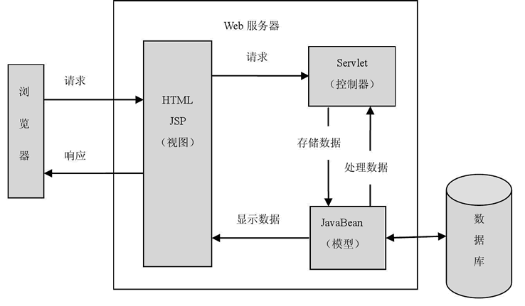 

> **最典型的 MVC 就是 JSP + servlet + javabean 的模式。**

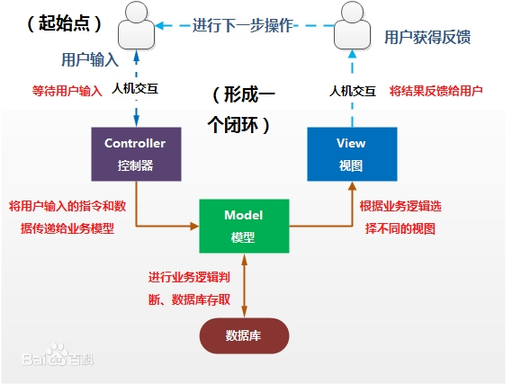

### 1.2 Model1 时代

- 在 web 早期的开发中，通常采用的都是 Model1。
- Model1 中，主要分为两层，视图层和模型层。

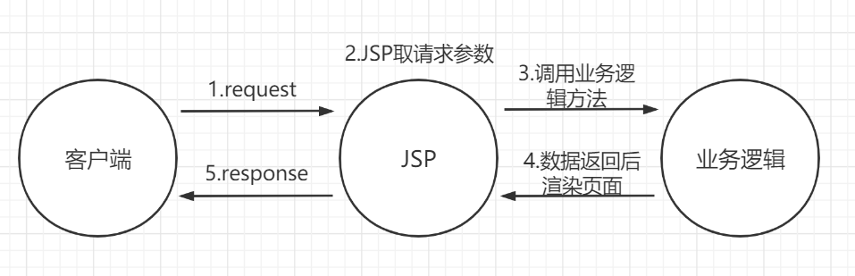

- Model1 优点：架构简单，比较适合小型项目开发；

- Model1 缺点：JSP 职责不单一，职责过重，不便于维护；

### 1.3 Model2 时代

- Model2 把一个项目分成三部分，包括 **视图、控制、模型。**

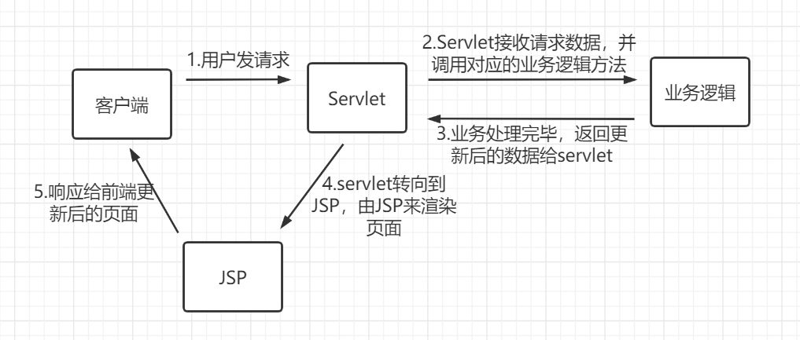

**职责分析：**

**Controller：控制器**

- 取得表单数据
- 调用业务逻辑
- 转向指定的页面

**Model：模型**

- 业务逻辑
- 保存数据的状态

**View：视图**

- 显示页面

> Model2 这样不仅提高的代码的复用率与项目的扩展性，且大大降低了项目的维护成本。Model 1 模式的实现比较简单，适用于快速开发小规模项目，Model1 中 JSP 页面身兼 View 和 Controller 两种角色，将控制逻辑和表现逻辑混杂在一起，从而导致代码的重用性非常低，增加了应用的扩展性和维护的难度。Model2 消除了 Model1 的缺点。

### 1.4 回顾 Servlet

1. 新建一个 Maven 工程当做父工程！pom 依赖！

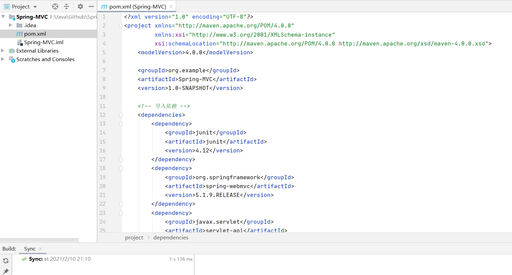

```xml
    <!-- 导入依赖 -->
    <dependencies>
        <dependency>
            <groupId>junit</groupId>
            <artifactId>junit</artifactId>
            <version>4.12</version>
        </dependency>
        <dependency>
            <groupId>org.springframework</groupId>
            <artifactId>spring-webmvc</artifactId>
            <version>5.1.9.RELEASE</version>
        </dependency>
        <dependency>
            <groupId>javax.servlet</groupId>
            <artifactId>servlet-api</artifactId>
            <version>2.5</version>
        </dependency>
        <dependency>
            <groupId>javax.servlet.jsp</groupId>
            <artifactId>jsp-api</artifactId>
            <version>2.2</version>
        </dependency>
        <dependency>
            <groupId>javax.servlet</groupId>
            <artifactId>jstl</artifactId>
            <version>1.2</version>
        </dependency>
    </dependencies>
```

2. 建立一个 Moudle：springmvc-01-servlet ， 添加 Web app 的支持！

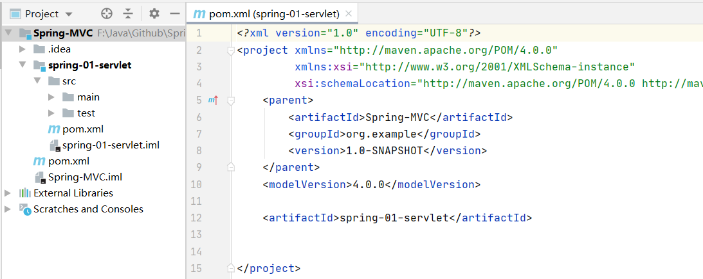

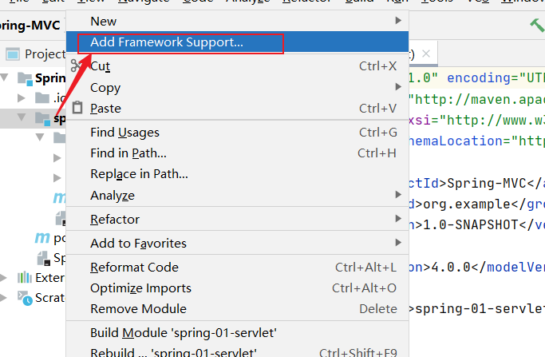

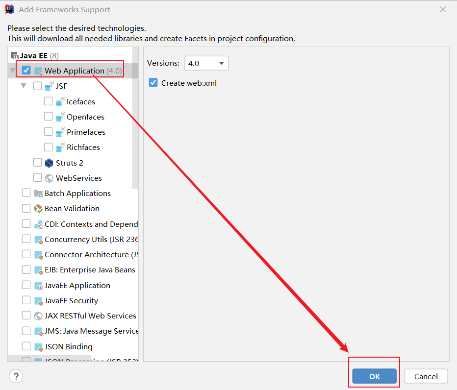

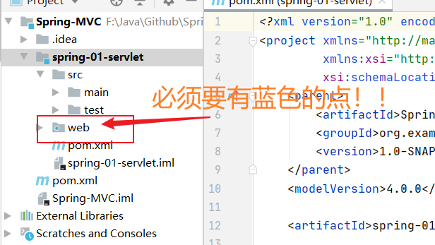

3. 导入 servlet 和 jsp 的 jar 依赖

```xml
    <!-- 导入servlet和jsp的依赖 -->
    <dependencies>
        <dependency>
            <groupId>javax.servlet</groupId>
            <artifactId>servlet-api</artifactId>
            <version>2.5</version>
        </dependency>
        <dependency>
            <groupId>javax.servlet.jsp</groupId>
            <artifactId>jsp-api</artifactId>
            <version>2.2</version>
        </dependency>
    </dependencies>
```

4. 编写一个 Servlet 类，用来处理用户的请求

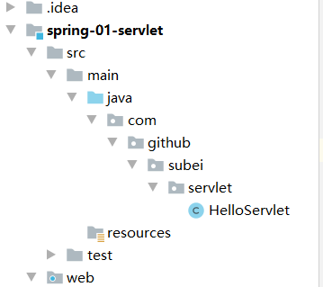

```java
package com.github.subei.servlet;

import javax.servlet.ServletException;
import javax.servlet.http.HttpServlet;
import javax.servlet.http.HttpServletRequest;
import javax.servlet.http.HttpServletResponse;
import java.io.IOException;

// 实现Servlet接口
public class HelloServlet extends HttpServlet {

    @Override
    protected void doGet(HttpServletRequest req, HttpServletResponse resp) throws ServletException, IOException {
        // 1.获取前端参数
        String method = req.getParameter("method");
        if (method.equals("add")){
            req.getSession().setAttribute("msg","执行add方法");
        }
        if (method.equals("delete")){
            req.getSession().setAttribute("msg","执行delete方法");
        }
        // 2.调用业务逻辑层

        // 3.视图转发或重定向
        req.getRequestDispatcher("/WEB-INF/jsp/Hello.jsp").forward(req,resp);
    }

    @Override
    protected void doPost(HttpServletRequest req, HttpServletResponse resp) throws ServletException, IOException {
        doGet(req,resp);
    }
}
```

5. 编写 Hello.jsp，在 WEB-INF 目录下新建一个 jsp 的文件夹，新建 Hello.jsp、Form.jsp

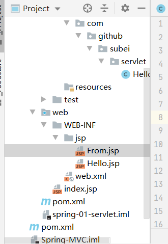

- Hello.jsp

```jsp
<%@ page contentType="text/html;charset=UTF-8" language="java" %>
<html>
<head>
    <title>subeiLY</title>
</head>
<body>
${msg}
</body>
</html>
```

- Form.jsp

```jsp
<%@ page contentType="text/html;charset=UTF-8" language="java" %>
<html>
<head>
    <title>Title</title>
</head>
<body>

<form action="/hello" method="post">
    <input type="text" name="method">
    <input type="submit">
</form>

</body>
</html>
```


6. 在 web.xml 中注册 Servlet

```xml
<?xml version="1.0" encoding="UTF-8"?>
<web-app xmlns="http://xmlns.jcp.org/xml/ns/javaee"
         xmlns:xsi="http://www.w3.org/2001/XMLSchema-instance"
         xsi:schemaLocation="http://xmlns.jcp.org/xml/ns/javaee http://xmlns.jcp.org/xml/ns/javaee/web-app_4_0.xsd"
         version="4.0">

    <servlet>
        <servlet-name>HelloServlet</servlet-name>
        <servlet-class>com.github.subei.servlet.HelloServlet</servlet-class>
    </servlet>
    <servlet-mapping>
        <servlet-name>HelloServlet</servlet-name>
        <url-pattern>/hello</url-pattern>
    </servlet-mapping>

</web-app>
```

7. 配置 Tomcat，并启动测试

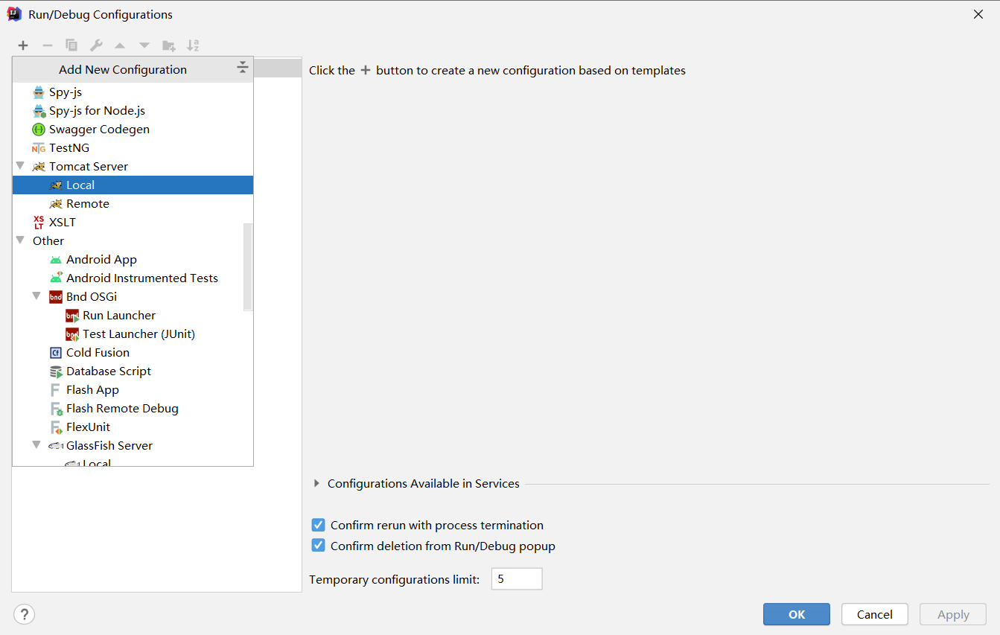

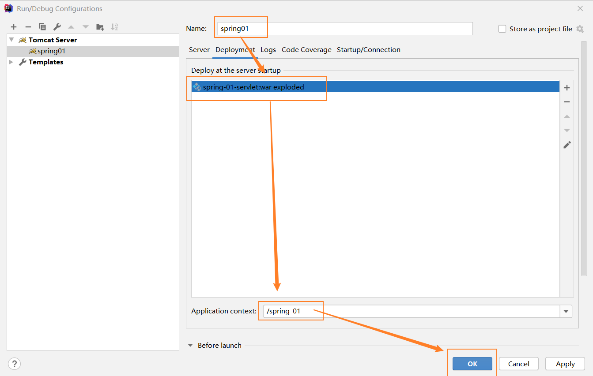


   - http://localhost: 8080/spring_01/hello?method = add

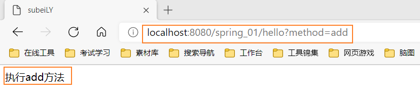


   - http://localhost: 8080/spring_01/hello?method = delete

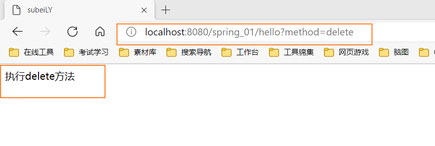

**MVC 框架要做哪些事情**

1. 将 url 映射到 java 类或 java 类的方法。
2. 封装用户提交的数据。
3. 处理请求--调用相关的业务处理--封装响应数据。
4. 将响应的数据进行渲染 . jsp / html 等表示层数据。

> 常见的服务器端 MVC 框架有：Struts、Spring MVC、ASP.NET MVC、Zend Framework、JSF；常见前端 MVC 框架：vue、angularjs、react、backbone；由 MVC 演化出了另外一些模式如：MVP、MVVM 等等....

#### MVVM 扫盲

> 参考于：https://www.jianshu.com/p/0ae3c0d830e5

- MVVM 是 Model-View-ViewModel 的简写。它 ==本质上就是 MVC 的改进版==。 
- MVVM（Model–View–Viewmodel）是一种软件架构模式。 

---

**MVC** 中的 **M** 就是单纯的从网络获取回来的数据模型，**V** 指的我们的视图界面，而 **C** 就是我们的 ViewController。

在其中，ViewController 负责 View 和 Model 之间调度，View 发生交互事件会通过 target-action 或者 delegate 方式回调给 ViewController，与此同时 ViewController 还要承担把 Model 通过 KVO、Notification 方式传来的数据传输给 View 用于展示的责任。

**随着业务越来越复杂，视图交互越复杂，导致 Controller 越来越臃肿，负重前行。脏活累活都它干了，到头来还一点不讨好。福报修多了的结果就是，不行了就重构你，重构不了就换掉你。**

- MVC 架构图

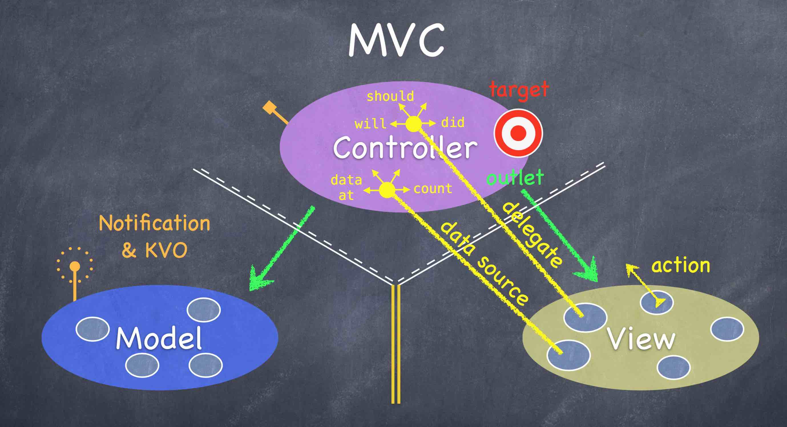 

所以，为了解决这个问题，MVVM 就闪亮登场了。他把 View 和 Contrller 都放在了 View 层（相当于把 Controller 一部分逻辑抽离了出来），Model 层依然是服务端返回的数据模型。

**而 ViewModel 充当了一个 UI 适配器的角色，也就是说 View 中每个 UI 元素都应该在 ViewModel 找到与之对应的属性。除此之外，从 Controller 抽离出来的与 UI 有关的逻辑都放在了 ViewModel 中，这样就减轻了 Controller 的负担。**

- MVVM 的架构图 

 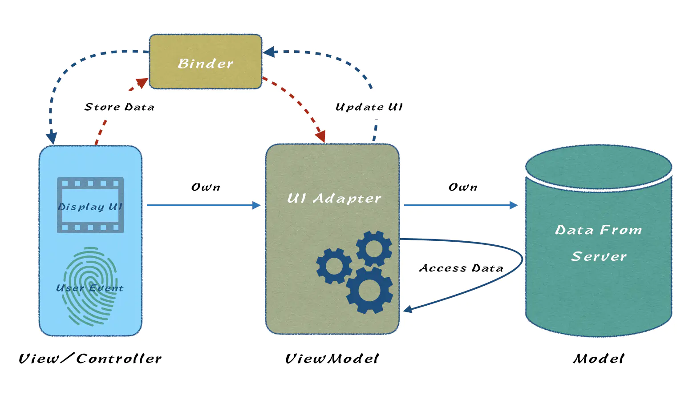

> 从以上的架构图中，我们可以很清晰的梳理出各自的分工。

-  **View 层**：视图展示。包含 UIView 以及 UIViewController，View 层是可以持有 ViewModel 的。
-  **ViewModel 层**：视图适配器。暴露属性与 View 元素显示内容或者元素状态一一对应。一般情况下 ViewModel 暴露的属性建议是 readOnly 的，至于为什么，我们在实战中会去解释。还有一点，ViewModel 层是可以持有 Model 的。
-  **Model 层**：数据模型与持久化抽象模型。数据模型很好理解，就是从服务器拉回来的 JSON 数据。而持久化抽象模型暂时放在 Model 层，是因为 MVVM 诞生之初就没有对这块进行很细致的描述。按照经验，我们通常把 [[16-数据库]]、文件操作封装成 Model，并对外提供操作接口。（有些公司把数据存取操作单拎出来一层，称之为 **DataAdapter 层**，所以在业内会有很多 MVVM 的变种，但其本质上都是 MVVM）。
-  **Binder**：MVVM 的灵魂。可惜在 MVVM 这几个英文单词中并没有它的一席之地，它的最主要作用是在 View 和 ViewModel 之间做了双向数据绑定。如果 MVVM 没有 Binder，那么它与 MVC 的差异不是很大。

> 我们发现，正是因为 View、ViewModel 以及 Model 间的清晰的持有关系，所以在三个模块间的数据流转有了很好的控制。 

## 2、什么是 SpringMVC

### 2.1 概述

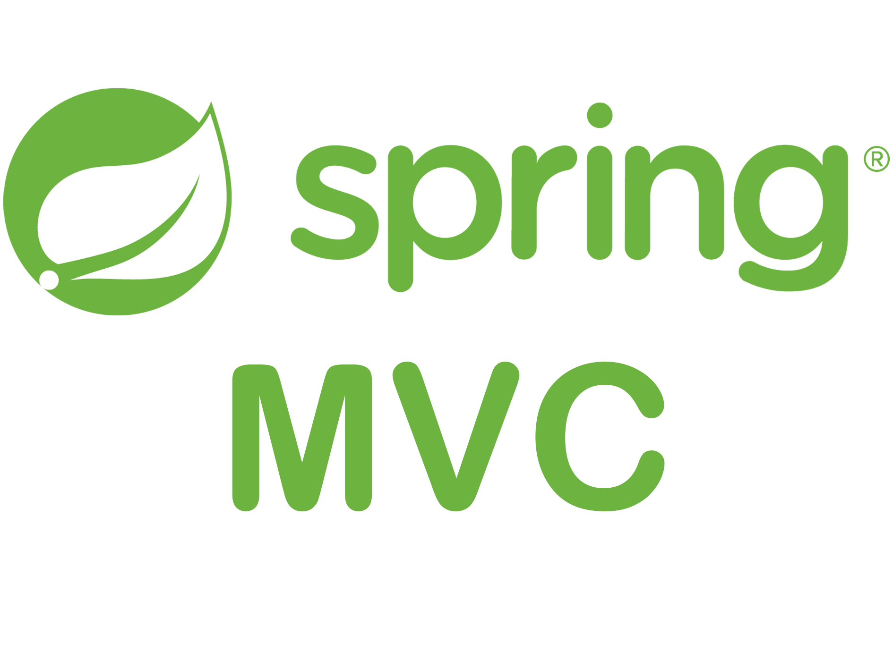

> Spring MVC 是 Spring Framework 的一部分，是基于 Java 实现 MVC 的轻量级 Web 框架。

- 官方文档：https://docs.spring.io/spring-framework/docs/4.3.24.RELEASE/spring-framework-reference/html/
- 中文官方文档：https://www.w3cschool.cn/spring_mvc_documentation_linesh_translation/spring_mvc_documentation_linesh_translation-y2ud27r5.html
- 中文文档下载地址：https://www.jb51.net/books/593599.html

> **为什么要学习 SpringMVC 呢?**

 Spring MVC 的特点：

1. 轻量级，简单易学
2. 高效 , 基于请求响应的 MVC 框架
3. 与 Spring 兼容性好，无缝结合
4. 约定优于配置
5. 功能强大：RESTful、数据验证、格式化、本地化、主题等
6. 简洁灵活

> Spring 的 web 框架围绕 **DispatcherServlet** [ 调度 Servlet ] 设计。

- DispatcherServlet 的作用是将请求分发到不同的处理器。从 Spring 2.5 开始，使用 Java 5 或者以上版本的用户可以采用基于注解形式进行开发，十分简洁；

- 正因为 SpringMVC 好 , 简单 , 便捷 , 易学 , 天生和 Spring 无缝集成(使用 SpringIoC 和 Aop) , 使用约定优于配置 . 能够进行简单的 junit 测试 . 支持 Restful 风格 .异常处理 , 本地化 , 国际化 , 数据验证 , 类型转换 , 拦截器 等等......所以要学习。

- **最重要的一点还是用的人多 , 使用的公司多 .** 

### 2.2 中心控制器

> Spring 的 web 框架围绕 DispatcherServlet 设计。DispatcherServlet 的作用是将请求分发到不同的处理器。从 Spring 2.5 开始，使用 Java 5 或者以上版本的用户可以采用基于注解的 controller 声明方式。

> Spring MVC 框架像许多其他 MVC 框架一样, **以请求为驱动** , **围绕一个中心 Servlet 分派请求及提供其他功能**，**DispatcherServlet 是一个实际的 Servlet (它继承自 HttpServlet 基类)**。

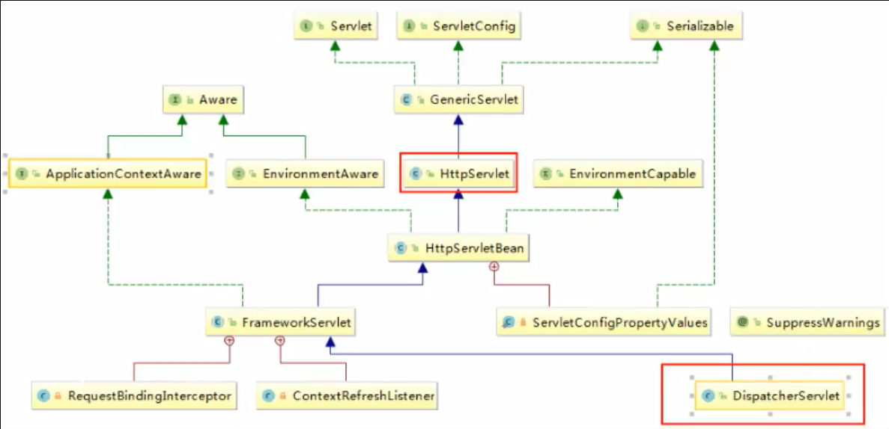

- SpringMVC 的原理如下图所示： 

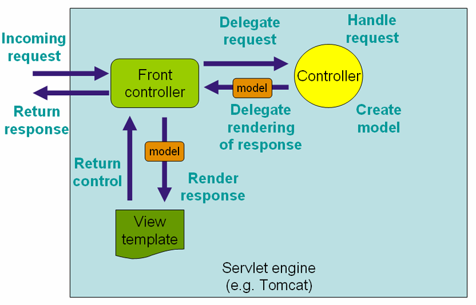 

> 当发起请求时被前置的控制器拦截到请求，根据请求参数生成代理请求，找到请求对应的实际控制器，控制器处理请求，创建数据模型，访问数据库，将模型响应给中心控制器，控制器使用模型与视图渲染视图结果，将结果返回给中心控制器，再将结果返回给请求者。 

 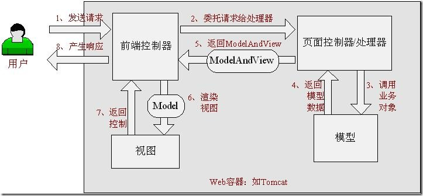 

### 2.3 SpringMVC 执行原理

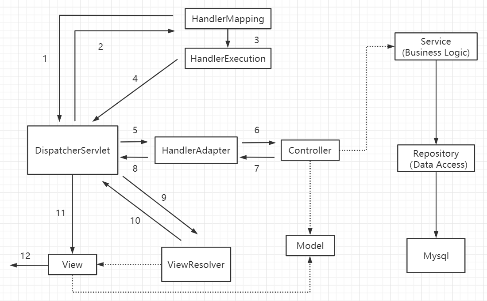

> 图为 SpringMVC 的一个较完整的流程图，实线表示 SpringMVC 框架提供的技术，不需要开发者实现，虚线表示需要开发者实现。 

**简要分析执行流程**

1. DispatcherServlet 表示前置控制器，是整个 SpringMVC 的控制中心。用户发出请求，DispatcherServlet 接收请求并拦截请求。

   假设请求的 url 为 : http://localhost: 8080/SpringMVC/hello

   **如上 url 拆分成三部分：**

   http://localhost: 8080：服务器域名

   SpringMVC：部署在服务器上的 web 站点

   hello：控制器

   通过分析，如上 url 表示为：请求位于服务器 localhost: 8080 上的 SpringMVC 站点的 hello 控制器。

2. HandlerMapping 为处理器映射。DispatcherServlet 调用 HandlerMapping, HandlerMapping 根据请求 url 查找 Handler。

3. HandlerExecution 表示具体的 Handler, 其主要作用是根据 url 查找控制器，如上 url 被查找控制器为：hello。

4. HandlerExecution 将解析后的信息传递给 DispatcherServlet, 如解析控制器映射等。

5. HandlerAdapter 表示处理器适配器，其按照特定的规则去执行 Handler。

6. Handler 让具体的 Controller 执行。

7. Controller 将具体的执行信息返回给 HandlerAdapter, 如 ModelAndView。

8. HandlerAdapter 将视图逻辑名或模型传递给 DispatcherServlet。

9. DispatcherServlet 调用视图解析器(ViewResolver)来解析 HandlerAdapter 传递的逻辑视图名。

10. 视图解析器将解析的逻辑视图名传给 DispatcherServlet。

11. DispatcherServlet 根据视图解析器解析的视图结果，调用具体的视图。

12. 最终视图呈现给用户。

## 3、HelloSpring

> 提一句：==IDEA 版本不建议使用 2020.1，版本不稳定会经常报错==。本节因为报错排错半个月！！！

### 3.1 配置版

1. 新建一个 Moudle ， springmvc-02-hellomvc ， 添加 web 的支持！ 

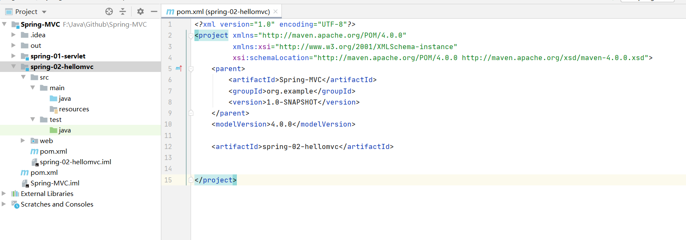

2. 确定导入了 SpringMVC 的依赖！

3. 配置 web.xml ， 注册 DispatcherServlet 

```xml
<?xml version="1.0" encoding="UTF-8"?>
<web-app xmlns="http://xmlns.jcp.org/xml/ns/javaee"
        xmlns:xsi="http://www.w3.org/2001/XMLSchema-instance"
        xsi:schemaLocation="http://xmlns.jcp.org/xml/ns/javaee 					   		http://xmlns.jcp.org/xml/ns/javaee/web-app_4_0.xsd"
        version="4.0">

   <!--1.注册DispatcherServlet-->
   <servlet>
       <servlet-name>springmvc</servlet-name>
       <servlet-class>org.springframework.web.servlet.DispatcherServlet</servlet-class>
       <!--关联一个springmvc的配置文件:【servlet-name】-servlet.xml-->
       <init-param>
           <param-name>contextConfigLocation</param-name>
           <param-value>classpath:springmvc-servlet.xml</param-value>
       </init-param>
       <!--启动级别-1-->
       <load-on-startup>1</load-on-startup>
   </servlet>

   <!--/ 匹配所有的请求；（不包括.jsp）-->
   <!--/* 匹配所有的请求；（包括.jsp）-->
   <servlet-mapping>
       <servlet-name>springmvc</servlet-name>
       <url-pattern>/</url-pattern>
   </servlet-mapping>

</web-app>
```

4. 编写 SpringMVC 的 配置文件！名称：springmvc-servlet.xml  : [servletname]-servlet.xml 

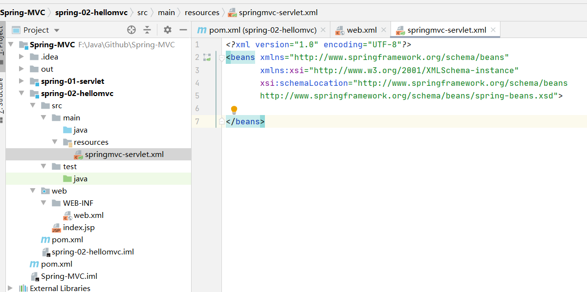

```xml
<?xml version="1.0" encoding="UTF-8"?>
<beans xmlns="http://www.springframework.org/schema/beans"
       xmlns:xsi="http://www.w3.org/2001/XMLSchema-instance"
       xsi:schemaLocation="http://www.springframework.org/schema/beans
       http://www.springframework.org/schema/beans/spring-beans.xsd">

</beans>
```

5. 添加处理映射器、 处理器适配器、 视图解析器 

```xml
<?xml version="1.0" encoding="UTF-8"?>
<beans xmlns="http://www.springframework.org/schema/beans"
       xmlns:xsi="http://www.w3.org/2001/XMLSchema-instance"
       xsi:schemaLocation="http://www.springframework.org/schema/beans
       http://www.springframework.org/schema/beans/spring-beans.xsd">

    <!-- 处理映射器 -->
    <bean class="org.springframework.web.servlet.handler.BeanNameUrlHandlerMapping"/>

    <!-- 处理器适配器 -->
    <bean class="org.springframework.web.servlet.mvc.SimpleControllerHandlerAdapter"/>

    <!-- 视图解析器:DispatcherServlet给他的ModelAndView --> 
    <bean class="org.springframework.web.servlet.view.InternalResourceViewResolver" id="InternalResourceViewResolver">
        <!--前缀-->
        <property name="prefix" value="/WEB-INF/jsp/"/>
        <!--后缀-->
        <property name="suffix" value=".jsp"/>
    </bean>

</beans>
```

6. 编写要操作业务 Controller ，要么实现 Controller 接口，要么增加注解；需要返回一个 ModelAndView，装数据，封视图； 

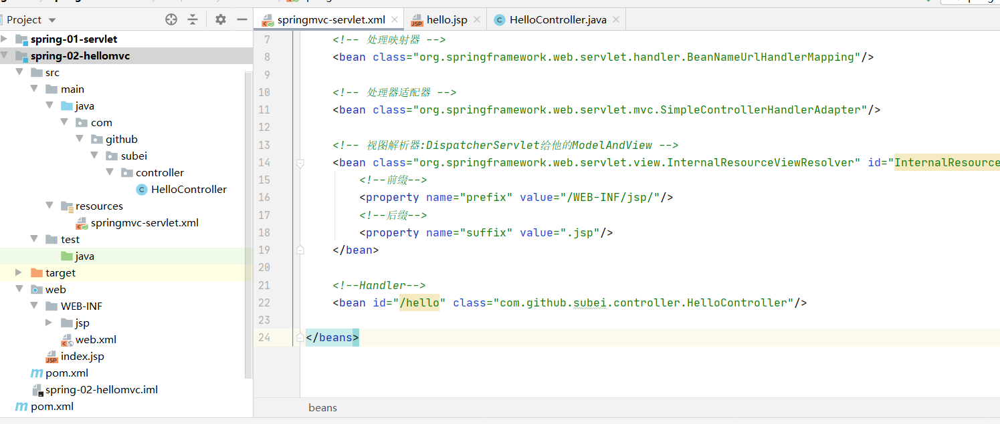

  ```java
package com.github.subei.controller;

import org.springframework.web.servlet.ModelAndView;
import org.springframework.web.servlet.mvc.Controller;

import javax.servlet.http.HttpServletRequest;
import javax.servlet.http.HttpServletResponse;

//注意：这里我们先导入Controller接口
public class HelloController implements Controller {

    public ModelAndView handleRequest(HttpServletRequest request, HttpServletResponse response) throws Exception {
        //ModelAndView 模型和视图
        ModelAndView mv = new ModelAndView();

        //封装对象，放在ModelAndView中。Model
        mv.addObject("msg","HelloSpringMVC!");
        //封装要跳转的视图，放在ModelAndView中
        mv.setViewName("hello"); //: /WEB-INF/jsp/hello.jsp
        return mv;
    }

}
  ```

7. 将自己的类交给 SpringIOC 容器，注册 bean，添加到 springmvc-servlet.xml 中。

```xml
    <!--Handler-->
    <bean id="/hello" class="com.github.subei.controller.HelloController"/>
```

8. 写要跳转的 jsp 页面，显示 ModelandView 存放的数据，以及正常页面； 

```jsp
<%@ page contentType="text/html;charset=UTF-8" language="java" %>
<html>
<head>
    <title>HelloSpringMVC</title>
</head>
<body>
    ${msg}
</body>
</html>
```

9. 配置 Tomcat，启动测试！ 

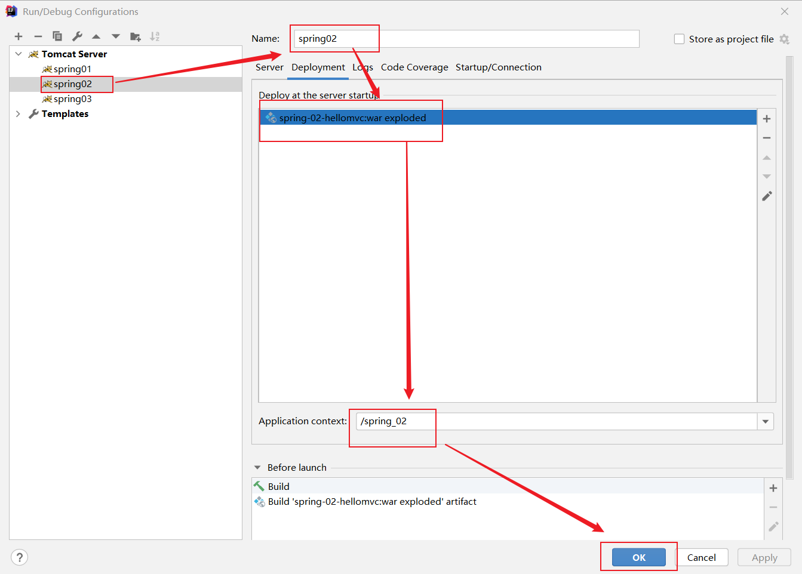

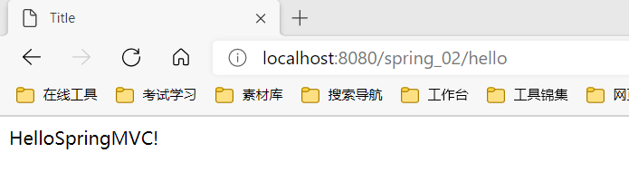

---

> 报错：Error:(3, 39) java: 程序包 org.springframework.web.servlet 不存在

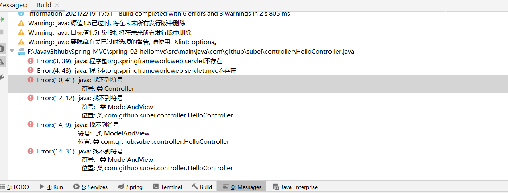

- 解决方法：在 WEB-INF 中添加 lib 文件夹，手动加入 spring-web-5.1.9.RELEASE.jar、spring-webmvc-5.1.9.RELEASE.jar 的 jar 包。

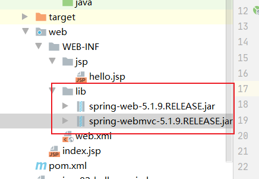

> 报错：404，如下图：

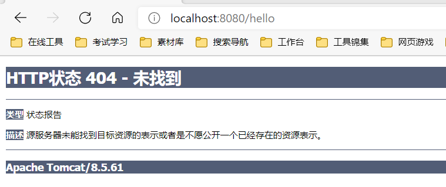

- 解决方法：

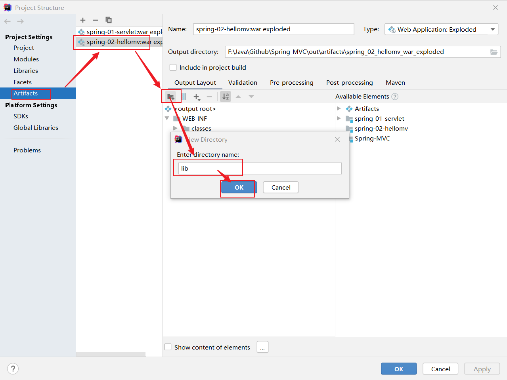

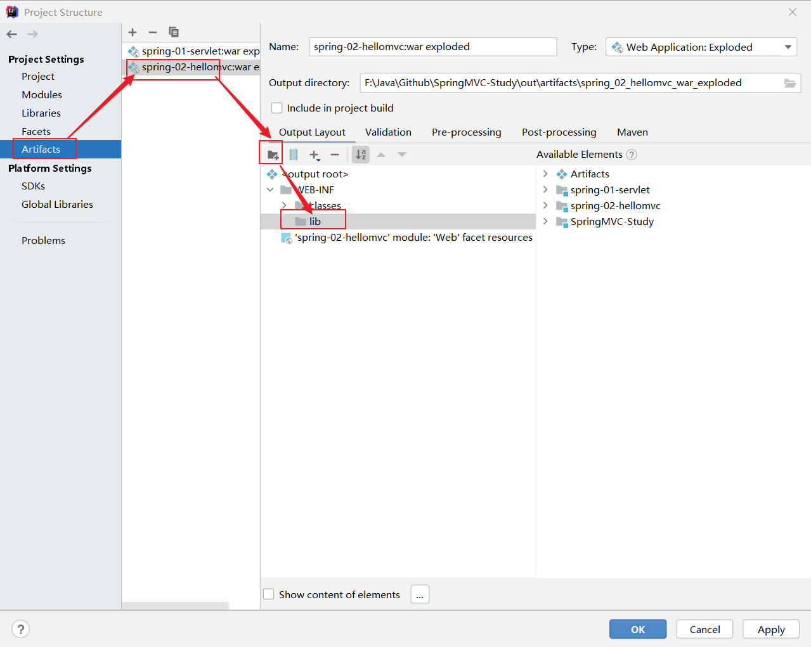

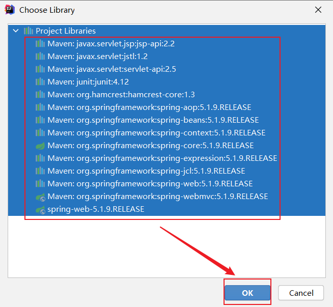

- 导入后运行，**如果仍无法解决 404 问题。可以考虑更换 IDEA 版本**。笔者之前的 IDEA 版本为 2020.1 经常报错。更换为 IDEA 2020.2 版本之后，完美解决！！！
- IDEA2020 软件地址：https://pan.baidu.com/s/1L6q0ZD2f0e7Re1669dtR3A 
- 提取码：ae4m 

### 3.2 注解版

1. 新建一个 Moudle，springmvc-03-hello-annotation ，添加 web 支持！

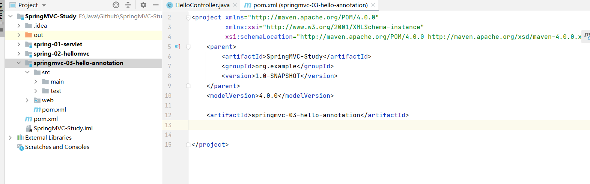

2. 由于 Maven 可能存在资源过滤的问题，将配置完善，在 pom.xml 中添加如下：

```xml
<build>
   <resources>
       <resource>
           <directory>src/main/java</directory>
           <includes>
               <include>**/*.properties</include>
               <include>**/*.xml</include>
           </includes>
           <filtering>false</filtering>
       </resource>
       <resource>
           <directory>src/main/resources</directory>
           <includes>
               <include>**/*.properties</include>
               <include>**/*.xml</include>
           </includes>
           <filtering>false</filtering>
       </resource>
   </resources>
</build>
```

3. 在 pom.xml 文件引入相关的依赖：主要有 Spring 框架核心库、Spring MVC、servlet , JSTL 等。==在父依赖中已经引入了==！

4. 配置 web.xml

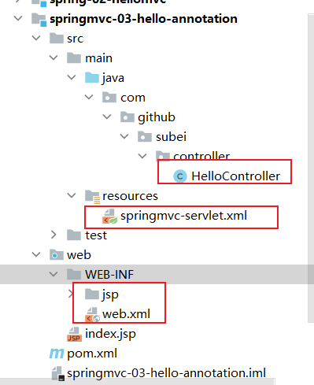

```xml
<?xml version="1.0" encoding="UTF-8"?>
<web-app xmlns="http://xmlns.jcp.org/xml/ns/javaee"
         xmlns:xsi="http://www.w3.org/2001/XMLSchema-instance"
         xsi:schemaLocation="http://xmlns.jcp.org/xml/ns/javaee http://xmlns.jcp.org/xml/ns/javaee/web-app_4_0.xsd"
         version="4.0">

    <!--1.注册servlet-->
    <servlet>
        <servlet-name>SpringMVC</servlet-name>
        <servlet-class>org.springframework.web.servlet.DispatcherServlet</servlet-class>
        <!--通过初始化参数指定SpringMVC配置文件的位置，进行关联-->
        <init-param>
            <param-name>contextConfigLocation</param-name>
            <param-value>classpath:springmvc-servlet.xml</param-value>
        </init-param>
        <!-- 启动顺序，数字越小，启动越早 -->
        <load-on-startup>1</load-on-startup>
    </servlet>

    <!--所有请求都会被springmvc拦截 -->
    <servlet-mapping>
        <servlet-name>SpringMVC</servlet-name>
        <url-pattern>/</url-pattern>
    </servlet-mapping>

</web-app>
```

- 注意/ 和 /\* 的区别：< url-pattern > / </ url-pattern > 不会匹配到.jsp， 只针对我们编写的请求；即：.jsp 不会进入 spring 的 DispatcherServlet 类 。< url-pattern > /* </ url-pattern > 会匹配 *.jsp，会出现返回 jsp 视图 时再次进入 spring 的 DispatcherServlet 类，导致找不到对应的 controller 所以报 404 错。

   - 注意 web.xml 版本问题，要最新版！
   - 注册 DispatcherServlet
   - 关联 SpringMVC 的配置文件
   - 启动级别为 1
   - 映射路径为 / 【不要用/*，会 404】

5. 添加 Spring MVC 配置文件

      > 在 resource 目录下添加 springmvc-servlet.xml 配置文件，配置的形式与 Spring 容器配置基本类似，为了支持基于注解的 IOC，设置了自动扫描包的功能，具体配置信息如下：

```xml
<?xml version="1.0" encoding="UTF-8"?>
<beans xmlns="http://www.springframework.org/schema/beans"
       xmlns:xsi="http://www.w3.org/2001/XMLSchema-instance"
       xmlns:context="http://www.springframework.org/schema/context"
       xmlns:mvc="http://www.springframework.org/schema/mvc"
       xsi:schemaLocation="http://www.springframework.org/schema/beans
       http://www.springframework.org/schema/beans/spring-beans.xsd
       http://www.springframework.org/schema/context
       https://www.springframework.org/schema/context/spring-context.xsd
       http://www.springframework.org/schema/mvc
       https://www.springframework.org/schema/mvc/spring-mvc.xsd">

    <!-- 自动扫描包，让指定包下的注解生效,由IOC容器统一管理 -->
    <context:component-scan base-package="com.github.subei.controller"/>
    <!-- 让Spring MVC不处理静态资源 -->
    <mvc:default-servlet-handler />
    <!--
    支持mvc注解驱动
        在spring中一般采用@RequestMapping注解来完成映射关系
        要想使@RequestMapping注解生效
        必须向上下文中注册DefaultAnnotationHandlerMapping
        和一个AnnotationMethodHandlerAdapter实例
        这两个实例分别在类级别和方法级别处理。
        而annotation-driven配置帮助我们自动完成上述两个实例的注入。
     -->
    <mvc:annotation-driven />

    <!-- 视图解析器 -->
    <bean class="org.springframework.web.servlet.view.InternalResourceViewResolver"
          id="internalResourceViewResolver">
        <!-- 前缀 -->
        <property name="prefix" value="/WEB-INF/jsp/" />
        <!-- 后缀 -->
        <property name="suffix" value=".jsp" />
    </bean>

</beans>
```

6. 创建 Controller，编写一个 Java 控制类：com.github.subei.controller.HelloController , 注意编码规范

```java
package com.github.subei.controller;

import org.springframework.stereotype.Controller;
import org.springframework.ui.Model;
import org.springframework.web.bind.annotation.RequestMapping;

@Controller
@RequestMapping("/HelloController")
public class HelloController {

    // 真实访问地址 : 项目名/HelloController/hello
    @RequestMapping("/hello")
    public String sayHello(Model model){
        // 向模型中添加属性msg与值，可以在JSP页面中取出并渲染
        model.addAttribute("msg","hello,SpringMVC");
        // web-inf/jsp/hello.jsp
        return "hello";
    }
}
```

- `@Controller` 是为了让 Spring IOC 容器初始化时自动扫描到；
- `@RequestMapping` 是为了映射请求路径，这里因为类与方法上都有映射所以访问时应该是/HelloController/hello；
- 方法中声明 Model 类型的参数是为了把 Action 中的数据带到视图中；
- 方法返回的结果是视图的名称 hello，加上配置文件中的前后缀变成 WEB-INF/jsp/hello.jsp。

7. 创建视图层

- 在 WEB-INF/ jsp 目录中创建 hello.jsp ， 视图可以直接取出并展示从 Controller 带回的信息；

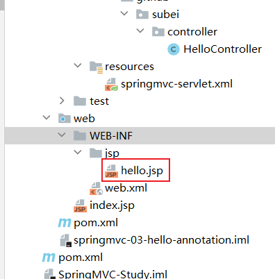

- 可以通过 EL 表示取出 Model 中存放的值，或者对象；

```jsp
<%@ page contentType="text/html;charset=UTF-8" language="java" %>
<html>
<head>
    <title>SpringMVC</title>
</head>
<body>
${msg}
</body>
</html>
```

8. 还要手动配置 lib 包。

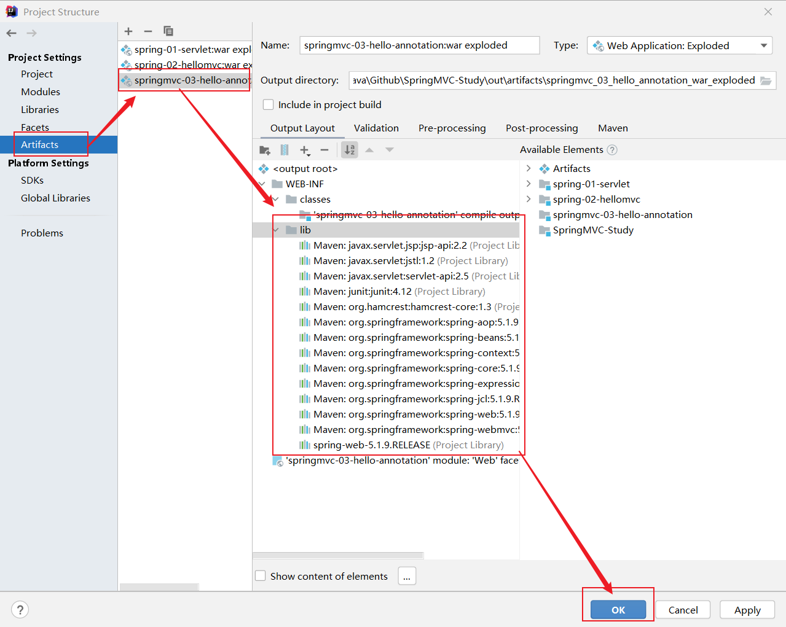

9. 配置 Tomcat 运行，开启服务器，访问对应的请求路径！

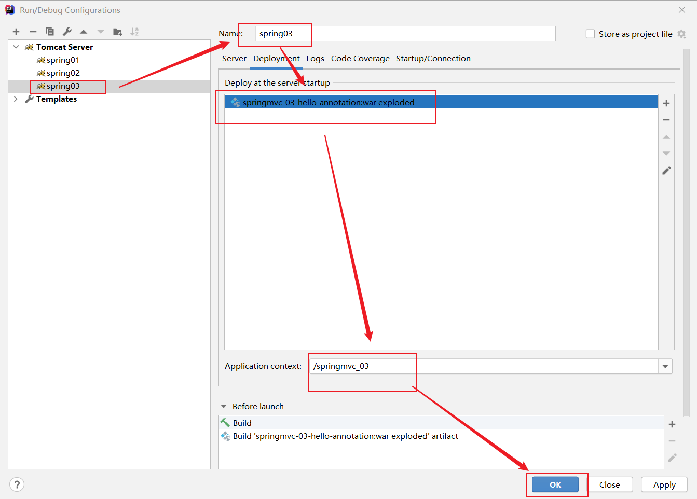

- 运行成功！！！
- http://localhost: 8080/springmvc_03/HelloController/hello

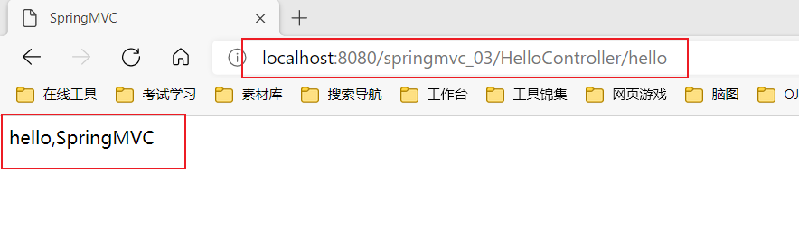

### 3.3 小结

> 实现步骤：

1. 新建一个 web 项目
2. 导入相关 jar 包
3. 编写 web.xml , 注册 DispatcherServlet
4. 编写 springmvc 配置文件
5. 接下来就是去创建对应的控制类 , controller
6. 最后完善前端视图和 controller 之间的对应
7. 测试运行调试.

> 使用 springMVC 必须配置的三大件：

- **处理器映射器、处理器适配器、视图解析器**

> 通常，我们只需要 **手动配置视图解析器**，而 **处理器映射器** 和 **处理器适配器** 只需要开启 **注解驱动** 即可，而省去了大段的 xml 配置。


## 4、RestFul 和 Controller

### 1.控制器 Controller

- 控制器复杂提供访问应用程序的行为，通常可以通过接口定义或注解定义两种方法实现。
- 控制器负责解析用户的请求并将其转换为一个模型。
- 在 Spring MVC 中一个控制器类可以包含多个方法
- 在 Spring MVC 中，对于 Controller 的配置方式有很多种

### 2.实现 Controller 接口

Controller 是一个接口，在 org.springframework.web.servlet.mvc 包下，接口中只有一个方法；

```java
// 实现该接口的类获得控制器功能
public interface Controller {
   // 处理请求且返回一个模型与视图对象
   ModelAndView handleRequest(HttpServletRequest var1, HttpServletResponse var2) throws Exception;
}
```

1. 新建一个 Moudle，springmvc-04-controller 。将刚才的 03 拷贝一份, 进行操作！

   - 删掉 HelloController。

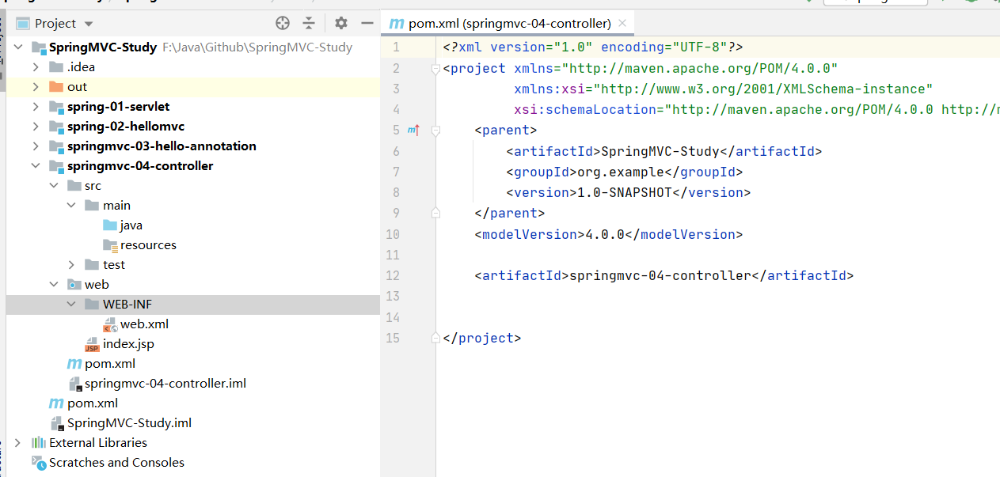

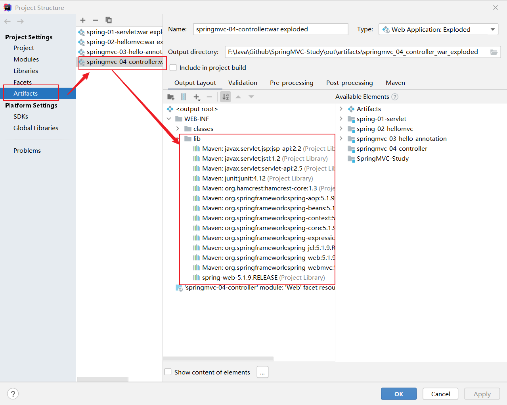

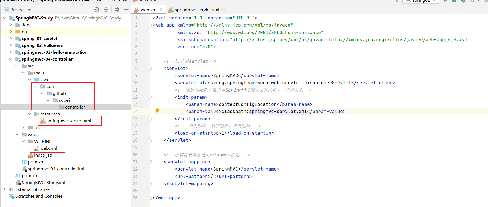

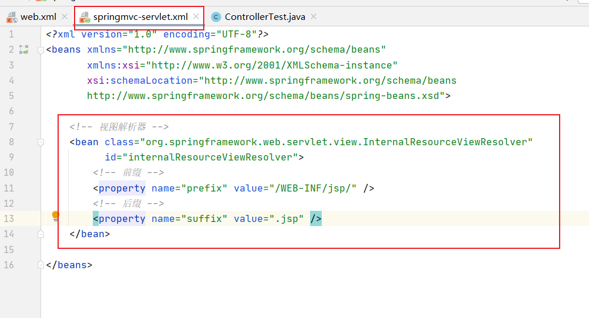

- web.xml

```xml
<?xml version="1.0" encoding="UTF-8"?>
<web-app xmlns="http://xmlns.jcp.org/xml/ns/javaee"
         xmlns:xsi="http://www.w3.org/2001/XMLSchema-instance"
         xsi:schemaLocation="http://xmlns.jcp.org/xml/ns/javaee http://xmlns.jcp.org/xml/ns/javaee/web-app_4_0.xsd"
         version="4.0">

    <!--1.注册servlet-->
    <servlet>
        <servlet-name>SpringMVC</servlet-name>
        <servlet-class>org.springframework.web.servlet.DispatcherServlet</servlet-class>
        <!--通过初始化参数指定SpringMVC配置文件的位置，进行关联-->
        <init-param>
            <param-name>contextConfigLocation</param-name>
            <param-value>classpath:springmvc-servlet.xml</param-value>
        </init-param>
        <!-- 启动顺序，数字越小，启动越早 -->
        <load-on-startup>1</load-on-startup>
    </servlet>

    <!--所有请求都会被springmvc拦截 -->
    <servlet-mapping>
        <servlet-name>SpringMVC</servlet-name>
        <url-pattern>/</url-pattern>
    </servlet-mapping>

</web-app>
```

- springmvc-servlet.xml，mvc 的配置文件只留下视图解析器！

```xml
<?xml version="1.0" encoding="UTF-8"?>
<beans xmlns="http://www.springframework.org/schema/beans"
       xmlns:xsi="http://www.w3.org/2001/XMLSchema-instance"
       xsi:schemaLocation="http://www.springframework.org/schema/beans
       http://www.springframework.org/schema/beans/spring-beans.xsd">

    <!-- 视图解析器 -->
    <bean class="org.springframework.web.servlet.view.InternalResourceViewResolver"
          id="internalResourceViewResolver">
        <!-- 前缀 -->
        <property name="prefix" value="/WEB-INF/jsp/" />
        <!-- 后缀 -->
        <property name="suffix" value=".jsp" />
    </bean>

</beans>
```

2. 编写一个 Controller 类，ControllerTest.java

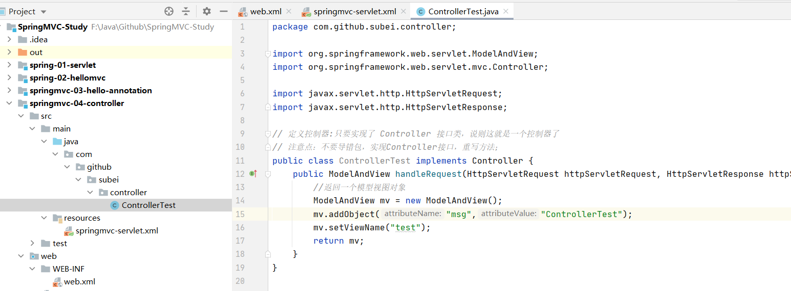

```java
package com.github.subei.controller;

import org.springframework.web.servlet.ModelAndView;
import org.springframework.web.servlet.mvc.Controller;

import javax.servlet.http.HttpServletRequest;
import javax.servlet.http.HttpServletResponse;

// 定义控制器:只要实现了 Controller 接口类，说则这就是一个控制器了
// 注意点：不要导错包，实现Controller接口，重写方法；
public class ControllerTest implements Controller {
    public ModelAndView handleRequest(HttpServletRequest httpServletRequest, HttpServletResponse httpServletResponse) throws Exception {
        //返回一个模型视图对象
        ModelAndView mv = new ModelAndView();
        mv.addObject("msg","ControllerTest");
        mv.setViewName("test");
        return mv;
    }
}
```

3. 编写完毕后，去 Spring 配置文件中注册请求的 bean；name 对应请求路径，class 对应处理请求的类。

   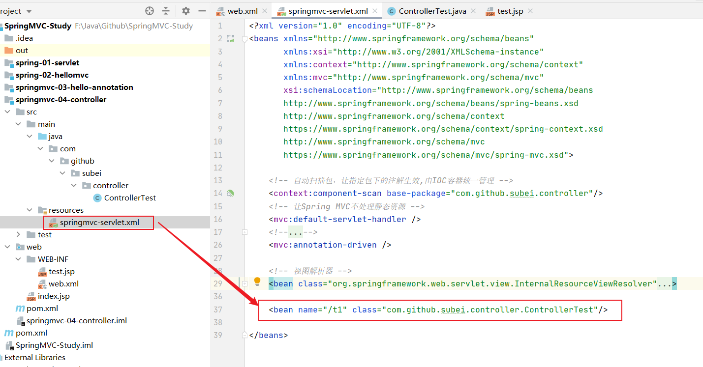

   ```xml
       <bean name="/t1" class="com.github.subei.controller.ControllerTest"/>
   ```

4. 编写前端 test.jsp，注意在 WEB-INF/jsp 目录下编写，方便对应视图解析器。

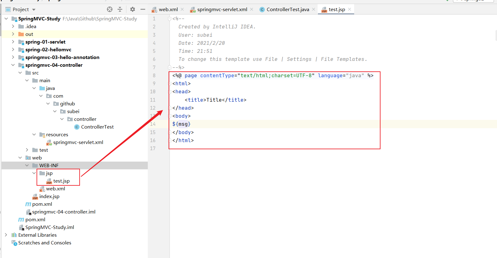

```jsp
<%@ page contentType="text/html;charset=UTF-8" language="java" %>
<html>
<head>
    <title>Title</title>
</head>
<body>
${msg}
</body>
</html>
```

5. 配置 Tomcat 运行测试，我这里项目发布名配置是/springmvc_04，如果没写，只是一个 / ，则请求不用加项目名，直接运行即可。不影响！

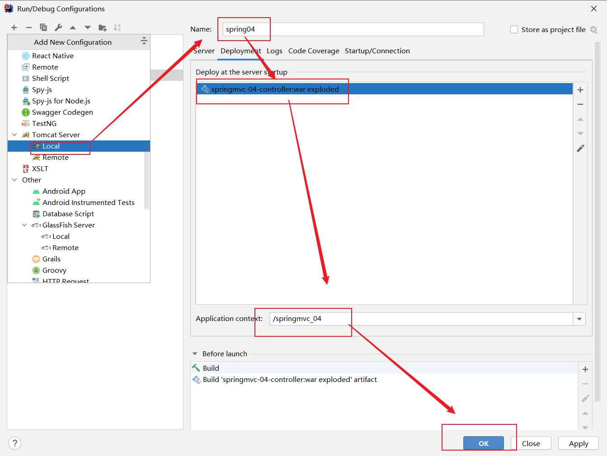

- 测试访问路径：http://localhost: 8080/springmvc_04/t1
- 测试成功！！！

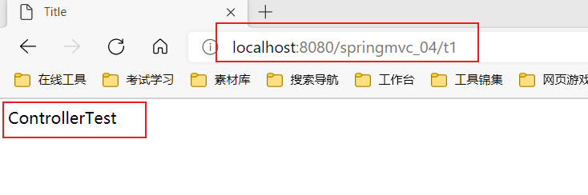

- ==注==
  - 实现接口 Controller 定义控制器是较老的办法；
  - `缺点` 是：==一个控制器中只有一个方法==，如果要多个方法则需要定义多个 Controller；定义的方式比较麻烦。

### 3.使用注解@Controller

- @Controller 注解类型用于声明 Spring 类的实例是一个控制器；

1. Spring 可以使用扫描机制来找到应用程序中所有基于注解的控制器类，为了保证 Spring 能找到你的控制器，需要在配置文件中声明组件扫描。

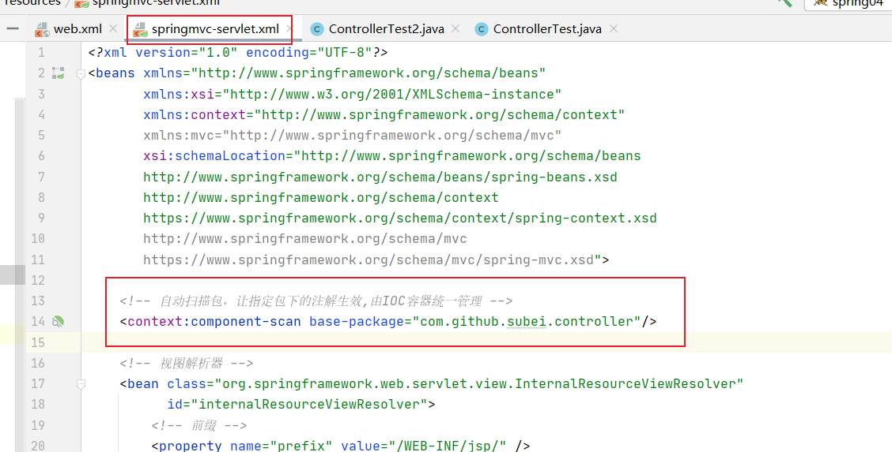

```xml
    <!-- 自动扫描包，让指定包下的注解生效,由IOC容器统一管理 -->
    <context:component-scan base-package="com.github.subei.controller"/>
```

2. 增加一个 ControllerTest2 类，使用注解实现； 

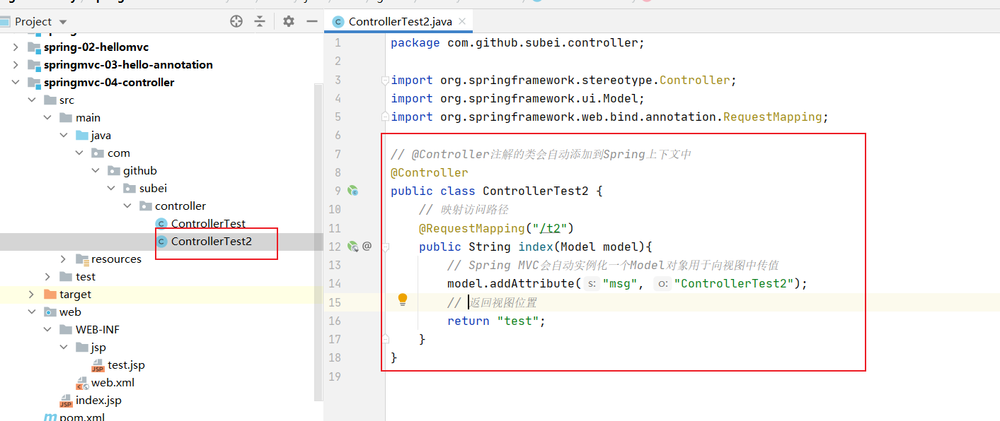

```java
package com.github.subei.controller;

import org.springframework.stereotype.Controller;
import org.springframework.ui.Model;
import org.springframework.web.bind.annotation.RequestMapping;

@Controller//代表这个类会被spring接管
// 被这个注解的类，中的所有方法，如果返问值是string，并且有具体页面可以跳转，那么就会被视图解析器解析；
public class ControllerTest2 {
    // 映射访问路径
    @RequestMapping("/t2")
    public String index(Model model){
        // Spring MVC会自动实例化一个Model对象用于向视图中传值
        model.addAttribute("msg", "ControllerTest2");
        // 返回视图位置
        return "test";
    }
}
```

3. 运行 tomcat 测试。测试路径：http://localhost: 8080/springmvc_04/t2

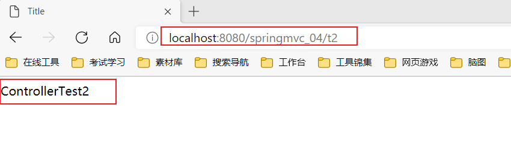

**可以发现：两个请求都可以指向一个视图，但是页面结果的结果是不一样的，从这里可以看出视图是被复用的，而控制器与视图之间是弱偶合关系。**

> **注解方式是平时使用的最多的方式！**

### 4.RequestMapping

> **@RequestMapping**

- @RequestMapping 注解用于映射 url 到控制器类或一个特定的处理程序方法。可用于类或方法上。用于类上，表示类中的所有响应请求的方法都是以该地址作为父路径。
- 只注解在方法上面。

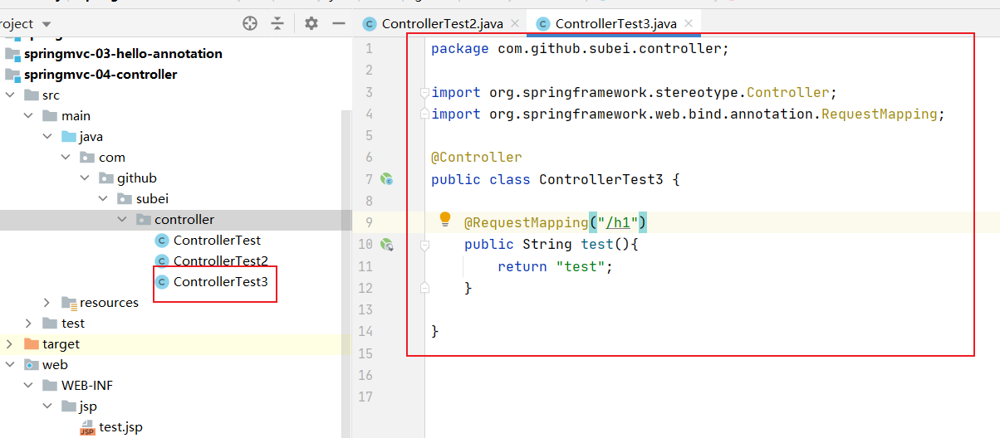

```java
package com.github.subei.controller;

import org.springframework.stereotype.Controller;
import org.springframework.web.bind.annotation.RequestMapping;

@Controller
public class ControllerTest3 {

    @RequestMapping("/h1")
    public String test(){
        return "test";
    }

}
```

- 访问路径：http://localhost: 8080 / 项目名 /h1
- http://localhost: 8080/springmvc_04/h1

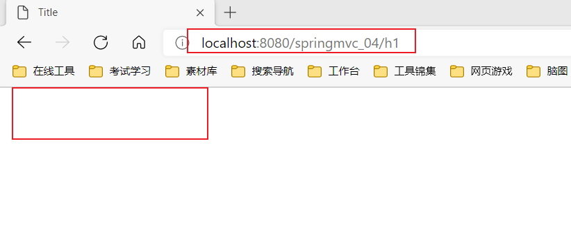

- 同时注解类与方法 

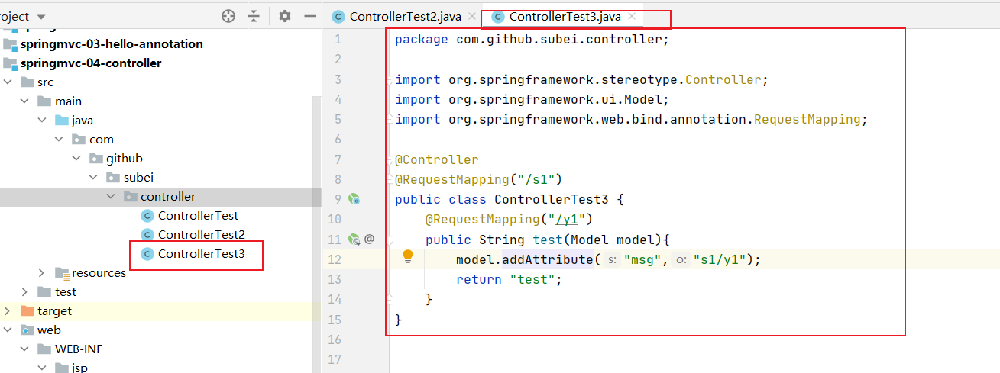

```java
package com.github.subei.controller;

import org.springframework.stereotype.Controller;
import org.springframework.ui.Model;
import org.springframework.web.bind.annotation.RequestMapping;

@Controller
@RequestMapping("/s1")
public class ControllerTest3 {
    @RequestMapping("/y1")
    public String test(Model model){
        model.addAttribute("msg","s1/y1");
        return "test";
    }
}
```

- 访问路径：http://localhost: 8080 / 项目名/ s1/y1  , 需要先指定类的路径再指定方法的路径； 
- http://localhost: 8080/springmvc_04/s1/y1

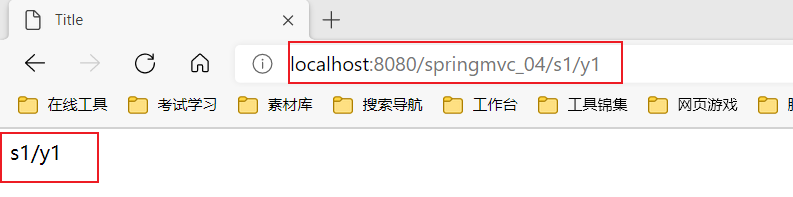

### 5.RestFul

> Restful 就是一个资源定位及资源操作的风格。不是标准也不是协议，只是一种风格。基于这个风格设计的软件可以更简洁，更有层次，更易于实现缓存等机制。

---

> **功能**

- 资源：互联网所有的事物都可以被抽象为资源；
- 资源操作：使用 POST、DELETE、PUT、GET，使用不同方法对资源进行操作。分别对应 添加、 删除、修改、查询。

> **传统方式操作资源**  ：通过不同的参数来实现不同的效果！方法单一，post 和 get

- http://127.0.0.1/item/queryItem.action?id = 1 查询, GET
- http://127.0.0.1/item/saveItem.action 新增, POST
- http://127.0.0.1/item/updateItem.action 更新, POST
- http://127.0.0.1/item/deleteItem.action?id = 1 删除, GET 或 POST

> **使用 RESTful 操作资源** ：可以通过不同的请求方式来实现不同的效果！如下：请求地址一样，但是功能可以不同！

- http://127.0.0.1/item/1 查询, GET
- http://127.0.0.1/item 新增, POST
- http://127.0.0.1/item 更新, PUT
- http://127.0.0.1/item/1 删除, DELETE

> 案例测试

1. 再新建一个类 RestFulController。

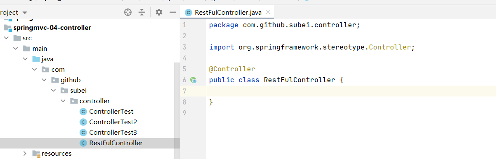

```java
package com.github.subei.controller;

import org.springframework.stereotype.Controller;

@Controller
public class RestFulController {
    
}
```

- 原来的方式！

```java
package com.github.subei.controller;

import org.springframework.stereotype.Controller;
import org.springframework.ui.Model;
import org.springframework.web.bind.annotation.RequestMapping;

@Controller
public class RestFulController {

    // 原来的：http://localhost:8080/springmvc_04/add?p1=1&p2=9

    // 映射访问路径
    @RequestMapping("/add")
    public String index( int p1, int p2, Model model){

        int result = p1+p2;
        // Spring MVC会自动实例化一个Model对象用于向视图中传值
        model.addAttribute("msg", "加法结果："+result);
        // 返回视图位置
        return "test";

    }
}
```

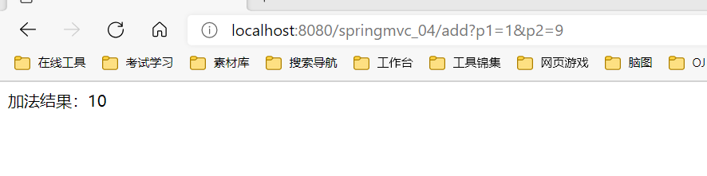


2. 在 Spring MVC 中可以使用  @PathVariable 注解，让方法参数的值对应绑定到一个 URI 模板变量上。 

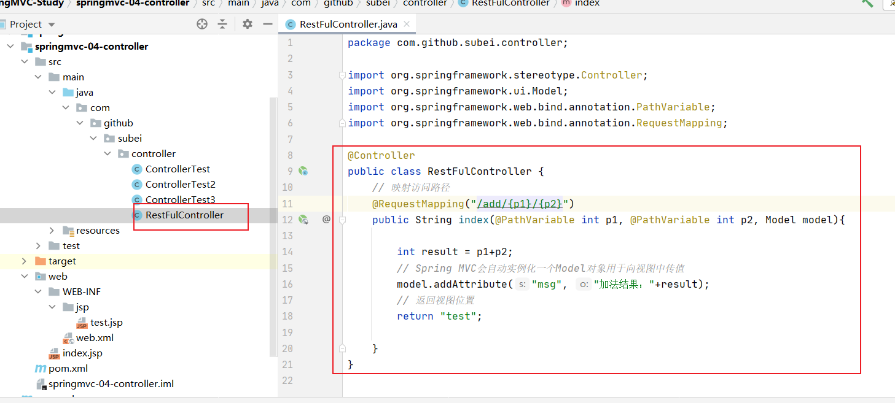

```java
package com.github.subei.controller;

import org.springframework.stereotype.Controller;
import org.springframework.ui.Model;
import org.springframework.web.bind.annotation.PathVariable;
import org.springframework.web.bind.annotation.RequestMapping;

@Controller
public class RestFulController {

    // 原来的：http://localhost:8080/springmvc_04/add?p1=1&p2=9
    // 现在的：http://localhost:8080/springmvc_04/add/45/66

    @RequestMapping("/add/{p1}/{p2}")
    public String index(@PathVariable int p1, @PathVariable int p2, Model model){

        int result = p1+p2;
        // Spring MVC会自动实例化一个Model对象用于向视图中传值
        model.addAttribute("msg", "加法结果："+result);
        // 返回视图位置
        return "test";
    }
}
```

3. 测试请求并查看。 

- http://localhost: 8080/springmvc_04/add/45/66

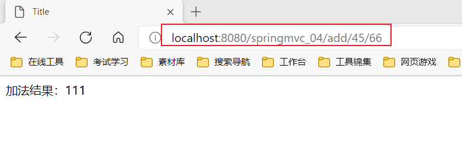

> 思考：使用路径变量的好处？

   - 使路径变得更加简洁；
   - 获得参数更加方便，框架会自动进行类型转换。
   - 通过路径变量的类型可以约束访问参数，如果类型不一样，则访问不到对应的请求方法，如这里访问是的路径是/add/9/k，则路径与方法不匹配，而不会是参数转换失败。

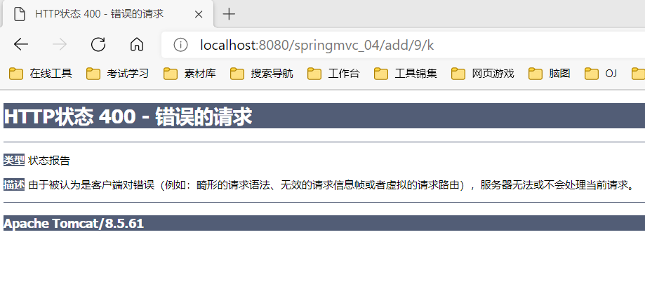

4. 修改下对应的参数类型，再次测试 

```java
package com.github.subei.controller;

import org.springframework.stereotype.Controller;
import org.springframework.ui.Model;
import org.springframework.web.bind.annotation.PathVariable;
import org.springframework.web.bind.annotation.RequestMapping;

@Controller
public class RestFulController {

    // 原来的：http://localhost:8080/springmvc_04/add?p1=1&p2=9
    // 现在的：http://localhost:8080/springmvc_04/add/45/66

    @RequestMapping("/add/{p1}/{p2}")
    public String index(@PathVariable int p1, @PathVariable String p2, Model model){

        String result = p1+p2;
        // Spring MVC会自动实例化一个Model对象用于向视图中传值
        model.addAttribute("msg", "字符结果："+result);
        // 返回视图位置
        return "test";

    }
}
```

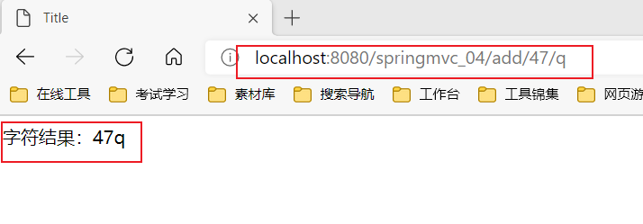

> **使用 method 属性指定请求类型**

- 用于约束请求的类型，可以收窄请求范围。指定请求谓词的类型如 GET, POST, HEAD, OPTIONS, PUT, PATCH, DELETE, TRACE 等。

> 案例测试：

- 增加一个方法

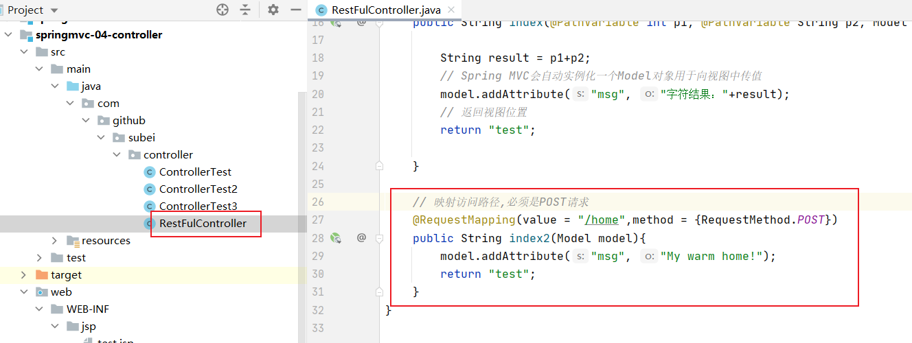

```java
    // 映射访问路径,必须是POST请求
    @RequestMapping(value = "/home",method = {RequestMethod.POST})
    public String index2(Model model){
        model.addAttribute("msg", "My warm home!");
        return "test";
    }
```

- 使用浏览器地址栏进行访问默认是 Get 请求，会报错 405： 

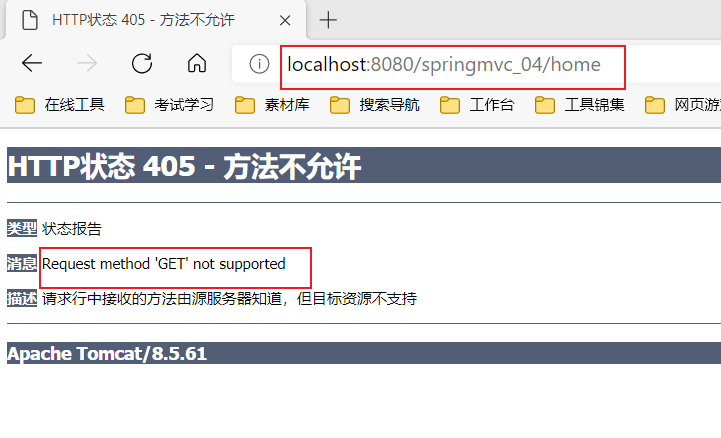

- 将 POST 修改为 GET 则正常了； 

```java
    // 映射访问路径,必须是GET请求
    @RequestMapping(value = "/home",method = {RequestMethod.GET})
    public String index2(Model model){
        model.addAttribute("msg", "My warm home!");
        return "test";
    }
```

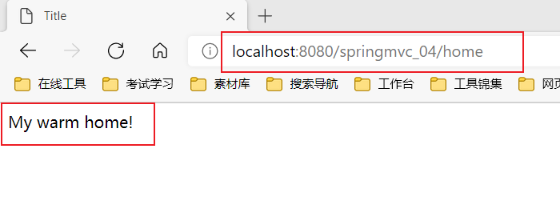

> Spring MVC 的 @RequestMapping 注解能够处理 HTTP 请求的方法, 比如 GET, PUT, POST, DELETE 以及 PATCH。

- **所有的地址栏请求默认都会是 HTTP GET 类型的。**
- 方法级别的注解变体有如下几个：组合注解

```java
@GetMapping
@PostMapping
@PutMapping
@DeleteMapping
@PatchMapping
```

> @GetMapping 是一个组合注解，平时使用的会比较多！它所扮演的是 @RequestMapping(method = RequestMethod.GET) 的一个快捷方式。

### 6.每个程序员都要知道的：小黄鸭调试法

> 转载自《程序员的那些事》

花了一下午（或一天）在试图解决某个 Bug，后来才知道解决方案很简单，当时就是没有想到。

有个同事正好路过，看到你愁眉苦脸的，问你“怎么了呀？”

“噢，是这样的。我遇到了一个问题，点击这个控件的时……” 当你正准备和同事详细解释的时候，突然灵光一现，你话都没说完，就中断了和同事的倾诉，继续干活了。

同事微微一笑，又走开了。他并没有怪你。

---

「程序员的那些事」主页君相信大家都有类似的经历。遇到 Bug/问题被卡住了，拉个人过来，和他 blablabla 讲了一通，很多时候中途你就找到了解决办法。

有时候，并不一定要和人倾诉，还可以像其他东西倾诉，强迫自己把遇到的问题，详细地解释出来（一定要说出来）。

其实呢。这种方法，有一个术语：**小黄鸭调试法**（Rubber Duck Debugging）。

> 维基百科有解释：小黄鸭调试法是软件工程中使用的调试代码方法之一。就是 **在程序的调试、纠错或测试过程中，耐心地向小黄鸭解释每一行程序的作用，以此来激发灵感**。

**名称由来**

此概念是参照于一个故事。故事中程序大师随身携带一只小黄鸭，在调试代码的时候会在桌上放上这只小黄鸭，然后详细地向鸭子解释每行代码。

  

## 5、数据处理及跳转

### 1.ModelAndView

- 设置 ModelAndView 对象 , 根据 view 的名称 , 和视图解析器跳到指定的页面；
- 页面 : {视图解析器前缀} + viewName +{视图解析器后缀}

```xml
<!-- 视图解析器 -->
<bean class="org.springframework.web.servlet.view.InternalResourceViewResolver"
     id="internalResourceViewResolver">
   <!-- 前缀 -->
   <property name="prefix" value="/WEB-INF/jsp/" />
   <!-- 后缀 -->
   <property name="suffix" value=".jsp" />
</bean>
```

- 对应的 controller 类 

```java
public class ControllerTest implements Controller {

   public ModelAndView handleRequest(HttpServletRequest httpServletRequest, HttpServletResponse httpServletResponse) throws Exception {
       // 返回一个模型视图对象
       ModelAndView mv = new ModelAndView();
       mv.addObject("msg","ControllerTest1");
       mv.setViewName("test");
       return mv;
  }
}
```

### 2.ServletAPI

> 通过设置 ServletAPI , 不需要视图解析器。

1. 通过 HttpServletResponse 进行输出；
2. 通过 HttpServletResponse 实现重定向；
3. 通过 HttpServletResponse 实现转发。

```java
package com.github.subei.controller;

import org.springframework.stereotype.Controller;
import org.springframework.web.bind.annotation.RequestMapping;

import javax.servlet.http.HttpServletRequest;
import javax.servlet.http.HttpServletResponse;
import javax.servlet.http.HttpSession;
import java.io.IOException;

@Controller
public class ModelTest1 {

    @RequestMapping("/m1/t1")
    public String test(HttpServletRequest request, HttpServletResponse response){
        HttpSession session = request.getSession();
        System.out.println(session.getId());
        return "test";
    }

    @RequestMapping("/m2/t1")
    public void test1(HttpServletRequest req, HttpServletResponse rsp) throws IOException {
        rsp.getWriter().println("Hello,Spring BY servlet API");
    }

    @RequestMapping("/m2/t2")
    public void test2(HttpServletRequest req, HttpServletResponse rsp) throws IOException {
        rsp.sendRedirect("/index.jsp");
    }

    @RequestMapping("/m2/t3")
    public void test3(HttpServletRequest req, HttpServletResponse rsp) throws Exception {
        // 转发
        req.setAttribute("msg","/result/t3");
        req.getRequestDispatcher("/WEB-INF/jsp/test.jsp").forward(req,rsp);
    }
}
```

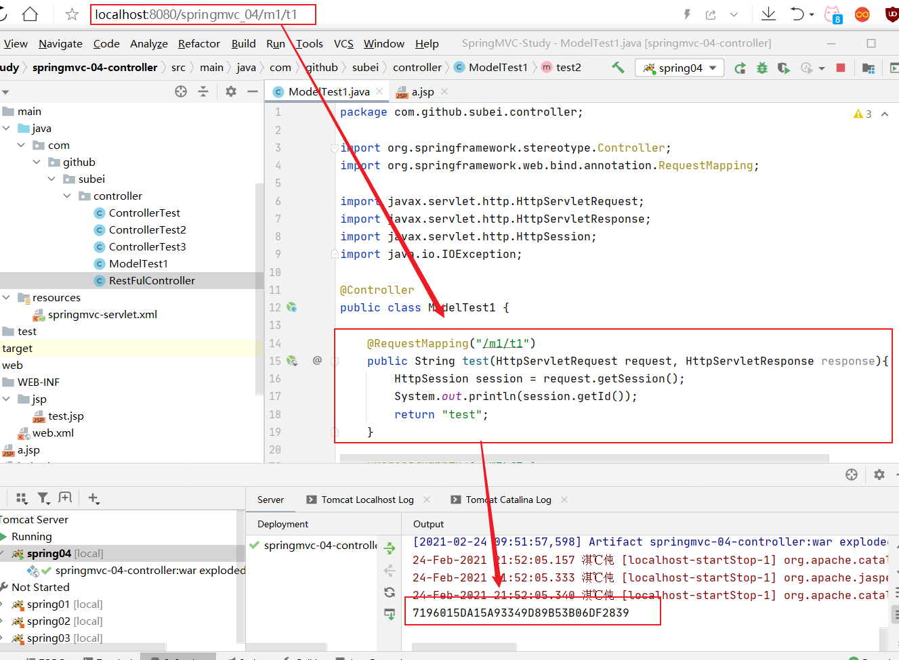

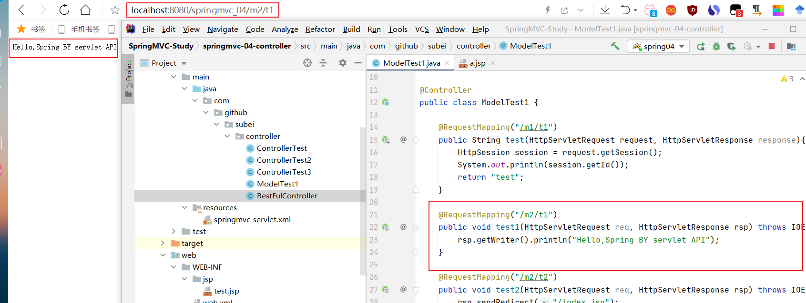

### 3.SpringMVC

> **通过 SpringMVC 来实现转发和重定向 - 无需视图解析器；**

- 测试前，需要将视图解析器注释掉。

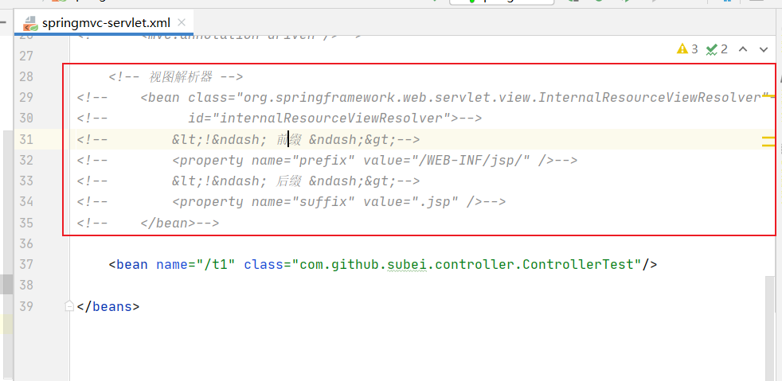

```java
package com.github.subei.controller;

import org.springframework.stereotype.Controller;
import org.springframework.ui.Model;
import org.springframework.web.bind.annotation.RequestMapping;

@Controller
public class ResultSpringMVC {
    @RequestMapping("/k1/t1")
    public String test(Model model){
        model.addAttribute("msg","ResultSpringMVC1");
        // 转发
        return "/WEB-INF/jsp/test.jsp";
    }

    @RequestMapping("/k1/t2")
    public String test2(Model model){
        // 转发2
        model.addAttribute("msg","ResultSpringMVC2");
        return "forward:/WEB-INF/jsp/test.jsp";
    }

    @RequestMapping("/k1/t3")
    public String test3(Model model){
        // 重定向
        model.addAttribute("msg","ResultSpringMVC3");
        return "redirect:/index.jsp";
    }
}
```

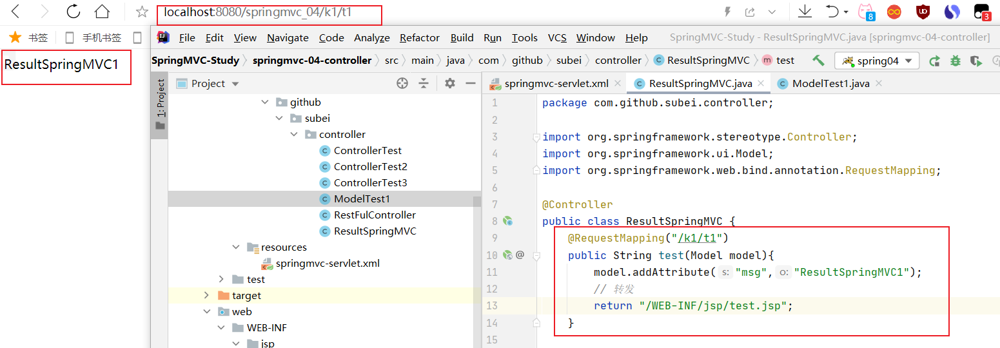

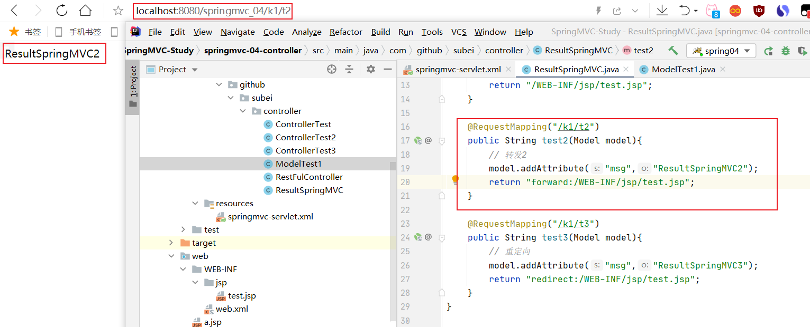

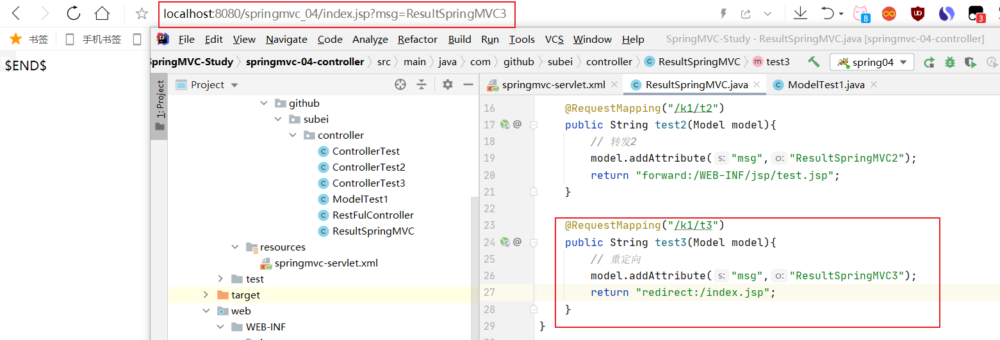

> **通过 SpringMVC 来实现转发和重定向 - 有视图解析器；**

- 重定向 , 不需要视图解析器 , 本质就是重新请求一个新地方嘛 , 所以注意路径问题。
- 可以重定向到另外一个请求实现。

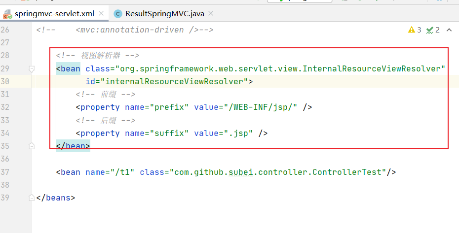

```java
package com.github.subei.controller;

import org.springframework.stereotype.Controller;
import org.springframework.ui.Model;
import org.springframework.web.bind.annotation.RequestMapping;

@Controller
public class ResultSpringMVC {

    @RequestMapping("/p1/t1")
    public String test4(Model model){
        // 转发
        model.addAttribute("msg","ResultSpringMVC4");
        return "test";
    }

    @RequestMapping("/p1/t2")
    public String test5(Model model){
        // 重定向
        model.addAttribute("msg","ResultSpringMVC5");
        return "redirect:/index.jsp";
        //return "redirect:hello.do"; //hello.do为另一个请求/
    }
}
```

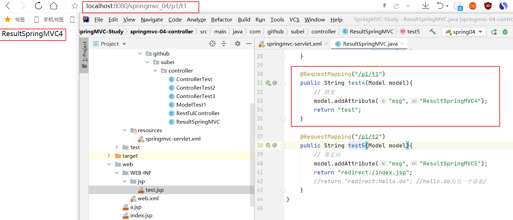

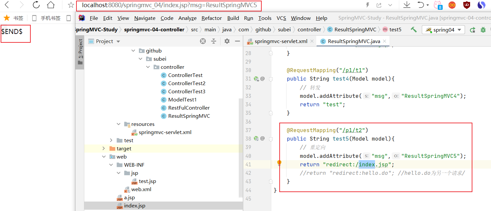

#### Spring-MVC 重定向 404 和数据丢失问题解决方案

> #### 1.转发正常，重定向 404，表示不公开的资源
>
> 图片缺失（外部笔记「阿浩的 java 笔记」未同步到本仓库）
>
> **原因**
>
> 重定向是对于客户端而言，而转发在服务器内部。重定向是想让客户端去访问指定的地址，而 WEB-INF 下的文件是受保护的，不可以被外部直接访问到，就会出现以上问题，报出 404 路径错误。
>
> **解决**
>
> 将要访问的文件放置到 WEB-INF 外即可
>
> #### 2.重定向数据无法携带
>
> controller 层
>
> ```java
> // 使用Model携带参数会发生数据丢失问题 使用session(会话级别)
> @RequestMapping("/redirect")
> public String model03(Model model) {
>     model.addAttribute("msg", "重定向跳转");
>     // 重定向
>     return "redirect:/index.jsp";
> }
> ```
>
> 跳转页面
>
> ```jsp
> <%@ page contentType="[[text]]/html;charset=UTF-8" language="java" %>
> <html>
> <head>
>     <title>首页</title>
> </head>
> <body>
> <h1>Spring-Controller的首页</h1>
> <hr>
> <h1>${msg}</h1>
> </body>
> </html>
> ```
>
> 图片缺失（外部笔记「阿浩的 java 笔记」未同步到本仓库）
>
> **将 controller 的代码修改如下，用 servlet 中 session 来携带数据**
>
> ```java
> // 使用Model携带参数会发生数据丢失问题 使用session(会话级别)
>     @RequestMapping("/redirect")
>     public String model03(HttpServletRequest request, HttpServletResponse response) {
>         HttpSession session = request.getSession();
>         session.setAttribute("msg", "重定向跳转");
>         // 重定向
>         return "redirect:/index.jsp";
>     }
> ```
>
> 再次运行，数据携带成功
>
> 图片缺失（外部笔记「阿浩的 java 笔记」未同步到本仓库）

### 4.处理提交数据

> **1、提交的域名称和处理方法的参数名一致**

- 提交数据 : http://localhost: 8080/springmvc_04/user/t1?name = subei
- 处理方法 :

```java
package com.github.subei.controller;

import org.springframework.stereotype.Controller;
import org.springframework.ui.Model;
import org.springframework.web.bind.annotation.GetMapping;
import org.springframework.web.bind.annotation.RequestMapping;

@Controller
@RequestMapping("user")
public class UserController {

    @GetMapping("/t1")
    public String test(String name, Model model){
        // 1.接收前端参数
        System.out.println("接收到前端的参数为:" + name);
        // 2.将返回的值传递给前端
        model.addAttribute("msg","name");
        // 3.跳转视图
        return "test";
    }
}
```

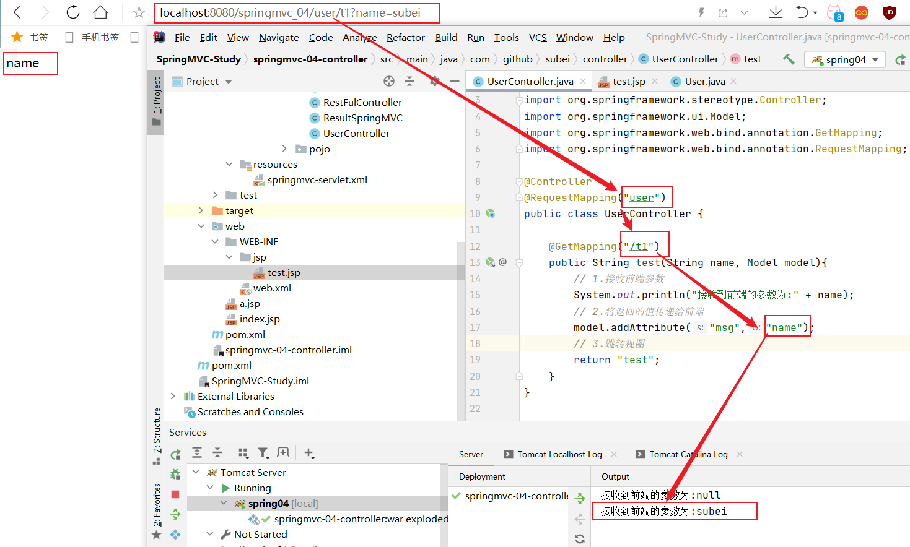

> **2、提交的域名称和处理方法的参数名不一致**

- 提交数据 : http://localhost: 8080/springmvc_04/user/t2?username = subei
- 处理方法 :

```java
package com.github.subei.controller;

import org.springframework.stereotype.Controller;
import org.springframework.ui.Model;
import org.springframework.web.bind.annotation.GetMapping;
import org.springframework.web.bind.annotation.RequestMapping;
import org.springframework.web.bind.annotation.RequestParam;

@Controller
@RequestMapping("user")
public class UserController {

    // @RequestParam("username") : username提交的域的名称 .
    @GetMapping("/t2")
    public String hello(@RequestParam("username") String name, Model model){
        // 1.接收前端参数
        System.out.println("接收到前端的参数为:" + name);
        // 2.将返回的值传递给前端
        model.addAttribute("msg","username");
        // 3.跳转视图
        return "test";
    }
}
```

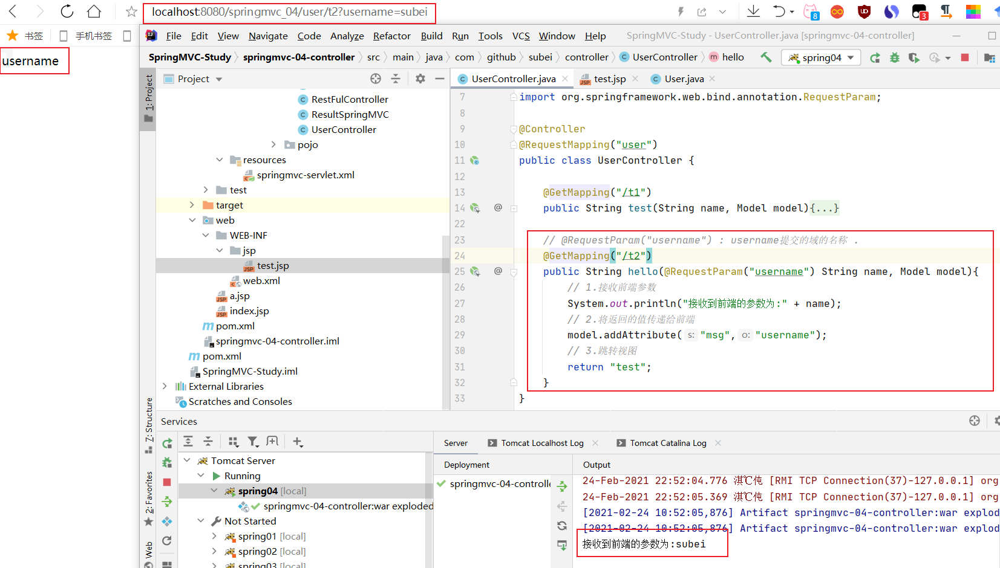

> **3、提交的是一个对象**

- 要求提交的表单域和对象的属性名一致  , 参数使用对象即可

1. 实体类

```java
package com.github.subei.pojo;

public class User {
    private int id;
    private String name;
    private int age;

    public int getId() {
        return id;
    }

    public void setId(int id) {
        this.id = id;
    }

    public String getName() {
        return name;
    }

    public void setName(String name) {
        this.name = name;
    }

    public int getAge() {
        return age;
    }

    public void setAge(int age) {
        this.age = age;
    }

    public User() {
    }

    public User(int id, String name, int age) {
        this.id = id;
        this.name = name;
        this.age = age;
    }

    @Override
    public String toString() {
        return "User{" +
                "id=" + id +
                ", name='" + name + '\'' +
                ", age=" + age +
                '}';
    }
}
```

2. 提交数据：http://localhost: 8080/springmvc_04/user/t3?name = subei&id = 4&age = 21

3. 处理方法 :

```java
package com.github.subei.controller;

import com.github.subei.pojo.User;
import org.springframework.stereotype.Controller;
import org.springframework.ui.Model;
import org.springframework.web.bind.annotation.GetMapping;
import org.springframework.web.bind.annotation.RequestMapping;
import org.springframework.web.bind.annotation.RequestParam;

@Controller
@RequestMapping("user")
public class UserController {

    @GetMapping("/t3")
    public String user(User user, Model model){
        // 1.接收前端参数
        System.out.println("接收到前端的参数为:" + user);
        // 2.将返回的值传递给前端
        model.addAttribute("msg","user");
        // 3.跳转视图
        return "test";
    }
}
```

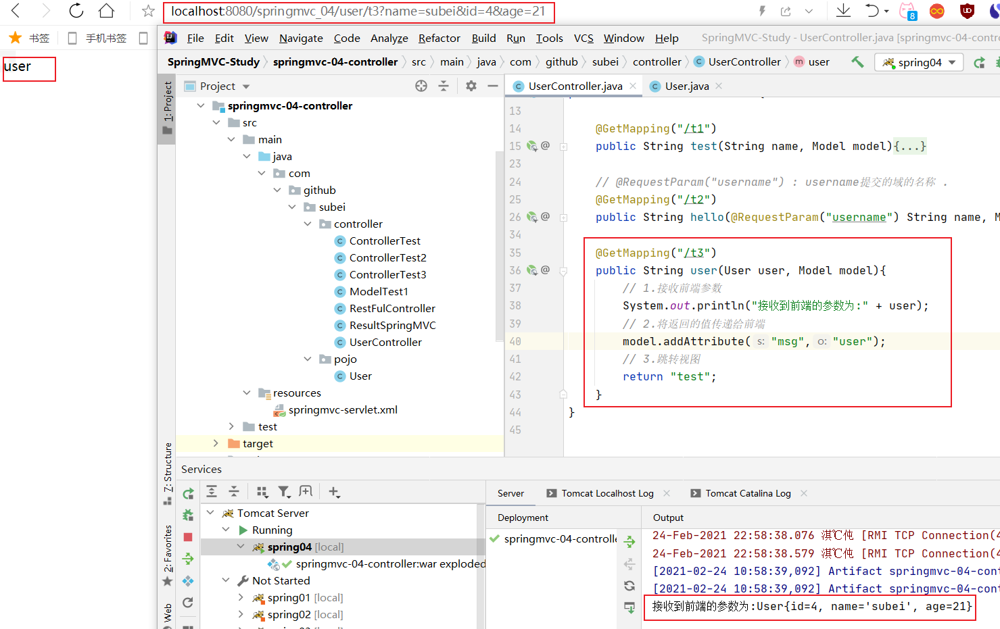

> 说明：如果使用对象的话，**前端传递的参数名和对象名必须一致**，否则就是 null。 

----

### 5.数据显示到前端

> **第一种 : 通过 ModelAndView**，最普遍的一种。

```java
public class ControllerTest implements Controller {
    public ModelAndView handleRequest(HttpServletRequest httpServletRequest, HttpServletResponse httpServletResponse) throws Exception {
        // 返回一个模型视图对象
        ModelAndView mv = new ModelAndView();
        mv.addObject("msg","ControllerTest");
        mv.setViewName("test");
        return mv;
    }
}
```

> **第二种 : 通过 Model**

```java
    @GetMapping("/t2")
    public String hello(@RequestParam("username") String name, Model model){
        // 封装要显示到视图中的数据
        // 相当于req.setAttribute("name",name);
        // 1.接收前端参数
        System.out.println("接收到前端的参数为:" + name);
        // 2.将返回的值传递给前端
        model.addAttribute("msg","username");
        // 3.跳转视图
        return "test";
    }
```

> **第三种 : 通过 ModelMap** 

```java
package com.github.subei.controller;

import com.github.subei.pojo.User;
import org.springframework.stereotype.Controller;
import org.springframework.ui.Model;
import org.springframework.ui.ModelMap;
import org.springframework.web.bind.annotation.GetMapping;
import org.springframework.web.bind.annotation.RequestMapping;
import org.springframework.web.bind.annotation.RequestParam;

@Controller
@RequestMapping("user")
public class UserController {

    @GetMapping("/t4")
    public String test2(@RequestParam("username") String name, ModelMap model){
        // 封装要显示到视图中的数据
        // 相当于req.setAttribute("name",name);
        // 1.接收前端参数
        System.out.println("接收到前端的参数为:" + name);
        // 2.将返回的值传递给前端
        model.addAttribute("msg","username2");
        // 3.跳转视图
        return "test";
    }
}

```

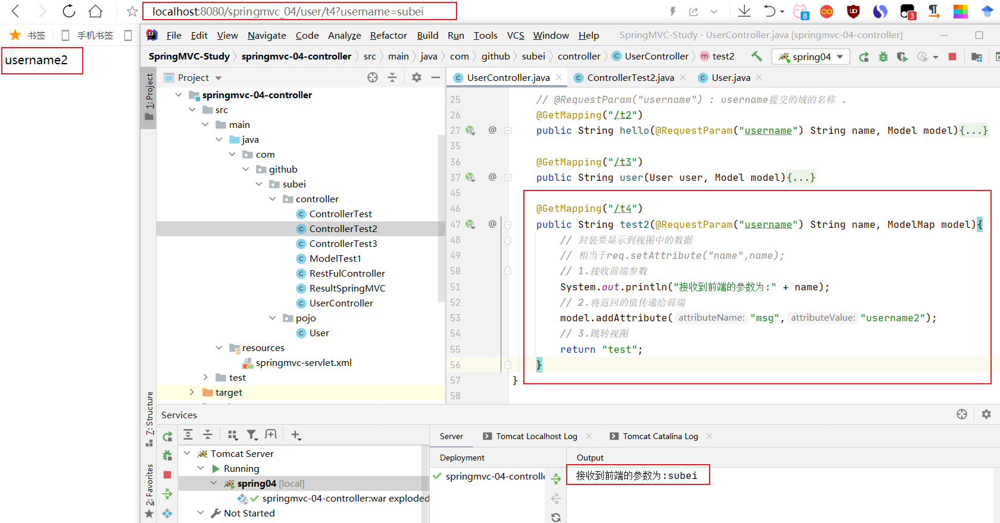

----

> 简单来说使用区别就是： 

- Model 只有寥寥几个方法只适合用于储存数据，简化了新手对于 Model 对象的操作和理解；
- ==ModelMap 继承了 LinkedMap==，除了实现了自身的一些方法，同样的继承 LinkedMap 的方法和特性；
- ModelAndView 可以在储存数据的同时，可以进行设置返回的逻辑视图，进行控制展示层的跳转。

> ==**请使用 80%的时间打好扎实的基础，剩下 18%的时间研究框架，2%的时间去学点英文，框架的官方文档永远是最好的教程。**==

### 6.乱码问题

> 案例

1. 在首页编写一个提交的表单。 

```jsp
<%@ page contentType="text/html;charset=UTF-8" language="java" %>
<html>
<head>
    <title>Title</title>
</head>
<body>
<form action="/springmvc_04/e/t1" method="post">
    <input type="text" name="name">
    <input type="submit">
</form>
</body>
</html>
```

2. 在后台编写对应的处理类。

```java
package com.github.subei.controller;

import org.springframework.stereotype.Controller;
import org.springframework.ui.Model;
import org.springframework.web.bind.annotation.PostMapping;

@Controller
public class EncodingController {
    @PostMapping("/e/t1")
    public String test(Model model, String name){
        // 获取表单提交的值
        model.addAttribute("msg",name);
        // 跳转到test页面显示输入的值
        return "test";
    }
}
```

3. 输入中文测试，发现乱码。

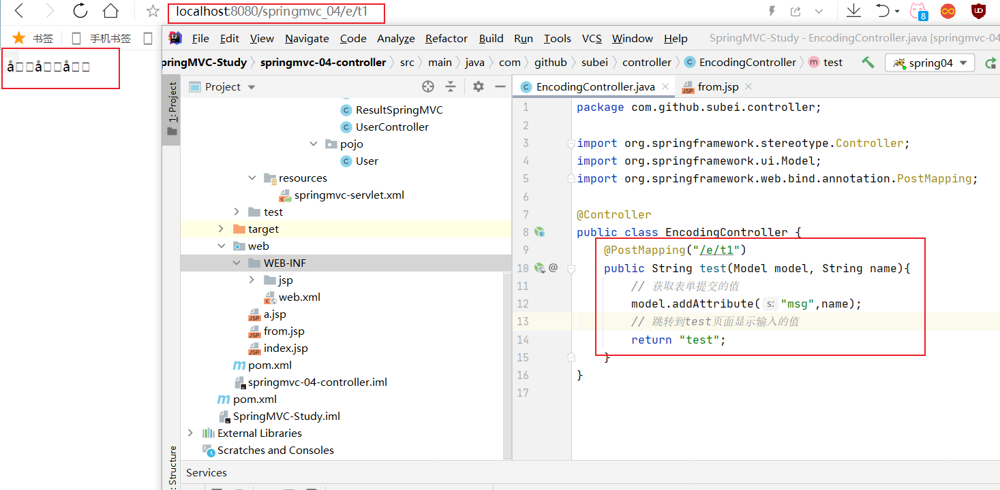

>以前乱码问题通过过滤器解决 , 而 SpringMVC 给我们提供了一个过滤器 , 可以在 web.xml 中配置。

- 修改 web.xml 文件，重启服务器！

```xml
    <filter>
        <filter-name>encoding</filter-name>
        <filter-class>org.springframework.web.filter.CharacterEncodingFilter</filter-class>
        <init-param>
            <param-name>encoding</param-name>
            <param-value>utf-8</param-value>
        </init-param>
    </filter>
    <filter-mapping>
        <filter-name>encoding</filter-name>
        <url-pattern>/*</url-pattern>
    </filter-mapping>
```

- 但是会发现：有些极端情况下，这个过滤器对 get 的支持不好。
- 处理方法 :

1. 修改 tomcat 配置文件，设置编码！ 

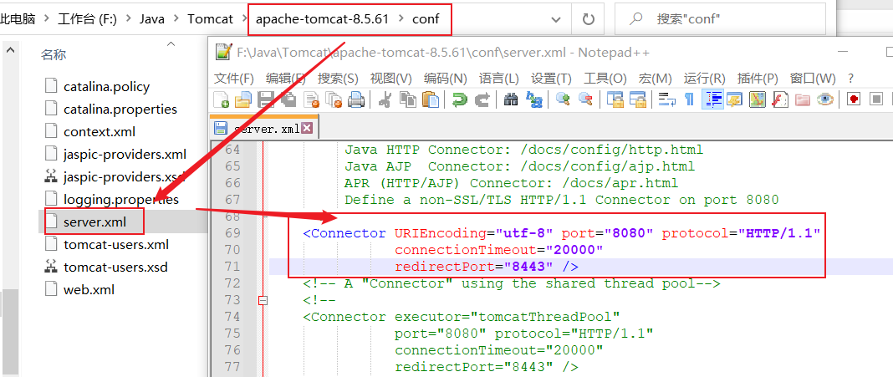

```xml
<Connector URIEncoding="utf-8" port="8080" protocol="HTTP/1.1"
          connectionTimeout="20000"
          redirectPort="8443" />
```

2. 自定义过滤器，修改 web.xml 文件

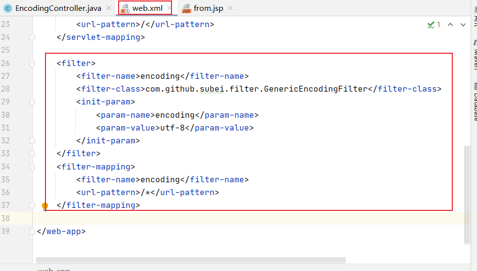

```java
package com.github.subei.filter;

import javax.servlet.*;
import javax.servlet.http.HttpServletRequest;
import javax.servlet.http.HttpServletRequestWrapper;
import javax.servlet.http.HttpServletResponse;
import java.io.IOException;
import java.io.UnsupportedEncodingException;
import java.util.Map;

/**
 * 解决get和post请求 全部乱码的过滤器
 */
public class GenericEncodingFilter implements Filter {
    
    public void destroy() {
    }
    
    public void doFilter(ServletRequest request, ServletResponse response, FilterChain chain) throws IOException, ServletException {
        // 处理response的字符编码
        HttpServletResponse myResponse=(HttpServletResponse) response;
        myResponse.setContentType("text/html;charset=UTF-8");

        // 转型为与协议相关对象
        HttpServletRequest httpServletRequest = (HttpServletRequest) request;
        // 对request包装增强
        HttpServletRequest myrequest = new MyRequest(httpServletRequest);
        chain.doFilter(myrequest, response);
    }

    public void init(FilterConfig filterConfig) throws ServletException {
    }

}

// 自定义request对象，HttpServletRequest的包装类
class MyRequest extends HttpServletRequestWrapper {

    private HttpServletRequest request;
    // 是否编码的标记
    private boolean hasEncode;
    // 定义一个可以传入HttpServletRequest对象的构造函数，以便对其进行装饰
    public MyRequest(HttpServletRequest request) {
        super(request);// super必须写
        this.request = request;
    }

    // 对需要增强方法 进行覆盖
    @Override
    public Map getParameterMap() {
        // 先获得请求方式
        String method = request.getMethod();
        if (method.equalsIgnoreCase("post")) {
            // post请求
            try {
                // 处理post乱码
                request.setCharacterEncoding("utf-8");
                return request.getParameterMap();
            } catch (UnsupportedEncodingException e) {
                e.printStackTrace();
            }
        } else if (method.equalsIgnoreCase("get")) {
            // get请求
            Map<String, String[]> parameterMap = request.getParameterMap();
            if (!hasEncode) { // 确保get手动编码逻辑只运行一次
                for (String parameterName : parameterMap.keySet()) {
                    String[] values = parameterMap.get(parameterName);
                    if (values != null) {
                        for (int i = 0; i < values.length; i++) {
                            try {
                                // 处理get乱码
                                values[i] = new String(values[i]
                                        .getBytes("ISO-8859-1"), "utf-8");
                            } catch (UnsupportedEncodingException e) {
                                e.printStackTrace();
                            }
                        }
                    }
                }
                hasEncode = true;
            }
            return parameterMap;
        }
        return super.getParameterMap();
    }

    // 取一个值
    @Override
    public String getParameter(String name) {
        Map<String, String[]> parameterMap = getParameterMap();
        String[] values = parameterMap.get(name);
        if (values == null) {
            return null;
        }
        return values[0]; // 取回参数的第一个值
    }

    // 取所有值
    @Override
    public String[] getParameterValues(String name) {
        Map<String, String[]> parameterMap = getParameterMap();
        String[] values = parameterMap.get(name);
        return values;
    }
}
```

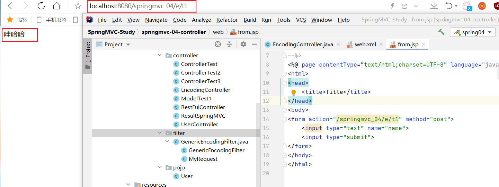

>- 一般情况下，SpringMVC 默认的乱码处理就已经能够很好的解决了
>- **然后在 web.xml 中配置这个过滤器即可！**
>- 乱码问题，需要平时多注意，在尽可能能设置编码的地方，都设置为统一编码 UTF-8！

## 6、Json 交互处理

### 1.Json 

> 什么是 JSON？

- JSON(JavaScript Object Notation, JS 对象标记) 是一种轻量级的数据交换格式，目前使用特别广泛。
- 采用完全独立于编程语言的 **文本格式** 来存储和表示数据。
- 简洁和清晰的层次结构使得 JSON 成为理想的数据交换语言。
- 易于人阅读和编写，同时也易于机器解析和生成，并有效地提升网络传输效率。

> 在 JavaScript 语言中，一切都是对象。因此，任何 JavaScript 支持的类型都可以通过 JSON 来表示，例如字符串、数字、对象、[[数组]]等。看看他的要求和语法格式：

- 对象表示为键值对，数据由逗号分隔
- 花括号保存对象
- 方括号保存数组

> **JSON 键值对** 是用来保存 JavaScript 对象的一种方式，和 JavaScript 对象的写法也大同小异，键/值对组合中的键名写在前面并用双引号 "" 包裹，使用冒号 : 分隔，然后紧接着值：

```js
{"name": "subei"}
{"age": "4"}
{"sex": "man"}
```

---

> JSON 和 JavaScript 对象的关系：

- JSON 是 JavaScript 对象的字符串表示法，它使用文本表示一个 JS 对象的信息，本质是一个字符串。 

```js
var obj = {a: 'Hello', b: 'World'}; // 这是一个对象，注意键名也是可以使用引号包裹的
var json = '{"a": "Hello", "b": "World"}'; // 这是一个 JSON 字符串，本质是一个字符串
```

>**JSON 和 JavaScript 对象互转**

- 要实现从 JSON 字符串转换为 JavaScript 对象，使用 JSON.parse() 方法：

```js
var obj = JSON.parse('{"a": "Hello", "b": "World"}');
// 结果是 {a: 'Hello', b: 'World'}
```

- 要实现从 JavaScript 对象转换为 JSON 字符串，使用 JSON.stringify() 方法： 

```js
var json = JSON.stringify({a: 'Hello', b: 'World'});
// 结果是 '{"a": "Hello", "b": "World"}'
```


----

### 2.JSON 案例

1. 新建一个 [[module]]，springmvc-05-[[json]] ， 添加 web 的支持

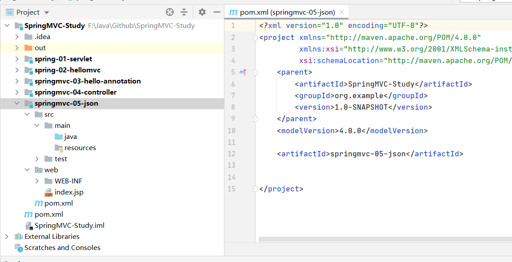

2. 在 web 目录下新建一个 jsontest.html ， 编写测试内容：

```html
<!DOCTYPE html>
<html lang="en">
<head>
    <meta charset="UTF-8">
    <title>JSON_苏北</title>
</head>
<body>

<script type="text/javascript">
    // 编写一个JavaScript对象
    var user = {
        name:"subei",
        age:4,
        sex:"man"
    }
    console.log(user);
</script>

</body>
</html>
```

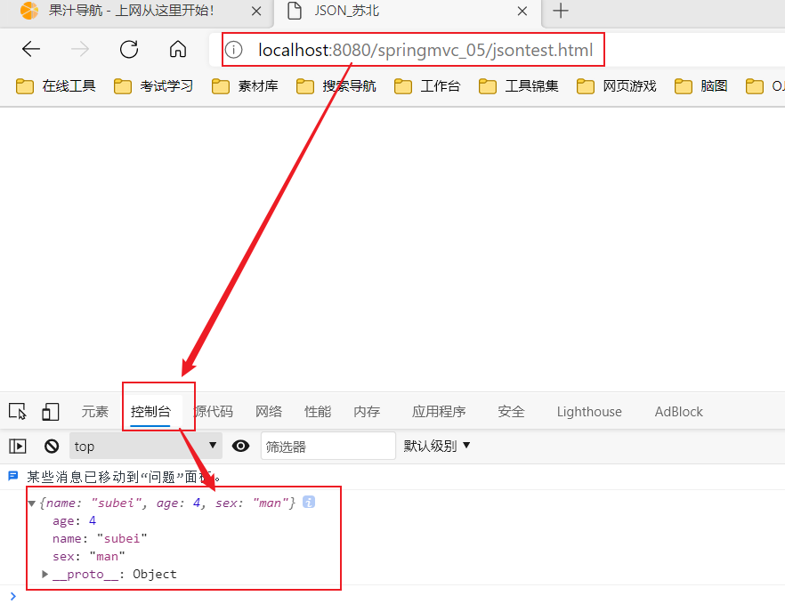

- 将 js 对象转换为 json 对象

```html
<!DOCTYPE html>
<html lang="en">
<head>
    <meta charset="UTF-8">
    <title>JSON_苏北</title>
</head>
<body>

<script type="text/javascript">
    // 编写一个JavaScript对象
    var user = {
        name:"subei",
        age:4,
        sex:"man"
    }
    // 将js对象转换为json对象
    var json = JSON.stringify(user);
    console.log(json);

    console.log(user);
</script>

</body>
</html>
```

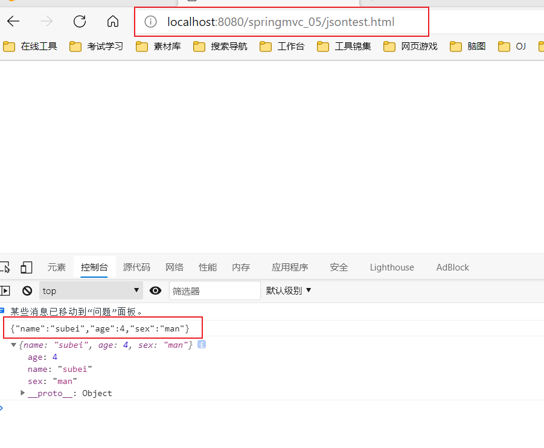

- 将 JSON 字符串转换为 JavaScript 对象

```html
<!DOCTYPE html>
<html lang="en">
<head>
    <meta charset="UTF-8">
    <title>JSON_苏北</title>
</head>
<body>

<script type="text/javascript">
    // 编写一个JavaScript对象
    var user = {
        name:"subei",
        age:4,
        sex:"man"
    }
    console.log(user);

    // 将js对象转换为json对象
    var json = JSON.stringify(user);
    console.log(json);

    console.log("------------------");

    // 将JSON字符串转换为JavaScript对象
    var obj = JSON.parse(json);
    console.log(obj);

</script>

</body>
</html>
```

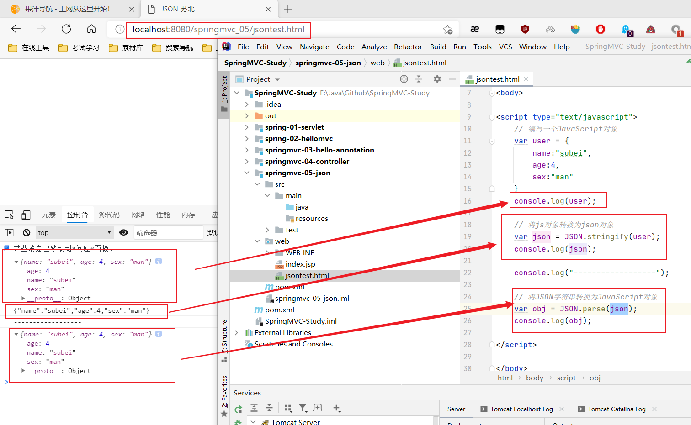

### 3.Jackson 使用
> Jackson 应该是一种使用比较好的 json 解析工具。 类似工具很多，如阿里巴巴的 fastjson 等 ，不做过多赘述！

#### 1.案例说明

1. 导入它的 jar 包到 pom.xml； 

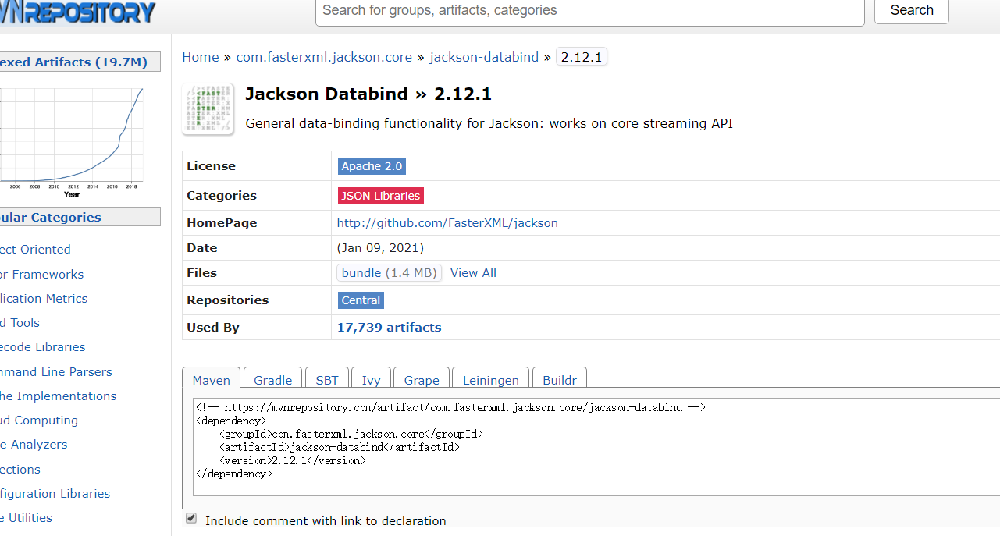

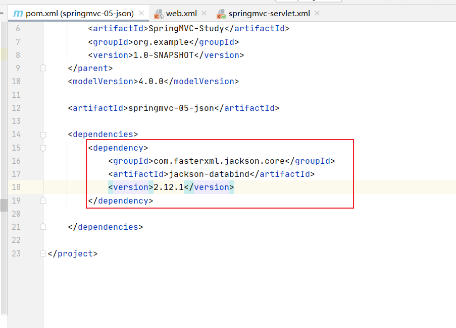

```xml
    <dependencies>
        <dependency>
            <groupId>com.fasterxml.jackson.core</groupId>
            <artifactId>jackson-databind</artifactId>
            <version>2.12.1</version>
        </dependency>
    </dependencies>
```

2. 配置 SpringMVC 需要的配置：web.xml

```xml
<?xml version="1.0" encoding="UTF-8"?>
<web-app xmlns="http://xmlns.jcp.org/xml/ns/javaee"
         xmlns:xsi="http://www.w3.org/2001/XMLSchema-instance"
         xsi:schemaLocation="http://xmlns.jcp.org/xml/ns/javaee http://xmlns.jcp.org/xml/ns/javaee/web-app_4_0.xsd"
         version="4.0">

    <!--1.注册servlet-->
    <servlet>
        <servlet-name>SpringMVC</servlet-name>
        <servlet-class>org.springframework.web.servlet.DispatcherServlet</servlet-class>
        <!--通过初始化参数指定SpringMVC配置文件的位置，进行关联-->
        <init-param>
            <param-name>contextConfigLocation</param-name>
            <param-value>classpath:springmvc-servlet.xml</param-value>
        </init-param>
        <!-- 启动顺序，数字越小，启动越早 -->
        <load-on-startup>1</load-on-startup>
    </servlet>

    <!--所有请求都会被springmvc拦截 -->
    <servlet-mapping>
        <servlet-name>SpringMVC</servlet-name>
        <url-pattern>/</url-pattern>
    </servlet-mapping>

    <filter>
        <filter-name>encoding</filter-name>
        <filter-class>org.springframework.web.filter.CharacterEncodingFilter</filter-class>
        <init-param>
            <param-name>encoding</param-name>
            <param-value>utf-8</param-value>
        </init-param>
    </filter>
    <filter-mapping>
        <filter-name>encoding</filter-name>
        <url-pattern>/</url-pattern>
    </filter-mapping>

</web-app>
```

3. 创建相关 Java 包，和 springmvc-servlet.xml 文件。

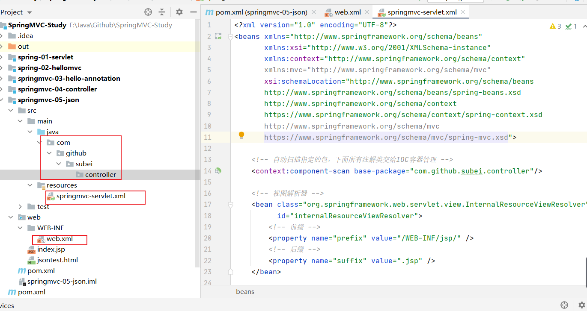

```xml
<?xml version="1.0" encoding="UTF-8"?>
<beans xmlns="http://www.springframework.org/schema/beans"
       xmlns:xsi="http://www.w3.org/2001/XMLSchema-instance"
       xmlns:context="http://www.springframework.org/schema/context"
       xmlns:mvc="http://www.springframework.org/schema/mvc"
       xsi:schemaLocation="http://www.springframework.org/schema/beans
       http://www.springframework.org/schema/beans/spring-beans.xsd
       http://www.springframework.org/schema/context
       https://www.springframework.org/schema/context/spring-context.xsd
       http://www.springframework.org/schema/mvc
       https://www.springframework.org/schema/mvc/spring-mvc.xsd">

    <!-- 自动扫描指定的包，下面所有注解类交给IOC容器管理 -->
    <context:component-scan base-package="com.github.subei.controller"/>

    <!-- 视图解析器 -->
    <bean class="org.springframework.web.servlet.view.InternalResourceViewResolver"
          id="internalResourceViewResolver">
        <!-- 前缀 -->
        <property name="prefix" value="/WEB-INF/jsp/" />
        <!-- 后缀 -->
        <property name="suffix" value=".jsp" />
    </bean>

</beans>
```

4. 编写一个 User 的实体类，然后去编写的测试 Controller；

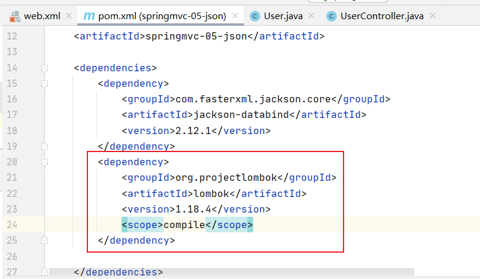

```java
package com.github.subei.pojo;

import lombok.AllArgsConstructor;
import lombok.Data;
import lombok.NoArgsConstructor;

@Data
@AllArgsConstructor
@NoArgsConstructor
public class User {
    private String name;
    private int age;
    private String sex;

}
```

5. 编写一个 Controller； 

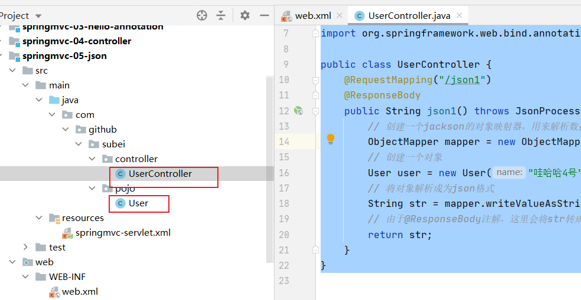

```java
package com.github.subei.controller;

import com.fasterxml.jackson.core.JsonProcessingException;
import com.fasterxml.jackson.databind.ObjectMapper;
import com.github.subei.pojo.User;
import org.springframework.stereotype.Controller;
import org.springframework.web.bind.annotation.RequestMapping;
import org.springframework.web.bind.annotation.ResponseBody;

@Controller
public class UserController {
    @RequestMapping("/j1")
    @ResponseBody
    public String json1() throws JsonProcessingException {
        // 创建一个jackson的对象映射器，用来解析数据
        ObjectMapper mapper = new ObjectMapper();
        // 创建一个对象
        User user = new User("哇哈哈4号", 22, "man");
        // 将对象解析成为json格式
        String str = mapper.writeValueAsString(user);
        // 由于@ResponseBody注解，这里会将str转成json格式返回；十分方便
        return str;
    }
}
```

6. 配置 Tomcat ， 启动测试：http://localhost: 8080/springmvc_05/j1

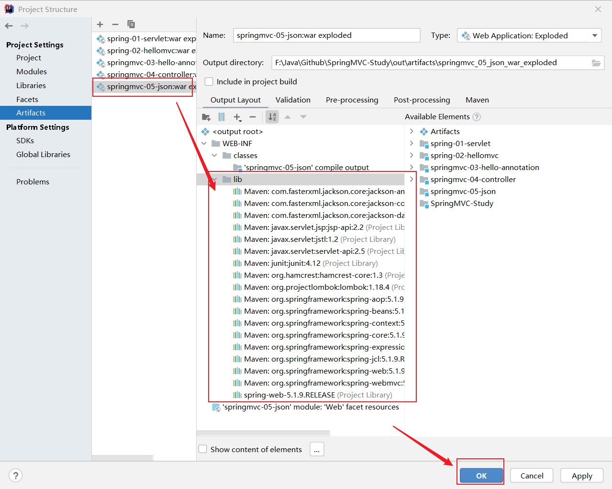

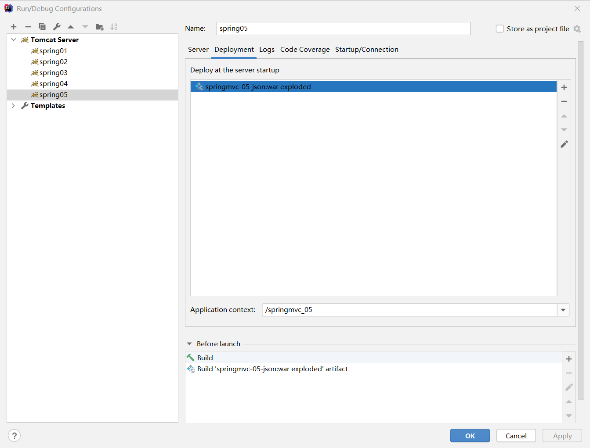

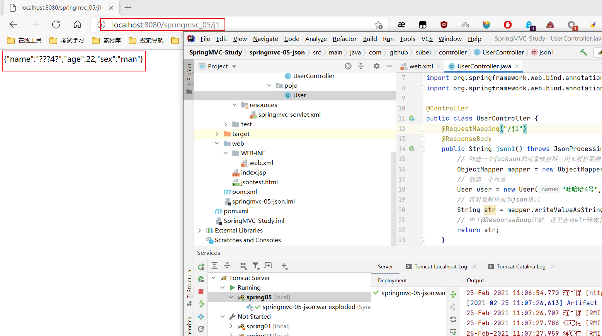

7. 发现出现了乱码问题，需要设置一下它的编码格式为 utf-8，以及它返回的类型； 

> 通过@RequestMaping 的 produces 属性来实现，修改下代码 

```java
    // produces:指定响应体返回类型和编码
    @RequestMapping(value = "/j1",produces = "application/json;charset=utf-8")
```

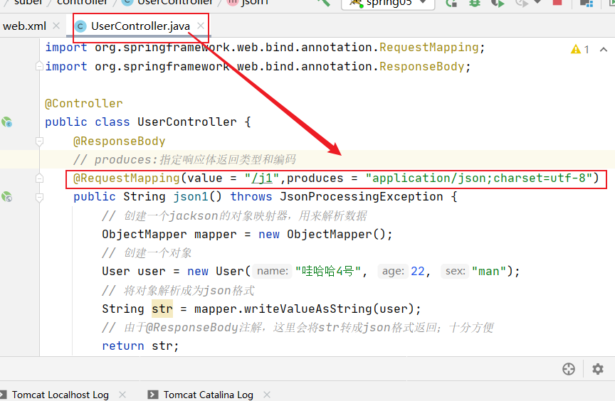

8. 再次测试，乱码问题解决！ 

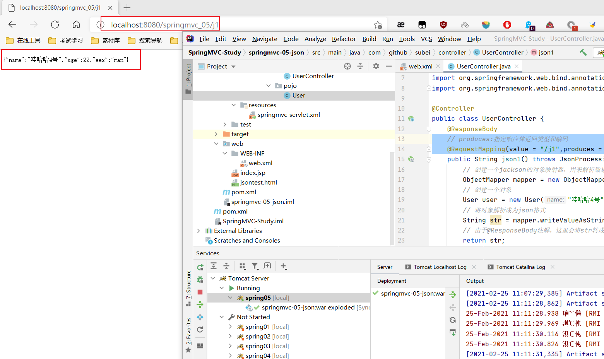

> ==注意：使用 json 记得处理乱码问题==。

----

#### 2.代码优化

1. **乱码统一解决**

- 上一种方法比较麻烦，如果项目中有许多请求则每一个都要添加，可以通过 Spring 配置统一指定，这样就不用每次都去处理了！
- 我们可以在 springmvc 的配置文件上添加一段消息 StringHttpMessageConverter 转换配置！

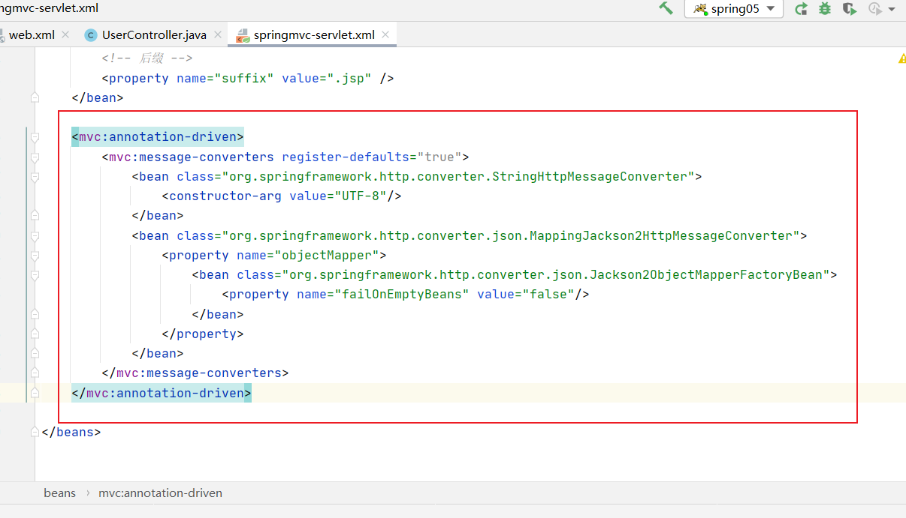

```xml
    <!-- JSON乱码问题 -->
    <mvc:annotation-driven>
        <mvc:message-converters register-defaults="true">
            <bean class="org.springframework.http.converter.StringHttpMessageConverter">
                <constructor-arg value="UTF-8"/>
            </bean>
            <bean class="org.springframework.http.converter.json.MappingJackson2HttpMessageConverter">
                <property name="objectMapper">
                    <bean class="org.springframework.http.converter.json.Jackson2ObjectMapperFactoryBean">
                        <property name="failOnEmptyBeans" value="false"/>
                    </bean>
                </property>
            </bean>
        </mvc:message-converters>
    </mvc:annotation-driven>
```

2. **返回 json 字符串统一解决**

- 在类上直接使用 **@RestController** ，这样子，里面所有的方法都只会返回 json 字符串了，不用再每一个都添加@ResponseBody ！我们在前后端分离开发中，一般都使用 @RestController ，十分便捷！

```java
package com.github.subei.controller;

import com.fasterxml.jackson.core.JsonProcessingException;
import com.fasterxml.jackson.databind.ObjectMapper;
import com.github.subei.pojo.User;
import org.springframework.stereotype.Controller;
import org.springframework.web.bind.annotation.RequestMapping;
import org.springframework.web.bind.annotation.ResponseBody;
import org.springframework.web.bind.annotation.RestController;

@Controller
@RestController
public class UserController {
    @ResponseBody
    // produces:指定响应体返回类型和编码
    @RequestMapping(value = "/j1")
    public String json1() throws JsonProcessingException {
        // 创建一个jackson的对象映射器，用来解析数据
        ObjectMapper mapper = new ObjectMapper();
        // 创建一个对象
        User user = new User("哇哈哈4号", 22, "man");
        // 将对象解析成为json格式
        String str = mapper.writeValueAsString(user);
        // 由于@ResponseBody注解，这里会将str转成json格式返回；十分方便
        return str;
    }
}
```

- 启动 tomcat 测试 

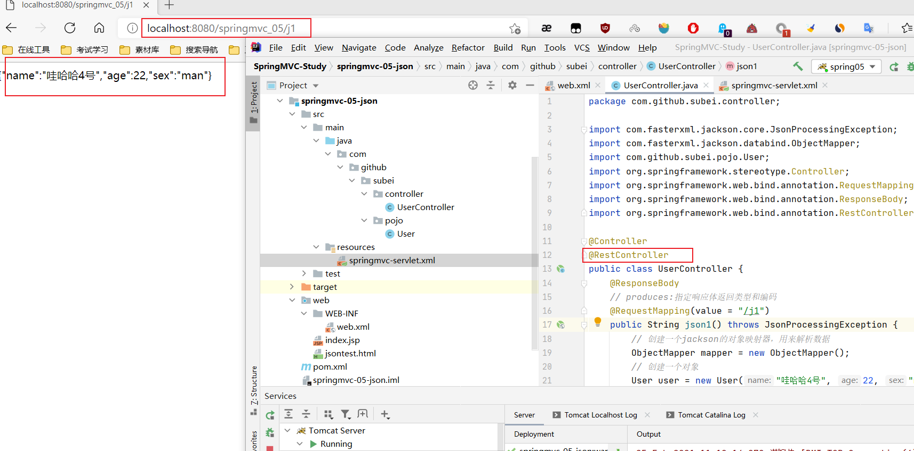

-----

#### 3.测试集合输出 

1. 增加一个新的方法

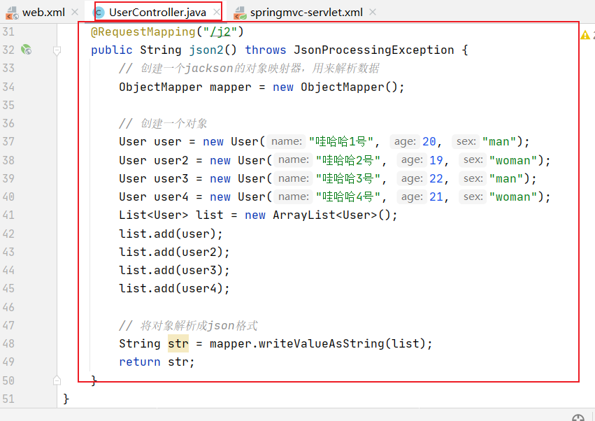

```java
    @RequestMapping("/j2")
    public String json2() throws JsonProcessingException {
        // 创建一个jackson的对象映射器，用来解析数据
        ObjectMapper mapper = new ObjectMapper();
        
        // 创建一个对象
        User user = new User("哇哈哈1号", 20, "man");
        User user2 = new User("哇哈哈2号", 19, "woman");
        User user3 = new User("哇哈哈3号", 22, "man");
        User user4 = new User("哇哈哈4号", 21, "woman");
        List<User> list = new ArrayList<User>();
        list.add(user);
        list.add(user2);
        list.add(user3);
        list.add(user4);

        // 将对象解析成json格式
        String str = mapper.writeValueAsString(list);
        return str;
    }
```

- 代码测试！

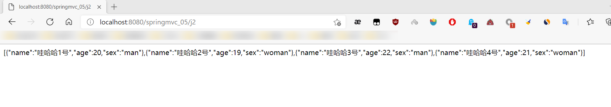

----

#### 4.输出时间对象

- 增加一个新的方法 

```java
    @RequestMapping("/j3")
    public String json3() throws JsonProcessingException {

        ObjectMapper mapper = new ObjectMapper();

        // 创建时间一个对象，java.util.Date
        Date date = new Date();
        // 将对象解析成json格式
        String str = mapper.writeValueAsString(date);
        return str;
    }
```

- 代码测试！

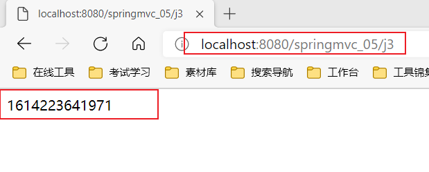

- 默认日期格式会变成一个数字，是 1970 年 1 月 1 日到当前日期的毫秒数！
- Jackson 默认是会把时间转成 timestamps 形式。

> **解决方案：取消 timestamps 形式 ， 自定义时间格式**。

- 在 UserController.java 中添加如下代码：

```java
    @RequestMapping("/j4")
    public String json4() throws JsonProcessingException {

        ObjectMapper mapper = new ObjectMapper();

        // 不使用时间戳的方式
        mapper.configure(SerializationFeature.WRITE_DATES_AS_TIMESTAMPS, false);
        // 自定义日期格式对象
        SimpleDateFormat sdf = new SimpleDateFormat("yyyy-MM-dd HH:mm:ss");
        // 设置指定日期格式
        mapper.setDateFormat(sdf);

        Date date = new Date();
        String str = mapper.writeValueAsString(date);
        return str;
    }
```

- 代码测试！

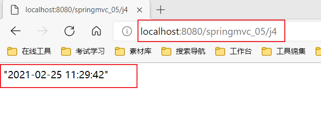

---

#### 5.抽取上述方法为工具类 

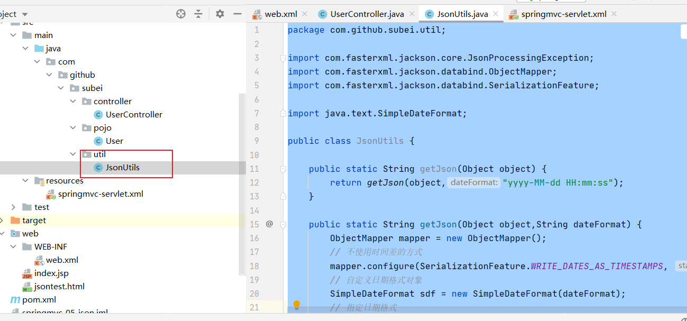

```java
package com.github.subei.util;

import com.fasterxml.jackson.core.JsonProcessingException;
import com.fasterxml.jackson.databind.ObjectMapper;
import com.fasterxml.jackson.databind.SerializationFeature;

import java.text.SimpleDateFormat;

public class JsonUtils {

    public static String getJson(Object object) {
        return getJson(object,"yyyy-MM-dd HH:mm:ss");
    }

    public static String getJson(Object object,String dateFormat) {
        ObjectMapper mapper = new ObjectMapper();
        // 不使用时间差的方式
        mapper.configure(SerializationFeature.WRITE_DATES_AS_TIMESTAMPS, false);
        // 自定义日期格式对象
        SimpleDateFormat sdf = new SimpleDateFormat(dateFormat);
        // 指定日期格式
        mapper.setDateFormat(sdf);
        try {
            return mapper.writeValueAsString(object);
        } catch (JsonProcessingException e) {
            e.printStackTrace();
        }
        return null;
    }
}
```

- 在 Java 中调用工具类。

```java
    @RequestMapping("/j5")
    public String json5() throws JsonProcessingException {
        Date date = new Date();
        String json = JsonUtils.getJson(date);
        return json;
    }
```

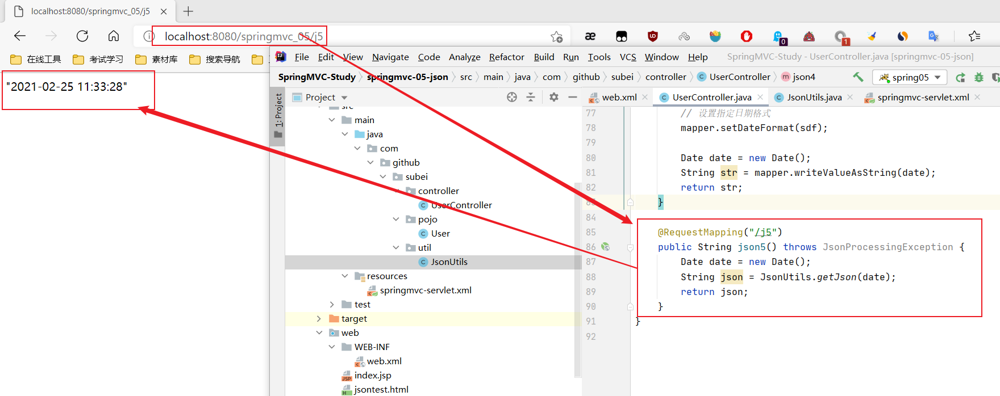

### 4.FastJson

> [fastjson.jar](https://mvnrepository.com/artifact/com.alibaba/fastjson) 是阿里开发的一款专门用于 Java 开发的包，可以方便的实现 json 对象与 JavaBean 对象的转换，实现 JavaBean 对象与 json 字符串的转换，实现 json 对象与 json 字符串的转换。实现 json 的转换方法很多，最后的实现结果都是一样的。 

- fastjson 的 pom 依赖！ 

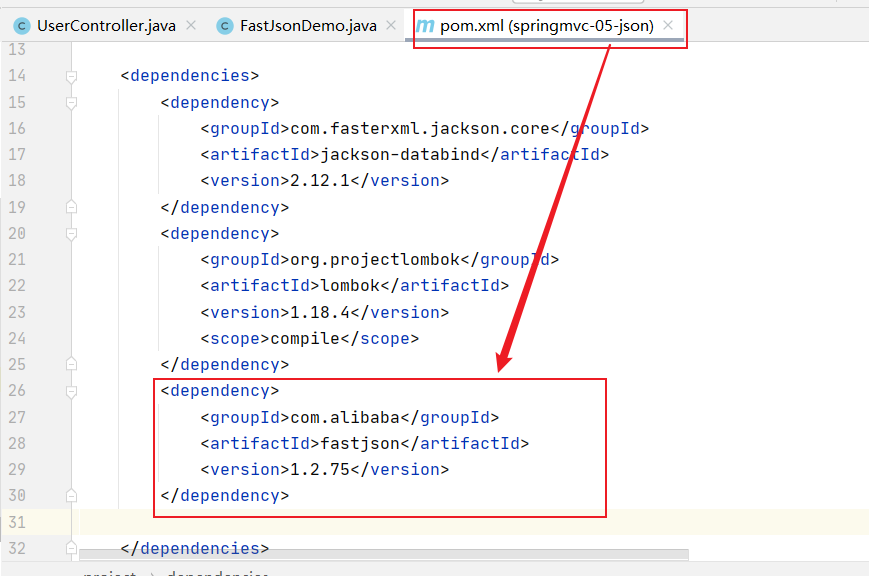

```xml
<!-- https://mvnrepository.com/artifact/com.alibaba/fastjson -->
<dependency>
    <groupId>com.alibaba</groupId>
    <artifactId>fastjson</artifactId>
    <version>1.2.75</version>
</dependency>
```

> fastjson 三个主要的类：

**JSONObject  代表 json 对象** 

- JSONObject 实现了 Map 接口, 猜想 JSONObject 底层操作是由 Map 实现的。
- JSONObject 对应 json 对象，通过各种形式的 get()方法可以获取 json 对象中的数据，也可利用诸如 size()，isEmpty()等方法获取 "键：值" 对的个数和判断是否为空。其本质是通过实现 Map 接口并调用接口中的方法完成的。

**JSONArray  代表 json 对象数组**

- 内部是有 List 接口中的方法来完成操作的。

**JSON 代表 JSONObject 和 JSONArray 的转化**

- JSON 类源码分析与使用
- 仔细观察这些方法，主要是实现 json 对象，json 对象数组，javabean 对象，json 字符串之间的相互转化。

----

> 代码测试，**新建一个 FastJsonDemo 类**。

```java
package com.github.subei.controller;

import com.alibaba.fastjson.JSON;
import com.alibaba.fastjson.JSONObject;
import com.github.subei.pojo.User;

import java.util.ArrayList;
import java.util.List;

public class FastJsonDemo {
    public static void main(String[] args) {
        // 创建一个对象
        User user = new User("哇哈哈1号", 20, "man");
        User user2 = new User("哇哈哈2号", 19, "woman");
        User user3 = new User("哇哈哈3号", 22, "man");
        User user4 = new User("哇哈哈4号", 21, "woman");
        List<User> list = new ArrayList<User>();
        list.add(user);
        list.add(user2);
        list.add(user3);
        list.add(user4);

        System.out.println("*******Java对象 转 JSON字符串*******");
        String str1 = JSON.toJSONString(list);
        System.out.println("JSON.toJSONString(list)==>"+str1);
        String str2 = JSON.toJSONString(user);
        System.out.println("JSON.toJSONString(user1)==>"+str2);

        System.out.println("\n****** JSON字符串 转 Java对象*******");
        User jp_user1=JSON.parseObject(str2,User.class);
        System.out.println("JSON.parseObject(str2,User.class)==>"+jp_user1);

        System.out.println("\n****** Java对象 转 JSON对象 ******");
        JSONObject jsonObject1 = (JSONObject) JSON.toJSON(user2);
        System.out.println("(JSONObject) JSON.toJSON(user2)==>"+jsonObject1.getString("name"));

        System.out.println("\n****** JSON对象 转 Java对象 ******");
        User to_java_user = JSON.toJavaObject(jsonObject1, User.class);
        System.out.println("JSON.toJavaObject(jsonObject1, User.class)==>"+to_java_user);
    }
}
```

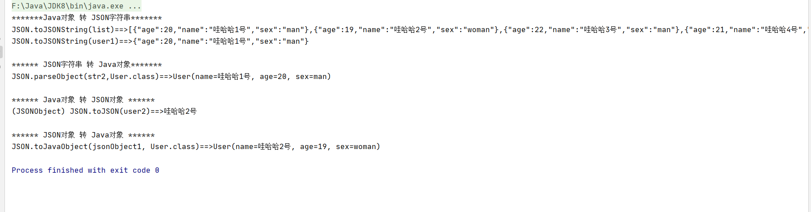

> 这种工具类，只需要掌握使用就好了，在使用的时候在根据具体的业务去找对应的实现。 

## 7、整合 SSM 框架

> 环境要求：

- IDEA 2020.2
- MySQL 5.7.19
- Tomcat 8.5
- Maven 3.6

> 技术要求：

- 需要熟练掌握 MySQL 数据库，Spring，JavaWeb 及 MyBatis 知识，简单的前端知识；

> 数据库环境：

  创建一个存放书籍数据的数据库表：

```mysql
CREATE DATABASE `ssmbuild`;
USE `ssmbuild`;
DROP TABLE
IF
	EXISTS `books`;
CREATE TABLE `books` (
	`bookID` INT ( 10 ) NOT NULL AUTO_INCREMENT COMMENT '书id',
	`bookName` VARCHAR ( 100 ) NOT NULL COMMENT '书名',
	`bookCounts` INT ( 11 ) NOT NULL COMMENT '数量',
	`detail` VARCHAR ( 200 ) NOT NULL COMMENT '描述',
	KEY `bookID` ( `bookID` ) 
) ENGINE = INNODB DEFAULT CHARSET = utf8;

INSERT INTO `books` ( `bookID`, `bookName`, `bookCounts`, `detail` )
VALUES
	( 1, 'Java', 1, '从入门到放弃' ),
	( 2, 'MySQL', 10, '从删库到跑路' ),
	( 3, 'Linux', 5, '从进门到进牢' );
```

### 1.基本环境搭建

1. 新建一 Maven 项目！ssmbuild ， 添加 web 的支持

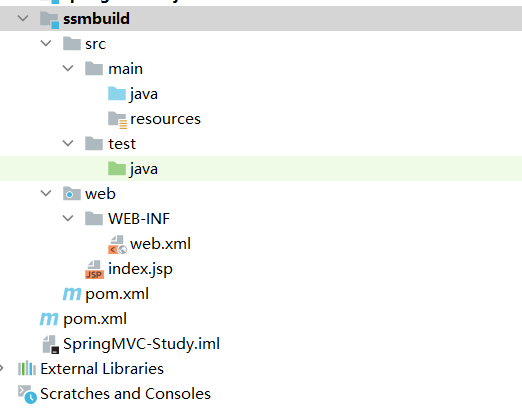

2. 导入相关的 pom 依赖！

```xml
<dependencies>
   <!--Junit-->
   <dependency>
       <groupId>junit</groupId>
       <artifactId>junit</artifactId>
       <version>4.12</version>
   </dependency>
   <!--数据库驱动-->
   <dependency>
       <groupId>mysql</groupId>
       <artifactId>mysql-connector-java</artifactId>
       <version>5.1.47</version>
   </dependency>
   <!-- 数据库连接池 -->
   <dependency>
       <groupId>com.mchange</groupId>
       <artifactId>c3p0</artifactId>
       <version>0.9.5.2</version>
   </dependency>

   <!--Servlet - JSP -->
   <dependency>
       <groupId>javax.servlet</groupId>
       <artifactId>servlet-api</artifactId>
       <version>2.5</version>
   </dependency>
   <dependency>
       <groupId>javax.servlet.jsp</groupId>
       <artifactId>jsp-api</artifactId>
       <version>2.2</version>
   </dependency>
   <dependency>
       <groupId>javax.servlet</groupId>
       <artifactId>jstl</artifactId>
       <version>1.2</version>
   </dependency>

   <!--Mybatis-->
   <dependency>
       <groupId>org.mybatis</groupId>
       <artifactId>mybatis</artifactId>
       <version>3.5.2</version>
   </dependency>
   <dependency>
       <groupId>org.mybatis</groupId>
       <artifactId>mybatis-spring</artifactId>
       <version>2.0.2</version>
   </dependency>

   <!--Spring-->
   <dependency>
       <groupId>org.springframework</groupId>
       <artifactId>spring-webmvc</artifactId>
       <version>5.1.9.RELEASE</version>
   </dependency>
   <dependency>
       <groupId>org.springframework</groupId>
       <artifactId>spring-jdbc</artifactId>
       <version>5.1.9.RELEASE</version>
   </dependency>
</dependencies>
```

3. Maven 资源过滤设置

 ```xml
<build>
   <resources>
       <resource>
           <directory>src/main/java</directory>
           <includes>
               <include>**/*.properties</include>
               <include>**/*.xml</include>
           </includes>
           <filtering>false</filtering>
       </resource>
       <resource>
           <directory>src/main/resources</directory>
           <includes>
               <include>**/*.properties</include>
               <include>**/*.xml</include>
           </includes>
           <filtering>false</filtering>
       </resource>
   </resources>
</build>
 ```

4. 建立基本结构和配置框架！

- com.github.subei.pojo
- com.github.subei.dao
- com.github.subei.service
- com.github.subei.controller
- mybatis-config.xml

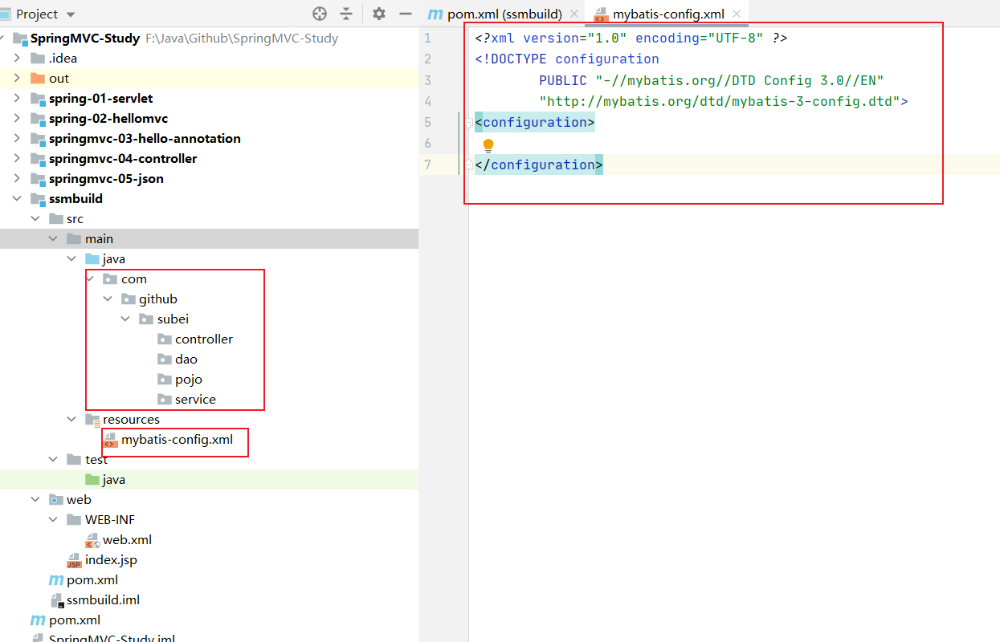

```xml
<?xml version="1.0" encoding="UTF-8" ?>
<!DOCTYPE configuration
        PUBLIC "-//mybatis.org//DTD Config 3.0//EN"
        "http://mybatis.org/dtd/mybatis-3-config.dtd">
<configuration>

</configuration>
```

- applicationContext.xml 

```xml
<?xml version="1.0" encoding="UTF-8"?>
<beans xmlns="http://www.springframework.org/schema/beans"
      xmlns:xsi="http://www.w3.org/2001/XMLSchema-instance"
      xsi:schemaLocation="http://www.springframework.org/schema/beans
       http://www.springframework.org/schema/beans/spring-beans.xsd">

</beans>
```

### 2.Mybatis 层

1. 数据库配置文件 **database.properties** 

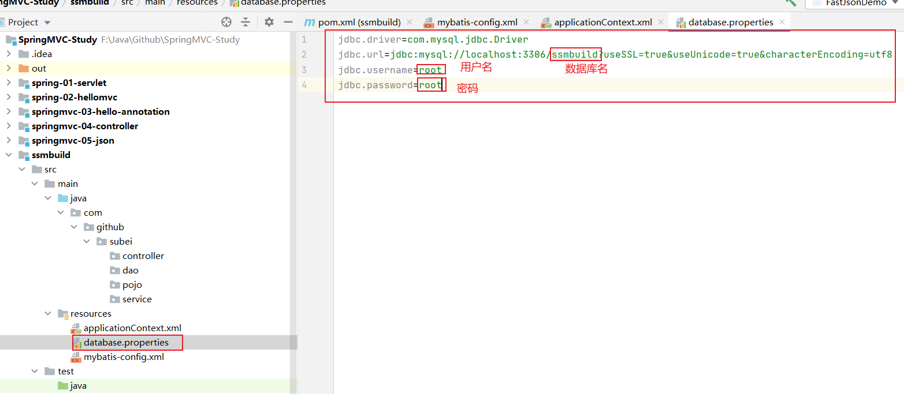

```mysql
jdbc.driver=com.mysql.jdbc.Driver
# 如果使用的是MySQL8.0+,增加一个时区的配置。
jdbc.url=jdbc:mysql://localhost:3306/ssmbuild?useSSL=true&useUnicode=true&characterEncoding=utf8
jdbc.username=root
jdbc.password=root
```

2. IDEA 关联数据库

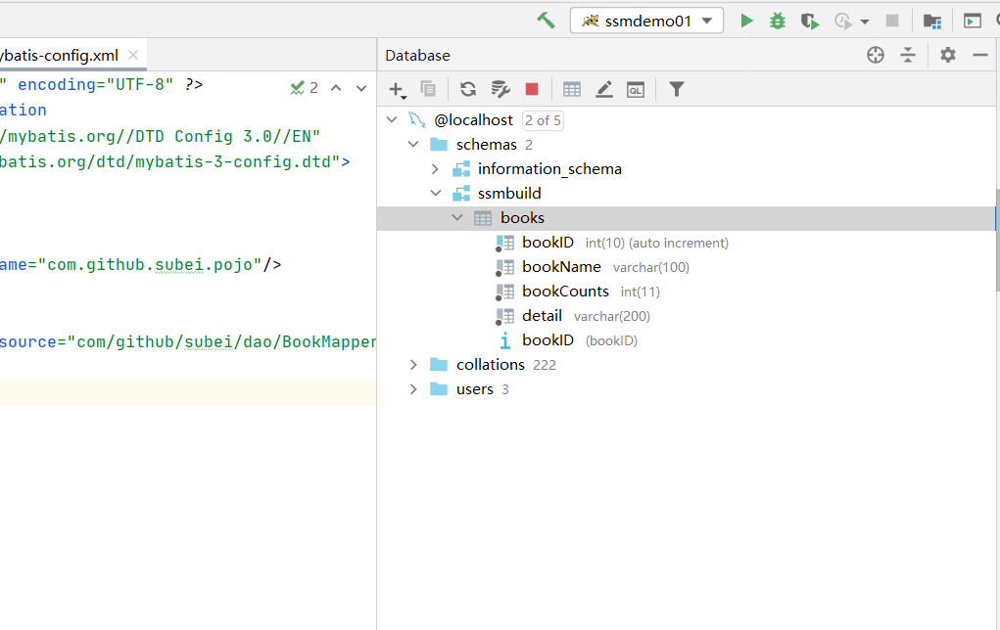

3. 编写 MyBatis 的核心配置文件

```xml
<?xml version="1.0" encoding="UTF-8" ?>
<!DOCTYPE configuration
        PUBLIC "-//mybatis.org//DTD Config 3.0//EN"
        "http://mybatis.org/dtd/mybatis-3-config.dtd">
<configuration>

    <typeAliases>
        <package name="com.github.subei.pojo"/>
    </typeAliases>
    
    <mappers>
        <mapper class="com.github.subei.dao.BookMapper"/>
    </mappers>

</configuration>
```

4. 编写数据库对应的实体类 com.github.subei.pojo.Books，使用 lombok 插件！

```java
package com.github.subei.pojo;

import lombok.AllArgsConstructor;
import lombok.Data;
import lombok.NoArgsConstructor;

@Data
@AllArgsConstructor
@NoArgsConstructor
public class Books {
    private int bookID;
    private String bookName;
    private int bookCounts;
    private String detail;

}
```

5. 编写 Dao 层的 Mapper 接口！ 

```java
package com.github.subei.dao;

import com.github.subei.pojo.Books;
import org.apache.ibatis.annotations.Param;

import java.util.List;

public interface BookMapper {
    // 增加一个Book
    int addBook(Books book);

    // 根据id删除一个Book
    int deleteBookById(@Param("bookID") int id);

    // 更新一个Book
    int updateBook(Books books);

    // 根据id查询,返回一个Book
    Books queryBookById(@Param("bookID") int id);

    // 查询全部Book,返回list集合
    List<Books> queryAllBook();
}
```

6. 编写接口对应的 Mapper.xml 文件。需要导入 MyBatis 的包； 

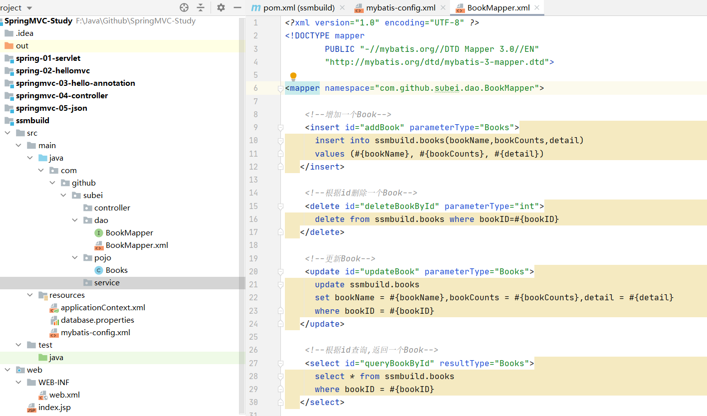

```xml
<?xml version="1.0" encoding="UTF-8" ?>
<!DOCTYPE mapper
        PUBLIC "-//mybatis.org//DTD Mapper 3.0//EN"
        "http://mybatis.org/dtd/mybatis-3-mapper.dtd">

<mapper namespace="com.github.subei.dao.BookMapper">

    <!--增加一个Book-->
    <insert id="addBook" parameterType="Books">
      insert into ssmbuild.books(bookName,bookCounts,detail)
      values (#{bookName}, #{bookCounts}, #{detail});
   </insert>

    <!--根据id删除一个Book-->
    <delete id="deleteBookById" parameterType="int">
      delete from ssmbuild.books where bookID=#{bookID};
   </delete>

    <!--更新Book-->
    <update id="updateBook" parameterType="Books">
      update ssmbuild.books
      set bookName = #{bookName},bookCounts = #{bookCounts},detail = #{detail}
      where bookID = #{bookID};
   </update>

    <!--根据id查询,返回一个Book-->
    <select id="queryBookById" resultType="Books">
      select * from ssmbuild.books
      where bookID = #{bookID};
   </select>

    <!--查询全部Book-->
    <select id="queryAllBook" resultType="Books">
      SELECT * from ssmbuild.books;
   </select>

</mapper>
```

7. 编写 Service 层的接口和实现类

- 接口：

```java
package com.github.subei.service;

import com.github.subei.pojo.Books;

import java.util.List;

// BookService:底下需要去实现,调用dao层
public interface BookService {
    // 增加一个Book
    int addBook(Books book);
    // 根据id删除一个Book
    int deleteBookById(int id);
    // 更新Book
    int updateBook(Books books);
    // 根据id查询,返回一个Book
    Books queryBookById(int id);
    // 查询全部Book,返回list集合
    List<Books> queryAllBook();
}
```

- 实现类： 

```java
package com.github.subei.service;

import com.github.subei.dao.BookMapper;
import com.github.subei.pojo.Books;

import java.util.List;

public class BookServiceImpl implements BookService {

    // 调用dao层的操作，设置一个set接口，方便Spring管理
    private BookMapper bookMapper;

    public void setBookMapper(BookMapper bookMapper) {
        this.bookMapper = bookMapper;
    }

    public int addBook(Books book) {
        return bookMapper.addBook(book);
    }

    public int deleteBookById(int id) {
        return bookMapper.deleteBookById(id);
    }

    public int updateBook(Books books) {
        return bookMapper.updateBook(books);
    }

    public Books queryBookById(int id) {
        return bookMapper.queryBookById(id);
    }

    public List<Books> queryAllBook() {
        return bookMapper.queryAllBook();
    }
}
```

> **OK，到此，底层需求操作编写完毕！** 

### 3.Spring 层

1. 配置 **Spring 整合 MyBatis**，这里数据源使用 c3p0 连接池；

2. 编写 Spring 整合 Mybatis 的相关的配置文件；spring-dao.xml

```xml
<?xml version="1.0" encoding="UTF-8"?>
<beans xmlns="http://www.springframework.org/schema/beans"
       xmlns:xsi="http://www.w3.org/2001/XMLSchema-instance"
       xmlns:context="http://www.springframework.org/schema/context"
       xsi:schemaLocation="http://www.springframework.org/schema/beans
       http://www.springframework.org/schema/beans/spring-beans.xsd
       http://www.springframework.org/schema/context
       https://www.springframework.org/schema/context/spring-context.xsd">

    <!-- 配置整合mybatis -->
    <!-- 1.关联数据库文件 -->
    <context:property-placeholder location="classpath:database.properties"/>

    <!-- 2.数据库连接池 -->
    <!--数据库连接池
        dbcp 半自动化操作 不能自动连接
        c3p0 自动化操作（自动的加载配置文件 并且设置到对象里面）
    -->
    <bean id="dataSource" class="com.mchange.v2.c3p0.ComboPooledDataSource">
        <!-- 配置连接池属性 -->
        <property name="driverClass" value="${jdbc.driver}"/>
        <property name="jdbcUrl" value="${jdbc.url}"/>
        <property name="user" value="${jdbc.username}"/>
        <property name="password" value="${jdbc.password}"/>

        <!-- c3p0连接池的私有属性 -->
        <property name="maxPoolSize" value="30"/>
        <property name="minPoolSize" value="10"/>
        <!-- 关闭连接后不自动commit -->
        <property name="autoCommitOnClose" value="false"/>
        <!-- 获取连接超时时间 -->
        <property name="checkoutTimeout" value="10000"/>
        <!-- 当获取连接失败重试次数 -->
        <property name="acquireRetryAttempts" value="2"/>
    </bean>

    <!-- 3.配置SqlSessionFactory对象 -->
    <bean id="sqlSessionFactory" class="org.mybatis.spring.SqlSessionFactoryBean">
        <!-- 注入数据库连接池 -->
        <property name="dataSource" ref="dataSource"/>
        <!-- 配置MyBaties全局配置文件:mybatis-config.xml -->
        <property name="configLocation" value="classpath:mybatis-config.xml"/>
    </bean>

    <!-- 4.配置扫描Dao接口包，动态实现Dao接口注入到spring容器中 -->
    <!--解释 ：https://www.cnblogs.com/jpfss/p/7799806.html-->
    <bean class="org.mybatis.spring.mapper.MapperScannerConfigurer">
        <!-- 注入sqlSessionFactory -->
        <property name="sqlSessionFactoryBeanName" value="sqlSessionFactory"/>
        <!-- 给出需要扫描Dao接口包 -->
        <property name="basePackage" value="com.github.subei.dao"/>
    </bean>

</beans>
```

3. **Spring 整合 service 层** 

```xml
<?xml version="1.0" encoding="UTF-8"?>
<beans xmlns="http://www.springframework.org/schema/beans"
       xmlns:xsi="http://www.w3.org/2001/XMLSchema-instance"
       xmlns:context="http://www.springframework.org/schema/context"
       xsi:schemaLocation="http://www.springframework.org/schema/beans
   http://www.springframework.org/schema/beans/spring-beans.xsd
   http://www.springframework.org/schema/context
   http://www.springframework.org/schema/context/spring-context.xsd">

    <!-- 扫描service相关的bean -->
    <context:component-scan base-package="com.github.subei.service" />

    <!--BookServiceImpl注入到IOC容器中-->
    <bean id="BookServiceImpl" class="com.github.subei.service.BookServiceImpl">
        <property name="bookMapper" ref="bookMapper"/>
    </bean>

    <!-- 配置事务管理器 -->
    <bean id="transactionManager" class="org.springframework.jdbc.datasource.DataSourceTransactionManager">
        <!-- 注入数据库连接池 -->
        <property name="dataSource" ref="dataSource" />
    </bean>

</beans>
```

### 4.SpringMVC 层

1. **web.xml** 

```xml
<?xml version="1.0" encoding="UTF-8"?>
<web-app xmlns="http://xmlns.jcp.org/xml/ns/javaee"
         xmlns:xsi="http://www.w3.org/2001/XMLSchema-instance"
         xsi:schemaLocation="http://xmlns.jcp.org/xml/ns/javaee http://xmlns.jcp.org/xml/ns/javaee/web-app_4_0.xsd"
         version="4.0">

    <!--DispatcherServlet-->
    <servlet>
        <servlet-name>DispatcherServlet</servlet-name>
        <servlet-class>org.springframework.web.servlet.DispatcherServlet</servlet-class>
        <init-param>
            <param-name>contextConfigLocation</param-name>
            <!--一定要注意:我们这里加载的是总的配置文件，之前被这里坑了！-->
            <param-value>classpath:applicationContext.xml</param-value>
        </init-param>
        <load-on-startup>1</load-on-startup>
    </servlet>
    <servlet-mapping>
        <servlet-name>DispatcherServlet</servlet-name>
        <url-pattern>/</url-pattern>
    </servlet-mapping>

    <!--encodingFilter-->
    <filter>
        <filter-name>encodingFilter</filter-name>
        <filter-class>
            org.springframework.web.filter.CharacterEncodingFilter
        </filter-class>
        <init-param>
            <param-name>encoding</param-name>
            <param-value>utf-8</param-value>
        </init-param>
    </filter>
    <filter-mapping>
        <filter-name>encodingFilter</filter-name>
        <url-pattern>/*</url-pattern>
    </filter-mapping>

    <!--Session过期时间-->
    <session-config>
        <session-timeout>15</session-timeout>
    </session-config>

</web-app>
```

2. **spring-mvc.xml** 

```xml
<?xml version="1.0" encoding="UTF-8"?>
<beans xmlns="http://www.springframework.org/schema/beans"
       xmlns:xsi="http://www.w3.org/2001/XMLSchema-instance"
       xmlns:context="http://www.springframework.org/schema/context"
       xmlns:mvc="http://www.springframework.org/schema/mvc"
       xsi:schemaLocation="http://www.springframework.org/schema/beans
   http://www.springframework.org/schema/beans/spring-beans.xsd
   http://www.springframework.org/schema/context
   http://www.springframework.org/schema/context/spring-context.xsd
   http://www.springframework.org/schema/mvc
   https://www.springframework.org/schema/mvc/spring-mvc.xsd">

    <!-- 配置SpringMVC -->
    <!-- 1.开启SpringMVC注解驱动 -->
    <mvc:annotation-driven />
    <!-- 2.静态资源默认servlet配置-->
    <mvc:default-servlet-handler/>

    <!-- 3.配置jsp 显示ViewResolver视图解析器 -->
    <bean class="org.springframework.web.servlet.view.InternalResourceViewResolver">
        <property name="viewClass" value="org.springframework.web.servlet.view.JstlView" />
        <property name="prefix" value="/WEB-INF/jsp/" />
        <property name="suffix" value=".jsp" />
    </bean>

    <!-- 4.扫描web相关的bean -->
    <context:component-scan base-package="com.github.subei.controller" />

</beans>
```

3. **Spring 配置整合文件，applicationContext.xml** 

```xml
<?xml version="1.0" encoding="UTF-8"?>
<beans xmlns="http://www.springframework.org/schema/beans"
       xmlns:xsi="http://www.w3.org/2001/XMLSchema-instance"
       xsi:schemaLocation="http://www.springframework.org/schema/beans
       http://www.springframework.org/schema/beans/spring-beans.xsd">

    <import resource="spring-dao.xml"/>
    <import resource="spring-service.xml"/>
    <import resource="spring-mvc.xml"/>

</beans>
```

> **配置文件，暂时结束！Controller 和 视图层编写** 

### 5.案例实现

1. BookController 类编写 ， 方法一：查询全部书籍 

```java
package com.github.subei.controller;

import com.github.subei.pojo.Books;
import com.github.subei.service.BookService;
import org.springframework.beans.factory.annotation.Autowired;
import org.springframework.beans.factory.annotation.Qualifier;
import org.springframework.stereotype.Controller;
import org.springframework.ui.Model;
import org.springframework.web.bind.annotation.RequestMapping;

import java.util.List;

@Controller
@RequestMapping("/book")
public class BookController {

    @Autowired
    @Qualifier("BookServiceImpl")
    private BookService bookService;

    @RequestMapping("/allBook")
    public String list(Model model) {
        List<Books> list = bookService.queryAllBook();
        model.addAttribute("list", list);
        return "allBook";
    }
}
```

 2、编写首页 **index.jsp** 

```jsp
<%@ page language="java" contentType="text/html; charset=UTF-8" pageEncoding="UTF-8" %>
<!DOCTYPE HTML>
<html>
<head>
  <title>首页</title>
  <style type="text/css">
    a {
      text-decoration: none;
      color: black;
      font-size: 18px;
    }
    h3 {
      width: 180px;
      height: 38px;
      margin: 100px auto;
      text-align: center;
      line-height: 38px;
      background: deepskyblue;
      border-radius: 4px;
    }
  </style>
</head>
<body>

<h3>
  <a href="${pageContext.request.contextPath}/book/allBook">点击进入列表页</a>
</h3>
</body>
</html>
```

3. 书籍列表页面 **allbook.jsp** 

```jsp
<%@ taglib prefix="c" uri="http://java.sun.com/jsp/jstl/core" %>
<%@ page contentType="text/html;charset=UTF-8" language="java" %>
<html>
<head>
   <title>书籍列表</title>
   <meta name="viewport" content="width=device-width, initial-scale=1.0">
   <!-- 引入 Bootstrap -->
   <link href="https://cdn.bootcss.com/bootstrap/3.3.7/css/bootstrap.min.css" rel="stylesheet">
</head>
<body>

<div class="container">

   <div class="row clearfix">
       <div class="col-md-12 column">
           <div class="page-header">
               <h1>
                   <small>书籍列表 —— 显示所有书籍</small>
               </h1>
           </div>
       </div>
   </div>

   <div class="row">
       <div class="col-md-4 column">
           <a class="btn btn-primary" href="${pageContext.request.contextPath}/book/toAddBook">新增书籍</a>
       </div>
   </div>

   <div class="row clearfix">
       <div class="col-md-12 column">
           <table class="table table-hover table-striped">
               <thead>
               <tr>
                   <th>书籍编号</th>
                   <th>书籍名字</th>
                   <th>书籍数量</th>
                   <th>书籍详情</th>
                   <th>操作</th>
               </tr>
               </thead>

               <tbody>
               <c:forEach var="book" items="${requestScope.get('list')}">
                   <tr>
                       <td>${book.getBookID()}</td>
                       <td>${book.getBookName()}</td>
                       <td>${book.getBookCounts()}</td>
                       <td>${book.getDetail()}</td>
                       <td>
                           <a href="${pageContext.request.contextPath}/book/toUpdateBook?id=${book.getBookID()}">更改</a> |
                           <a href="${pageContext.request.contextPath}/book/del/${book.getBookID()}">删除</a>
                       </td>
                   </tr>
               </c:forEach>
               </tbody>
           </table>
       </div>
   </div>
</div>
```

4. BookController 类编写 ， 方法二：添加书籍 

```java
    @RequestMapping("/toAddBook")
    public String toAddPaper() {
        return "addBook";
    }

    @RequestMapping("/addBook")
    public String addPaper(Books books) {
        System.out.println(books);
        bookService.addBook(books);
        return "redirect:/book/allBook";
    }
```

5. 添加书籍页面：**addBook.jsp**

```jsp
<%@ taglib prefix="c" uri="http://java.sun.com/jsp/jstl/core" %>
<%@ page contentType="text/html;charset=UTF-8" language="java" %>

<html>
<head>
   <title>新增书籍</title>
   <meta name="viewport" content="width=device-width, initial-scale=1.0">
   <!-- 引入 Bootstrap -->
   <link href="https://cdn.bootcss.com/bootstrap/3.3.7/css/bootstrap.min.css" rel="stylesheet">
</head>
<body>
<div class="container">

   <div class="row clearfix">
       <div class="col-md-12 column">
           <div class="page-header">
               <h1>
                   <small>新增书籍</small>
               </h1>
           </div>
       </div>
   </div>
   <form action="${pageContext.request.contextPath}/book/addBook" method="post">
      书籍名称：<input type="text" name="bookName"><br><br><br>
      书籍数量：<input type="text" name="bookCounts"><br><br><br>
      书籍详情：<input type="text" name="detail"><br><br><br>
       <input type="submit" value="添加">
   </form>

</div>
```

6. BookController 类编写 ， 方法三：修改书籍 

```java
    @RequestMapping("/toUpdateBook")
    public String toUpdateBook(Model model, int id) {
        Books books = bookService.queryBookById(id);
        System.out.println(books);
        model.addAttribute("book",books );
        return "updateBook";
    }

    @RequestMapping("/updateBook")
    public String updateBook(Model model, Books book) {
        System.out.println(book);
        bookService.updateBook(book);
        Books books = bookService.queryBookById(book.getBookID());
        model.addAttribute("books", books);
        return "redirect:/book/allBook";
    }
```

7. 修改书籍页面  **updateBook.jsp** 

```jsp
<%--
  Created by IntelliJ IDEA.
  User: subei
  Date: 2021/2/27
  Time: 17:53
  To change this template use File | Settings | File Templates.
--%>
<%@ taglib prefix="c" uri="http://java.sun.com/jsp/jstl/core" %>
<%@ page contentType="text/html;charset=UTF-8" language="java" %>
<html>
<head>
    <title>修改信息</title>
    <meta name="viewport" content="width=device-width, initial-scale=1.0">
    <!-- 引入 Bootstrap -->
    <link href="https://cdn.bootcss.com/bootstrap/3.3.7/css/bootstrap.min.css" rel="stylesheet">
</head>
<body>
<div class="container">

    <div class="row clearfix">
        <div class="col-md-12 column">
            <div class="page-header">
                <h1>
                    <small>修改信息</small>
                </h1>
            </div>
        </div>
    </div>

    <form action="${pageContext.request.contextPath}/book/updateBook" method="post">
        <input type="hidden" name="bookID" value="${book.getBookID()}"/>
        书籍名称：<input type="text" name="bookName" value="${book.getBookName()}"/>
        书籍数量：<input type="text" name="bookCounts" value="${book.getBookCounts()}"/>
        书籍详情：<input type="text" name="detail" value="${book.getDetail() }"/>
        <input type="submit" value="提交"/>
    </form>

</div>
```

8. BookController 类编写 ， 方法四：删除书籍 

```java
    @RequestMapping("/del/{bookID}")
    public String deleteBook(@PathVariable("bookID") int id) {
        bookService.deleteBookById(id);
        return "redirect:/book/allBook";
    }
```

----

9. 书籍查询功能

- 修改前端页面，allBook.jsp 页面

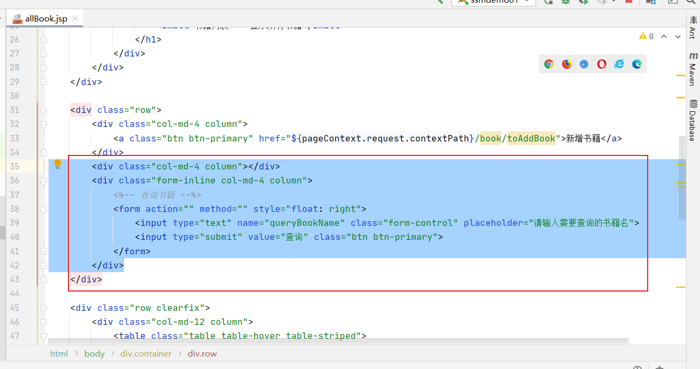

```jsp
        <div class="col-md-4 column"></div>
        <div class="form-inline">
            <%-- 查询书籍 --%>
            <form action="" method="" style="float: right">
                <input type="text" name="queryBookName" class="form-control" placeholder="请输入需要查询的书籍名">
                <input type="submit" value="查询" class="btn btn-primary">
            </form>
        </div>
```

- 修改 DAO 层：BookMapper.java

```java
    // 查询，搜索书籍
    Books queryBookByName(@Param("bookName")String bookName);
```

- 修改 DAO 层：BookMapper.xml

```xml
    <!--搜索Book-->
    <select id="queryBookByName" resultType="Books">
      SELECT * from ssmbuild.books where bookName = #{bookName};
   </select>
```

- 修改 service 层：BookService.java

```java
    // 查询，搜索书籍
    Books queryBookByName(String bookName);
```

- 修改 service 层：BookServiceImpl.java

```java
    public Books queryBookByName(String bookName) {
        return bookMapper.queryBookByName(bookName);
    }
```

- 修改 controller 层：BookController.java

```java
    // 查询书籍
    @RequestMapping("/queryBook")
    public String queryBook(String queryBookName,Model model){
        Books books = bookService.queryBookByName(queryBookName);
        List<Books> list = new ArrayList<Books>();
        list.add(books);
        model.addAttribute("list", list);
        return "allBook";
    }
```

- 修改前端：allBook.jsp

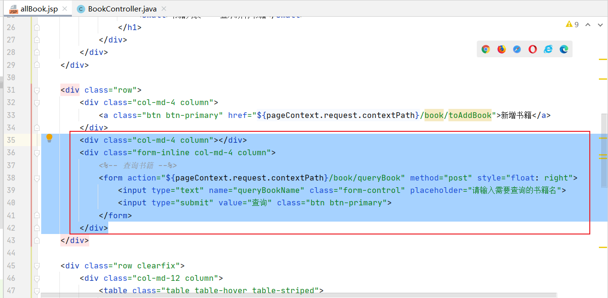

```jsp
        <div class="col-md-4 column"></div>
        <div class="form-inline">
            <%-- 查询书籍 --%>
            <form action="${pageContext.request.contextPath}/book/queryBook" method="post" style="float: right">
                <input type="text" name="queryBookName" class="form-control" placeholder="请输入需要查询的书籍名">
                <input type="submit" value="查询" class="btn btn-primary">
            </form>
        </div>
```

- 运行测试：

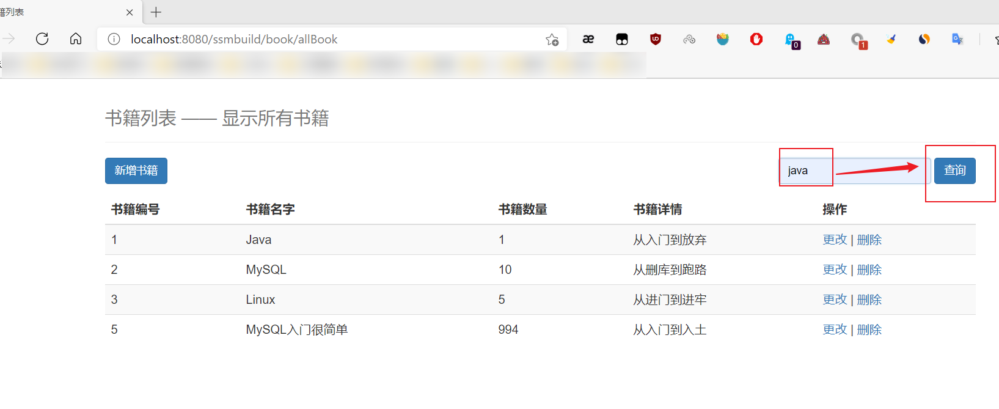

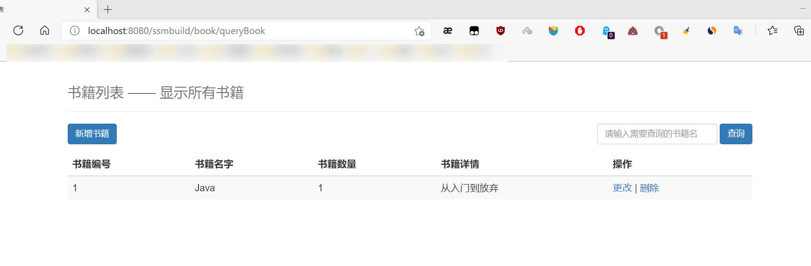

> 如果查询失败，需要显示全部书籍页面？

- 修改前端页面 allBook.jsp

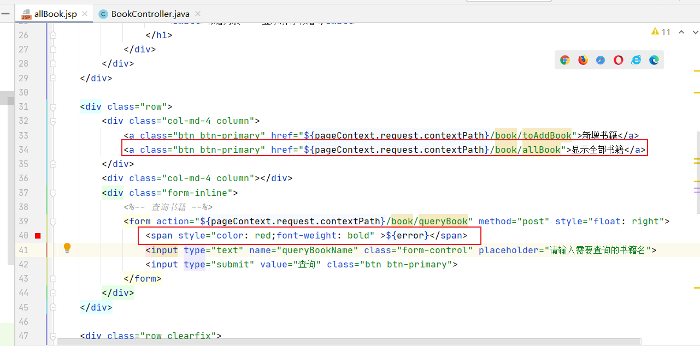

```jsp
    <div class="row">
        <div class="col-md-4 column">
            <a class="btn btn-primary" href="${pageContext.request.contextPath}/book/toAddBook">新增书籍</a>
            <a class="btn btn-primary" href="${pageContext.request.contextPath}/book/allBook">显示全部书籍</a>
        </div>
        <div class="col-md-4 column"></div>
        <div class="form-inline">
            <%-- 查询书籍 --%>
            <form action="${pageContext.request.contextPath}/book/queryBook" method="post" style="float: right">
                <span style="color: red;font-weight: bold" >${error}</span>
                <input type="text" name="queryBookName" class="form-control" placeholder="请输入需要查询的书籍名">
                <input type="submit" value="查询" class="btn btn-primary">
            </form>
        </div>
    </div>
```

- 修改后台 BookController.java

```java
    // 查询书籍
    @RequestMapping("/queryBook")
    public String queryBook(String queryBookName,Model model){
        Books books = bookService.queryBookByName(queryBookName);
        List<Books> list = new ArrayList<Books>();
        list.add(books);

        if(books==null){
            list = bookService.queryAllBook();
            model.addAttribute("error","未查到");
        }

        model.addAttribute("list", list);
        return "allBook";
    }
```

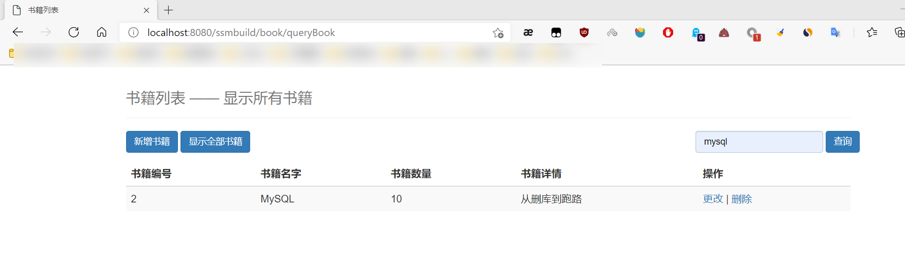

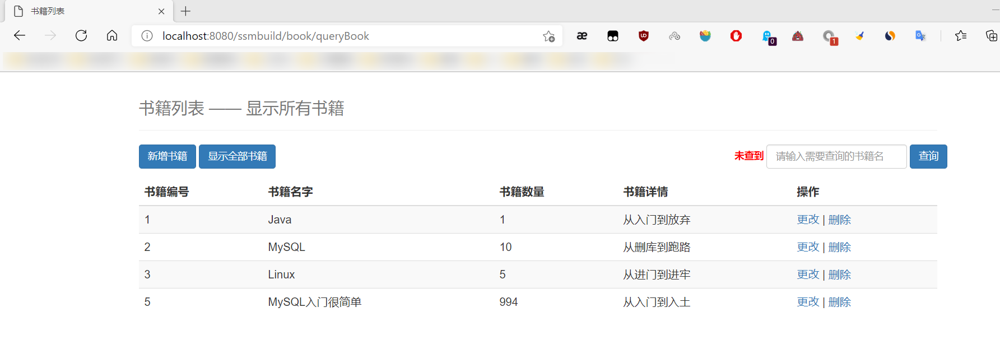


> **配置 Tomcat，进行运行！** 

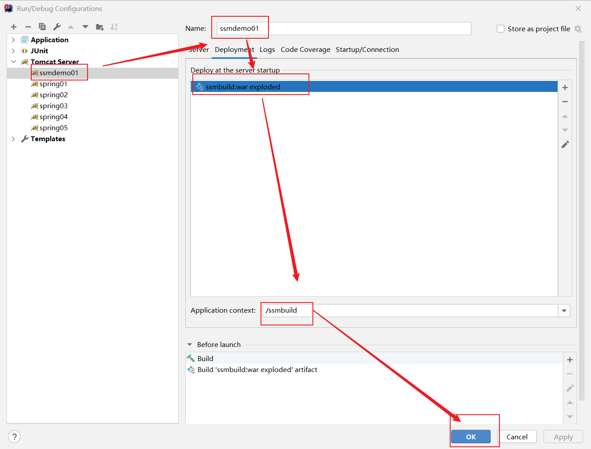

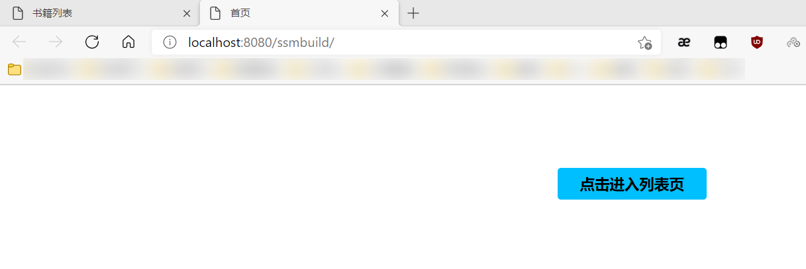

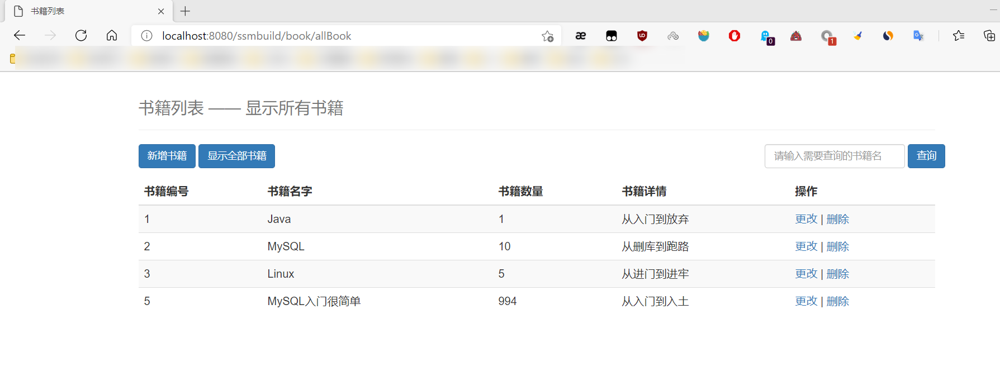

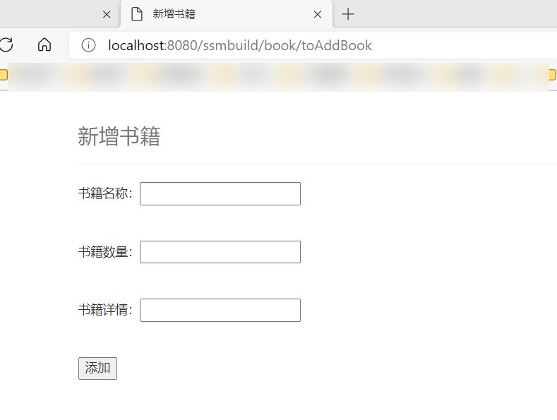

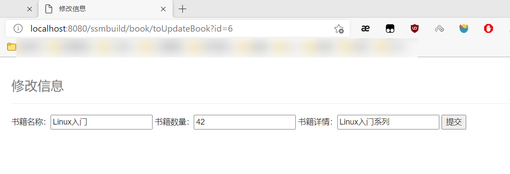

> **项目结构图**：

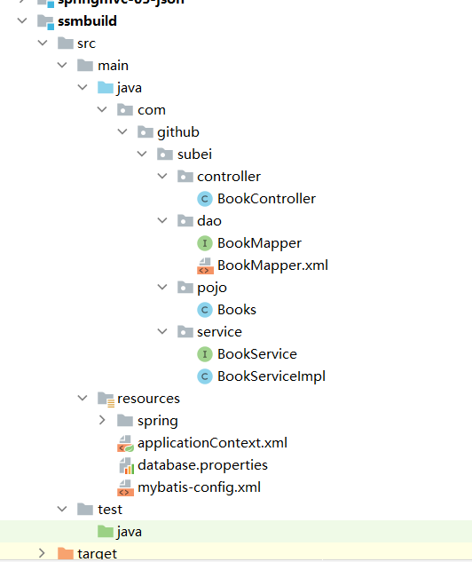

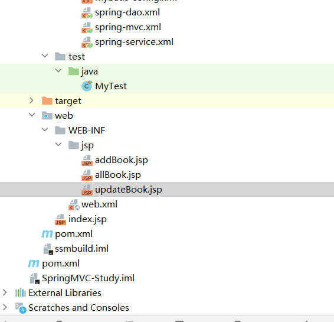

> 推荐一个前端可视化布局设计网站：https://www.bootcss.com/p/layoutit/

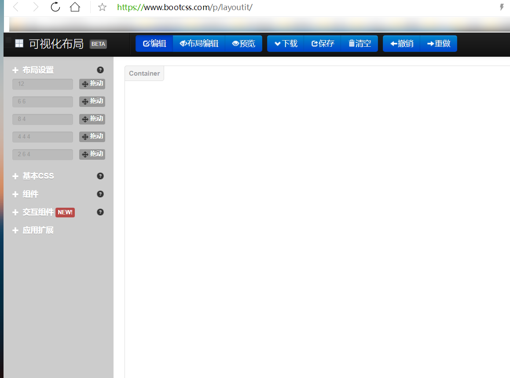

## 8、Ajax 技术

### 1.Ajax 初体验

> 简介

- **AJAX = Asynchronous JavaScript and XML（异步的 JavaScript 和 XML）。**
- AJAX 是一种在无需重新加载整个网页的情况下，能够更新部分网页的技术。
- **Ajax 不是一种新的编程语言，而是一种用于创建更好更快以及交互性更强的 Web 应用程序的技术。**
- 在 2005 年，Google 通过其 Google Suggest 使 AJAX 变得流行起来。Google Suggest 能够自动帮你完成搜索单词。
- Google Suggest 使用 AJAX 创造出动态性极强的 web 界面：当您在谷歌的搜索框输入关键字时，JavaScript 会把这些字符发送到服务器，然后服务器会返回一个搜索建议的列表。
- 和国内百度的搜索框一样!

- 传统的网页(即不用 ajax 技术的网页)，想要更新内容或者提交一个表单，都需要重新加载整个网页。
- 使用 ajax 技术的网页，通过在后台服务器进行少量的数据交换，就可以实现异步局部更新。
- 使用 Ajax，用户可以创建接近本地桌面应用的直接、高可用、更丰富、更动态的 Web 用户界面。

> 伪造 Ajax
>
> - 可以使用前端的一个标签来伪造一个 ajax 的样子。iframe 标签

1. 新建一个 module ：springmvc-06-ajax ， 导入 web 支持！

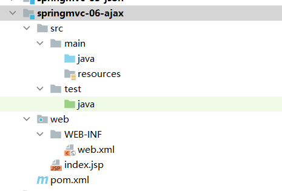

2. 测试项目是否成功！

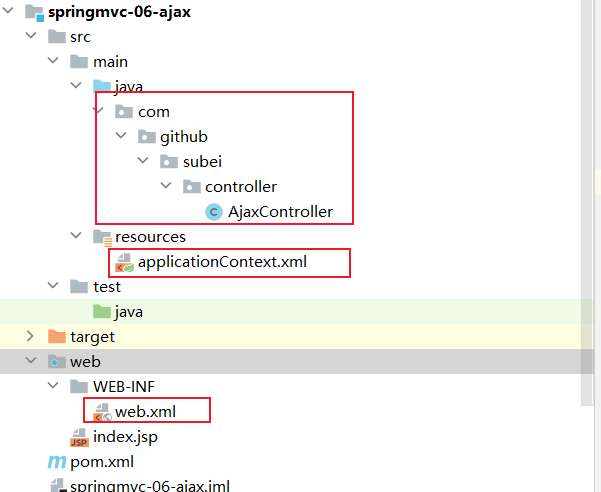

- 配置 web.xml

```xml
<?xml version="1.0" encoding="UTF-8"?>
<web-app xmlns="http://xmlns.jcp.org/xml/ns/javaee"
         xmlns:xsi="http://www.w3.org/2001/XMLSchema-instance"
         xsi:schemaLocation="http://xmlns.jcp.org/xml/ns/javaee http://xmlns.jcp.org/xml/ns/javaee/web-app_4_0.xsd"
         version="4.0">
    <servlet>
        <servlet-name>springmvc</servlet-name>
        <servlet-class>org.springframework.web.servlet.DispatcherServlet</servlet-class>
        <init-param>
            <param-name>contextConfigLocation</param-name>
            <param-value>classpath:applicationContext.xml</param-value>
        </init-param>
        <load-on-startup>1</load-on-startup>
    </servlet>
    <servlet-mapping>
        <servlet-name>springmvc</servlet-name>
        <url-pattern>/</url-pattern>
    </servlet-mapping>
    
    <filter>
        <filter-name>encoding</filter-name>
        <filter-class>org.springframework.web.filter.CharacterEncodingFilter</filter-class>
        <init-param>
            <param-name>encoding</param-name>
            <param-value>utf-8</param-value>
        </init-param>
    </filter>
    <filter-mapping>
        <filter-name>encoding</filter-name>
        <url-pattern>/*</url-pattern>
    </filter-mapping>

</web-app>
```

- 配置 applicationContext.xml

```xml
<?xml version="1.0" encoding="UTF-8"?>
<beans xmlns="http://www.springframework.org/schema/beans"
       xmlns:xsi="http://www.w3.org/2001/XMLSchema-instance"
       xmlns:context="http://www.springframework.org/schema/context"
       xmlns:mvc="http://www.springframework.org/schema/mvc"
       xsi:schemaLocation="http://www.springframework.org/schema/beans
       http://www.springframework.org/schema/beans/spring-beans.xsd
       http://www.springframework.org/schema/context
       https://www.springframework.org/schema/context/spring-context.xsd
       http://www.springframework.org/schema/mvc
       https://www.springframework.org/schema/mvc/spring-mvc.xsd">

    <!-- 自动扫描指定的包，下面所有注解类交给IOC容器管理 -->
    <context:component-scan base-package="com.github.subei.controller"/>

    <!-- 视图解析器 -->
    <bean class="org.springframework.web.servlet.view.InternalResourceViewResolver"
          id="internalResourceViewResolver">
        <!-- 前缀 -->
        <property name="prefix" value="/WEB-INF/jsp/" />
        <!-- 后缀 -->
        <property name="suffix" value=".jsp" />
    </bean>

    <!-- JSON乱码问题 -->
    <mvc:annotation-driven>
        <mvc:message-converters register-defaults="true">
            <bean class="org.springframework.http.converter.StringHttpMessageConverter">
                <constructor-arg value="UTF-8"/>
            </bean>
            <bean class="org.springframework.http.converter.json.MappingJackson2HttpMessageConverter">
                <property name="objectMapper">
                    <bean class="org.springframework.http.converter.json.Jackson2ObjectMapperFactoryBean">
                        <property name="failOnEmptyBeans" value="false"/>
                    </bean>
                </property>
            </bean>
        </mvc:message-converters>
    </mvc:annotation-driven>

</beans>
```

- 配置 AjaxController.java

```java
package com.github.subei.controller;

import org.springframework.web.bind.annotation.RequestMapping;
import org.springframework.web.bind.annotation.RestController;

@RestController
public class AjaxController {

    @RequestMapping("k1")
    public String test(){
        return "hello";
    }
}
```

- 这一步很关键，手动添加 lib

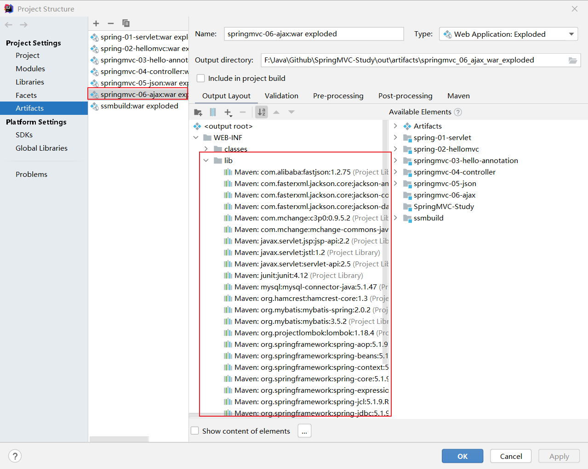

- 测试文件！

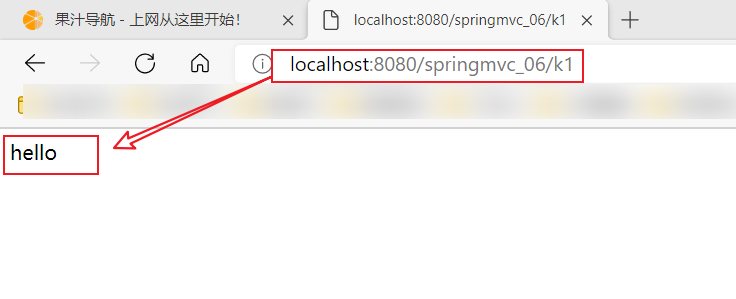


3. 编写一个 ajax-frame.html 使用 iframe 测试，感受下效果。

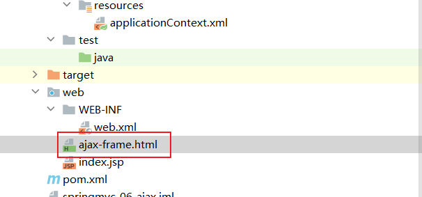

```html
<!DOCTYPE html>
<html lang="en">
<head>
    <meta charset="UTF-8">
    <title>subei</title>
</head>
<body>
<script type="text/javascript">
    window.onload = function(){
        var myDate = new Date();
        document.getElementById('currentTime').innerText = myDate.getTime();
    };

    function LoadPage(){
        var targetUrl =  document.getElementById('url').value;
        console.log(targetUrl);
        document.getElementById("iframePosition").src = targetUrl;
    }

</script>

<div>
    <p>请输入要加载的地址：<span id="currentTime"></span></p>
    <p>
        <input id="url" type="text" value="https://www.dogedoge.com/"/>
        <input type="button" value="提交" onclick="LoadPage()">
    </p>
</div>

<div>
    <h3>加载页面位置：</h3>
    <iframe id="iframePosition" style="width: 100%;height: 500px;"></iframe>
</div>
</body>
</html>
```

3. 使用 IDEA 开浏览器测试一下！ 

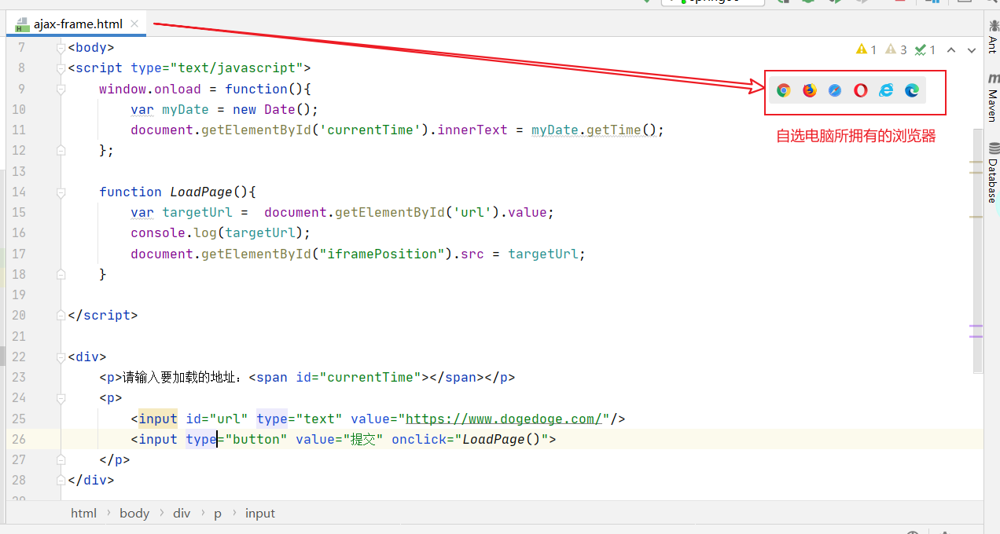

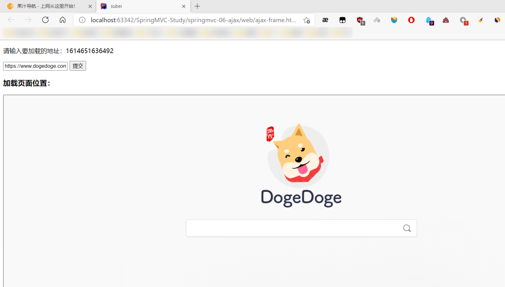

> **利用 AJAX 可以做：**

- 注册时，输入用户名自动检测用户是否已经存在。
- 登陆时，提示用户名密码错误
- 删除数据行时，将行 ID 发送到后台，后台在数据库中删除，数据库删除成功后，在页面 DOM 中将数据行也删除。
- ....等等

### 2.jQuery

- 纯 JS 原生实现 Ajax 不作详细赘述，直接使用 jquery 提供的，方便学习和使用，避免重复造轮子，有兴趣的同学可以去了解下 ==JS 原生 XMLHttpRequest== ！

- Ajax 的核心是 XMLHttpRequest 对象(XHR)。XHR 为向服务器发送请求和解析服务器响应提供了接口。能够以异步方式从服务器获取新数据。

- jQuery 提供多个与 AJAX 有关的方法。

- 通过 jQuery AJAX 方法，您能够使用 HTTP Get 和 HTTP Post 从远程服务器上请求文本、HTML、XML 或 JSON – 同时您能够把这些外部数据直接载入网页的被选元素中。

- jQuery 不是生产者，而是大自然搬运工。

- jQuery Ajax 本质就是 XMLHttpRequest，对他进行了封装，方便调用！

```js
jQuery.ajax(...)
      部分参数：
            url：请求地址
            type：请求方式，GET、POST（1.9.0之后用method）
        headers：请求头
            data：要发送的数据
    contentType：即将发送信息至服务器的内容编码类型(默认: "application/x-www-form-urlencoded; charset=UTF-8")
          async：是否异步
        timeout：设置请求超时时间（毫秒）
      beforeSend：发送请求前执行的函数(全局)
        complete：完成之后执行的回调函数(全局)
        success：成功之后执行的回调函数(全局)
          error：失败之后执行的回调函数(全局)
        accepts：通过请求头发送给服务器，告诉服务器当前客户端可接受的数据类型
        dataType：将服务器端返回的数据转换成指定类型
          "xml": 将服务器端返回的内容转换成xml格式
          "text": 将服务器端返回的内容转换成普通文本格式
          "html": 将服务器端返回的内容转换成普通文本格式，在插入DOM中时，如果包含JavaScript标签，则会尝试去执行。
        "script": 尝试将返回值当作JavaScript去执行，然后再将服务器端返回的内容转换成普通文本格式
          "json": 将服务器端返回的内容转换成相应的JavaScript对象
        "jsonp": JSONP 格式使用 JSONP 形式调用函数时，如 "myurl?callback=?" jQuery 将自动替换 ? 为正确的函数名，以执行回调函数
```

- 项目 06 中引用 jQuary，下载地址：https://jquery.com/download/

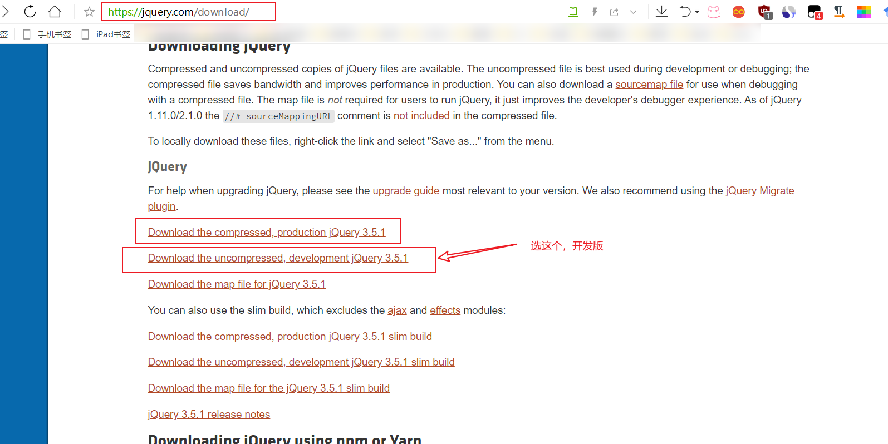

- 放入项目

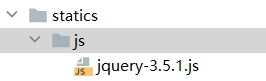

> 案例测试

1. 配置 web.xml 和 springmvc 的配置文件，复制上面案例的即可 【记得静态资源过滤和注解驱动配置上】 

```xml
<?xml version="1.0" encoding="UTF-8"?>
<beans xmlns="http://www.springframework.org/schema/beans"
       xmlns:xsi="http://www.w3.org/2001/XMLSchema-instance"
       xmlns:context="http://www.springframework.org/schema/context"
       xmlns:mvc="http://www.springframework.org/schema/mvc"
       xsi:schemaLocation="http://www.springframework.org/schema/beans
       http://www.springframework.org/schema/beans/spring-beans.xsd
       http://www.springframework.org/schema/context
       https://www.springframework.org/schema/context/spring-context.xsd
       http://www.springframework.org/schema/mvc
       https://www.springframework.org/schema/mvc/spring-mvc.xsd">

    <!-- 自动扫描指定的包，下面所有注解类交给IOC容器管理 -->
    <context:component-scan base-package="com.github.subei.controller"/>
    <!-- 静态资源过滤 -->
    <mvc:default-servlet-handler />
    <mvc:annotation-driven />

    <!-- 视图解析器 -->
    <bean class="org.springframework.web.servlet.view.InternalResourceViewResolver"
          id="internalResourceViewResolver">
        <!-- 前缀 -->
        <property name="prefix" value="/WEB-INF/jsp/" />
        <!-- 后缀 -->
        <property name="suffix" value=".jsp" />
    </bean>

    <!-- JSON乱码问题 -->
    <mvc:annotation-driven>
        <mvc:message-converters register-defaults="true">
            <bean class="org.springframework.http.converter.StringHttpMessageConverter">
                <constructor-arg value="UTF-8"/>
            </bean>
            <bean class="org.springframework.http.converter.json.MappingJackson2HttpMessageConverter">
                <property name="objectMapper">
                    <bean class="org.springframework.http.converter.json.Jackson2ObjectMapperFactoryBean">
                        <property name="failOnEmptyBeans" value="false"/>
                    </bean>
                </property>
            </bean>
        </mvc:message-converters>
    </mvc:annotation-driven>

</beans>
```

2. 编写一个 AjaxController 

```java
package com.github.subei.controller;

import org.springframework.web.bind.annotation.RequestMapping;
import org.springframework.web.bind.annotation.RestController;

import javax.servlet.http.HttpServletResponse;
import java.io.IOException;

@RestController
public class AjaxController {

    @RequestMapping("/a1")
    public void a1(String name , HttpServletResponse response) throws IOException {
        System.out.println("a1:param=>"+name);
        if ("subei".equals(name)){
            response.getWriter().print("true");
        }else{
            response.getWriter().print("false");
        }
    }
}
```

3. 导入 jquery

```html
    <script src="${pageContext.request.contextPath}/statics/js/jquery-3.5.1.js"></script>
```

4. 编写 index.jsp 测试 

```js
<%@ page contentType="text/html;charset=UTF-8" language="java" %>
<html>
  <head>
    <title>$Title$</title>

    <script src="${pageContext.request.contextPath}/statics/js/jquery-3.5.1.js"></script>

    <script>
      function a(){
        $.post({
          url:"${pageContext.request.contextPath}/a1",
          data:{'name':$("#username").val()},
          success:function (data,status) {
            console.log("data=" + data);
            console.log("status=" + status);
          }
        });
      }
    </script>
  </head>
  <body>

  <%-- 失去焦点的时候，发起一个请求到后台 --%>
  用户名：<input type="text" id="txtName" onblur="a()"/>

  </body>
</html>
```

5. 启动 tomcat 测试！打开浏览器的控制台，当我们鼠标离开输入框的时候，可以看到发出了一个 ajax 的请求！是后台返回给我们的结果！测试成功！ 

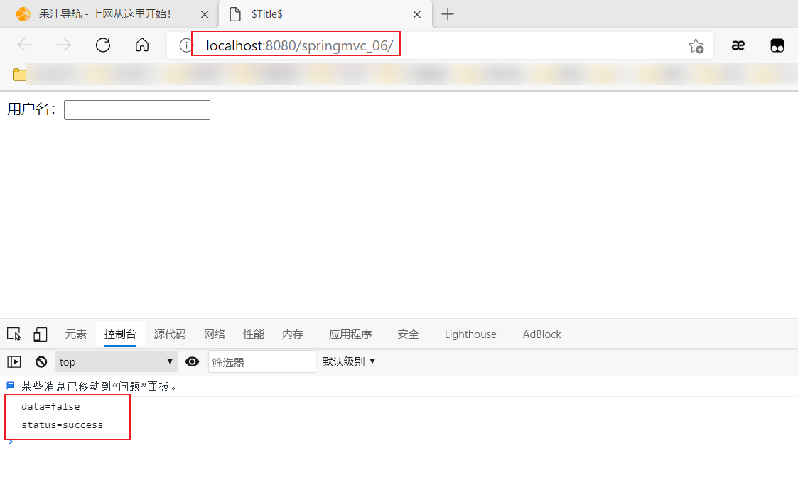

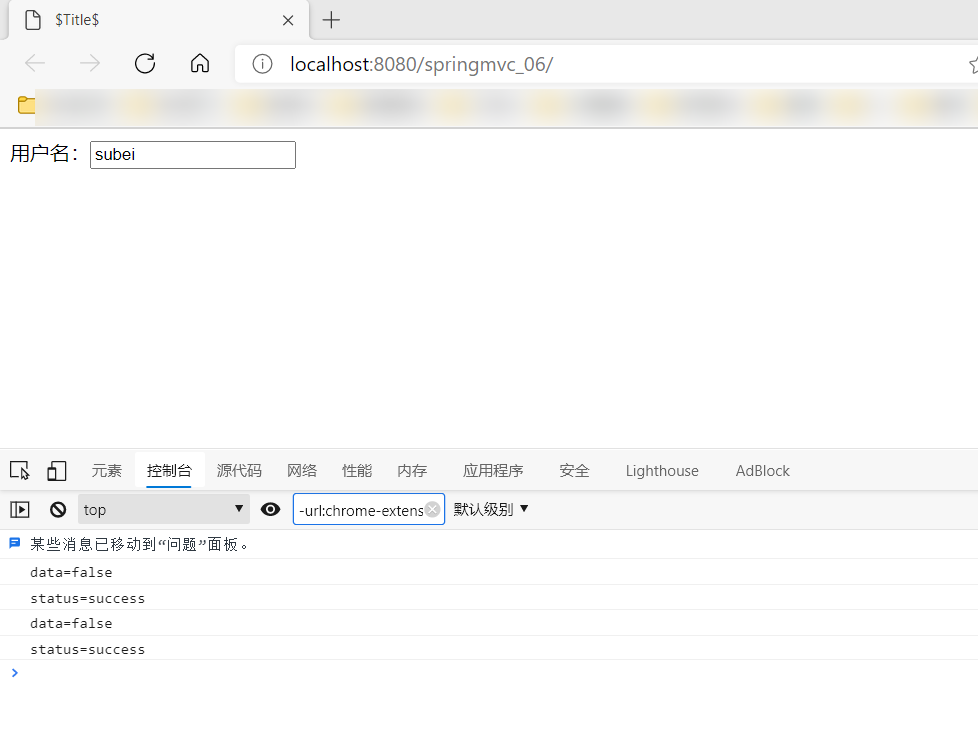

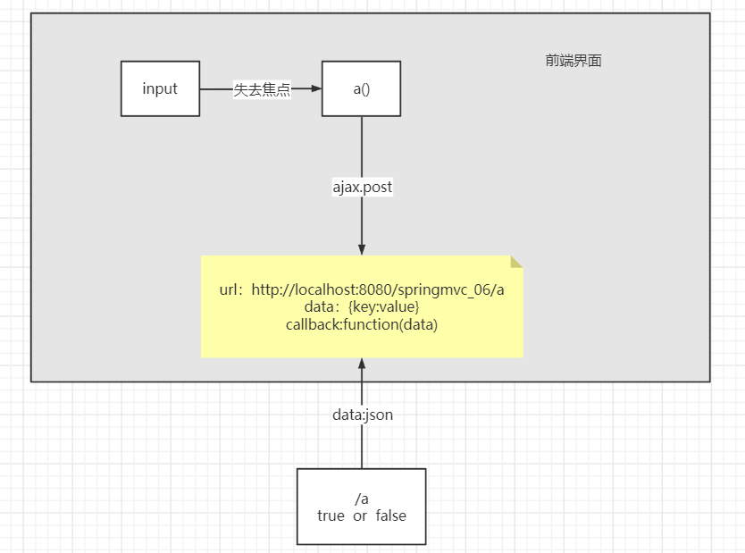

### 3.Ajax 异步加载数据

- 实体类 user 

````java
package com.github.subei.pojo;

import lombok.AllArgsConstructor;
import lombok.Data;
import lombok.NoArgsConstructor;

@Data
@AllArgsConstructor
@NoArgsConstructor
public class User {
    private String name;
    private int age;
    private String sex;

}
````

- 获取一个集合对象，展示到前端页面 

```java
    @RequestMapping("/a2")
    public List<User> a2(){
        List<User> list = new ArrayList<User>();
        list.add(new User("哇哈哈1号",9,"男"));
        list.add(new User("哇哈哈2号",6,"男"));
        list.add(new User("哇哈哈3号",1,"男"));
        return list; // 由于@RestController注解，将list转成json格式返回
    }
```

- 前端页面 

```html
<%@ page contentType="text/html;charset=UTF-8" language="java" %>
<html>
<head>
    <title>Title</title>
</head>
<body>
<input type="button" id="btn" value="获取数据"/>
<table width="80%" align="center">
    <tr>
        <td>姓名</td>
        <td>年龄</td>
        <td>性别</td>
    </tr>
    <tbody id="content">
    </tbody>
</table>

<script src="${pageContext.request.contextPath}/statics/js/jquery-3.5.1.js"></script>
<script>

    $(function () {
        $("#btn").click(function () {
            $.post("${pageContext.request.contextPath}/a2",function (data) {
                console.log(data)
                var html="";
                for (var i = 0; i <data.length ; i++) {
                    html+= "<tr>" +
                        "<td>" + data[i].name + "</td>" +
                        "<td>" + data[i].age + "</td>" +
                        "<td>" + data[i].sex + "</td>" +
                        "</tr>"
                }
                $("#content").html(html);
            });
        })
    })
</script>
</body>
</html>
```

- 测试服务器

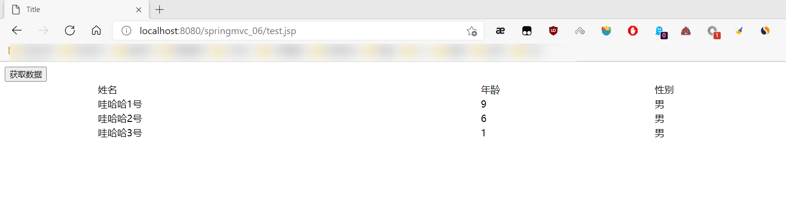

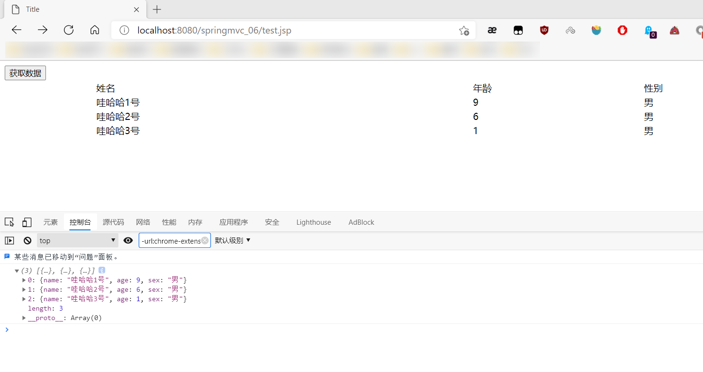

### 4.Ajax 验证用户名体验

- 编写 Controller 

```java
    @RequestMapping("/a3")
    public String a3(String name,String pwd){
        String msg = "";
        //模拟数据库中存在数据
        if (name!=null){
            if ("admin".equals(name)){
                msg = "OK";
            }else {
                msg = "用户名输入错误";
            }
        }
        if (pwd!=null){
            if ("123456".equals(pwd)){
                msg = "OK";
            }else {
                msg = "密码输入有误";
            }
        }
        return msg; //由于@RestController注解，将msg转成json格式返回
    }
```

- 前端页面 login.jsp 

```jsp
<%@ page contentType="text/html;charset=UTF-8" language="java" %>
<html>
<head>
    <title>ajax</title>
    <script src="${pageContext.request.contextPath}/statics/js/jquery-3.5.1.js"></script>
    <script>

        function a1(){
            $.post({
                url:"${pageContext.request.contextPath}/a3",
                data:{'name':$("#name").val()},
                success:function (data) {
                    if (data.toString()=='OK'){
                        $("#userInfo").css("color","green");
                    }else {
                        $("#userInfo").css("color","red");
                    }
                    $("#userInfo").html(data);
                }
            });
        }
        function a2(){
            $.post({
                url:"${pageContext.request.contextPath}/a3",
                data:{'pwd':$("#pwd").val()},
                success:function (data) {
                    if (data.toString()=='OK'){
                        $("#pwdInfo").css("color","green");
                    }else {
                        $("#pwdInfo").css("color","red");
                    }
                    $("#pwdInfo").html(data);
                }
            });
        }

    </script>
</head>
<body>
<p>
    用户名:<input type="text" id="name" onblur="a1()"/>
    <span id="userInfo"></span>
</p>
<p>
    密码:<input type="text" id="pwd" onblur="a2()"/>
    <span id="pwdInfo"></span>
</p>
</body>
</html>
```

- 测试一下效果 

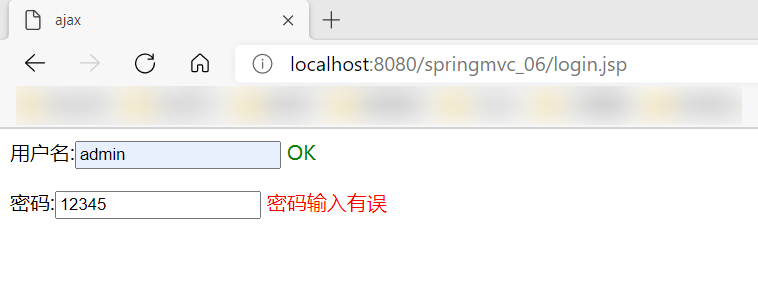

### 5.获取 baidu 接口 Demo 

```html
<!DOCTYPE HTML>
<html>
<head>
    <meta http-equiv="Content-Type" content="text/html; charset=utf-8">
    <title>JSONP百度搜索</title>
    <style>
        #q{
            width: 500px;
            height: 30px;
            border:1px solid #ddd;
            line-height: 30px;
            display: block;
            margin: 0 auto;
            padding: 0 10px;
            font-size: 14px;
        }
        #ul{
            width: 520px;
            list-style: none;
            margin: 0 auto;
            padding: 0;
            border:1px solid #ddd;
            margin-top: -1px;
            display: none;
        }
        #ul li{
            line-height: 30px;
            padding: 0 10px;
        }
        #ul li:hover{
            background-color: #f60;
            color: #fff;
        }
    </style>
    <script>

        // 2.步骤二
        // 定义demo函数 (分析接口、数据)
        function demo(data){
            var Ul = document.getElementById('ul');
            var html = '';
            // 如果搜索数据存在 把内容添加进去
            if (data.s.length) {
                // 隐藏掉的ul显示出来
                Ul.style.display = 'block';
                // 搜索到的数据循环追加到li里
                for(var i = 0;i<data.s.length;i++){
                    html += '<li>'+data.s[i]+'</li>';
                }
                // 循环的li写入ul
                Ul.innerHTML = html;
            }
        }

        // 1.步骤一
        window.onload = function(){
            // 获取输入框和ul
            var Q = document.getElementById('q');
            var Ul = document.getElementById('ul');

            // 事件鼠标抬起时候
            Q.onkeyup = function(){
                // 如果输入框不等于空
                if (this.value != '') {
                    // 创建标签
                    var script = document.createElement('script');
                    //给定要跨域的地址 赋值给src
                    //这里是要请求的跨域的地址 我写的是百度搜索的跨域地址
                    script.src = 'https://sp0.baidu.com/5a1Fazu8AA54nxGko9WTAnF6hhy/su?wd='+this.value+'&cb=demo';
                    // 将组合好的带src的script标签追加到body里
                    document.body.appendChild(script);
                }
            }
        }
    </script>
</head>

<body>
<input type="text" id="q" />
<ul id="ul">

</ul>
</body>
</html>
```

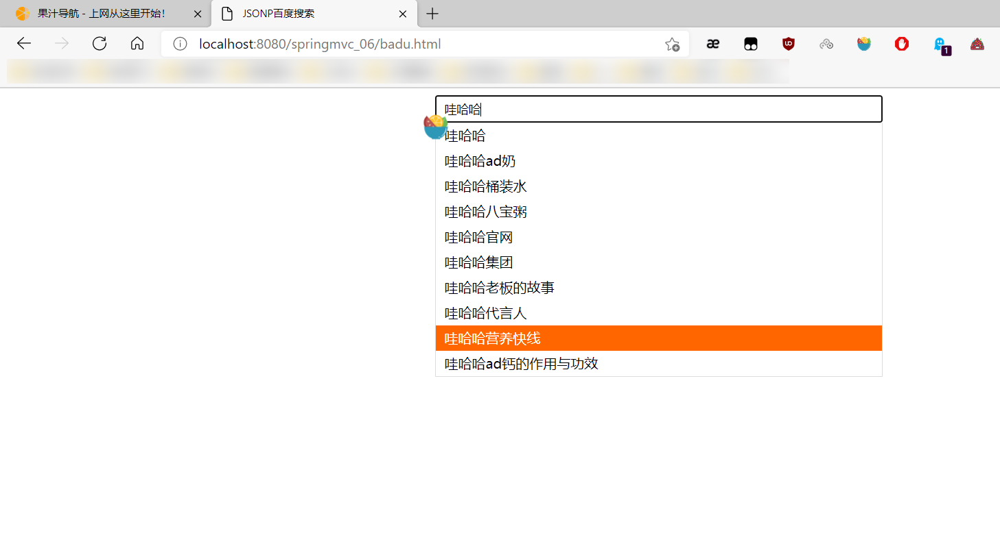

## 9、拦截器

### 1.概述

SpringMVC 的处理器拦截器类似于 Servlet 开发中的过滤器 Filter, 用于对处理器进行预处理和后处理。开发者可以自己定义一些拦截器来实现特定的功能。

- **过滤器与拦截器的区别：** 拦截器是 AOP 思想的具体应用。

> **过滤器**

- servlet 规范中的一部分，任何 java web 工程都可以使用
- 在 url-pattern 中配置了/*之后，可以对所有要访问的资源进行拦截

> **拦截器** 

- 拦截器是 SpringMVC 框架自己的，只有使用了 SpringMVC 框架的工程才能使用
- 拦截器只会拦截访问的控制器方法， 如果访问的是 jsp/html/[[css]]/[[image]]/js 是不会进行拦截的

### 2.自定义拦截器

那如何实现拦截器呢？

想要自定义拦截器，必须实现 HandlerInterceptor 接口。

1、新建一个 Moudule ， springmvc-07-Interceptor  ， 添加 web 支持。

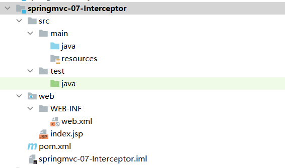

2、配置 web.xml 和 applicationContext.xml 文件

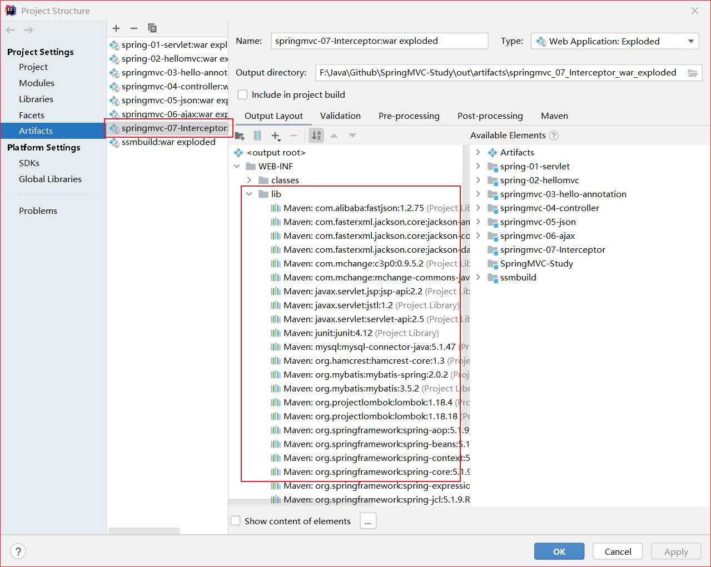

- web.xml

```xml
<?xml version="1.0" encoding="UTF-8"?>
<web-app xmlns="http://xmlns.jcp.org/xml/ns/javaee"
         xmlns:xsi="http://www.w3.org/2001/XMLSchema-instance"
         xsi:schemaLocation="http://xmlns.jcp.org/xml/ns/javaee http://xmlns.jcp.org/xml/ns/javaee/web-app_4_0.xsd"
         version="4.0">
    <servlet>
        <servlet-name>springmvc</servlet-name>
        <servlet-class>org.springframework.web.servlet.DispatcherServlet</servlet-class>
        <init-param>
            <param-name>contextConfigLocation</param-name>
            <param-value>classpath:applicationContext.xml</param-value>
        </init-param>
        <load-on-startup>1</load-on-startup>
    </servlet>
    <servlet-mapping>
        <servlet-name>springmvc</servlet-name>
        <url-pattern>/</url-pattern>
    </servlet-mapping>

    <filter>
        <filter-name>encoding</filter-name>
        <filter-class>org.springframework.web.filter.CharacterEncodingFilter</filter-class>
        <init-param>
            <param-name>encoding</param-name>
            <param-value>utf-8</param-value>
        </init-param>
    </filter>
    <filter-mapping>
        <filter-name>encoding</filter-name>
        <url-pattern>/*</url-pattern>
    </filter-mapping>

</web-app>
```

- applicationContext.xml

```xml
<?xml version="1.0" encoding="UTF-8"?>
<beans xmlns="http://www.springframework.org/schema/beans"
       xmlns:xsi="http://www.w3.org/2001/XMLSchema-instance"
       xmlns:context="http://www.springframework.org/schema/context"
       xmlns:mvc="http://www.springframework.org/schema/mvc"
       xsi:schemaLocation="http://www.springframework.org/schema/beans
       http://www.springframework.org/schema/beans/spring-beans.xsd
       http://www.springframework.org/schema/context
       https://www.springframework.org/schema/context/spring-context.xsd
       http://www.springframework.org/schema/mvc
       https://www.springframework.org/schema/mvc/spring-mvc.xsd">

    <!-- 自动扫描指定的包，下面所有注解类交给IOC容器管理 -->
    <context:component-scan base-package="com.github.subei.controller"/>
    <!-- 静态资源过滤 -->
    <mvc:default-servlet-handler />
    <mvc:annotation-driven />

    <!-- 视图解析器 -->
    <bean class="org.springframework.web.servlet.view.InternalResourceViewResolver"
          id="internalResourceViewResolver">
        <!-- 前缀 -->
        <property name="prefix" value="/WEB-INF/jsp/" />
        <!-- 后缀 -->
        <property name="suffix" value=".jsp" />
    </bean>

    <!-- JSON乱码问题 -->
    <mvc:annotation-driven>
        <mvc:message-converters register-defaults="true">
            <bean class="org.springframework.http.converter.StringHttpMessageConverter">
                <constructor-arg value="UTF-8"/>
            </bean>
            <bean class="org.springframework.http.converter.json.MappingJackson2HttpMessageConverter">
                <property name="objectMapper">
                    <bean class="org.springframework.http.converter.json.Jackson2ObjectMapperFactoryBean">
                        <property name="failOnEmptyBeans" value="false"/>
                    </bean>
                </property>
            </bean>
        </mvc:message-converters>
    </mvc:annotation-driven>

</beans>
```

3. 编写一个拦截器

```java
package com.github.subei.interceptor;

import org.springframework.web.servlet.HandlerInterceptor;
import org.springframework.web.servlet.ModelAndView;

import javax.servlet.http.HttpServletRequest;
import javax.servlet.http.HttpServletResponse;

package com.github.subei.interceptor;

import org.springframework.web.servlet.HandlerInterceptor;
import org.springframework.web.servlet.ModelAndView;

import javax.servlet.http.HttpServletRequest;
import javax.servlet.http.HttpServletResponse;

public class Interceptor implements HandlerInterceptor {

    // 在请求处理的方法之前执行
    // 如果返回true执行下一个拦截器
    // 如果返回false就不执行下一个拦截器
    public boolean preHandle(HttpServletRequest httpServletRequest, HttpServletResponse httpServletResponse, Object o) throws Exception {
        System.out.println("------------处理前------------");
        return true;
    }

    // 在请求处理方法执行之后执行
    public void postHandle(HttpServletRequest httpServletRequest, HttpServletResponse httpServletResponse, Object o, ModelAndView modelAndView) throws Exception {
        System.out.println("------------处理后------------");
    }

    // 在dispatcherServlet处理后执行,做清理工作.
    public void afterCompletion(HttpServletRequest httpServletRequest, HttpServletResponse httpServletResponse, Object o, Exception e) throws Exception {
        System.out.println("------------清理------------");
    }
}
```

4. 在 applicationContext.xml 的配置文件中配置拦截器 

```xml
    <!--关于拦截器的配置-->
    <mvc:interceptors>
        <mvc:interceptor>
            <!--/** 包括路径及其子路径-->
            <!--/admin/* 拦截的是/admin/add等等这种 , /admin/add/user不会被拦截-->
            <!--/admin/** 拦截的是/admin/下的所有-->
            <mvc:mapping path="/**"/>
            <!--bean配置的就是拦截器-->
            <bean class="com.github.subei.interceptor.Interceptor"/>
        </mvc:interceptor>
    </mvc:interceptors>
```

5. 编写一个 Controller，接收请求 

```java
package com.github.subei.controller;

import org.springframework.stereotype.Controller;
import org.springframework.web.bind.annotation.RequestMapping;
import org.springframework.web.bind.annotation.ResponseBody;

// 测试拦截器的控制器
@Controller
public class InterceptorController {
    @RequestMapping("/k1")
    @ResponseBody
    public String testFunction() {
        System.out.println("控制器中的方法执行了==》");
        return "hello";
    }
}
```

6. 前端 index.jsp 

```jsp
<%@ page contentType="text/html;charset=UTF-8" language="java" %>
<html>
  <head>
    <title>$Title$</title>
  </head>
  <body>
  <a href="${pageContext.request.contextPath}/k1">拦截器测试</a>
  </body>
</html>
```

 7、启动 tomcat 测试一下！ 

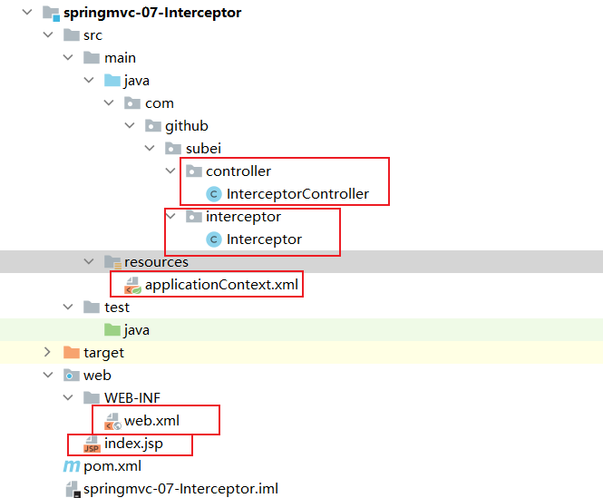

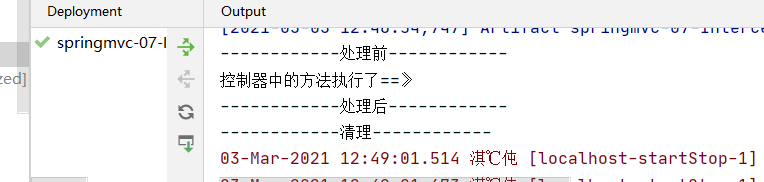

### 3.验证用户是否登录

> **实现思路**

1. 有一个登陆页面，需要写一个 controller 访问页面。
2. 登陆页面有一提交表单的动作。需要在 controller 中处理。判断用户名密码是否正确。如果正确，向 session 中写入用户信息。返回登陆成功。
3. 拦截用户请求，判断用户是否登陆。如果用户已经登陆。放行， 如果用户未登陆，跳转到登陆页面

> **案例测试：**

1. 编写一个登陆页面  login.jsp

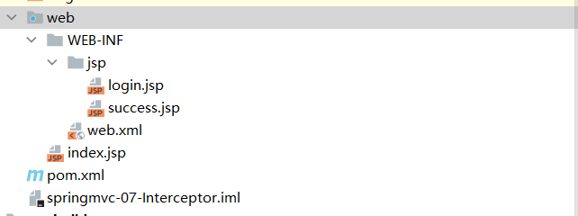

```jsp
<%@ page contentType="text/html;charset=UTF-8" language="java" %>
<html>
<head>
    <title>Title</title>
</head>

<h1>登录页面</h1>
<hr>

<body>
<form action="${pageContext.request.contextPath}/user/login">
    用户名：<input type="text" name="username"> <br>
    密码：<input type="password" name="pwd"> <br>
    <input type="submit" value="提交">
</form>
</body>
</html>
```

2. 编写一个 Controller 处理请求 

```java
package com.github.subei.controller;

import org.springframework.stereotype.Controller;
import org.springframework.web.bind.annotation.RequestMapping;

import javax.servlet.http.HttpSession;

@Controller
@RequestMapping("/user")
public class UserController {

    // 跳转到登陆页面
    @RequestMapping("/jumplogin")
    public String jumpLogin() throws Exception {
        return "login";
    }

    // 跳转到成功页面
    @RequestMapping("/jumpSuccess")
    public String jumpSuccess() throws Exception {
        return "success";
    }

    // 登陆提交
    @RequestMapping("/login")
    public String login(HttpSession session, String username, String pwd) throws Exception {
        // 向session记录用户身份信息
        System.out.println("接收前端==="+username);
        session.setAttribute("user", username);
        return "success";
    }

    // 退出登陆
    @RequestMapping("logout")
    public String logout(HttpSession session) throws Exception {
        // session 过期
        session.invalidate();
        return "login";
    }
}
```

3. 编写一个登陆成功的页面 success.jsp 

```jsp
<%@ page contentType="text/html;charset=UTF-8" language="java" %>
<html>
<head>
    <title>Title</title>
</head>
<body>

<h1>登录成功页面</h1>
<hr>

${user}
<a href="${pageContext.request.contextPath}/user/logout">注销</a>
</body>
</html>
```

4. 在 index.jsp 页面上测试跳转！启动 Tomcat 测试，未登录也可以进入主页！ 

```jsp
<%@ page contentType="text/html;charset=UTF-8" language="java" %>
<html>
  <head>
    <title>$Title$</title>
  </head>
  <body>
  <%--登录--%>
  <a href="${pageContext.request.contextPath}/user/jumplogin">登录</a>
  <a href="${pageContext.request.contextPath}/user/jumpSuccess">成功页面</a>
  </body>
</html>
```

5. 编写用户登录拦截器 

```java
package com.github.subei.interceptor;

import org.springframework.web.servlet.HandlerInterceptor;
import org.springframework.web.servlet.ModelAndView;

import javax.servlet.ServletException;
import javax.servlet.http.HttpServletRequest;
import javax.servlet.http.HttpServletResponse;
import javax.servlet.http.HttpSession;
import java.io.IOException;

public class LoginInterceptor implements HandlerInterceptor {

    public boolean preHandle(HttpServletRequest request, HttpServletResponse response, Object handler) throws ServletException, IOException, ServletException, IOException {
        // 如果是登陆页面则放行
        System.out.println("uri: " + request.getRequestURI());
        if (request.getRequestURI().contains("login")) {
            return true;
        }

        HttpSession session = request.getSession();

        // 如果用户已登陆也放行
        if(session.getAttribute("user") != null) {
            return true;
        }

        // 用户没有登陆跳转到登陆页面
        request.getRequestDispatcher("/WEB-INF/jsp/login.jsp").forward(request, response);
        return false;
    }

    public void postHandle(HttpServletRequest httpServletRequest, HttpServletResponse httpServletResponse, Object o, ModelAndView modelAndView) throws Exception {

    }

    public void afterCompletion(HttpServletRequest httpServletRequest, HttpServletResponse httpServletResponse, Object o, Exception e) throws Exception {

    }
}
```

6. 在 applicationContext.xml 的配置文件中注册拦截器 

```jsp
    <!--关于拦截器的配置-->
    <mvc:interceptors>
        <mvc:interceptor>
            <!--/** 包括路径及其子路径-->
            <!--/admin/* 拦截的是/admin/add等等这种 , /admin/add/user不会被拦截-->
            <!--/admin/** 拦截的是/admin/下的所有-->
            <mvc:mapping path="/**"/>
            <!--bean配置的就是拦截器-->
            <bean class="com.github.subei.interceptor.LoginInterceptor"/>
        </mvc:interceptor>
    </mvc:interceptors>
```

7. 再次重启 Tomcat 测试！ 

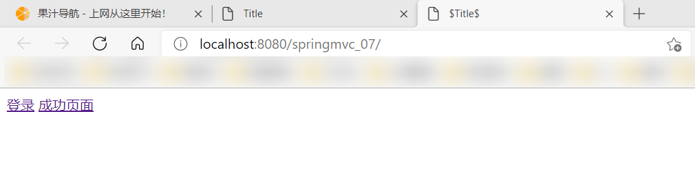

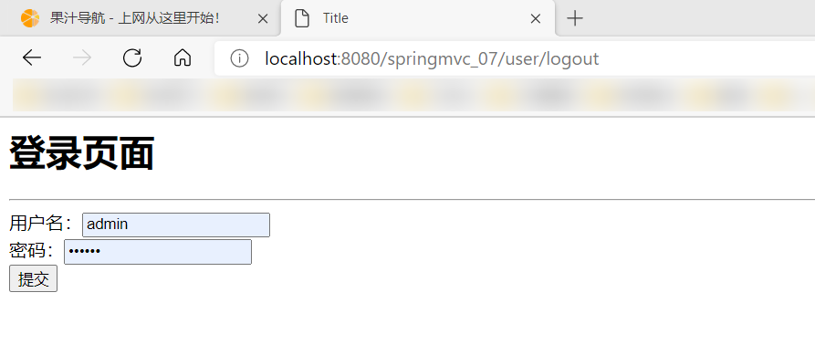

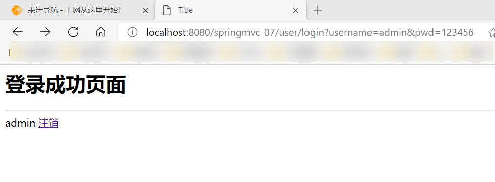


## 10、文件上传和下载

### 1.准备工作 

- 文件上传是项目开发中最常见的功能之一 , springMVC 可以很好的支持文件上传，但是 SpringMVC 上下文中默认没有装配 MultipartResolver，因此默认情况下其不能处理文件上传工作。如果想使用 Spring 的文件上传功能，则需要在上下文中配置 MultipartResolver。

- 前端表单要求：为了能上传文件，必须将表单的 method 设置为 POST，并将 enctype 设置为 multipart/form-data。只有在这样的情况下，浏览器才会把用户选择的文件以二进制数据发送给服务器；

> **对表单中的 enctype 属性做个详细的说明：**

- application/x-www = form-urlencoded：默认方式，只处理表单域中的 value 属性值，采用这种编码方式的表单会将表单域中的值处理成 URL 编码方式。
- multipart/form-data：这种编码方式会以二进制流的方式来处理表单数据，这种编码方式会把文件域指定文件的内容也封装到请求参数中，不会对字符编码。
- text/plain：除了把空格转换为 "+" 号外，其他字符都不做编码处理，这种方式适用直接通过表单发送邮件。

```jsp
<form action="" enctype="multipart/form-data" method="post">
   <input type="file" name="file"/>
   <input type="submit">
</form>
```

> 一旦设置了 enctype 为 multipart/form-data，浏览器即会采用二进制流的方式来处理表单数据，而对于文件上传的处理则涉及在服务器端解析原始的 HTTP 响应。在 2003 年，Apache Software Foundation 发布了开源的 Commons FileUpload 组件，其很快成为 Servlet/JSP 程序员上传文件的最佳选择。

- Servlet3.0 规范已经提供方法来处理文件上传，但这种上传需要在 Servlet 中完成。
- 而 Spring MVC 则提供了更简单的封装。
- Spring MVC 为文件上传提供了直接的支持，这种支持是用即插即用的 MultipartResolver 实现的。
- Spring MVC 使用 Apache Commons FileUpload 技术实现了一个 MultipartResolver 实现类：
- CommonsMultipartResolver。因此，SpringMVC 的文件上传还需要依赖 Apache Commons FileUpload 的组件。

### 2.文件上传

1. 导入文件上传的 jar 包，commons-fileupload ， Maven 会自动帮我们导入依赖包 commons-io 包； 

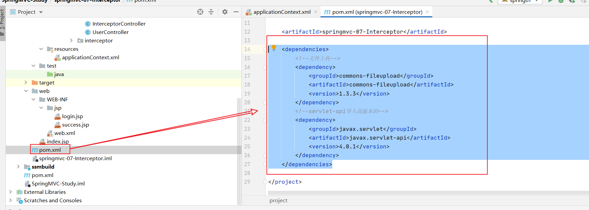

```xml
    <dependencies>
        <!--文件上传-->
        <dependency>
            <groupId>commons-fileupload</groupId>
            <artifactId>commons-fileupload</artifactId>
            <version>1.3.3</version>
        </dependency>
        <dependency>
            <groupId>javax.servlet</groupId>
            <artifactId>javax.servlet-api</artifactId>
            <version>3.0.1</version>
            <scope>provided</scope>
        </dependency>
        
    </dependencies>
```

2. 配置 bean：multipartResolver，在 applicationContext.xml 中配置。

> 【**注意！！！这个 bena 的 id 必须为：multipartResolver ， 否则上传文件会报 400 的错误！在这里栽过坑, 教训！**】

```xml
<?xml version="1.0" encoding="UTF-8"?>
<beans xmlns="http://www.springframework.org/schema/beans"
       xmlns:xsi="http://www.w3.org/2001/XMLSchema-instance"
       xmlns:context="http://www.springframework.org/schema/context"
       xmlns:mvc="http://www.springframework.org/schema/mvc"
       xsi:schemaLocation="http://www.springframework.org/schema/beans
       http://www.springframework.org/schema/beans/spring-beans.xsd
       http://www.springframework.org/schema/context
       https://www.springframework.org/schema/context/spring-context.xsd
       http://www.springframework.org/schema/mvc
       https://www.springframework.org/schema/mvc/spring-mvc.xsd">

    <!-- 自动扫描指定的包，下面所有注解类交给IOC容器管理 -->
    <context:component-scan base-package="com.github.subei.controller"/>
    <!-- 静态资源过滤 -->
    <mvc:default-servlet-handler />
    <mvc:annotation-driven />

    <!-- 视图解析器 -->
    <bean class="org.springframework.web.servlet.view.InternalResourceViewResolver"
          id="internalResourceViewResolver">
        <!-- 前缀 -->
        <property name="prefix" value="/WEB-INF/jsp/" />
        <!-- 后缀 -->
        <property name="suffix" value=".jsp" />
    </bean>

    <!--文件上传配置-->
    <bean id="multipartResolver"  class="org.springframework.web.multipart.commons.CommonsMultipartResolver">
        <!-- 请求的编码格式，必须和jSP的pageEncoding属性一致，以便正确读取表单的内容，默认为ISO-8859-1 -->
        <property name="defaultEncoding" value="utf-8"/>
        <!-- 上传文件大小上限，单位为字节（10485760=10M） -->
        <property name="maxUploadSize" value="10485760"/>
        <property name="maxInMemorySize" value="40960"/>
    </bean>

    <!-- JSON乱码问题 -->
    <mvc:annotation-driven>
        <mvc:message-converters register-defaults="true">
            <bean class="org.springframework.http.converter.StringHttpMessageConverter">
                <constructor-arg value="UTF-8"/>
            </bean>
            <bean class="org.springframework.http.converter.json.MappingJackson2HttpMessageConverter">
                <property name="objectMapper">
                    <bean class="org.springframework.http.converter.json.Jackson2ObjectMapperFactoryBean">
                        <property name="failOnEmptyBeans" value="false"/>
                    </bean>
                </property>
            </bean>
        </mvc:message-converters>
    </mvc:annotation-driven>

</beans>
```

> CommonsMultipartFile 的 常用方法：

- **String getOriginalFilename()：获取上传文件的原名**
- **InputStream getInputStream()：获取文件流**
- **void transferTo(File dest)：将上传文件保存到一个目录文件中**

3. 编写前端页面，index.jsp

```jsp
<%@ page contentType="text/html;charset=UTF-8" language="java" %>
<html>
  <head>
    <title>$Title$</title>
  </head>
  <body>
  <form action="${pageContext.request.contextPath}/upload" enctype="multipart/form-data" method="post">
    <input type="file" name="file"/>
    <input type="submit" value="upload">
  </form>
  </body>
</html>
```

4. **Controller** 

```java
package com.github.subei.controller;

import org.springframework.stereotype.Controller;
import org.springframework.web.bind.annotation.RequestMapping;
import org.springframework.web.bind.annotation.RequestParam;
import org.springframework.web.multipart.commons.CommonsMultipartFile;

import javax.servlet.http.HttpServletRequest;
import java.io.*;

@Controller
public class FileController {
    // @RequestParam("file") 将name=file控件得到的文件封装成CommonsMultipartFile 对象
    // 批量上传CommonsMultipartFile则为数组即可
    @RequestMapping("/upload")
    public String fileUpload(@RequestParam("file") CommonsMultipartFile file , HttpServletRequest request) throws IOException {

        // 获取文件名 : file.getOriginalFilename();
        String uploadFileName = file.getOriginalFilename();

        // 如果文件名为空，直接回到首页！
        if ("".equals(uploadFileName)){
            return "redirect:/index.jsp";
        }
        System.out.println("上传文件名 : "+uploadFileName);

        // 上传路径保存设置
        String path = request.getServletContext().getRealPath("/upload");
        // 如果路径不存在，创建一个
        File realPath = new File(path);
        if (!realPath.exists()){
            realPath.mkdir();
        }
        System.out.println("上传文件保存地址："+realPath);

        InputStream is = file.getInputStream(); //文件输入流
        OutputStream os = new FileOutputStream(new File(realPath,uploadFileName)); //文件输出流

        // 读取写出
        int len=0;
        byte[] buffer = new byte[1024];
        while ((len=is.read(buffer))!=-1){
            os.write(buffer,0,len);
            os.flush();
        }
        os.close();
        is.close();
        return "redirect:/index.jsp";
    }
}
```

#### 报错：Cannot resolve method 'getServletContext' in 'HttpServletRequest'

- 这个报错原因是因为 pom 依赖导包 `servlet-api` 的版本错误：
- 在调用 request.getServletContext()的方法需要 `servlet-api` 的版本 3.0 以上才可以。
- 所以把之前的版本修改一下就可以了，修改为 4.0.1 版本即可。如下：

```xml
        <dependency>
            <groupId>javax.servlet</groupId>
            <artifactId>javax.servlet-api</artifactId>
            <version>4.0.1</version>
            <scope>provided</scope>
        </dependency>
```

5. 测试上传，成功！！！

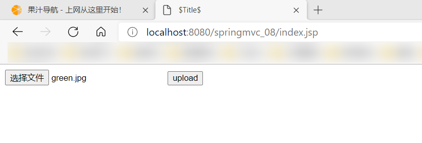

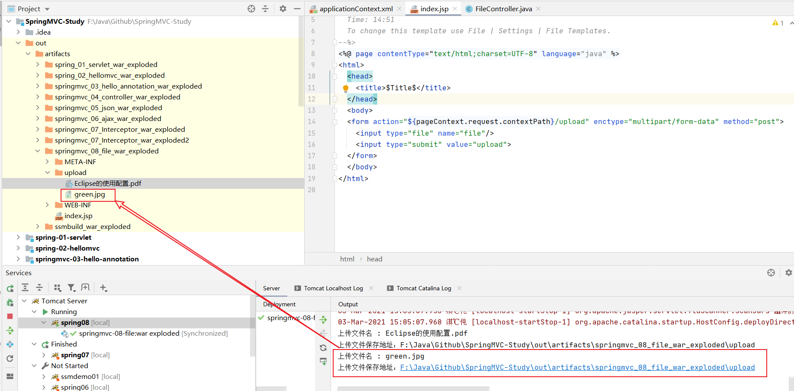

---

> **采用 [[file]].Transto 来保存上传的文件**

1. 编写 Controller

```java
    /*
     * 采用file.Transto 来保存上传的文件
     */
    @RequestMapping("/upload2")
    public String  fileUpload2(@RequestParam("file") CommonsMultipartFile file, HttpServletRequest request) throws IOException {

        //上传路径保存设置
        String path = request.getServletContext().getRealPath("/upload");
        File realPath = new File(path);
        if (!realPath.exists()){
            realPath.mkdir();
        }
        //上传文件地址
        System.out.println("上传文件保存地址："+realPath);

        //通过CommonsMultipartFile的方法直接写文件（注意这个时候）
        file.transferTo(new File(realPath +"/"+ file.getOriginalFilename()));

        return "redirect:/index.jsp";
    }
```

2. 前端表单提交地址修改

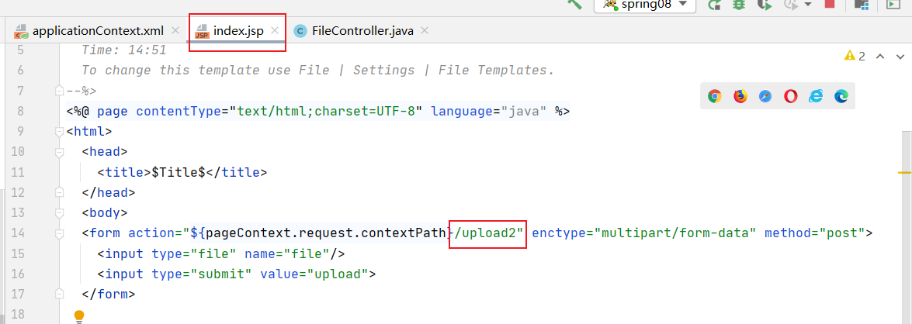

3. 访问提交测试，OK！

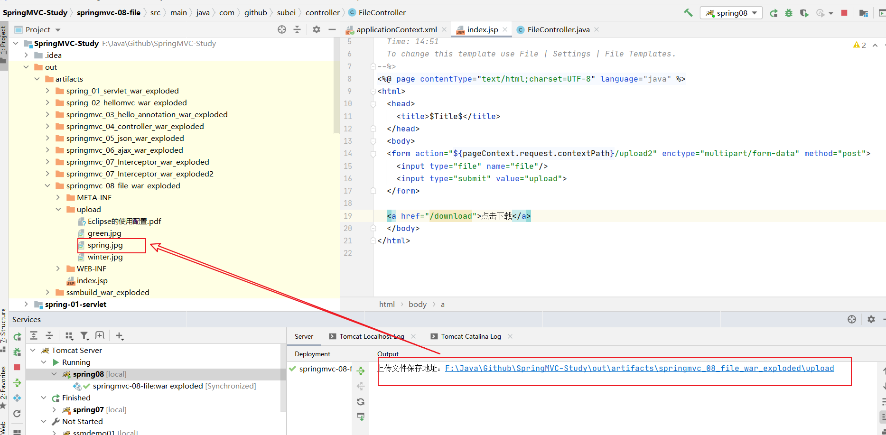

### 3.文件下载

> **文件下载步骤：**

1. 设置 response 响应头

2. 读取文件 -- InputStream

3. 写出文件 -- OutputStream

4. 执行操作

5. 关闭流 （先开后关）

> **代码实现：** 

```java
@RequestMapping(value="/download")
public String downloads(HttpServletResponse response ,HttpServletRequest request) throws Exception{
   // 要下载的图片地址
   String  path = request.getServletContext().getRealPath("/upload");
   String  fileName = "winter.jpg";

   // 1、设置response 响应头
   response.reset(); // 设置页面不缓存,清空buffer
   response.setCharacterEncoding("UTF-8"); // 字符编码
   response.setContentType("multipart/form-data"); // 二进制传输数据
   // 设置响应头
   response.setHeader("Content-Disposition",
           "attachment;fileName="+URLEncoder.encode(fileName, "UTF-8"));

   File file = new File(path,fileName);
   // 2、 读取文件--输入流
   InputStream input=new FileInputStream(file);
   // 3、 写出文件--输出流
   OutputStream out = response.getOutputStream();

   byte[] buff =new byte[1024];
   int index=0;
   // 4、执行 写出操作
   while((index= input.read(buff))!= -1){
       out.write(buff, 0, index);
       out.flush();
  }
   out.close();
   input.close();
   return null;
}
```

- 前端

```jsp
  <a href="${pageContext.request.contextPath}/download">点击下载</a>
```

- 测试，文件下载 OK 

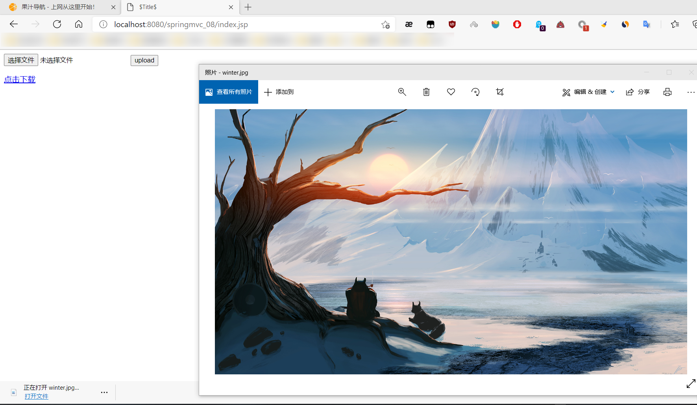

## 相关笔记
- [[Spring学习笔记]]
