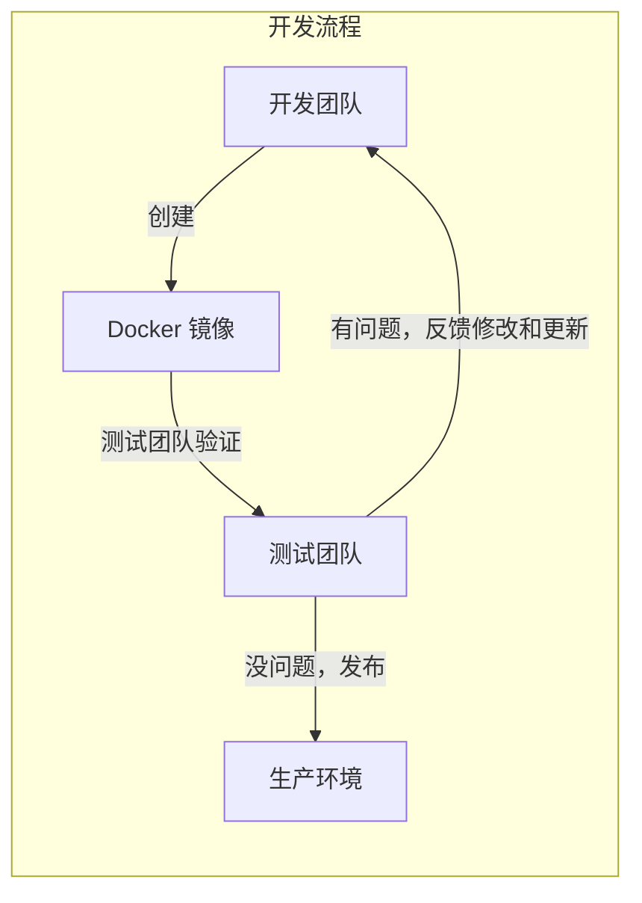
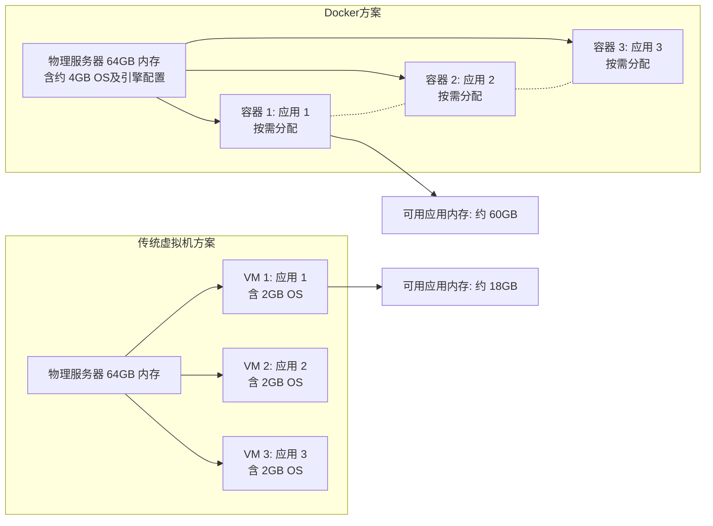
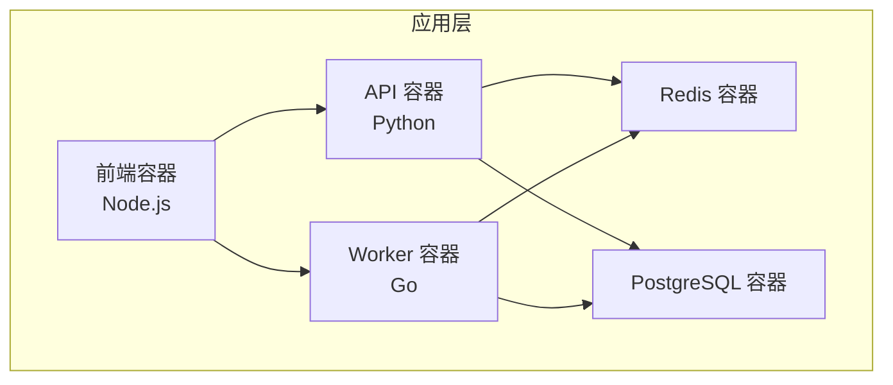

# 1.3 为什么要用 Docker

> **来源**：Docker 入门教程


## 一、没有 Docker 的世界

在 Docker 出现之前，软件开发和运维面临着诸多棘手的问题。先来看三个典型的痛点场景。

### 场景一：“在我电脑上明明能跑”

```text
周五下午 5:00
├── 开发者：代码写完了，本地测试通过，提交！🎉
├── 周一早上 9:00
│   └── 测试："这个功能在测试环境跑不起来"
└── 开发者："不可能，在我电脑上明明能跑啊……"
```

这个问题通常由以下原因导致：

- Python/Node/Java 版本不一致
- 依赖库版本不一致
- 操作系统配置不一致
- 某些环境变量没有设置
- “哦，忘了说我本地装了个 XXX”

### 场景二：环境配置的噩梦

```bash
新同事入职
├── Day 1：领电脑，配环境
├── Day 2：继续配环境，遇到问题
├── Day 3：换种方法配环境
├── Day 4：问老同事怎么配的，他也忘了
└── Day 5：终于能跑起来了！但不知道为什么……
```

### 场景三：服务器迁移的恐惧

```bash
运维："我们需要把服务迁移到新服务器"
开发："旧服务器上的配置文档在哪？"
运维："当时是一个已经离职的同事配的……"
所有人：😱
```


## 二、Docker 如何解决这些问题

Docker 通过 **“一次构建，到处运行”** 的核心理念，从根本上改变了软件交付的方式。



### 三、Docker 的核心优势

#### 1. 环境一致性

Docker 镜像包含了应用运行所需的大部分用户态依赖：代码、运行时、系统工具、库和默认配置。它不包含宿主机内核，也不能消除 CPU 架构、内核能力、外部服务、网络、卷和运行时配置差异。这意味着：

- ✅ 开发环境和生产环境可以显著减少差异
- ✅ 大幅降低“在我机器上能跑”的问题
- ✅ 新人入职，一条命令就能启动开发环境

```bash
# 新同事入职第一天

$ git clone https://github.com/company/project.git
$ docker compose up

# 完整的开发环境就准备好了
```

#### 2. 秒级启动

传统虚拟机启动需要几分钟（引导操作系统），而 Docker 容器启动通常只需要**几秒甚至几百毫秒**。

实测数据：

| 启动内容 | 虚拟机 | Docker 容器 |
|---|---|---|
| 空系统 | ~60 秒 | ~0.5 秒 |
| MySQL | ~90 秒 | ~3 秒 |
| 完整 Web 应用 | ~120 秒 | ~5 秒 |

这个差异对以下场景尤为重要：

- **CI/CD 流水线**：每次构建节省几分钟，一天累积下来就是几小时
- **弹性扩容**：流量高峰时能快速启动更多实例
- **开发体验**：快速重启服务进行调试

#### 3. 资源效率

Docker 容器共享宿主机内核，无需为每个应用运行完整的操作系统。以一台 64GB 内存的物理服务器为例：

| 方案 | 内存分配 | 可用应用内存 |
|---|---|---|
| **传统虚拟机** | 每个 VM 含约 2GB OS，3 个 VM 损耗约 6GB | **约 18GB** |
| **Docker 容器** | OS 及引擎约 4GB | **约 60GB** |



#### 4. 持续交付和部署

Docker 完美契合 DevOps 的工作流程：


使用 [Dockerfile](https://yeasy.github.io/docker_practice/04_image/4.5_build.html) 定义镜像构建过程，使得：

- 构建过程**可重复、可追溯**
- 任何人都能从代码重建完全相同的镜像
- 配合 GitHub Actions 等 CI 系统实现自动化

#### 5. 轻松迁移

Docker 可以在几乎任何平台上运行：

- ✅ 本地开发机（macOS、Windows、Linux）
- ✅ 公有云（AWS、Azure、GCP、阿里云、腾讯云）
- ✅ 私有云和自建数据中心
- ✅ 边缘设备和 IoT

**同一个镜像，在任何地方运行结果都一致。**

#### 6. 微服务架构的基石

现代微服务架构几乎都依赖容器技术。Docker 让你可以：

- **隔离服务**：每个服务运行在独立容器中，互不干扰
- **独立扩展**：哪个服务负载高，就单独扩展哪个
- **独立部署**：更新一个服务不影响其他服务
- **技术多样**：不同服务可以用不同语言和框架




## 四、Docker 不适合的场景

Docker 并非银弹，以下场景可能不太适合：

- **需要完全隔离的场景**：容器共享宿主机内核，隔离性不如虚拟机。如果需要运行不受信任的代码，虚拟机可能更安全
- **需要特殊内核的场景**：容器使用宿主机内核。如果应用需要特定版本的内核或内核模块，可能需要虚拟机
- **Windows 原生应用**：虽然 Docker 支持 Windows 容器，但生态不如 Linux 容器成熟
- **桌面应用**：Docker 主要面向服务端应用。桌面 GUI 应用的容器化虽然可行，但通常得不偿失


## 五、与传统虚拟机的对比总结

| 特性 | Docker 容器 | 传统虚拟机 |
|---|---|---|
| **启动速度** | 秒级 | 分钟级 |
| **资源占用** | MB 级别 | GB 级别 |
| **性能** | 接近原生（损耗约 0-5%） | 有明显损耗（5-20%） |
| **隔离级别** | 进程级隔离 | 完全隔离（硬件虚拟化） |
| **单机数量** | 可运行上千个 | 通常几十个 |
| **适用场景** | 微服务、CI/CD、开发环境 | 多租户、高安全需求场景 |

> 总结来说，Docker 的最大贡献不仅是技术本身，更是它**让容器技术从系统管理员的工具变成了每个开发者都能使用的标准工具**。
