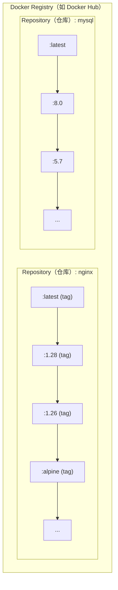
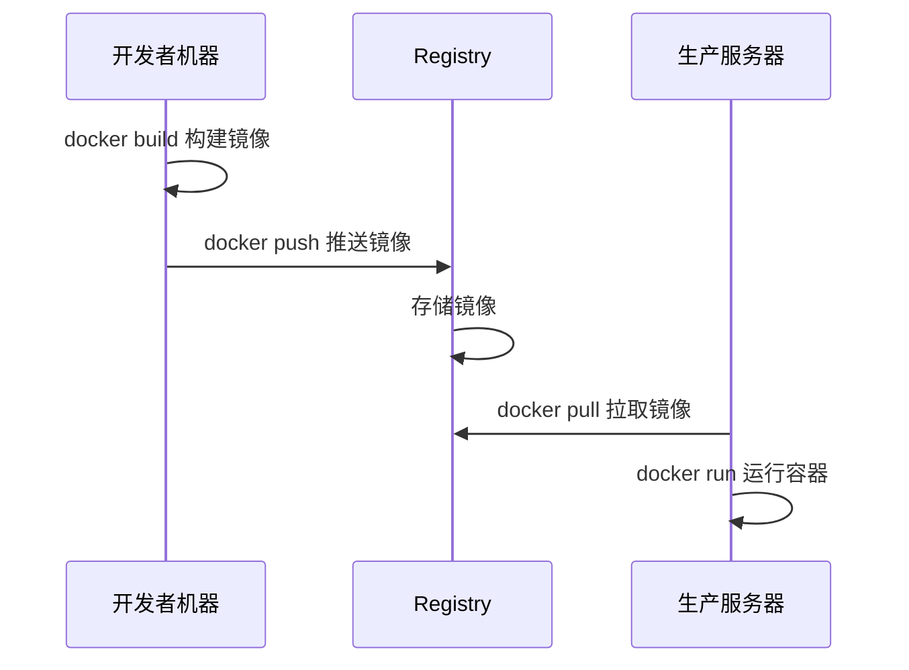

# 2.3 仓库

> **来源**：Docker 入门教程
> **版本说明**：本节示例基于 Docker v29.x 编写。示例中的版本号（如 `nginx:1.28`、`mysql:8.4` 等）为演示用途，实际使用时请访问 [Docker Hub](https://hub.docker.com/) 确认最新版本。


## 一、一句话理解 Registry

> **Docker Registry 是存储和分发 Docker 镜像的服务，类似于代码的 GitHub 或包管理的 npm。**

镜像构建完成后，可以在当前机器上运行。但如果需要在其他服务器上使用这个镜像，就需要一个集中的存储和分发服务——这就是 Docker Registry。


## 二、核心概念

### 2.1 Registry、仓库、标签的关系

Docker Registry 中可以包含多个 Repository（仓库），每个 Repository 可以包含多个 Tag（标签）。



| 概念 | 说明 | 示例 |
|---|---|---|
| **Registry** | 存储镜像的服务 | Docker Hub、ghcr.io |
| **Repository（仓库）** | 同一软件的镜像集合 | `nginx`、`mysql`、`mycompany/myapp` |
| **Tag（标签）** | 仓库内的版本标识 | `latest`、`1.28`、`alpine` |

### 2.2 镜像的完整名称

一个完整的 Docker 镜像名称由 Registry 地址、用户名/组织名、仓库名和标签组成：

```bash
[registry 地址/][用户名/]仓库名[:标签]
```

**示例**：

```bash
# 完整格式
registry.example.com/mycompany/myapp:v1.2.3
│                    │         │     │
│                    │         │     └── 标签
│                    │         └── 仓库名
│                    └── 用户名/组织名
└── Registry 地址

# Docker Hub 官方镜像（省略 registry 和用户名）
nginx:1.28
ubuntu:24.04

# Docker Hub 用户镜像
jwilder/nginx-proxy:latest

# 其他 Registry
ghcr.io/username/myapp:v1.0
```

> 💡 如果不指定 Registry 地址，默认使用 Docker Hub。如果不指定标签，默认使用 `latest`。


## 三、公共 Registry 服务

### 3.1 默认的 Docker Hub

[Docker Hub](https://hub.docker.com/) 是最大的公共 Registry，也是 Docker 的默认 Registry。

**特点**：

- 拥有大量[官方镜像](https://hub.docker.com/search?q=&type=image&image_filter=official)（nginx、mysql、redis 等）
- 免费账户可以创建公开仓库
- 免费个人账户可创建 1 个私有仓库

```bash
# 从 Docker Hub 拉取镜像
$ docker pull nginx              # 官方镜像
$ docker pull bitnami/redis      # 第三方镜像

# 推送镜像到 Docker Hub
$ docker login
$ docker push username/myapp:v1.0
```

### 3.2 其他公共 Registry

| Registry | 地址 | 说明 |
|---|---|---|
| **GitHub Container Registry** | ghcr.io | GitHub 提供，与 GitHub Actions 集成好 |
| **Google Artifact Registry** | LOCATION-docker.pkg.dev | Google Cloud 当前推荐 |
| **Quay.io** | quay.io | Red Hat 提供 |
| **阿里云容器镜像服务** | registry.cn-*.aliyuncs.com | 国内访问快 |
| **腾讯云容器镜像服务** | ccr.ccs.tencentyun.com | 国内访问快 |


## 四、镜像加速器

由于网络原因，在国内直接访问 Docker Hub 可能会很慢。可以配置**镜像加速器（Registry Mirror）** 来加速下载：

```jsonc
// /etc/docker/daemon.json
{
  "registry-mirrors": [
    "https://your-accelerator-url"
  ]
}
```

> ⚠️ 镜像加速器的可用性经常变化，使用前建议先测试是否可用。


## 五、私有 Registry

出于安全和隐私的考虑，企业往往需要搭建自己的私有 Registry。

### 5.1 官方 Registry 镜像

Docker 官方提供了 [registry](https://hub.docker.com/_/registry/) 镜像，可以快速搭建私有 Registry：

```bash
# 启动一个本地 Registry
$ docker run -d -p 5000:5000 --name registry registry:2

# 推送镜像到本地 Registry
$ docker tag myapp:v1.0 localhost:5000/myapp:v1.0
$ docker push localhost:5000/myapp:v1.0

# 从本地 Registry 拉取
$ docker pull localhost:5000/myapp:v1.0
```

### 5.2 企业级解决方案

| 方案 | 特点 |
|---|---|
| **[Harbor](https://goharbor.io/)** | CNCF 项目，功能全面（用户管理、漏洞扫描、镜像签名） |
| **[Nexus Repository](https://yeasy.github.io/docker_practice/06_repository/6.4_nexus3_registry.html)** | 支持多种制品类型（Docker、Maven、npm 等） |
| **云厂商服务** | 阿里云 ACR、腾讯云 TCR、AWS ECR 等 |

**选型建议**：

- **小团队**：官方 Registry，够用即可
- **中大型团队**：推荐 Harbor，功能完善且开源免费
- **已使用云服务**：直接用云厂商的 Registry 服务更省心

## 六、镜像的推送和拉取

### 6.1 完整工作流程



### 6.2 常用命令

```bash
# 登录 Registry
$ docker login                      # 登录 Docker Hub
$ docker login registry.example.com # 登录其他 Registry

# 拉取镜像
$ docker pull nginx:1.28

# 标记镜像（准备推送）
$ docker tag myapp:latest registry.example.com/myteam/myapp:v1.0

# 推送镜像
$ docker push registry.example.com/myteam/myapp:v1.0

# 登出
$ docker logout
```


## 七、镜像的安全性

### 7.1 使用官方镜像

Docker Hub 的[官方镜像](https://hub.docker.com/search?q=&type=image&image_filter=official)（标有 “Official Image” 标识）经过 Docker 团队审核，相对更安全：

```bash
# ✅ 官方镜像
nginx
mysql
redis

# ⚠️ 第三方镜像（需要自行评估可信度）
bitnami/redis
someuser/myapp
```

### 7.2 镜像签名

Docker Content Trust（DCT）已被正式退役，建议使用 **Sigstore / Cosign** 进行镜像签名与验证：

```bash
# 准备镜像
$ export IMAGE=<你的仓库名>/nginx:1.28
$ docker pull nginx:1.28
$ docker tag nginx:1.28 $IMAGE
$ docker push $IMAGE

# 生成签名密钥（会生成 cosign.key / cosign.pub）
$ cosign generate-key-pair

# 使用 Cosign 签名与验证
$ cosign sign --key cosign.key $IMAGE
$ cosign verify --key cosign.pub $IMAGE
```

### 7.3 漏洞扫描

```bash
# 使用 Docker Scout 扫描镜像漏洞
$ docker scout cves nginx:latest

# 使用 Trivy（开源工具）
$ trivy image nginx:latest
```


## 本章小结

| 概念 | 类比 | 关键命令 |
|---|---|---|
| **Registry** | GitHub 服务器 | `docker login`、`docker logout` |
| **Repository** | GitHub 仓库 | `docker pull`、`docker push`、`docker tag` |
| **Tag** | Git 标签 | `docker image ls`、`docker images --digests` |
