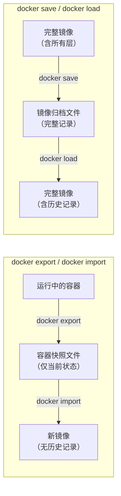

# 5.5 导出和导入

> **来源**：Docker 入门教程


## 一、概述

当需要迁移容器或者备份容器时，可以使用 Docker 的导入和导出功能：

| 命令 | 操作对象 | 说明 |
|---|---|---|
| `docker export` | **容器** | 导出容器快照到文件 |
| `docker import` | **快照文件** | 从快照文件导入为镜像 |


## 二、导出容器（docker export）

使用 `docker export` 命令导出本地某个容器：

```bash
# 查看所有容器（包括已停止的）
$ docker container ls -a
CONTAINER ID        IMAGE               COMMAND             CREATED             STATUS                    PORTS               NAMES
7691a814370e        ubuntu:24.04        "/bin/bash"         36 hours ago        Exited (0) 21 hours ago                       test

# 导出容器快照到本地文件
$ docker export 7691a814370e > ubuntu.tar
```

> **版本说明**：导出的容器快照不包含镜像版本历史，导入时可以自定义标签和版本号。


## 三、导入容器快照（docker import）

从容器快照文件中导入为镜像：

```bash
# 从标准输入导入
$ cat ubuntu.tar | docker import - test/ubuntu:v1.0

# 查看导入的镜像
$ docker image ls
REPOSITORY          TAG                 IMAGE ID            CREATED              SIZE
test/ubuntu         v1.0                9d37a6082e97        About a minute ago   171.3 MB
```

此外，也可以通过指定 URL 或者某个目录来导入：

```bash
# 从 URL 导入
$ docker import http://example.com/exampleimage.tgz example/imagerepo
```


## 四、export/import vs save/load 对比

| 特性 | `docker export` / `docker import` | `docker save` / `docker load` |
|---|---|---|
| **操作对象** | 容器 | 镜像 |
| **保存内容** | 容器快照（仅当前状态） | 完整镜像（含所有层和历史） |
| **历史记录** | ❌ 丢弃所有历史记录和元数据 | ✅ 保留完整记录 |
| **文件体积** | 较小 | 较大 |
| **导入时** | 可重新指定标签等元数据 | 使用原有元数据 |
| **适用场景** | 容器状态备份、迁移 | 镜像完整备份、分发 |




## 命令速查表

| 命令 | 说明 |
|---|---|
| `docker export <容器> > 文件.tar` | 导出容器快照 |
| `docker export <容器> \| gzip > 文件.tar.gz` | 导出并压缩容器快照 |
| `docker import < 文件.tar` | 从文件导入镜像 |
| `cat 文件.tar \| docker import - <镜像名:标签>` | 从标准输入导入镜像 |
| `docker import <URL> <镜像名:标签>` | 从 URL 导入镜像 |