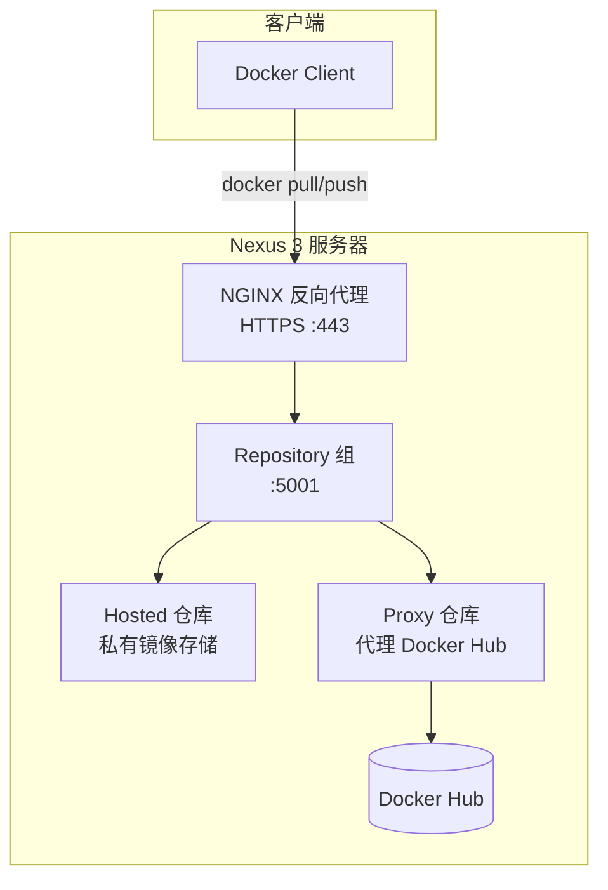

# 6.4 Nexus 3——企业级私有仓库

> **来源**：Docker 入门教程


## 一、为什么选择 Nexus 3

使用 Docker 官方 Registry 创建的仓库面临一些维护问题：

- 镜像删除后空间默认**不会自动回收**，需要执行命令回收空间并重启 Registry
- 功能相对单一，仅支持 Docker 镜像

**Nexus 3** 的优势：

- 全面支持 Docker 私有镜像
- 一个软件统一管理 **Docker**、**Maven**、**Yum**、**PyPI** 等多种制品
- 支持镜像回收、权限管理、代理缓存等企业级功能

> [Nexus 3 官方下载](https://www.sonatype.com/product/repository-oss-download)


## 二、启动 Nexus 容器

### 2.1 运行容器

```bash
$ docker run -d --name nexus3 --restart=always \
    -p 8081:8081 \
    --mount src=nexus-data,target=/nexus-data \
    sonatype/nexus3:3.69.0
```

> **版本说明**：
>
> - 使用具体版本号（如 `3.69.0`）而非 `latest`，避免意外升级带来的不兼容问题
> - 首次运行需等待 3-5 分钟

### 2.2 查看启动日志

```bash
$ docker logs nexus3 -f

2021-03-11 15:31:21,990+0000 INFO  [jetty-main-1] *SYSTEM org.sonatype.nexus.bootstrap.jetty.JettyServer -
-------------------------------------------------

Started Sonatype Nexus OSS 3.69.0

-------------------------------------------------
```

看到以上日志说明启动成功，使用浏览器打开 `http://YourIP:8081` 访问 Nexus。

### 2.3 获取初始密码

```bash
$ docker exec nexus3 cat /nexus-data/admin.password

9266139e-41a2-4abb-92ec-e4142a3532cb
```

- **默认账号**：`admin`
- **默认密码**：上述命令获取到的密码
- 首次登录需更改初始密码


## 三、创建仓库

### 3.1 创建 Docker 私有仓库

**路径**：`Repository → Repositories` → 点击 `Create repository` → 选择 `docker (hosted)`

| 配置项 | 说明 |
|---|---|
| **Name** | 仓库名称 |
| **HTTP** | 仓库访问端口（如 `5001`） |
| **Hosted → Deployment policy** | 必须选择 **Allow redeploy**，否则无法上传镜像 |

### 3.2 其他仓库类型

还可以创建以下类型的仓库：

| 仓库类型 | 说明 |
|---|---|
| **docker (proxy)** | 代理仓库，链接到 Docker Hub 作为缓存 |
| **docker (group)** | 组合仓库，将 hosted 与 proxy 合并为一个访问地址 |

**推荐组合**：创建 group 仓库将 hosted 和 proxy 添加在一起。客户端访问时默认从私有仓库下载，若没有则从 Docker Hub 下载并缓存到 Nexus 中。


## 四、添加访问权限

### 4.1 启用 Docker Bearer Token Realm

**路径**：`Security → Realms` → 把 **Docker Bearer Token Realm** 移到右侧框中 → 保存

### 4.2 创建角色

**路径**：`Security → Roles → Create role`

在 `Privileges` 选项搜索 `docker`，将相应的规则移动到右侧框 → 保存

### 4.3 创建用户

**路径**：`Security → Users → Create local user`

在 `Roles` 选项中选中刚才创建的角色 → 移动到右侧窗口 → 保存


## 五、NGINX 反向代理配置

> 证书生成方法请参见 [6.3 私有仓库高级配置](https://yeasy.github.io/docker_practice/06_repository/6.3_registry_auth.html)

```nginx
upstream register {
    server "YourHostName OR IP":5001;  # 端口为创建仓库时设置的 HTTP 端口
    check interval=3000 rise=2 fall=10 timeout=1000 type=http;
    check_http_send "HEAD / HTTP/1.0\r\n\r\n";
    check_http_expect_alive http_4xx;
}

server {
    server_name YourDomainName;  # 若无 DNS 解析，可删除此选项使用 IP 访问
    listen 443 ssl;

    ssl_certificate key/example.crt;
    ssl_certificate_key key/example.key;

    ssl_session_timeout  5m;
    ssl_protocols TLSv1.2 TLSv1.3;
    ssl_ciphers  HIGH:!aNULL:!MD5;
    ssl_prefer_server_ciphers   on;
    large_client_header_buffers 4 32k;
    client_max_body_size 300m;
    client_body_buffer_size 512k;
    proxy_connect_timeout 600;
    proxy_read_timeout   600;
    proxy_send_timeout   600;
    proxy_buffer_size    128k;
    proxy_buffers        4 64k;
    proxy_busy_buffers_size 128k;
    proxy_temp_file_write_size 512k;

    location / {
        proxy_set_header Host $host;
        proxy_set_header X-Forwarded-Proto $scheme;
        proxy_set_header X-Forwarded-Port $server_port;
        proxy_set_header X-Forwarded-For $proxy_add_x_forwarded_for;
        proxy_http_version 1.1;
        proxy_set_header Upgrade $http_upgrade;
        proxy_set_header Connection $connection_upgrade;
        proxy_redirect off;
        proxy_set_header X-Real-IP $remote_addr;
        proxy_pass http://register;
        proxy_read_timeout 900s;
    }
    error_page 500 502 503 504 /50x.html;
}
```


## 六、Docker 主机访问镜像仓库

### 6.1 不使用 SSL（非 HTTPS）

按照 [6.2 私有仓库](https://yeasy.github.io/docker_practice/06_repository/6.2_registry.html) 的方法，在 Docker 配置文件中添加非 HTTPS 仓库地址，然后重启 Docker。

### 6.2 使用 SSL（HTTPS）

```bash
# REGISTRY_HOST 填域名或主机 IP
$ REGISTRY_HOST=your-domain-or-host-ip
$ openssl s_client -showcerts -connect "$REGISTRY_HOST":443 </dev/null 2>/dev/null | openssl x509 -outform PEM > ca.crt
$ cat ca.crt | sudo tee -a /etc/ssl/certs/ca-certificates.crt
$ sudo systemctl restart docker
```

### 6.3 测试连接

```bash
docker login $REGISTRY_HOST
```

输入 Nexus 中设置的用户名和密码进行测试。


## 七、命令速查

| 命令 | 说明 |
|---|---|
| `docker run -d --name nexus3 -p 8081:8081 sonatype/nexus3:3.69.0` | 启动 Nexus 容器 |
| `docker exec nexus3 cat /nexus-data/admin.password` | 获取初始密码 |
| `docker logs nexus3 -f` | 查看 Nexus 启动日志 |
| `docker login <仓库地址>` | 登录 Nexus 镜像仓库 |


## 八、架构概览




## 九、与其他方案对比

| 方案 | 适用场景 | 特点 |
|---|---|---|
| **Docker Hub** | 开源项目、个人学习 | 免费公开仓库，无需自建 |
| **Docker Registry** | 简单私有场景 | 最小化部署，功能基础 |
| **Registry + TLS/认证** | 生产环境私有仓库 | 安全配置，功能仍有限 |
| **Nexus 3 / Harbor** | 企业级部署 | 权限管理、备份、高可用、多制品类型 |
