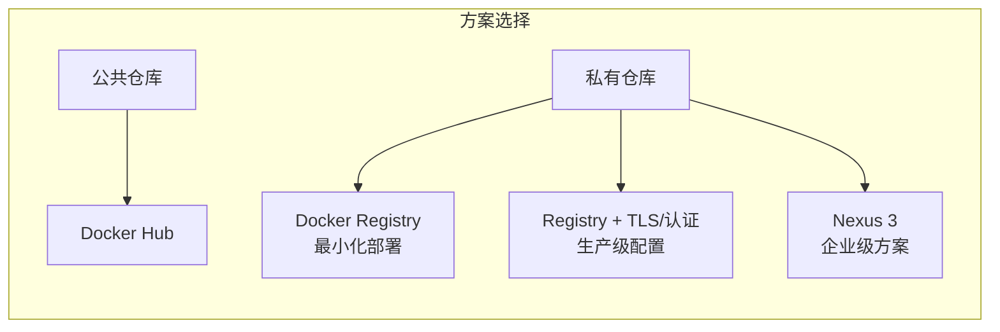

# 第六章：Docker 仓库——本章小结

> **来源**：Docker 入门教程

## 一、本章小结

本章介绍了 Docker Hub 的使用、私有仓库的搭建以及 Nexus 3 等企业级方案。

| 功能         | 说明                                                         |
| ------------ | ------------------------------------------------------------ |
| **官方镜像** | 优先使用的基础镜像，安全性更有保障                           |
| **拉取限制** | 匿名用户 100 次/6h，登录用户 200 次/6h                       |
| **安全**     | 推荐开启 2FA 并使用 Access Token 进行 CLI 登录               |
| **自动化**   | 支持 Webhooks 和自动构建（自动构建已弃用，计划 2027-04-01 退役） |

## 二、本章路径概览

## 三、方案选型建议

| 场景                  | 推荐方案            | 说明                               |
| --------------------- | ------------------- | ---------------------------------- |
| **开源项目/个人学习** | Docker Hub          | 免费公开仓库，无需自建             |
| **简单私有场景**      | Docker Registry     | 最小化部署，功能基础               |
| **生产环境私有仓库**  | Registry + TLS/认证 | 添加安全配置，支持 HTTPS 和认证    |
| **企业级部署**        | Nexus 3 / Harbor    | 权限管理、备份、高可用、多制品类型 |

## 四、延伸阅读

- [私有仓库：搭建自己的 Registry](https://yeasy.github.io/docker_practice/06_repository/6.2_registry.html)
- [私有仓库高级配置：TLS + 认证](https://yeasy.github.io/docker_practice/06_repository/6.3_registry_auth.html)
- [Nexus 3：企业级仓库管理](https://yeasy.github.io/docker_practice/06_repository/6.4_nexus3_registry.html)
- [镜像加速器：加速 Docker Hub 下载](https://yeasy.github.io/docker_practice/03_install/3.9_mirror.html)