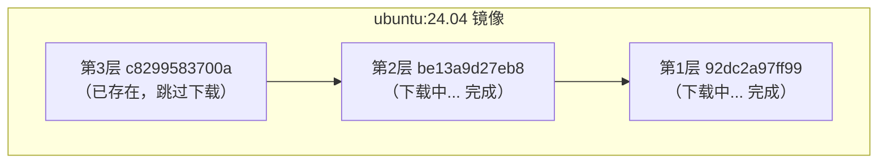

# 4.1 获取镜像

> **来源**：Docker 入门教程


## 版本号最佳实践

| 实践原则 | 说明 |
|---|---|
| **永远指定版本号** | 避免使用 `latest` 标签，应指定具体版本（如 `ubuntu:24.04`、`nginx:1.28`），确保镜像内容稳定一致 |
| **生产环境使用摘要** | 优先使用镜像摘要（SHA256）而非标签，如 `nginx@sha256:abc123...`，因为摘要不可变 |
| **定期评估依赖** | 即使指定了版本号，仍应定期检查依赖的基础镜像是否有安全更新 |


## 一、docker pull 命令

从镜像仓库获取镜像的命令是 `docker pull`：

```bash
docker pull [选项] [Registry地址/]仓库名[:标签]
```

### 1.1 镜像名称格式

Docker 镜像名称由 Registry 地址、用户名、仓库名和标签组成：

```text
docker.io / library / ubuntu : 24.04
    │           │         │      │
    │           │         │      └── 标签
    │           │         └── 仓库名
    │           └── 用户名（可省略）
    └── Registry 地址（可省略）
```

| 组成部分 | 说明 | 默认值 |
|---|---|---|
| Registry 地址 | 镜像仓库地址 | `docker.io`（Docker Hub） |
| 用户名 | 镜像所属用户/组织 | `library`（官方镜像） |
| 仓库名 | 镜像名称 | 必须指定 |
| 标签 | 版本标识 | `latest` |

### 1.2 示例

```bash
# 完整格式
$ docker pull docker.io/library/ubuntu:24.04

# 省略 Registry（默认 Docker Hub）
$ docker pull library/ubuntu:24.04

# 省略 library（官方镜像）
$ docker pull ubuntu:24.04

# 省略标签（默认 latest）
$ docker pull ubuntu

# 拉取第三方镜像
$ docker pull bitnami/redis:latest

# 从其他 Registry 拉取
$ docker pull ghcr.io/username/myapp:v1.0
```


## 二、下载过程解析

以 `ubuntu:24.04` 为例：

```bash
$ docker pull ubuntu:24.04
24.04: Pulling from library/ubuntu
92dc2a97ff99: Pull complete
be13a9d27eb8: Pull complete
c8299583700a: Pull complete
Digest: sha256:4bc3ae6596938cb0d9e5ac51a1152ec9dcac2a1c50829c74abd9c4361e321b26
Status: Downloaded newer image for ubuntu:24.04
docker.io/library/ubuntu:24.04
```

### 2.1 输出解读

| 输出内容 | 说明 |
|---|---|
| `Pulling from library/ubuntu` | 正在从官方 ubuntu 仓库拉取 |
| `92dc2a97ff99: Pull complete` | 各层的下载状态（显示层 ID 前 12 位） |
| `Digest: sha256:...` | 镜像内容的唯一摘要 |
| `docker.io/library/ubuntu:24.04` | 镜像的完整名称 |

### 2.2 分层下载

镜像是**分层下载**的：



如果本地已有相同的层，Docker 会跳过下载，节省带宽和时间。


## 三、常用选项

| 选项 | 说明 | 示例 |
|---|---|---|
| `--all-tags, -a` | 拉取所有标签 | `docker pull -a ubuntu` |
| `--platform` | 指定平台架构 | `docker pull --platform linux/arm64 nginx` |
| `--quiet, -q` | 静默模式 | `docker pull -q nginx` |

### 指定平台

在 Apple Silicon Mac 上拉取 x86 镜像：

```bash
docker pull --platform linux/amd64 nginx
```


## 四、拉取后运行

拉取镜像后，可以基于它启动容器：

```bash
# 拉取镜像
$ docker pull ubuntu:24.04

# 运行容器
$ docker run -it --rm ubuntu:24.04 bash
root@e7009c6ce357:/# cat /etc/os-release
PRETTY_NAME="Ubuntu 24.04 LTS"
...
root@e7009c6ce357:/# exit
```

| 参数 | 说明 |
|---|---|
| `-it` | 交互式终端模式 |
| `--rm` | 退出后自动删除容器 |
| `bash` | 启动命令 |

> 💡 `docker run` 在需要时会自动执行 `pull`，因此通常不需要单独执行 `docker pull`。


## 五、镜像加速

从 Docker Hub 下载可能较慢，可以配置镜像加速器：

```jsonc
// /etc/docker/daemon.json (Linux)
// ~/.docker/daemon.json (Docker Desktop)
{
  "registry-mirrors": [
    "https://your-accelerator-url"
  ]
}
```

配置后重启 Docker：

```bash
$ sudo systemctl restart docker   # Linux
# 或在 Docker Desktop 中重启
```


## 六、验证镜像完整性

### 6.1 查看镜像摘要

```bash
$ docker images --digests ubuntu
REPOSITORY   TAG     DIGEST                                                                    IMAGE ID
ubuntu       24.04   sha256:4bc3ae6596938cb0d9e5ac51a1152ec9dcac2a1c50829c74abd9c4361e321b26   ca2b0f26964c
```

### 6.2 使用摘要拉取

用摘要拉取可确保获取完全相同的镜像：

```bash
docker pull ubuntu@sha256:4bc3ae6596938cb0d9e5ac51a1152ec9dcac2a1c50829c74abd9c4361e321b26
```

> 💡 **建议**：生产环境使用摘要而非标签，因为标签可能被覆盖，摘要则是不可变的。


## 七、常见问题

### Q：下载速度很慢

1. 配置镜像加速器
2. 检查网络连接
3. 尝试拉取更小的镜像版本（如 `alpine` 变体）

### Q：提示镜像不存在

```text
Error: pull access denied, repository does not exist
```

可能原因：

- 镜像名拼写错误
- 私有镜像未登录（需要 `docker login`）
- 镜像确实不存在

### Q：磁盘空间不足

```bash
# 清理未使用的镜像
$ docker image prune

# 清理所有未使用资源
$ docker system prune
```
