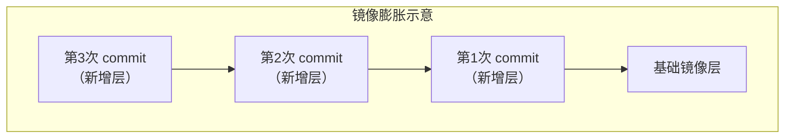

# 4.4 利用 commit 理解镜像构成

> **来源**：Docker 入门教程
> **版本说明**：以下示例中 `nginx` 镜像使用默认 `latest` 标签。生产环境建议指定具体版本号（如 `nginx:1.28`），以避免镜像更新带来的不兼容性。


## 适用场景

`docker commit` 除了帮助理解镜像分层之外，在少数场景下也可用于留存现场，例如事后分析被入侵容器的状态。

> ⚠️ **日常定制镜像不应依赖 `docker commit`，而应使用 Dockerfile。** 如果你是初学者，可以先学习本节理解镜像分层概念，后续再学习 Dockerfile。

**前置知识**：

- 镜像是多层存储，每一层是在前一层的基础上进行的修改
- 容器同样也是多层存储，它以镜像层为只读基础，并在最上方增加一层供运行时写入的容器层


## 一、启动并修改容器

以定制一个 Web 服务器为例子，来讲解镜像是如何构建的。

### 1.1 启动 Nginx 容器

```bash
docker run --name webserver -d -p 8080:80 nginx
```

这条命令会用 `nginx` 镜像启动一个容器，命名为 `webserver`：

| 参数 | 说明 |
|---|---|
| `--name webserver` | 容器命名为 `webserver` |
| `-d` | 后台运行 |
| `-p 8080:80` | 将宿主机 `8080` 端口映射到容器 `80` 端口 |

如果是在本机运行的 Docker，访问 `http://localhost:8080` 即可看到默认的 Nginx 欢迎页面。如果是在虚拟机、云服务器上，将 `localhost` 替换为对应的 IP 地址。


### 1.2 进入容器修改内容

假设我们想把欢迎页面改为 "Hello, Docker!"：

```bash
$ docker exec -it webserver bash
root@3729b97e8226:/# echo '<h1>Hello, Docker!</h1>' > /usr/share/nginx/html/index.html
root@3729b97e8226:/# exit
exit
```

以交互式终端方式进入 `webserver` 容器，用 `<h1>Hello, Docker!</h1>` 覆盖了 `/usr/share/nginx/html/index.html` 的内容。

刷新浏览器，内容被改变：


### 1.3 查看容器改动

通过 `docker diff` 命令查看容器的存储层改动：

```bash
$ docker diff webserver
C /root
A /root/.bash_history
C /run
C /usr
C /usr/share
C /usr/share/nginx
C /usr/share/nginx/html
C /usr/share/nginx/html/index.html
C /var
C /var/cache
C /var/cache/nginx
A /var/cache/nginx/client_temp
A /var/cache/nginx/fastcgi_temp
A /var/cache/nginx/proxy_temp
A /var/cache/nginx/scgi_temp
A /var/cache/nginx/uwsgi_temp
```

其中：

- **A（Added）** ：新增
- **C（Changed）** ：变更
- **D（Deleted）** ：删除


## 二、使用 commit 保存镜像

### 2.1 提交镜像

`docker commit` 的语法格式为：

```bash
docker commit [选项] <容器ID或容器名> [<仓库名>[:<标签>]]
```

```bash
$ docker commit \
    --author "Tao Wang <twang2218@gmail.com>" \
    --message "修改了默认网页" \
    webserver \
    nginx:v2
sha256:07e33465974800ce65751acc279adc6ed2dc5ed4e0838f8b86f0c87aa1795214
```

| 参数 | 说明 |
|---|---|
| `--author` | 指定修改的作者 |
| `--message` | 记录本次修改的内容 |

> 默认情况下，`docker commit` 会在提交时暂停容器进程，以降低数据损坏的风险；如果确实不希望暂停，可以显式指定 `--no-pause`。

### 2.2 查看新镜像

```bash
$ docker image ls nginx
REPOSITORY          TAG                 IMAGE ID            CREATED             SIZE
nginx               v2                  07e334659748        9 seconds ago       181.5 MB
nginx               1.30                05a60462f8ba        12 days ago         181.5 MB
nginx               latest              e43d811ce2f4        4 weeks ago         181.5 MB
```

### 2.3 查看镜像历史

用 `docker history` 查看镜像内的历史记录：

```bash
$ docker history nginx:v2
IMAGE               CREATED             CREATED BY                                      SIZE                COMMENT
07e334659748        54 seconds ago      nginx -g daemon off;                            95 B                修改了默认网页
e43d811ce2f4        4 weeks ago         /bin/sh -c #(nop)  CMD ["nginx" "-g" "daemon    0 B
<missing>           4 weeks ago         /bin/sh -c #(nop)  EXPOSE 443/tcp 80/tcp        0 B
<missing>           4 weeks ago         /bin/sh -c ln -sf /dev/stdout /var/log/nginx/   22 B
<missing>           4 weeks ago         /bin/sh -c apt-key adv --keyserver hkp://pgp.   58.46 MB
<missing>           4 weeks ago         /bin/sh -c #(nop)  ENV NGINX_VERSION=1.27.0-1   0 B
<missing>           4 weeks ago         /bin/sh -c #(nop)  MAINTAINER NGINX Docker Ma   0 B
<missing>           4 weeks ago         /bin/sh -c #(nop)  CMD ["/bin/bash"]            0 B
<missing>           4 weeks ago         /bin/sh -c #(nop) ADD file:23aa4f893e3288698c   123 MB
```

可以看到我们刚刚提交出来的新层（最上面一行）。

### 2.4 运行新镜像

```bash
docker run --name web2 -d -p 81:80 nginx:v2
```

访问 `http://localhost:81`，看到的内容与之前修改后的 `webserver` 一样。


## 三、慎用 docker commit

使用 `docker commit` 命令虽然可以比较直观地帮助理解镜像分层存储的概念，但**它不应作为常规定制镜像的方式**。

### 3.1 镜像臃肿

如果仔细观察之前的 `docker diff webserver` 的结果，你会发现除了真正想要修改的 `/usr/share/nginx/html/index.html` 文件外，由于命令的执行，还有很多文件被改动或添加了。如果是安装软件包、编译构建，会有大量无关内容被添加进来，导致镜像极为臃肿。

### 3.2 黑箱镜像

使用 `docker commit` 意味着所有对镜像的操作都是**黑箱操作**，生成的镜像也被称为**黑箱镜像**：

- 除了制作镜像的人，别人根本无从得知执行过什么命令
- 即使是制作镜像的人，过一段时间后也无法记清具体操作
- 这种黑箱镜像的维护工作非常痛苦

### 3.3 层数膨胀

回顾镜像的分层存储概念：

- 除当前层外，之前的每一层都不会发生改变
- 任何修改仅仅是在当前层进行标记、添加、修改，而不会改动上一层
- 每次使用 `docker commit` 修改，都会让镜像再膨胀一层
- 即使文件在更高层被删除，它们仍然存在于更低层中，只是在最终视图里被隐藏



> **结论**：日常定制镜像应使用 **Dockerfile**，把构建过程写成可重复执行、便于审查的文本。


## 命令速查表

| 命令 | 说明 |
|---|---|
| `docker diff <容器>` | 查看容器的文件系统改动 |
| `docker commit <容器> <镜像名:标签>` | 将容器保存为镜像 |
| `docker commit --author "xxx" --message "xxx" <容器> <镜像名:标签>` | 带作者和注释提交 |
| `docker history <镜像名:标签>` | 查看镜像的构建历史 |
