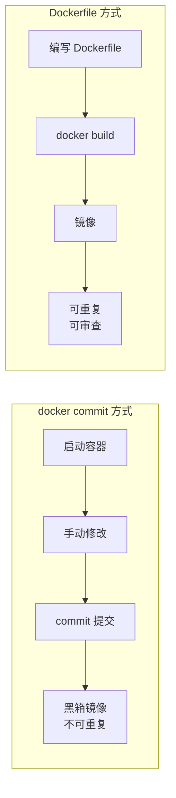

# 4.5 使用 Dockerfile 定制镜像

> **来源**：Docker 入门教程


## 概述

Dockerfile 是一个文本文件，其内包含了一条条的**指令（Instruction）**。其中，会修改文件系统的指令通常会创建新层；而 `LABEL`、`CMD` 这类只修改镜像元数据的指令，则不会新增文件系统层。每一条指令的内容，都是在描述该镜像应当如何构建。


## 一、使用 docker init 快速创建（推荐）

Docker 提供了 `docker init` 命令，可以根据项目类型自动生成 `Dockerfile`、`.dockerignore`、`compose.yaml` 和 `README.Docker.md` 等文件：

```bash
docker init
```

该命令会交互式地询问项目类型（支持 Go、Node.js、Python、Rust、Java、ASP.NET Core、PHP with Apache 等），并生成可作为起点的配置文件。


## 二、手动创建 Dockerfile

### 2.1 创建文件

在一个空白目录中，建立一个文本文件，并命名为 `Dockerfile`：

```bash
mkdir mynginx
cd mynginx
touch Dockerfile
```

### 2.2 编写内容

以定制 `nginx` 镜像为例：

```dockerfile
FROM nginx
RUN echo '<h1>Hello, Docker!</h1>' > /usr/share/nginx/html/index.html
```

这个 Dockerfile 很简单，一共就两行，涉及两条指令：`FROM` 和 `RUN`。

> **版本提示**：示例中 `FROM nginx` 使用的是 `latest` 标签。在实际应用中应使用明确的版本号（如 `FROM nginx:1.28`），以确保 Dockerfile 的可重现性和稳定性。


## 三、FROM——指定基础镜像

`FROM` 就是指定**基础镜像**，因此一个 `Dockerfile` 中 `FROM` 是必备的指令，并且必须是第一条**构建指令**（`ARG` 是唯一能写在 `FROM` 之前的指令）。

> **版本号最佳实践**：在 `FROM` 指令中**务必指定具体版本号**（如 `FROM ubuntu:24.04` 或 `FROM python:3.12-slim`），确保 Dockerfile 在不同时间、不同环境下构建出的镜像内容一致。

### 3.1 常用基础镜像

| 类型 | 示例 | 说明 |
|---|---|---|
| **服务类镜像** | `nginx`、`redis`、`mysql`、`tomcat` | 可直接拿来使用的服务 |
| **语言环境镜像** | `node`、`python`、`golang`、`eclipse-temurin` | 方便开发、构建、运行各语言应用 |
| **操作系统镜像** | `ubuntu`、`debian`、`alpine` | 提供更广阔的扩展空间 |

### 3.2 特殊镜像：scratch

`scratch` 是一个虚拟的概念，并不实际存在，表示一个**空白镜像**：

```dockerfile
FROM scratch
...
```

如果你以 `scratch` 为基础镜像，意味着你不以任何镜像为基础，接下来所写的指令将作为镜像第一层开始存在。对于 Linux 下静态编译的程序（如 Go 语言应用），并不需要有操作系统提供运行时支持，直接 `FROM scratch` 会让镜像体积更加小巧。


## 四、RUN——执行命令

`RUN` 指令是用来执行命令行命令的，是定制镜像时最常用的指令之一。

### 4.1 两种格式

| 格式 | 示例 | 说明 |
|---|---|---|
| **Shell 格式** | `RUN echo '<h1>Hello</h1>' > /usr/share/nginx/html/index.html` | 就像直接在命令行中输入的命令一样 |
| **Exec 格式** | `RUN ["可执行文件", "参数1", "参数2"]` | 更像是函数调用中的格式 |

### 4.2 注意事项

> ⚠️ 每一个 `RUN` 指令都会产生一个新的镜像层。为了减少镜像体积和层数，通常会将多个命令合并到一个 `RUN` 指令中执行。


## 五、构建镜像

### 5.1 基本构建命令

在 `Dockerfile` 文件所在目录执行：

```bash
docker build -t nginx:v3 .
```

命令格式：

```bash
docker build [选项] <上下文路径/URL/->
```

### 5.2 构建过程解析

```bash
$ docker build -t nginx:v3 .
Sending build context to Docker daemon 2.048 kB
Step 1 : FROM nginx
 ---> e43d811ce2f4
Step 2 : RUN echo '<h1>Hello, Docker!</h1>' > /usr/share/nginx/html/index.html
 ---> Running in 9cdc27646c7b
 ---> 44aa4490ce2c
Removing intermediate container 9cdc27646c7b
Successfully built 44aa4490ce2c
```

从输出中可以清晰地看到镜像的构建过程：

1. `Step 1`：基于 `nginx` 镜像
2. `Step 2`：`RUN` 指令启动了一个临时容器，执行命令，提交这一层，随后删除所用到的容器


## 六、镜像构建上下文

### 6.1 什么是上下文

`docker build` 命令最后的 `.` 是在指定**上下文路径（context）**，而不是 `Dockerfile` 所在路径。

**工作原理**：

- `docker build` 会打包上下文目录中的所有文件和子目录，发送给 Docker 引擎
- 构建器只能访问上下文范围内的文件
- `COPY`、`ADD` 等指令的源文件路径都以构建上下文为基准

```dockerfile
COPY ./package.json /app/
```

这复制的是**上下文目录**下的 `package.json`，而不是执行 `docker build` 命令所在目录下的 `package.json`。

### 6.2 .dockerignore 文件

如果目录下有些东西不希望作为上下文传递给 Docker 引擎，可以用 `.gitignore` 一样的语法写一个 `.dockerignore` 文件。

### 6.3 最佳实践

- 将 `Dockerfile` 置于一个空目录下，或者项目根目录下
- 只包含构建镜像所需的必要文件
- 使用 `.dockerignore` 排除不需要的文件


## 七、其他 docker build 用法

### 7.1 直接用 Git repo 进行构建

```bash
docker build https://github.com/user/myrepo.git#mybranch:docker
```

表示：把 Git 仓库作为构建上下文，使用 `mybranch` 分支中的 `docker/` 子目录来构建。

### 7.2 用给定的 tar 压缩包构建

```bash
docker build http://server/context.tar.gz
```

Docker 引擎会下载这个包，自动解压缩，以其作为上下文开始构建。

### 7.3 从标准输入中读取 Dockerfile 进行构建

```bash
docker build - < Dockerfile
```

或

```bash
cat Dockerfile | docker build -
```

这种形式没有上下文，因此不可以将本地文件 `COPY` 进镜像。

### 7.4 从标准输入中读取上下文压缩包进行构建

```bash
docker build - < context.tar.gz
```

如果标准输入的文件格式是 `gzip`、`bzip2` 或 `xz`，会将其视为上下文压缩包展开并开始构建。


## 八、常用指令速查

| 指令 | 用途 | 示例 |
|---|---|---|
| `FROM` | 指定基础镜像 | `FROM ubuntu:24.04` |
| `RUN` | 执行命令 | `RUN apt-get update` |
| `COPY` | 复制文件到镜像 | `COPY ./app /app` |
| `ADD` | 复制文件（支持解压） | `ADD app.tar.gz /app` |
| `CMD` | 容器启动命令 | `CMD ["nginx", "-g", "daemon off;"]` |
| `ENTRYPOINT` | 容器入口点 | `ENTRYPOINT ["/docker-entrypoint.sh"]` |
| `EXPOSE` | 暴露端口 | `EXPOSE 80` |
| `ENV` | 设置环境变量 | `ENV NODE_ENV=production` |
| `WORKDIR` | 设置工作目录 | `WORKDIR /app` |
| `USER` | 指定运行用户 | `USER nginx` |
| `ARG` | 构建参数 | `ARG VERSION=latest` |
| `LABEL` | 添加元数据 | `LABEL maintainer="example@email.com"` |


## 九、构建流程对比




## 十、总结

使用 Dockerfile 相比 `docker commit` 的优势：

| 特性 | docker commit | Dockerfile |
|---|---|---|
| **可重复性** | ❌ 不可重复 | ✅ 可重复构建 |
| **透明性** | ❌ 黑箱操作 | ✅ 构建过程可见 |
| **维护性** | ❌ 难以维护 | ✅ 易于维护 |
| **体积控制** | ❌ 易臃肿 | ✅ 可优化 |
| **版本控制** | ❌ 难以追踪 | ✅ 可纳入 Git |
| **团队协作** | ❌ 不可共享 | ✅ 可共享 |
