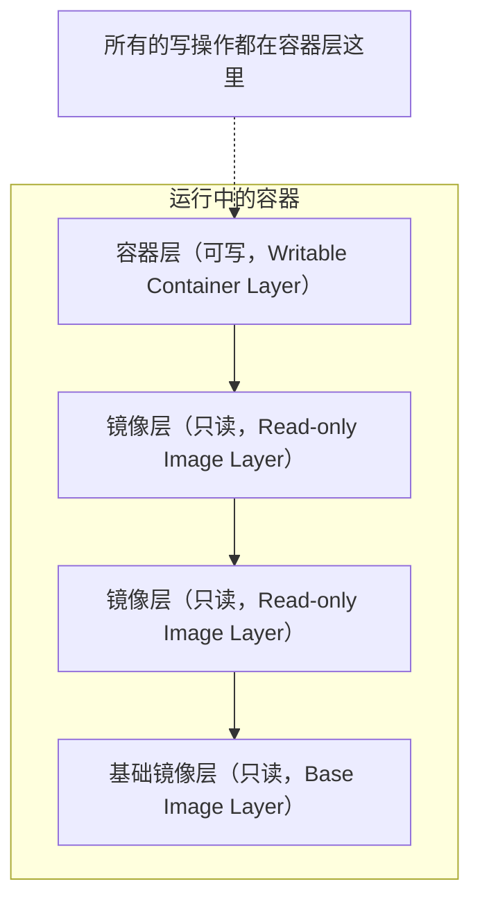

# 4.7 实现原理

> **来源**：Docker 入门教程


## 一、镜像与分层存储

Docker 镜像是怎么实现增量的修改和维护的？为什么容器启动如此之快？这一切都归功于 Docker 的镜像分层存储设计。

Docker 充分利用 **Union FS** 的技术，将镜像设计为**分层存储的架构**。Docker 镜像并不是一个单纯的文件，而是由**一组文件系统叠加构成的**。

- **基础镜像（Base Image）** ：最底层的镜像，通常是各种 Linux 发行版的 root 文件系统（如 Ubuntu、Debian、CentOS 等）
- **新建层（Layer）** ：在基础镜像之上构建新镜像时，Docker 不会复制基础镜像，而是在其之上新建一个层，仅记录文件变更

### 分层存储的优势

| 优势 | 说明 |
|---|---|
| **复用** | 多个镜像共享同一基础镜像时，宿主机只存储一份基础镜像 |
| **轻量分发** | 只传输和存储新增差异层，减少网络和存储开销 |


## 二、容器层与读写

> **关键概念：镜像的每一层都是只读的（Read-only）**

### 2.1 容器启动时发生了什么？

当容器启动时，Docker 会在镜像的最上层添加一个新的**可写层（Writable Layer）** ，通常被称为**容器层**。



### 2.2 读写操作流程

| 操作 | 机制 | 说明 |
|---|---|---|
| **读取文件** | 从上向下查找 | 从容器层开始，逐层向下寻找，直到找到该文件 |
| **修改文件** | **写时复制（Copy-on-Write，CoW）** | 将文件从下层镜像复制到容器层，然后修改副本 |
| **删除文件** | **白障（Whiteout）** | 在容器层创建特殊标记文件，在容器视图中隐藏下层文件，而非真正删除 |

### 2.3 关键结论

1. **容器删除后数据丢失**：所有数据修改都保存在容器层中，容器销毁时该层随之销毁（除非使用数据卷）

2. **镜像不可变**：无论容器里删除了多少文件，基础镜像的体积并不会减小，因为文件依然存在于底层的只读层中


## 三、内容寻址与镜像 ID

Docker 镜像的每一层都有一个唯一的 ID，该 ID 是根据该层的内容计算出来的 **SHA256 哈希值**。

| 特性 | 说明 |
|---|---|
| **内容即 ID** | 层的内容有任何变化，ID 就会改变 |
| **安全性** | 确保镜像内容的完整性，下载损坏则校验失败 |
| **去重** | 不同镜像包含相同层（ID 相同）时，本地只存储一份 |


## 四、联合文件系统（Union FS）

Docker 使用联合文件系统（Union FS）与写时复制策略来实现分层挂载。

### 4.1 技术演进

| 时期 | 实现方式 |
|---|---|
| **早期** | `aufs`、`devicemapper` |
| **主流** | `overlay2`、`btrfs`、`zfs` |
| **当前（Docker 29.0+）** | containerd image store，使用 snapshotter 管理层 |

> **版本背景**：Docker Engine 29.0.0 发布于 2025 年 11 月 10 日，是一个重要版本分界点。Docker Engine 29.0 及之后的全新安装默认使用 containerd image store；从更早版本升级的 daemon 会继续使用 legacy graph driver，直到显式启用 containerd image store。Docker Desktop 4.34 及之后也默认启用 containerd image store。

### 4.2 核心模型

无论底层实现细节如何变化，都遵循相同的核心模型：

```
┌─────────────────────────────────┐
│  容器层（可写）                  │  ← 写时复制
├─────────────────────────────────┤
│  镜像层 3（只读）               │
├─────────────────────────────────┤
│  镜像层 2（只读）               │
├─────────────────────────────────┤
│  镜像层 1 / 基础镜像（只读）    │
└─────────────────────────────────┘
          ▲
    Union FS / Snapshotter
```

> 想要深入了解 Overlay2 等文件系统的具体实现原理（包括 WorkDir、UpperDir、LowerDir 等底层细节），请参阅 **[第十二章 底层实现](https://yeasy.github.io/docker_practice/12_implementation/index.html)** 中的 **[联合文件系统](https://yeasy.github.io/docker_practice/12_implementation/12.4_ufs.html)** 章节。


## 核心概念速查

| 概念 | 说明 |
|---|---|
| **分层存储** | 镜像由多层只读层叠加构成 |
| **基础镜像** | 最底层的镜像层 |
| **容器层** | 容器启动时在镜像之上添加的可写层 |
| **写时复制（CoW）** | 修改文件时复制到容器层再修改 |
| **白障（Whiteout）** | 标记删除下层文件的特殊文件 |
| **内容寻址** | 层 ID = 内容的 SHA256 哈希值 |
| **Union FS** | 实现多层叠加挂载的文件系统技术 |
