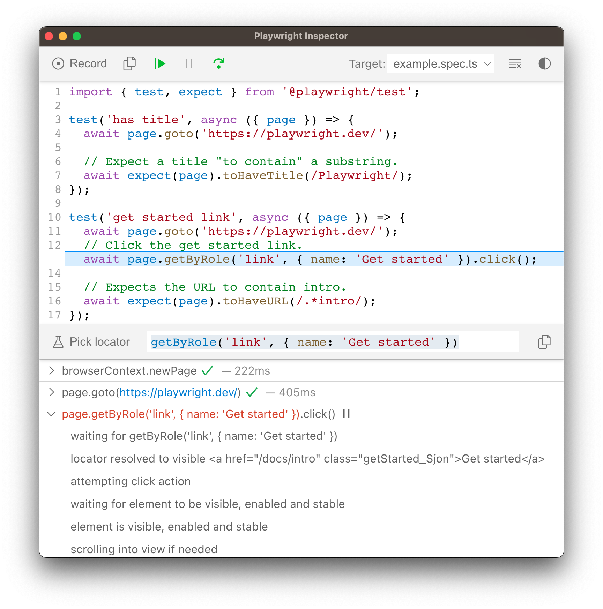
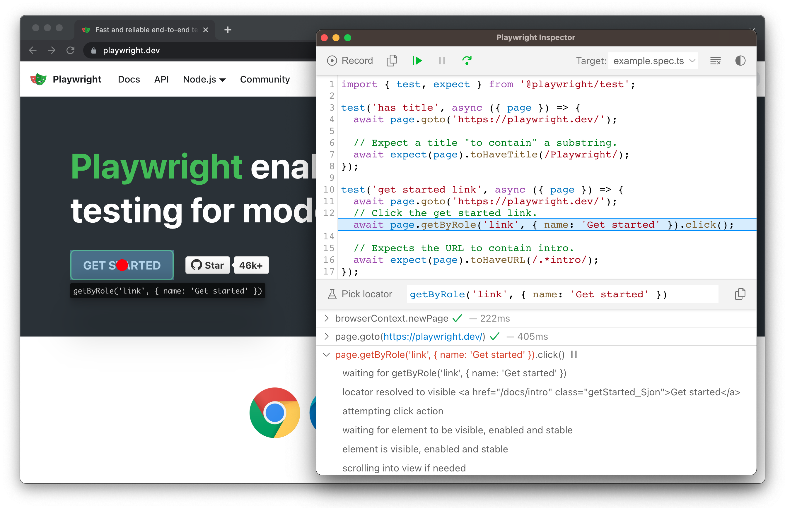
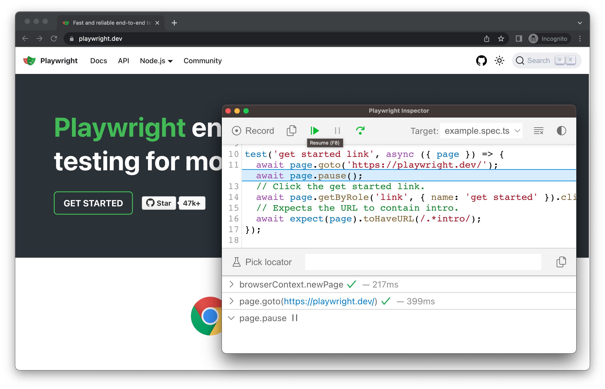
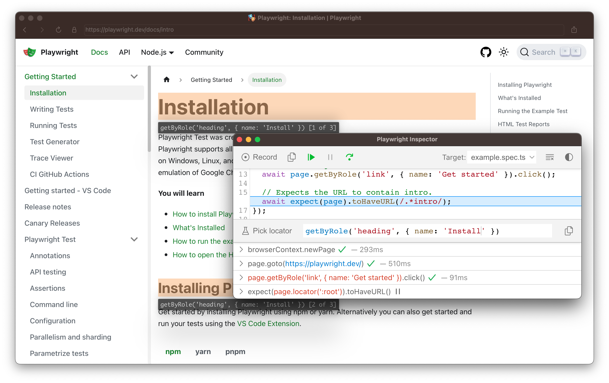
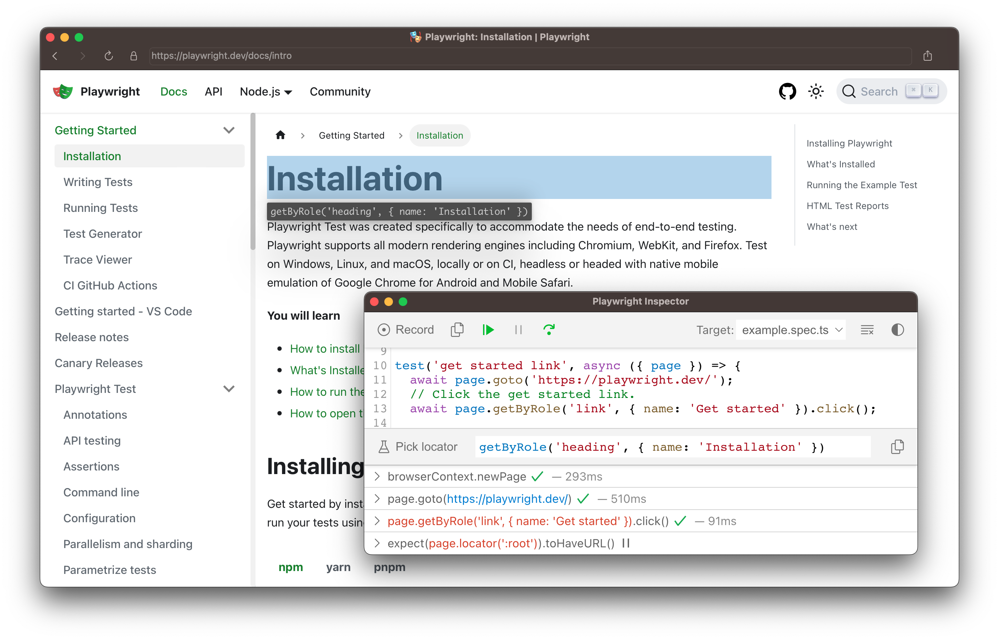
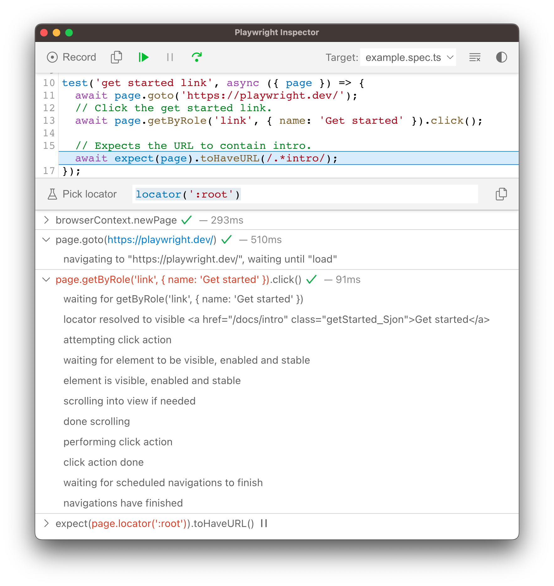
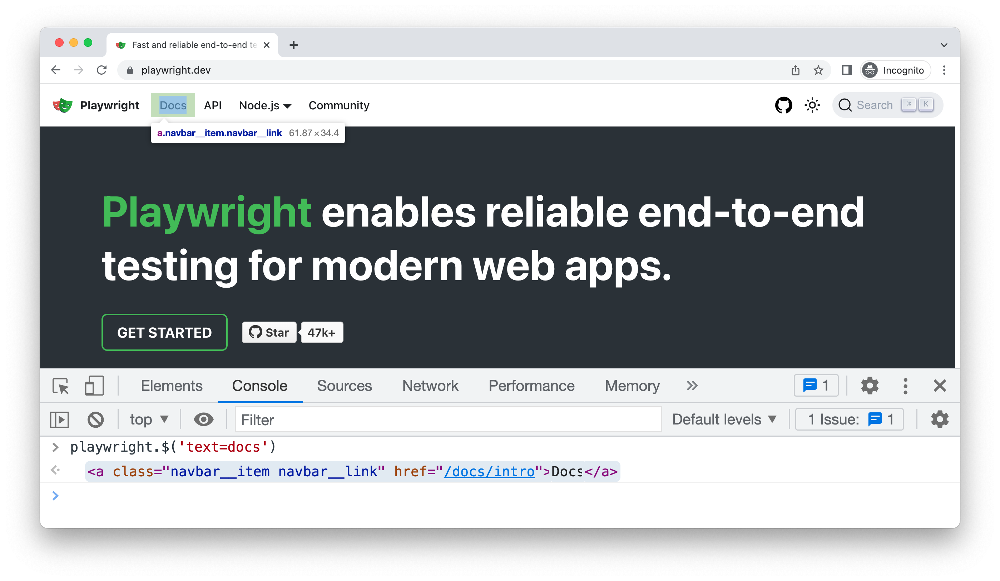

## Playwright Inspector

Playwright Inspector 是一个 GUI 工具，可帮助您调试 Playwright 测试。它允许您逐步执行测试、实时编辑定位器、选择定位器和查看可操作性日志。



### 以调试模式运行

设置 `PWDEBUG` 环境变量，以在调试模式下运行 Playwright 测试。这会配置 Playwright 进行调试并打开检查器。当设置 `PWDEBUG=1` 时，还会配置其他有用的默认值。

- 浏览器以有头模式启动
- 默认超时设置为 0 (= 无超时)

```bash
PWDEBUG=1 pytest -s
```

### 单步调试测试

您可以使用 Inspector 顶部的工具栏播放、暂停或逐步执行测试的每个操作。您可以看到当前操作在测试代码中高亮显示，匹配的元素在浏览器窗口中高亮显示。



### 从特定断点运行测试

为了加快调试过程，你可以在测试中添加一个 [page.pause()](https://playwright.cn/python/docs/api/class-page#page-pause) 方法。这样，你就无需单步执行测试中的每个动作，就能直接跳到你想要调试的地方。

```bash
page.pause()
```

添加 `page.pause()` 调用后，以调试模式运行测试。单击 Inspector 中的“Resume”按钮将运行测试，并且只在 `page.pause()` 处停止。



### 实时编辑定位器

在调试模式下运行期间，你可以实时编辑定位器。在“Pick Locator”按钮旁边有一个字段，显示了测试暂停时所在的 [定位器](https://playwright.cn/python/docs/locators)。你可以直接在 **Pick Locator** 字段中编辑此定位器，浏览器窗口中将高亮显示匹配的元素。



### 选择定位器

在调试期间，您可能需要选择一个更可靠的定位器。 您可以通过单击**“拾取定位器”**按钮并在浏览器窗口中的任何元素上悬停来实现此目的。 悬停在元素上时，您将看到定位此元素所需的代码在下方高亮显示。 单击浏览器中的元素会将定位器添加到字段中，然后您可以对其进行调整或将其复制到代码中。



Playwright 将检查你的页面并找出最佳定位器，优先使用 [role、text 和 test id 定位器](https://playwright.cn/python/docs/locators)。如果 Playwright 找到了多个与该定位器匹配的元素，它会改进定位器，使其具有鲁棒性并能唯一标识目标元素，因此你无需担心因定位器问题而导致测试失败。

### 可操作性日志

当 Playwright 在点击动作上暂停时，它已经执行了可在日志中找到的 [可操作性检查](https://playwright.cn/python/docs/actionability)。这可以帮助你了解测试期间发生了什么，以及 Playwright 做了什么或尝试做什么。日志会告诉你元素是否可见、可用且稳定，定位器是否解析到了元素、是否滚动到了视口中，等等。如果无法达到可操作性，它会将该动作显示为挂起（pending）状态。



## Trace Viewer

Playwright [Trace Viewer](https://playwright.cn/python/docs/trace-viewer) 是一个 GUI 工具，可让你浏览测试中记录的 Playwright 跟踪（trace）。你可以在左侧前后切换各个动作，并直观地查看动作发生时的情景。在屏幕中间，你可以看到该动作的 DOM 快照。在右侧，你可以看到动作的详细信息，例如时间、参数、返回值和日志。你还可以浏览控制台消息、网络请求和源代码。

## 浏览器开发者工具

在以调试模式运行并设置 `PWDEBUG=console` 时，开发者工具控制台中会提供一个 `playwright` 对象。开发者工具可以帮助您

- 检查 DOM 树并**查找元素选择器**
- 在执行期间**查看控制台日志**（或了解如何[通过 API 读取日志](https://playwright.cn/python/docs/api/class-page#page-event-console)）
- 检查**网络活动**和其他开发者工具功能



要使用浏览器开发者工具调试你的测试，请首先在测试中设置断点，使用 [page.pause()](https://playwright.cn/python/docs/api/class-page#page-pause) 方法暂停执行。

```python
page.pause()
```

在测试中设置断点后，您可以使用 `PWDEBUG=console` 运行测试。

```python
PWDEBUG=console pytest -s
```

Playwright 启动浏览器窗口后，您可以打开开发者工具。`playwright` 对象将在控制台面板中可用。

### playwright.$(selector)

使用实际的 Playwright 查询引擎查询 Playwright 选择器，例如

```python
playwright.$('.auth-form >> text=Log in');

<button>Log in</button>
```

#### playwright.$$(selector)

与 `playwright.$` 相同，但返回所有匹配的元素。

```bash
playwright.$$('li >> text=John')

[<li>, <li>, <li>, <li>]
```

#### playwright.inspect(selector)

在元素面板中显示元素。

```bash
playwright.inspect('text=Log in')
```

#### playwright.locator(selector)

创建定位器并查询匹配元素，例如

```python
playwright.locator('.auth-form', { hasText: 'Log in' });

Locator ()
  - element: button
  - elements: [button]
```

#### playwright.selector(element)

为给定元素生成选择器。例如，在元素面板中选择一个元素并传入 `$0`

```bash
playwright.selector($0)

"div[id="glow-ingress-block"] >> text=/.*Hello.*/"
```

## 详细 API 日志

Playwright 支持使用 `DEBUG` 环境变量进行详细日志记录。

```bash
DEBUG=pw:api pytest -s
```

## 有头模式 (Headed mode)

Playwright 默认以无头模式运行浏览器。要更改此行为，请使用 `headless: false` 作为启动选项。

你还可以使用 [slow_mo](https://playwright.cn/python/docs/api/class-browsertype#browser-type-launch-option-slow-mo) 选项来减慢执行速度（每个操作减慢 N 毫秒），以便在调试时跟上节奏。

```python
# Chromium, Firefox, or WebKit
chromium.launch(headless=False, slow_mo=100)
```

