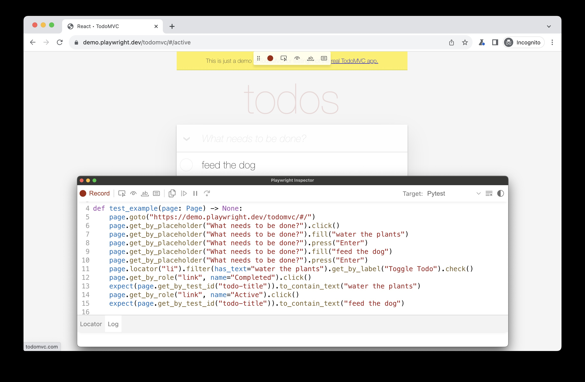
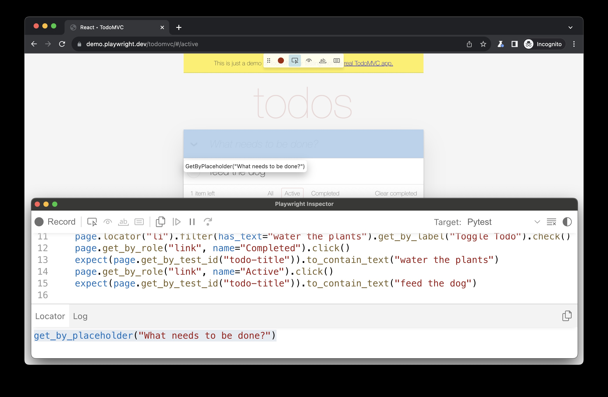
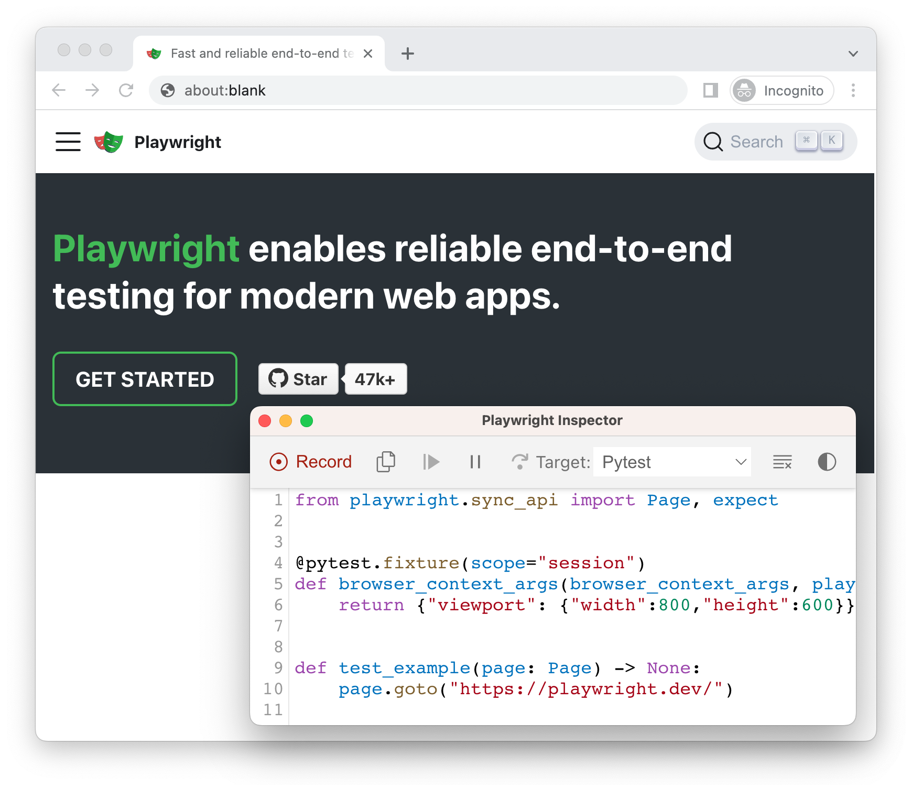
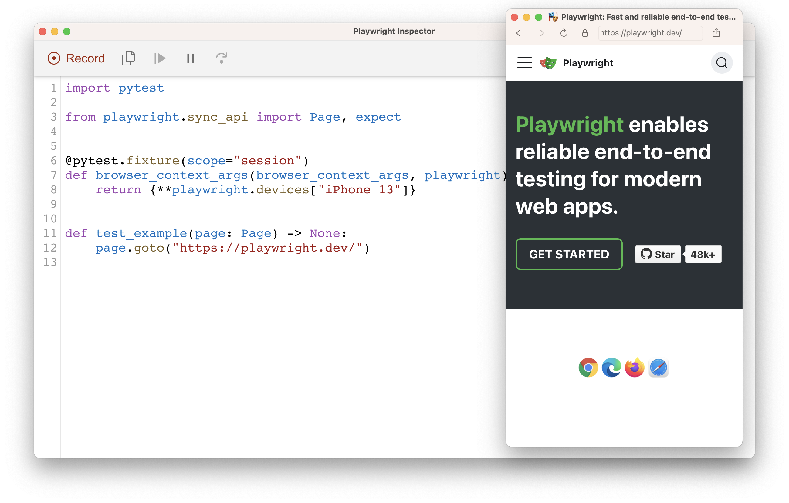
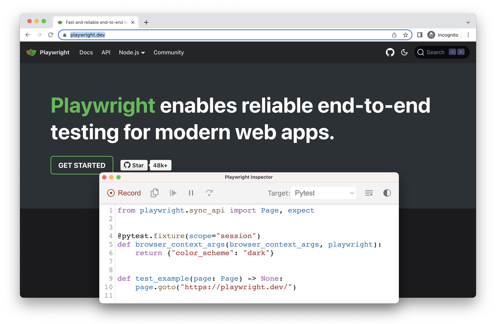
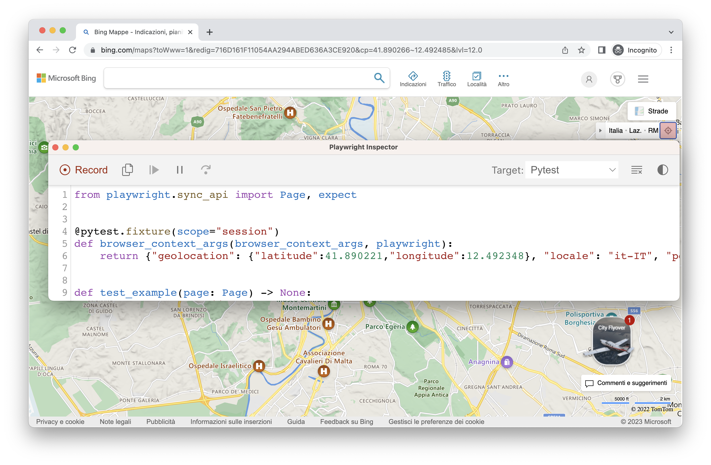
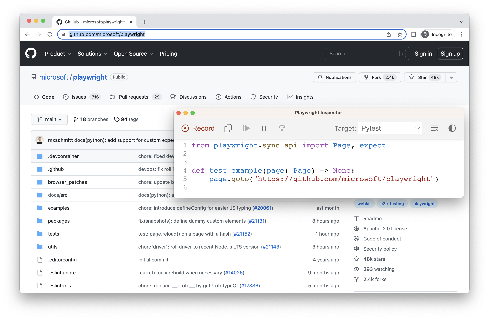
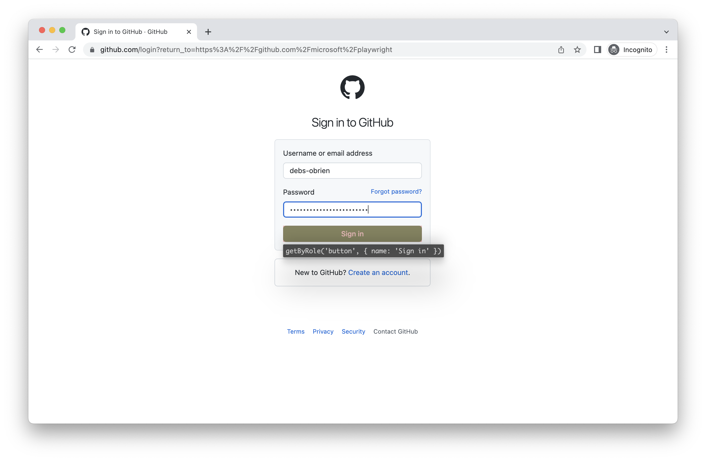
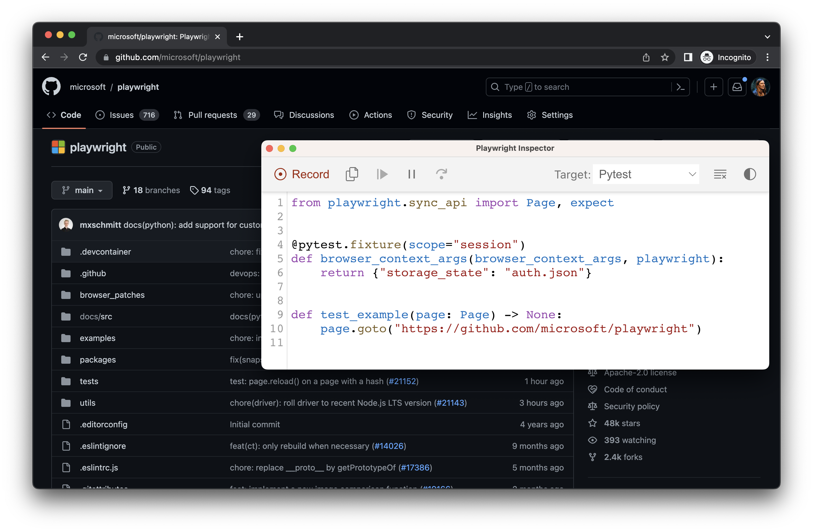

# 测试生成器

## 简介

Playwright 能够在你在浏览器中执行操作时自动为你生成测试，这是快速开始测试的绝佳方式。Playwright 会检查你的页面并找出最佳定位器，优先使用 [role、text 和 test id 定位器](https://playwright.cn/python/docs/locators)。如果生成器发现多个元素匹配该定位器，它会优化定位器，使其具备能够唯一标识目标元素的强健性。

## 使用 Playwright Inspector 生成测试

运行 `codegen` 命令时，将打开两个窗口，一个浏览器窗口，您可以在其中与要测试的网站交互，另一个是 Playwright Inspector 窗口，您可以在其中录制测试，然后将其复制到编辑器中。

### 运行 Codegen

使用 `codegen` 命令运行测试生成器，后跟你想为其生成测试的网站 URL。URL 是可选的，你也可以在不带 URL 的情况下运行该命令，然后直接在浏览器窗口中添加 URL。

```bash
playwright codegen demo.playwright.dev/todomvc
```

### 录制测试

运行 `codegen` 命令并在浏览器窗口中执行操作。Playwright 将生成用户交互的代码，你可以在 Playwright 检查器窗口中看到这些代码。完成测试录制后，停止录制并按下“**复制 (copy)**”按钮将生成的测试复制到你的编辑器中。

使用测试生成器，您可以记录

- 通过简单地与页面交互来执行点击或填充等操作
- 通过点击工具栏中的一个图标，然后点击页面上的一个元素进行断言。您可以选择
- `'断言可见性'` 以断言元素可见
- `'断言文本'` 以断言元素包含特定文本
- `'断言值'` 以断言元素具有特定值



与页面交互完成后，按**录制**按钮停止录制，并使用**复制**按钮将生成的代码复制到编辑器中。

使用**清除**按钮清除代码以重新开始录制。完成后，关闭 Playwright Inspector 窗口或停止终端命令。

### 生成定位器

你可以使用测试生成器生成 [定位器](https://playwright.cn/python/docs/locators)。

- 按`“录制”`按钮停止录制，然后将出现`“选择定位器”`按钮。
- 点击`“选择定位器”`按钮，然后将鼠标悬停在浏览器窗口中的元素上，以查看每个元素下方突出显示的定位器。
- 要选择定位器，请点击您要定位的元素，该定位器的代码将出现在“选择定位器”按钮旁边的字段中。
- 然后，您可以在此字段中编辑定位器以进行微调，或使用复制按钮复制并将其粘贴到代码中。



## 仿真

你可以使用测试生成器来生成使用模拟（emulation）的测试，从而为特定的视口、设备、配色方案生成测试，还可以模拟地理位置、语言或时区。测试生成器还可以生成保留已认证状态的测试。

### 仿真视口大小

Playwright 打开一个浏览器窗口，其视口设置为特定的宽度和高度，并且不响应式，因为测试需要在相同条件下运行。使用 `--viewport` 选项生成具有不同视口大小的测试。

```bash
playwright codegen --viewport-size="800,600" playwright.dev
```



### 仿真设备

使用 `--device` 选项模拟移动设备，录制脚本和测试，该选项设置视口大小和用户代理等。

```bash
playwright codegen --device="iPhone 13" playwright.dev
```



### 仿真配色方案

使用 `--color-scheme` 选项模拟配色方案，录制脚本和测试。

```bash
playwright codegen --color-scheme=dark playwright.dev
```



### 仿真地理位置、语言和时区

使用 `--timezone`、`--geolocation` 和 `--lang` 选项模拟时区、语言和位置，录制脚本和测试。页面打开后

1. 接受 cookie
2. 在右上方，点击“定位我”按钮以查看地理位置的实际效果。

```bash
playwright codegen --timezone="Europe/Rome" --geolocation="41.890221,12.492348" --lang="it-IT" bing.com/maps
```



### 保留认证状态

运行带有 `--save-storage` 的 `codegen`，以便在会话结束时保存 [cookies](https://mdn.org.cn/en-US/docs/Web/HTTP/Cookies)、[localStorage](https://mdn.org.cn/en-US/docs/Web/API/Window/localStorage) 和 [IndexedDB](https://mdn.org.cn/en-US/docs/Web/API/IndexedDB_API) 数据。这对于单独录制认证步骤并在以后录制更多测试时重用它非常有用。

```bash
playwright codegen github.com/microsoft/playwright --save-storage=auth.json
```



#### 登录

执行身份验证并关闭浏览器后，`auth.json` 将包含存储状态，您可以在测试中重复使用该状态。



请务必仅在本地使用 `auth.json`，因为它包含敏感信息。将其添加到您的 `.gitignore` 中，或者在生成测试完成后将其删除。

#### 加载认证状态

运行带有 `--load-storage` 的命令，以使用之前从 `auth.json` 加载的存储数据。这样，所有的 [cookies](https://mdn.org.cn/en-US/docs/Web/HTTP/Cookies)、[localStorage](https://mdn.org.cn/en-US/docs/Web/API/Window/localStorage) 和 [IndexedDB](https://mdn.org.cn/en-US/docs/Web/API/IndexedDB_API) 数据都将被恢复，使大多数 Web 应用无需重新登录即可进入认证状态。这意味着您可以从已登录状态继续生成测试。

```bash
playwright codegen --load-storage=auth.json github.com/microsoft/playwright
```



#### 使用现有的 userDataDir

运行带有 `--user-data-dir` 的 `codegen`，为浏览器会话设置固定的 [用户数据目录](https://playwright.cn/docs/api/class-browsertype#browser-type-launch-persistent-context-option-user-data-dir)。如果您创建了一个自定义浏览器用户数据目录，codegen 将使用此现有的浏览器配置文件，并有权访问该配置文件中存在的任何认证状态。

警告

[从 Chrome 136 开始，默认用户数据目录无法通过自动化工具访问](https://developer.chrome.com/blog/remote-debugging-port)，例如 Playwright。您必须创建一个单独的用户数据目录供测试使用。

```bash
playwright codegen --user-data-dir=/path/to/your/browser/data/ github.com/microsoft/playwright
```

## 使用自定义设置录制

如果你想在某些非标准设置中使用 codegen（例如，使用 [browser_context.route()](https://playwright.cn/python/docs/api/class-browsercontext#browser-context-route)），你可以调用 [page.pause()](https://playwright.cn/python/docs/api/class-page#page-pause)，这会打开一个包含 codegen 控制项的单独窗口。

- 同步
- 异步

```py
from playwright.sync_api import sync_playwright


with sync_playwright() as p:

    # Make sure to run headed.

    browser = p.chromium.launch(headless=False)


    # Setup context however you like.

    context = browser.new_context() # Pass any options

    context.route('**/*', lambda route: route.continue_())


    # Pause the page, and start recording manually.

    page = context.new_page()

    page.pause()
```
