# Trace 查看器

## 简介

Playwright Trace 查看器是一个 GUI 工具，可帮助您在脚本运行后探索录制的 Playwright Trace（追踪记录）。当测试在 CI 中失败时，Trace 是调试测试的绝佳方式。您可以[在本地](https://playwright.cn/python/docs/trace-viewer#opening-trace-viewer)打开 Trace，也可以在浏览器中通过 [trace.playwright.dev](https://trace.playwright.dev/) 打开。

## 打开 Trace 查看器

您可以使用 Playwright CLI 打开保存的 Trace，也可以在浏览器中访问 [trace.playwright.dev](https://trace.playwright.dev/)。请务必提供 `trace.zip` 文件所在的完整路径。

```bash
playwright show-trace trace.zip
```

### 使用 [trace.playwright.dev](https://trace.playwright.dev/)

[trace.playwright.dev](https://trace.playwright.dev/) 是 Trace 查看器的静态托管版本。您可以通过拖放或使用 `Select file`（选择文件）按钮上传 Trace 文件。

追踪查看器完全在您的浏览器中加载追踪，不会向外部传输任何数据。

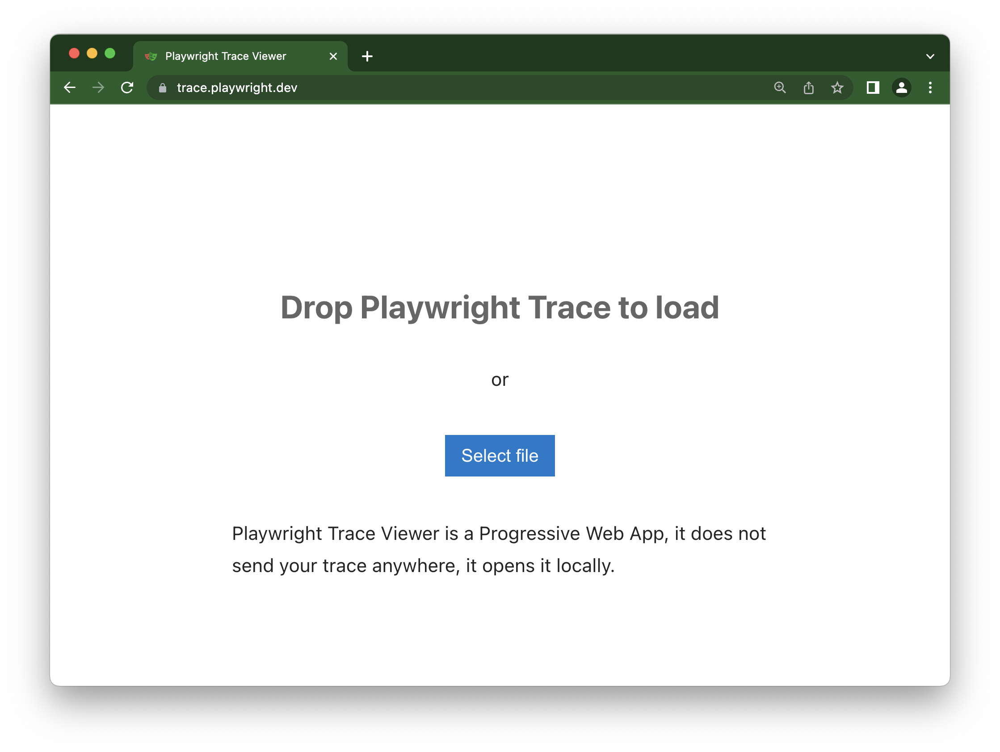

### 查看远程 Trace

您可以直接使用其 URL 打开远程追踪。这使得查看远程追踪变得容易，例如，无需手动从 CI 运行中下载文件。

```bash
playwright show-trace https://example.com/trace.zip
```

使用 [trace.playwright.dev](https://trace.playwright.dev/) 时，您还可以将上传至可访问存储空间（例如在您的 CI 中）的 Trace URL 作为查询参数传递。可能需要遵循 CORS（跨源资源共享）规则。

```txt
https://trace.playwright.dev/?trace=https://demo.playwright.dev/reports/todomvc/data/e6099cadf79aa753d5500aa9508f9d1dbd87b5ee.zip
```

## 录制 Trace

可以通过在运行测试时带上 `--tracing` 标志来录制 Trace。

```bash
pytest --tracing on
```

Trace 的选项包括：

- `on`: 为每个测试录制 Trace
- `off`: 不录制 Trace。（默认）
- `retain-on-failure`: 为每个测试录制 Trace，但删除所有成功运行的测试的 Trace。

这将录制 Trace 并将其放入 `test-results` 目录下一个名为 `trace.zip` 的文件中。

如果您没有使用 Pytest，请点击此处了解如何录制 Trace。

```python
browser = chromium.launch()
context = browser.new_context()

# Start tracing before creating / navigating a page.
context.tracing.start(screenshots=True, snapshots=True, sources=True)

page = context.new_page()
page.goto("https://playwright.cn")

# Stop tracing and export it into a zip archive.
context.tracing.stop(path = "trace.zip")
```

## Trace 查看器功能

### 操作 (Actions)

在“操作”选项卡中，您可以看到每个操作使用的定位器及其运行时间。将鼠标悬停在测试的每个操作上，即可直观地看到 DOM 快照的变化。在时间轴上来回移动，单击某个操作进行检查和调试。使用“之前”和“之后”选项卡可直观地查看操作发生之前和之后的情况。

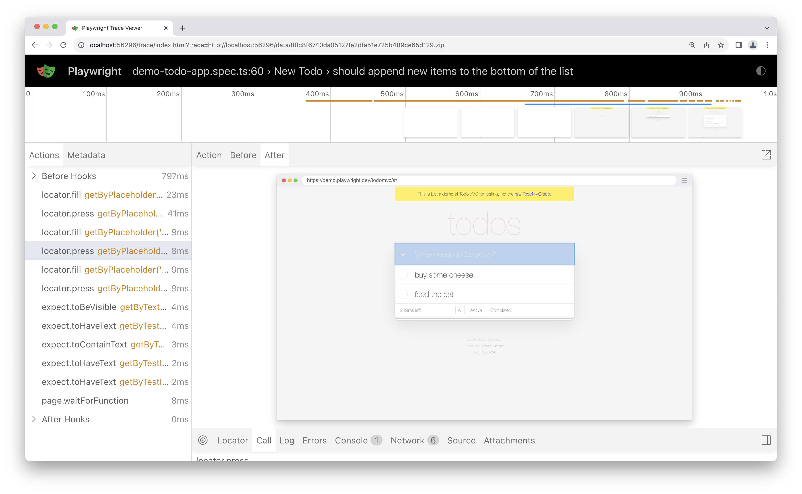

**选择每个操作将显示**

- 操作快照
- 操作日志
- 源代码位置

### 屏幕截图 (Screenshots)

当开启 [screenshots](https://playwright.cn/python/docs/api/class-tracing#tracing-start-option-screenshots) 选项（默认）进行 Trace 时，每个 Trace 都会录制屏幕截图并将其渲染为胶片条。您可以将鼠标悬停在胶片条上，查看每个操作和状态的放大图像，这有助于您轻松找到想要检查的操作。

双击一个操作以查看该操作的时间范围。您可以使用时间轴上的滑块来增加选定的操作，这些操作将显示在“操作”选项卡中，并且所有控制台日志和网络日志将过滤为仅显示所选操作的日志。

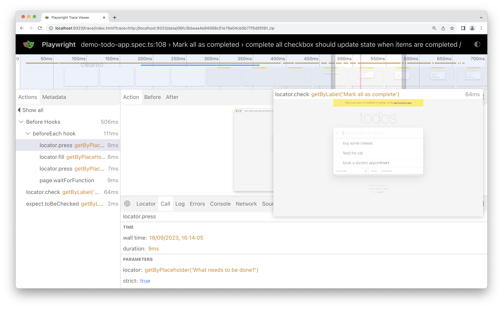

### 快照 (Snapshots)

当开启 [snapshots](https://playwright.cn/python/docs/api/class-tracing#tracing-start-option-snapshots) 选项（默认）进行 Trace 时，Playwright 会为每个操作捕获一组完整的 DOM 快照。根据操作的类型，它将捕获

| 类型 | 描述                                                         |
| ---- | ------------------------------------------------------------ |
| 之前 | 在调用操作时的快照。                                         |
| 操作 | 执行输入时的快照。这种类型的快照在探究 Playwright 究竟点击了哪里时特别有用。 |
| 之后 | 操作后的快照。                                               |

这是典型的动作快照：

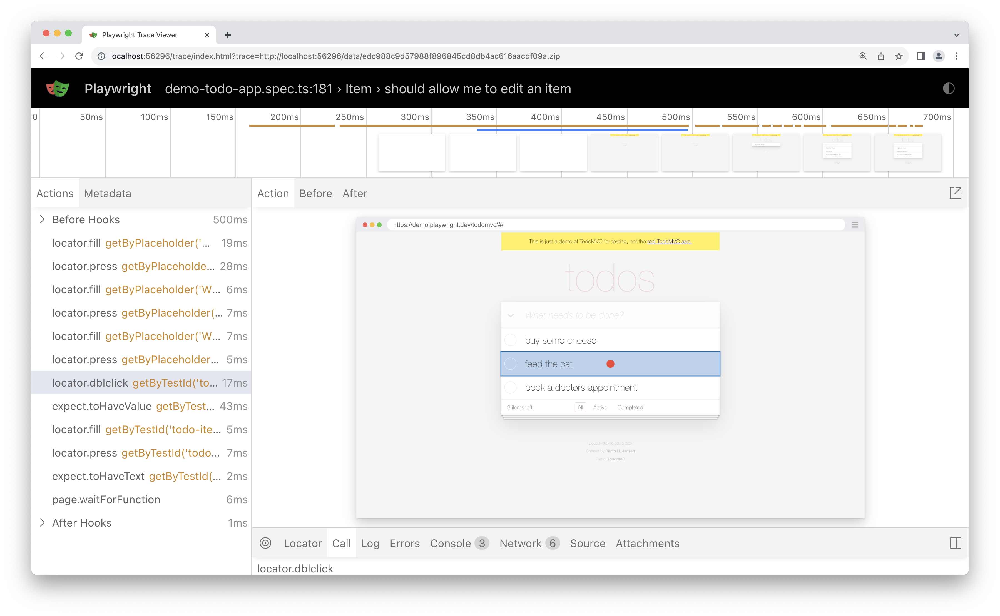

请注意，它同时突出显示了 DOM 节点和精确的点击位置。

### 源代码 (Source)

当您点击侧边栏中的一个操作时，该操作的代码行会在源面板中高亮显示。

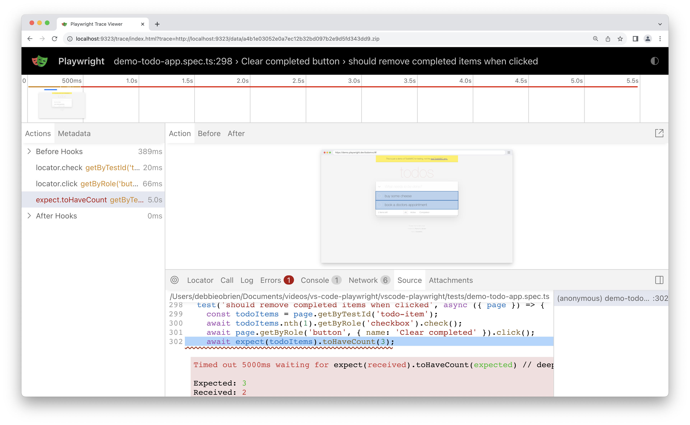

### 调用 (Call)

“调用”选项卡显示有关操作的信息，例如它花费的时间、使用的定位符、是否处于严格模式以及使用的键。

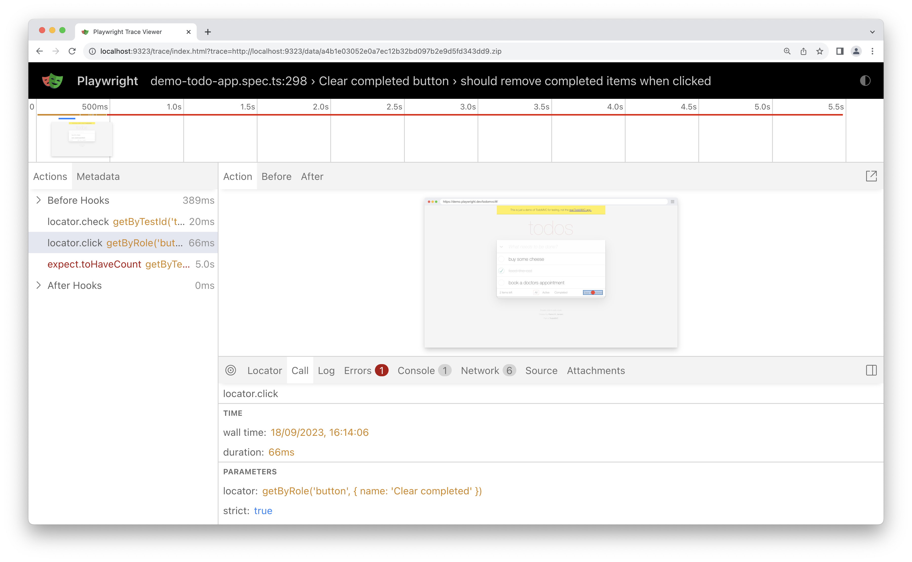

### 日志 (Log)

查看测试的完整日志，以更好地了解 Playwright 在幕后正在做什么，例如滚动到视图中、等待元素可见、启用和稳定，以及执行点击、填充、按下等操作。

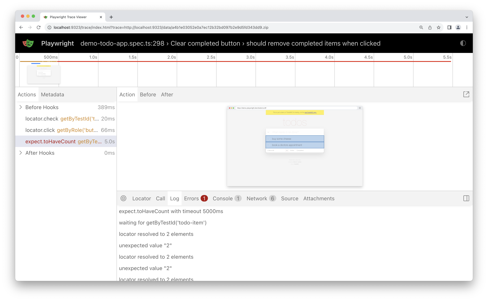

### 错误 (Errors)

如果您的测试失败，您将在“错误”选项卡中看到每个测试的错误消息。时间线还将显示一条红线，突出显示错误发生的位置。您还可以单击“源”选项卡以查看错误在源代码的哪一行。

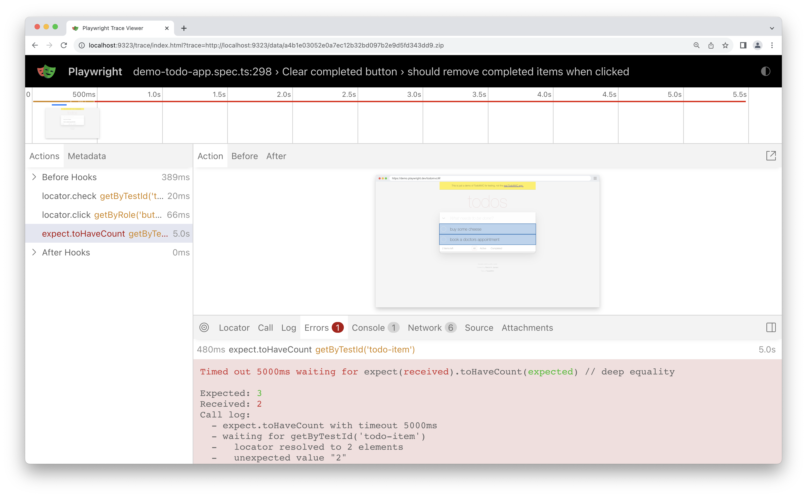

### 控制台 (Console)

查看来自浏览器以及测试的控制台日志。显示不同的图标以显示控制台日志是来自浏览器还是来自测试文件。

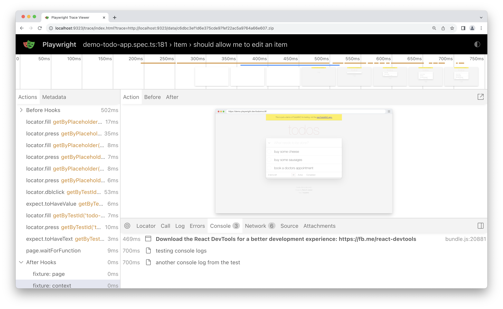

双击操作侧边栏中测试中的一个操作。这将过滤控制台，仅显示在该操作期间生成的日志。单击*显示全部*按钮可再次查看所有控制台日志。

使用时间轴通过点击起点并拖动到终点来过滤操作。控制台选项卡也将被过滤，仅显示在选定操作期间生成的日志。

### 网络

“网络”选项卡显示测试期间发出的所有网络请求。您可以按不同的请求类型、状态码、方法、请求、内容类型、持续时间和大小进行排序。单击请求可查看有关它的更多信息，例如请求头、响应头、请求体和响应体。

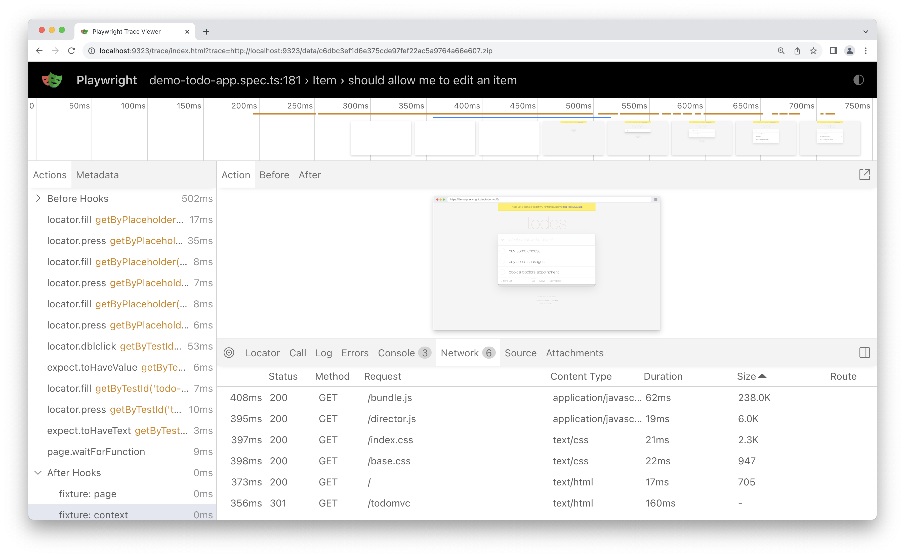

双击操作侧边栏中测试中的一个操作。这将过滤网络请求，仅显示在该操作期间发出的请求。单击*显示全部*按钮可再次查看所有网络请求。

使用时间轴通过点击起点并拖动到终点来过滤操作。网络选项卡也将被过滤，仅显示在选定操作期间发出的网络请求。

### 元数据 (Metadata)

在“操作”选项卡旁边，您会找到“元数据”选项卡，其中会显示有关测试的更多信息，例如浏览器、视口大小、测试持续时间等。

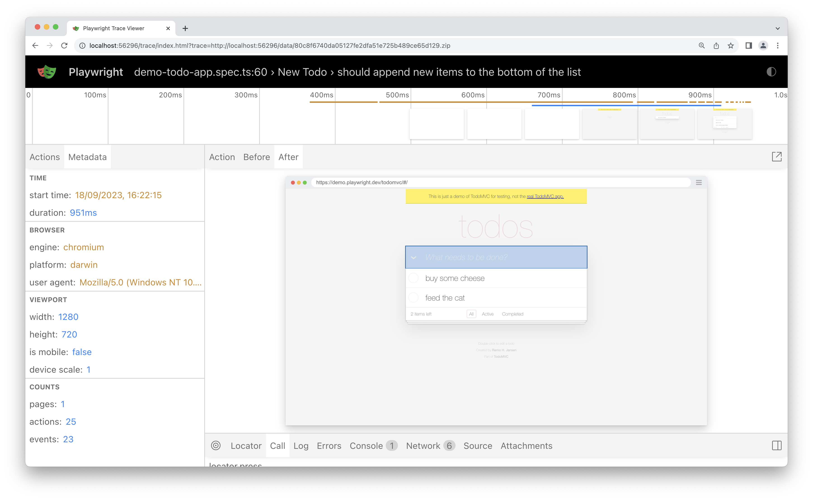
