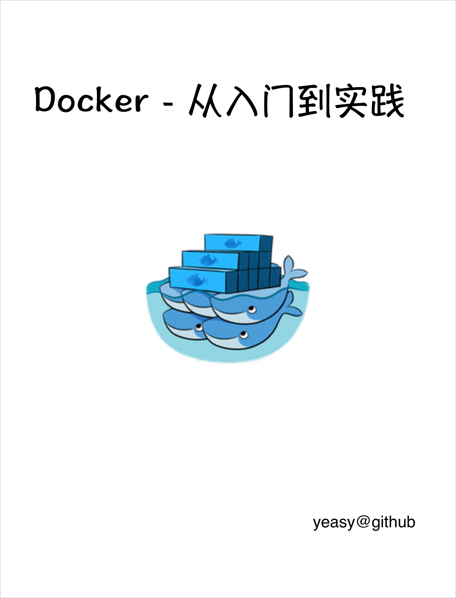

# Docker 从入门到实践

[](https://creativecommons.org/licenses/by-nc-sa/4.0/) [](https://github.com/yeasy/docker_practice) [](https://github.com/yeasy/docker_practice/releases) [在线阅读在线阅读在线阅读GitBookGitBookGitBook](https://yeasy.gitbook.io/docker_practice) [PDFPDFPDF下载下载下载](https://github.com/yeasy/docker_practice/releases/latest) [](https://docs.docker.com/engine/release-notes/)

> 从零开始，系统掌握 Docker 容器技术的核心概念、原理与实战技巧



------

## [#](https://yeasy.github.io/docker_practice/?utm_source=chatgpt.com#关于本书)关于本书

[Docker](https://www.docker.com/) 是个划时代的开源项目，它彻底释放了计算虚拟化的威力，极大提高了应用的维护效率，降低了云计算应用开发的成本！使用 Docker，可以让应用的部署、测试和分发都变得前所未有的高效和轻松！

无论是应用开发者、运维人员、还是其他信息技术从业人员，都有必要认识和掌握 Docker，节约有限的生命。

本书既适用于具备基础 Linux 知识的 Docker 初学者，也希望可供理解原理和实现的高级用户参考。同时，书中给出的实践案例，可供在进行实际部署时借鉴。

## [#](https://yeasy.github.io/docker_practice/?utm_source=chatgpt.com#内容特色)内容特色

- **入门基础**：第 1 ~ 6 章为基础内容，帮助深入理解 Docker 的基本概念 (镜像、容器、仓库) 和核心操作。
- **进阶应用**：第 7 ~ 11 章涵盖 Dockerfile 指令详解、数据与网络管理、Buildx、Compose 等高级配置和管理操作。
- **深入原理**：第 12 ~ 17 章介绍其底层实现技术，深入探讨容器编排体系 (Kubernetes、Etcd)，并延伸涉及容器与云计算及其它关键生态项目 (Fedora CoreOS、Podman 等)。
- **实战扩展**：第 18 ~ 21 章重点讨论容器安全防护机制、监控与日志聚合系统 (Prometheus、ELK)，并展示操作系统、CI/CD 自动化构建等典型实践案例。

## [#](https://yeasy.github.io/docker_practice/?utm_source=chatgpt.com#五分钟快速上手)五分钟快速上手

“5分钟运行第一个容器”——跟随以下步骤快速体验 Docker：

1. **安装 Docker**（第3章）：根据操作系统完成 Docker 的安装与验证
2. **第一个容器**（第1章 `1.1`）：快速体验构建镜像与启动容器的完整流程
3. **交互式容器**（第5章）：执行 `docker run -it ubuntu bash`，进入容器内部与系统交互
4. **镜像与仓库**（第2章、第4章、第6章）：理解核心概念，并学会拉取、使用与管理镜像和仓库
5. **自定义镜像**（第7章）：学习如何编写 Dockerfile 创建自己的镜像

## [#](https://yeasy.github.io/docker_practice/?utm_source=chatgpt.com#学习路线图)学习路线图

<svg id="mermaid-1787152427011" width="100%" xmlns="http://www.w3.org/2000/svg" xmlns:xlink="http://www.w3.org/1999/xlink" class="flowchart" style="max-width: 988.734375px;" viewBox="0 0 988.734375 526" role="graphics-document document" aria-roledescription="flowchart-v2"><g><marker id="mermaid-1787152427011_flowchart-v2-pointEnd" class="marker flowchart-v2" viewBox="0 0 10 10" refX="5" refY="5" markerUnits="userSpaceOnUse" markerWidth="8" markerHeight="8" orient="auto"><path d="M 0 0 L 10 5 L 0 10 z" class="arrowMarkerPath" style="stroke-width: 1; stroke-dasharray: 1, 0;"></path></marker><marker id="mermaid-1787152427011_flowchart-v2-pointStart" class="marker flowchart-v2" viewBox="0 0 10 10" refX="4.5" refY="5" markerUnits="userSpaceOnUse" markerWidth="8" markerHeight="8" orient="auto"><path d="M 0 5 L 10 10 L 10 0 z" class="arrowMarkerPath" style="stroke-width: 1; stroke-dasharray: 1, 0;"></path></marker><marker id="mermaid-1787152427011_flowchart-v2-pointEnd-margin" class="marker flowchart-v2" viewBox="0 0 11.5 14" refX="11.5" refY="7" markerUnits="userSpaceOnUse" markerWidth="10.5" markerHeight="14" orient="auto"><path d="M 0 0 L 11.5 7 L 0 14 z" class="arrowMarkerPath" style="stroke-width: 0; stroke-dasharray: 1, 0;"></path></marker><marker id="mermaid-1787152427011_flowchart-v2-pointStart-margin" class="marker flowchart-v2" viewBox="0 0 11.5 14" refX="1" refY="7" markerUnits="userSpaceOnUse" markerWidth="11.5" markerHeight="14" orient="auto"><polygon points="0,7 11.5,14 11.5,0" class="arrowMarkerPath" style="stroke-width: 0; stroke-dasharray: 1, 0;"></polygon></marker><marker id="mermaid-1787152427011_flowchart-v2-circleEnd" class="marker flowchart-v2" viewBox="0 0 10 10" refX="11" refY="5" markerUnits="userSpaceOnUse" markerWidth="11" markerHeight="11" orient="auto"><circle cx="5" cy="5" r="5" class="arrowMarkerPath" style="stroke-width: 1; stroke-dasharray: 1, 0;"></circle></marker><marker id="mermaid-1787152427011_flowchart-v2-circleStart" class="marker flowchart-v2" viewBox="0 0 10 10" refX="-1" refY="5" markerUnits="userSpaceOnUse" markerWidth="11" markerHeight="11" orient="auto"><circle cx="5" cy="5" r="5" class="arrowMarkerPath" style="stroke-width: 1; stroke-dasharray: 1, 0;"></circle></marker><marker id="mermaid-1787152427011_flowchart-v2-circleEnd-margin" class="marker flowchart-v2" viewBox="0 0 10 10" refY="5" refX="12.25" markerUnits="userSpaceOnUse" markerWidth="14" markerHeight="14" orient="auto"><circle cx="5" cy="5" r="5" class="arrowMarkerPath" style="stroke-width: 0; stroke-dasharray: 1, 0;"></circle></marker><marker id="mermaid-1787152427011_flowchart-v2-circleStart-margin" class="marker flowchart-v2" viewBox="0 0 10 10" refX="-2" refY="5" markerUnits="userSpaceOnUse" markerWidth="14" markerHeight="14" orient="auto"><circle cx="5" cy="5" r="5" class="arrowMarkerPath" style="stroke-width: 0; stroke-dasharray: 1, 0;"></circle></marker><marker id="mermaid-1787152427011_flowchart-v2-crossEnd" class="marker cross flowchart-v2" viewBox="0 0 11 11" refX="12" refY="5.2" markerUnits="userSpaceOnUse" markerWidth="11" markerHeight="11" orient="auto"><path d="M 1,1 l 9,9 M 10,1 l -9,9" class="arrowMarkerPath" style="stroke-width: 2; stroke-dasharray: 1, 0;"></path></marker><marker id="mermaid-1787152427011_flowchart-v2-crossStart" class="marker cross flowchart-v2" viewBox="0 0 11 11" refX="-1" refY="5.2" markerUnits="userSpaceOnUse" markerWidth="11" markerHeight="11" orient="auto"><path d="M 1,1 l 9,9 M 10,1 l -9,9" class="arrowMarkerPath" style="stroke-width: 2; stroke-dasharray: 1, 0;"></path></marker><marker id="mermaid-1787152427011_flowchart-v2-crossEnd-margin" class="marker cross flowchart-v2" viewBox="0 0 15 15" refX="17.7" refY="7.5" markerUnits="userSpaceOnUse" markerWidth="12" markerHeight="12" orient="auto"><path d="M 1,1 L 14,14 M 1,14 L 14,1" class="arrowMarkerPath" style="stroke-width: 2.5;"></path></marker><marker id="mermaid-1787152427011_flowchart-v2-crossStart-margin" class="marker cross flowchart-v2" viewBox="0 0 15 15" refX="-3.5" refY="7.5" markerUnits="userSpaceOnUse" markerWidth="12" markerHeight="12" orient="auto"><path d="M 1,1 L 14,14 M 1,14 L 14,1" class="arrowMarkerPath" style="stroke-width: 2.5; stroke-dasharray: 1, 0;"></path></marker><g class="root"><g class="clusters"></g><g class="edgePaths"><path d="M190.672,245L194.839,245C199.005,245,207.339,245,215.005,245C222.672,245,229.672,245,233.172,245L236.672,245" id="mermaid-1787152427011-L_Start_Ch1_0" class="edge-thickness-normal edge-pattern-solid edge-thickness-normal edge-pattern-solid flowchart-link" style=";" data-edge="true" data-et="edge" data-id="L_Start_Ch1_0" data-points="W3sieCI6MTkwLjY3MTg3NSwieSI6MjQ1fSx7IngiOjIxNS42NzE4NzUsInkiOjI0NX0seyJ4IjoyNDAuNjcxODc1LCJ5IjoyNDV9XQ==" data-look="classic" marker-end="url(#mermaid-1787152427011_flowchart-v2-pointEnd)"></path><path d="M362.298,218L380.871,189.5C399.444,161,436.589,104,469.995,75.5C503.401,47,533.068,47,547.901,47L562.734,47" id="mermaid-1787152427011-L_Ch1_Role1_0" class="edge-thickness-normal edge-pattern-solid edge-thickness-normal edge-pattern-solid flowchart-link" style=";" data-edge="true" data-et="edge" data-id="L_Ch1_Role1_0" data-points="W3sieCI6MzYyLjI5ODI5NTQ1NDU0NTQ0LCJ5IjoyMTh9LHsieCI6NDczLjczNDM3NSwieSI6NDd9LHsieCI6NTY2LjczNDM3NSwieSI6NDd9XQ==" data-look="classic" marker-end="url(#mermaid-1787152427011_flowchart-v2-pointEnd)"></path><path d="M394.472,218L407.683,210.833C420.893,203.667,447.314,189.333,469.531,182.167C491.747,175,509.76,175,518.767,175L527.773,175" id="mermaid-1787152427011-L_Ch1_Role2_0" class="edge-thickness-normal edge-pattern-solid edge-thickness-normal edge-pattern-solid flowchart-link" style=";" data-edge="true" data-et="edge" data-id="L_Ch1_Role2_0" data-points="W3sieCI6Mzk0LjQ3MjMyMTQyODU3MTQzLCJ5IjoyMTh9LHsieCI6NDczLjczNDM3NSwieSI6MTc1fSx7IngiOjUzMS43NzM0Mzc1LCJ5IjoxNzV9XQ==" data-look="classic" marker-end="url(#mermaid-1787152427011_flowchart-v2-pointEnd)"></path><path d="M394.472,272L407.683,279.167C420.893,286.333,447.314,300.667,464.024,307.833C480.734,315,487.734,315,491.234,315L494.734,315" id="mermaid-1787152427011-L_Ch1_Role3_0" class="edge-thickness-normal edge-pattern-solid edge-thickness-normal edge-pattern-solid flowchart-link" style=";" data-edge="true" data-et="edge" data-id="L_Ch1_Role3_0" data-points="W3sieCI6Mzk0LjQ3MjMyMTQyODU3MTQzLCJ5IjoyNzJ9LHsieCI6NDczLjczNDM3NSwieSI6MzE1fSx7IngiOjQ5OC43MzQzNzUsInkiOjMxNX1d" data-look="classic" marker-end="url(#mermaid-1787152427011_flowchart-v2-pointEnd)"></path><path d="M360.396,272L379.286,304.5C398.176,337,435.955,402,458.345,434.5C480.734,467,487.734,467,491.234,467L494.734,467" id="mermaid-1787152427011-L_Ch1_Role4_0" class="edge-thickness-normal edge-pattern-solid edge-thickness-normal edge-pattern-solid flowchart-link" style=";" data-edge="true" data-et="edge" data-id="L_Ch1_Role4_0" data-points="W3sieCI6MzYwLjM5NjExNDg2NDg2NDg0LCJ5IjoyNzJ9LHsieCI6NDczLjczNDM3NSwieSI6NDY3fSx7IngiOjQ5OC43MzQzNzUsInkiOjQ2N31d" data-look="classic" marker-end="url(#mermaid-1787152427011_flowchart-v2-pointEnd)"></path><path d="M690.734,47L706.234,47C721.734,47,752.734,47,773.068,47C793.401,47,803.068,47,807.901,47L812.734,47" id="mermaid-1787152427011-L_Role1_End1_0" class="edge-thickness-normal edge-pattern-solid edge-thickness-normal edge-pattern-solid flowchart-link" style=";" data-edge="true" data-et="edge" data-id="L_Role1_End1_0" data-points="W3sieCI6NjkwLjczNDM3NSwieSI6NDd9LHsieCI6NzgzLjczNDM3NSwieSI6NDd9LHsieCI6ODE2LjczNDM3NSwieSI6NDd9XQ==" data-look="classic" marker-end="url(#mermaid-1787152427011_flowchart-v2-pointEnd)"></path><path d="M725.695,175L735.368,175C745.042,175,764.388,175,777.561,175C790.734,175,797.734,175,801.234,175L804.734,175" id="mermaid-1787152427011-L_Role2_End2_0" class="edge-thickness-normal edge-pattern-solid edge-thickness-normal edge-pattern-solid flowchart-link" style=";" data-edge="true" data-et="edge" data-id="L_Role2_End2_0" data-points="W3sieCI6NzI1LjY5NTMxMjUsInkiOjE3NX0seyJ4Ijo3ODMuNzM0Mzc1LCJ5IjoxNzV9LHsieCI6ODA4LjczNDM3NSwieSI6MTc1fV0=" data-look="classic" marker-end="url(#mermaid-1787152427011_flowchart-v2-pointEnd)"></path><path d="M758.734,315L762.901,315C767.068,315,775.401,315,784.401,315C793.401,315,803.068,315,807.901,315L812.734,315" id="mermaid-1787152427011-L_Role3_End3_0" class="edge-thickness-normal edge-pattern-solid edge-thickness-normal edge-pattern-solid flowchart-link" style=";" data-edge="true" data-et="edge" data-id="L_Role3_End3_0" data-points="W3sieCI6NzU4LjczNDM3NSwieSI6MzE1fSx7IngiOjc4My43MzQzNzUsInkiOjMxNX0seyJ4Ijo4MTYuNzM0Mzc1LCJ5IjozMTV9XQ==" data-look="classic" marker-end="url(#mermaid-1787152427011_flowchart-v2-pointEnd)"></path><path d="M758.734,467L762.901,467C767.068,467,775.401,467,784.401,467C793.401,467,803.068,467,807.901,467L812.734,467" id="mermaid-1787152427011-L_Role4_End4_0" class="edge-thickness-normal edge-pattern-solid edge-thickness-normal edge-pattern-solid flowchart-link" style=";" data-edge="true" data-et="edge" data-id="L_Role4_End4_0" data-points="W3sieCI6NzU4LjczNDM3NSwieSI6NDY3fSx7IngiOjc4My43MzQzNzUsInkiOjQ2N30seyJ4Ijo4MTYuNzM0Mzc1LCJ5Ijo0Njd9XQ==" data-look="classic" marker-end="url(#mermaid-1787152427011_flowchart-v2-pointEnd)"></path></g><g class="edgeLabels"><g class="edgeLabel"><g class="label" data-id="L_Start_Ch1_0" transform="translate(0, 0)"><foreignObject width="0" height="0"><div xmlns="http://www.w3.org/1999/xhtml" class="labelBkg" style="box-sizing: border-box; margin: 0px; padding: 0px; background-color: rgba(232, 232, 232, 0.5); display: table-cell; white-space: nowrap; line-height: 1.5; max-width: 200px; text-align: center;"><span class="edgeLabel" style="box-sizing: border-box; margin: 0px; padding: 0px; fill: rgb(51, 51, 51); color: rgb(51, 51, 51); background-color: rgba(232, 232, 232, 0.8); text-align: center;"></span></div></foreignObject></g></g><g class="edgeLabel"><g class="label" data-id="L_Ch1_Role1_0" transform="translate(0, 0)"><foreignObject width="0" height="0"><div xmlns="http://www.w3.org/1999/xhtml" class="labelBkg" style="box-sizing: border-box; margin: 0px; padding: 0px; background-color: rgba(232, 232, 232, 0.5); display: table-cell; white-space: nowrap; line-height: 1.5; max-width: 200px; text-align: center;"><span class="edgeLabel" style="box-sizing: border-box; margin: 0px; padding: 0px; fill: rgb(51, 51, 51); color: rgb(51, 51, 51); background-color: rgba(232, 232, 232, 0.8); text-align: center;"></span></div></foreignObject></g></g><g class="edgeLabel"><g class="label" data-id="L_Ch1_Role2_0" transform="translate(0, 0)"><foreignObject width="0" height="0"><div xmlns="http://www.w3.org/1999/xhtml" class="labelBkg" style="box-sizing: border-box; margin: 0px; padding: 0px; background-color: rgba(232, 232, 232, 0.5); display: table-cell; white-space: nowrap; line-height: 1.5; max-width: 200px; text-align: center;"><span class="edgeLabel" style="box-sizing: border-box; margin: 0px; padding: 0px; fill: rgb(51, 51, 51); color: rgb(51, 51, 51); background-color: rgba(232, 232, 232, 0.8); text-align: center;"></span></div></foreignObject></g></g><g class="edgeLabel"><g class="label" data-id="L_Ch1_Role3_0" transform="translate(0, 0)"><foreignObject width="0" height="0"><div xmlns="http://www.w3.org/1999/xhtml" class="labelBkg" style="box-sizing: border-box; margin: 0px; padding: 0px; background-color: rgba(232, 232, 232, 0.5); display: table-cell; white-space: nowrap; line-height: 1.5; max-width: 200px; text-align: center;"><span class="edgeLabel" style="box-sizing: border-box; margin: 0px; padding: 0px; fill: rgb(51, 51, 51); color: rgb(51, 51, 51); background-color: rgba(232, 232, 232, 0.8); text-align: center;"></span></div></foreignObject></g></g><g class="edgeLabel"><g class="label" data-id="L_Ch1_Role4_0" transform="translate(0, 0)"><foreignObject width="0" height="0"><div xmlns="http://www.w3.org/1999/xhtml" class="labelBkg" style="box-sizing: border-box; margin: 0px; padding: 0px; background-color: rgba(232, 232, 232, 0.5); display: table-cell; white-space: nowrap; line-height: 1.5; max-width: 200px; text-align: center;"><span class="edgeLabel" style="box-sizing: border-box; margin: 0px; padding: 0px; fill: rgb(51, 51, 51); color: rgb(51, 51, 51); background-color: rgba(232, 232, 232, 0.8); text-align: center;"></span></div></foreignObject></g></g><g class="edgeLabel"><g class="label" data-id="L_Role1_End1_0" transform="translate(0, 0)"><foreignObject width="0" height="0"><div xmlns="http://www.w3.org/1999/xhtml" class="labelBkg" style="box-sizing: border-box; margin: 0px; padding: 0px; background-color: rgba(232, 232, 232, 0.5); display: table-cell; white-space: nowrap; line-height: 1.5; max-width: 200px; text-align: center;"><span class="edgeLabel" style="box-sizing: border-box; margin: 0px; padding: 0px; fill: rgb(51, 51, 51); color: rgb(51, 51, 51); background-color: rgba(232, 232, 232, 0.8); text-align: center;"></span></div></foreignObject></g></g><g class="edgeLabel"><g class="label" data-id="L_Role2_End2_0" transform="translate(0, 0)"><foreignObject width="0" height="0"><div xmlns="http://www.w3.org/1999/xhtml" class="labelBkg" style="box-sizing: border-box; margin: 0px; padding: 0px; background-color: rgba(232, 232, 232, 0.5); display: table-cell; white-space: nowrap; line-height: 1.5; max-width: 200px; text-align: center;"><span class="edgeLabel" style="box-sizing: border-box; margin: 0px; padding: 0px; fill: rgb(51, 51, 51); color: rgb(51, 51, 51); background-color: rgba(232, 232, 232, 0.8); text-align: center;"></span></div></foreignObject></g></g><g class="edgeLabel"><g class="label" data-id="L_Role3_End3_0" transform="translate(0, 0)"><foreignObject width="0" height="0"><div xmlns="http://www.w3.org/1999/xhtml" class="labelBkg" style="box-sizing: border-box; margin: 0px; padding: 0px; background-color: rgba(232, 232, 232, 0.5); display: table-cell; white-space: nowrap; line-height: 1.5; max-width: 200px; text-align: center;"><span class="edgeLabel" style="box-sizing: border-box; margin: 0px; padding: 0px; fill: rgb(51, 51, 51); color: rgb(51, 51, 51); background-color: rgba(232, 232, 232, 0.8); text-align: center;"></span></div></foreignObject></g></g><g class="edgeLabel"><g class="label" data-id="L_Role4_End4_0" transform="translate(0, 0)"><foreignObject width="0" height="0"><div xmlns="http://www.w3.org/1999/xhtml" class="labelBkg" style="box-sizing: border-box; margin: 0px; padding: 0px; background-color: rgba(232, 232, 232, 0.5); display: table-cell; white-space: nowrap; line-height: 1.5; max-width: 200px; text-align: center;"><span class="edgeLabel" style="box-sizing: border-box; margin: 0px; padding: 0px; fill: rgb(51, 51, 51); color: rgb(51, 51, 51); background-color: rgba(232, 232, 232, 0.8); text-align: center;"></span></div></foreignObject></g></g></g><g class="nodes"><g class="node default" id="mermaid-1787152427011-flowchart-Start-0" data-look="classic" transform="translate(99.3359375, 245)"><rect class="basic label-container" style="" x="-91.3359375" y="-27" width="182.671875" height="54"></rect><g class="label" style="" transform="translate(-61.3359375, -12)"><rect></rect><foreignObject width="122.671875" height="24"><div xmlns="http://www.w3.org/1999/xhtml" style="box-sizing: border-box; margin: 0px; padding: 0px; display: table-cell; white-space: nowrap; line-height: 1.5; max-width: 200px; text-align: center;"><span class="nodeLabel" style="box-sizing: border-box; margin: 0px; padding: 0px; fill: rgb(51, 51, 51); color: rgb(51, 51, 51);"><p style="box-sizing: border-box; margin: 0px; padding: 0px; text-align: left;">Docker 学习入口</p></span></div></foreignObject></g></g><g class="node default" id="mermaid-1787152427011-flowchart-Ch1-1" data-look="classic" transform="translate(344.703125, 245)"><rect class="basic label-container" style="" x="-104.03125" y="-27" width="208.0625" height="54"></rect><g class="label" style="" transform="translate(-74.03125, -12)"><rect></rect><foreignObject width="148.0625" height="24"><div xmlns="http://www.w3.org/1999/xhtml" style="box-sizing: border-box; margin: 0px; padding: 0px; display: table-cell; white-space: nowrap; line-height: 1.5; max-width: 200px; text-align: center;"><span class="nodeLabel" style="box-sizing: border-box; margin: 0px; padding: 0px; fill: rgb(51, 51, 51); color: rgb(51, 51, 51);"><p style="box-sizing: border-box; margin: 0px; padding: 0px; text-align: left;">第1章：Docker 简介</p></span></div></foreignObject></g></g><g class="node default" id="mermaid-1787152427011-flowchart-Role1-3" data-look="classic" transform="translate(628.734375, 47)"><rect class="basic label-container" style="" x="-62" y="-39" width="124" height="78"></rect><g class="label" style="" transform="translate(-32, -24)"><rect></rect><foreignObject width="64" height="48"><div xmlns="http://www.w3.org/1999/xhtml" style="box-sizing: border-box; margin: 0px; padding: 0px; display: table-cell; white-space: nowrap; line-height: 1.5; max-width: 200px; text-align: center;"><span class="nodeLabel" style="box-sizing: border-box; margin: 0px; padding: 0px; fill: rgb(51, 51, 51); color: rgb(51, 51, 51);"><p style="box-sizing: border-box; margin: 0px; padding: 0px; text-align: left;">运维新手<br style="box-sizing: border-box; margin: 0px; padding: 0px;">第1-6章</p></span></div></foreignObject></g></g><g class="node default" id="mermaid-1787152427011-flowchart-Role2-5" data-look="classic" transform="translate(628.734375, 175)"><rect class="basic label-container" style="" x="-96.9609375" y="-39" width="193.921875" height="78"></rect><g class="label" style="" transform="translate(-66.9609375, -24)"><rect></rect><foreignObject width="133.921875" height="48"><div xmlns="http://www.w3.org/1999/xhtml" style="box-sizing: border-box; margin: 0px; padding: 0px; display: table-cell; white-space: nowrap; line-height: 1.5; max-width: 200px; text-align: center;"><span class="nodeLabel" style="box-sizing: border-box; margin: 0px; padding: 0px; fill: rgb(51, 51, 51); color: rgb(51, 51, 51);"><p style="box-sizing: border-box; margin: 0px; padding: 0px; text-align: left;">开发者<br style="box-sizing: border-box; margin: 0px; padding: 0px;">第1-8章 → 第11章</p></span></div></foreignObject></g></g><g class="node default" id="mermaid-1787152427011-flowchart-Role3-7" data-look="classic" transform="translate(628.734375, 315)"><rect class="basic label-container" style="" x="-130" y="-51" width="260" height="102"></rect><g class="label" style="" transform="translate(-100, -36)"><rect></rect><foreignObject width="200" height="72"><div xmlns="http://www.w3.org/1999/xhtml" style="box-sizing: border-box; margin: 0px; padding: 0px; display: table; white-space: break-spaces; line-height: 1.5; max-width: 200px; text-align: center; width: 200px;"><span class="nodeLabel" style="box-sizing: border-box; margin: 0px; padding: 0px; fill: rgb(51, 51, 51); color: rgb(51, 51, 51);"><p style="box-sizing: border-box; margin: 0px; padding: 0px; text-align: left;">DevOps 工程师<br style="box-sizing: border-box; margin: 0px; padding: 0px;">第1-11章 → 第13-14章 → 第18-21章</p></span></div></foreignObject></g></g><g class="node default" id="mermaid-1787152427011-flowchart-Role4-9" data-look="classic" transform="translate(628.734375, 467)"><rect class="basic label-container" style="" x="-130" y="-51" width="260" height="102"></rect><g class="label" style="" transform="translate(-100, -36)"><rect></rect><foreignObject width="200" height="72"><div xmlns="http://www.w3.org/1999/xhtml" style="box-sizing: border-box; margin: 0px; padding: 0px; display: table; white-space: break-spaces; line-height: 1.5; max-width: 200px; text-align: center; width: 200px;"><span class="nodeLabel" style="box-sizing: border-box; margin: 0px; padding: 0px; fill: rgb(51, 51, 51); color: rgb(51, 51, 51);"><p style="box-sizing: border-box; margin: 0px; padding: 0px; text-align: left;">架构师<br style="box-sizing: border-box; margin: 0px; padding: 0px;">第1-6章 → 第12-17章 → 第18-19章</p></span></div></foreignObject></g></g><g class="node default" id="mermaid-1787152427011-flowchart-End1-11" data-look="classic" transform="translate(894.734375, 47)"><rect class="basic label-container" style="" x="-78" y="-27" width="156" height="54"></rect><g class="label" style="" transform="translate(-48, -12)"><rect></rect><foreignObject width="96" height="24"><div xmlns="http://www.w3.org/1999/xhtml" style="box-sizing: border-box; margin: 0px; padding: 0px; display: table-cell; white-space: nowrap; line-height: 1.5; max-width: 200px; text-align: center;"><span class="nodeLabel" style="box-sizing: border-box; margin: 0px; padding: 0px; fill: rgb(51, 51, 51); color: rgb(51, 51, 51);"><p style="box-sizing: border-box; margin: 0px; padding: 0px; text-align: left;">掌握基本操作</p></span></div></foreignObject></g></g><g class="node default" id="mermaid-1787152427011-flowchart-End2-13" data-look="classic" transform="translate(894.734375, 175)"><rect class="basic label-container" style="" x="-86" y="-27" width="172" height="54"></rect><g class="label" style="" transform="translate(-56, -12)"><rect></rect><foreignObject width="112" height="24"><div xmlns="http://www.w3.org/1999/xhtml" style="box-sizing: border-box; margin: 0px; padding: 0px; display: table-cell; white-space: nowrap; line-height: 1.5; max-width: 200px; text-align: center;"><span class="nodeLabel" style="box-sizing: border-box; margin: 0px; padding: 0px; fill: rgb(51, 51, 51); color: rgb(51, 51, 51);"><p style="box-sizing: border-box; margin: 0px; padding: 0px; text-align: left;">构建与部署应用</p></span></div></foreignObject></g></g><g class="node default" id="mermaid-1787152427011-flowchart-End3-15" data-look="classic" transform="translate(894.734375, 315)"><rect class="basic label-container" style="" x="-78" y="-27" width="156" height="54"></rect><g class="label" style="" transform="translate(-48, -12)"><rect></rect><foreignObject width="96" height="24"><div xmlns="http://www.w3.org/1999/xhtml" style="box-sizing: border-box; margin: 0px; padding: 0px; display: table-cell; white-space: nowrap; line-height: 1.5; max-width: 200px; text-align: center;"><span class="nodeLabel" style="box-sizing: border-box; margin: 0px; padding: 0px; fill: rgb(51, 51, 51); color: rgb(51, 51, 51);"><p style="box-sizing: border-box; margin: 0px; padding: 0px; text-align: left;">自动化与运维</p></span></div></foreignObject></g></g><g class="node default" id="mermaid-1787152427011-flowchart-End4-17" data-look="classic" transform="translate(894.734375, 467)"><rect class="basic label-container" style="" x="-78" y="-27" width="156" height="54"></rect><g class="label" style="" transform="translate(-48, -12)"><rect></rect><foreignObject width="96" height="24"><div xmlns="http://www.w3.org/1999/xhtml" style="box-sizing: border-box; margin: 0px; padding: 0px; display: table-cell; white-space: nowrap; line-height: 1.5; max-width: 200px; text-align: center;"><span class="nodeLabel" style="box-sizing: border-box; margin: 0px; padding: 0px; fill: rgb(51, 51, 51); color: rgb(51, 51, 51);"><p style="box-sizing: border-box; margin: 0px; padding: 0px; text-align: left;">设计容器方案</p></span></div></foreignObject></g></g></g></g></g><defs><filter id="mermaid-1787152427011-drop-shadow" height="130%" width="130%"><feDropShadow dx="4" dy="4" stdDeviation="0" flood-opacity="0.06" flood-color="#000000"></feDropShadow></filter></defs><defs><filter id="mermaid-1787152427011-drop-shadow-small" height="150%" width="150%"><feDropShadow dx="2" dy="2" stdDeviation="0" flood-opacity="0.06" flood-color="#000000"></feDropShadow></filter></defs></svg>

| 读者角色          | 学习重点                         | 核心成果                         |
| :---------------- | :------------------------------- | :------------------------------- |
| **运维新手**      | 第1-6章                          | 掌握容器的基本概念与操作         |
| **开发者**        | 第1-8章 → 第11章                 | 学会容器化应用的构建与部署       |
| **DevOps 工程师** | 第1-11章 → 第13-14章 → 第18-21章 | 实现容器编排与自动化部署流程     |
| **架构师**        | 第1-6章 → 第12-17章 → 第18-19章  | 设计高可用、高性能的容器基础设施 |

## [#](https://yeasy.github.io/docker_practice/?utm_source=chatgpt.com#在线阅读)在线阅读

本书在线阅读，可直接访问 [GitBook](https://yeasy.gitbook.io/docker_practice/)。也可访问 [GitHub 仓库目录](https://github.com/yeasy/docker_practice/blob/master/SUMMARY.md)。

## [#](https://yeasy.github.io/docker_practice/?utm_source=chatgpt.com#下载离线版本)下载离线版本

本书提供 PDF 版本供离线阅读，可前往 [GitHub Releases](https://github.com/yeasy/docker_practice/releases/latest) 页面下载最新版本。

如需获取默认分支自动更新的预览版，可直接下载 [docker_practice.pdf](https://github.com/yeasy/docker_practice/releases/download/preview-pdf/docker_practice.pdf)。该文件会随主线更新覆盖，不代表正式发布版本。

## [#](https://yeasy.github.io/docker_practice/?utm_source=chatgpt.com#本地阅读)本地阅读

先安装 [mdPress](https://github.com/yeasy/mdpress)：

```bash
brew tap yeasy/tap && brew install mdpress
mdpress serve
```

复制

## [#](https://yeasy.github.io/docker_practice/?utm_source=chatgpt.com#社区交流)社区交流

- [GitHub Issues](https://github.com/yeasy/docker_practice/issues/new/choose)（内容错误、建议）

## [#](https://yeasy.github.io/docker_practice/?utm_source=chatgpt.com#推荐阅读)推荐阅读

本书是技术丛书的一部分。以下书籍与本书形成互补：

| 书名                                                         | 与本书的关系                                                 |
| :----------------------------------------------------------- | :----------------------------------------------------------- |
| [《前线部署工程实践指南》](https://yeasy.gitbook.io/forward_deployed_engineering_guide/) | 讲容器、Kubernetes、GitOps、IaC、供应链、安全、观测与 SLO 如何组合成可交付、可审计、可运营的部署工程体系 |
| [《智能体 Harness 工程指南》](https://yeasy.gitbook.io/harness_engineering_guide) | Agent 基础设施中的容器化部署与隔离                           |
| [《大模型安全权威指南》](https://yeasy.gitbook.io/ai_security_guide) | 容器安全与 AI 系统安全的交叉实践                             |
| [《区块链技术指南》](https://yeasy.gitbook.io/blockchain_guide) | 区块链节点的容器化部署                                       |
